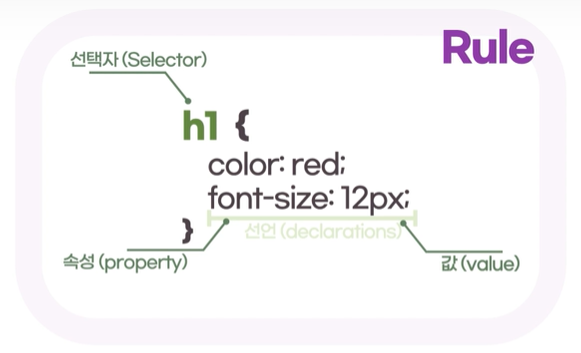

# 개요

## 1. CSS 소개

html로 요소 정의하는 법과 하나의 웹 페이지를 만들었는데 이 스타일 적용하는 것을 css라고 합니다.

### CSS(Cascading Style Sheets)

- 파일이 웹 문서의 스타일을 작성하는 문서(시트)임을 알 수 있습니다. 
- 웹 브라우저마다 모듈별로 CSS 업데이트가 다를 수 있습니다. **버젼별 모듈**

- cascading이란 위에서 아래로 흐른다는 뜻으로 CSS는 위 부모에서부터 적용한 스타일을 자식요소가 모두 적용합니다.

## 2. CSS는 어떻게 생겼을까

- CSS는 룰 기반(Rule-based)의 언어이다.
- CSS를 통해 특정 요소, 혹은 특정 요소들의 집합의 스타일 규칙을 정의할 수 있다.

룰 규칙: 코드에 규칙을 적용해 코드를 작성한다는 뜻으로 예를 들어 h1태그는 빨간 글씨체로 한다. div태그는 파란 바탕으로 한다. 와 같습니다.
selector로 html요소를 선택할 수 있습니다. 중괄호 내부에 요소 스타일을 선언합니다. 하나의 선언은 속성:값 이 쌍을 이룹니다.



### 주석(Comments)

`/* 내용 */`의 형식으로 작성

## 3. CSS를 적용하는 방법

### 1) 내부 스타일(embedded)

✨ **예시**

```html
<!DOCTYPE html>
<html>
  <head>
    <style>
      h1 {
        color: red;
      }
    </style>
    <title>CSS</title>
  </head>
  <body>
    <h1>Welcome!</h1>
  </body>
</html>
```

### 2) 인라인 스타일 (inline)

사용을 지양하는 것이 좋습니다.
가장 좋은 방법은 외부 스타일

✨ **예시**

```html
<body>
  <h1 style="color:red">Welcome!</h1>
</body>
```

### 3) 외부 스타일 (external)

✨ **예시**

```html
<!DOCTYPE html>
<html>
  <head>
    <title>CSS</title>
    <link rel="stylesheet" href="style/main.css" />
  </head>
  <body>
    <h1>Welcome!</h1>
  </body>
</html>
```

## 4. 캐스캐이딩 원칙

### 1) 스타일 우선순위

- 동일한 스타일이라도 **선언된 곳**에 따라 우선순위가 정해집니다.
  - 이 브라우저에 의해 정의된 스타일 < 개발자가 선언한 스타일 < 사용자가 구성한 스타일
- 적용 범위가 적을 수록 우선시 됩니다.
  - tag 스타일 < class 스타일 < id 스타일 < 인라인 스타일
- 소스코드의 순서가 뒤에 있으면 덮어씁니다.

결론: 브라우저에서 정의된 스타일을 개발자가 선언한 스타일로 재정의 될 수 있다.

### 2) 스타일 상속

- 부모 요소에 있는 스타일 속성들이 자식 요소로 전달된다.
  - 자식 요소에서 재정의할 경우, 부모의 스타일을 덮어쓴다.
- 상속이 되지 않는 속성도 있다.(예: 배경 이미지, 배경 색 등)
  ps. 일부 요소 중 부모요소가 자식부모에 전달되지 않는 요소가 있다.
