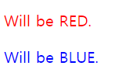

# 개요

## 1. CSS 소개

html로 요소 정의하는 법과 하나의 웹 페이지를 만들었는데 이 스타일 적용하는 것을 css라고 합니다.

### CSS(Cascading Style Sheets)

- 파일이 웹 문서의 스타일을 작성하는 문서(시트)임을 알 수 있습니다. 
- 웹 브라우저마다 모듈별로 CSS 업데이트가 다를 수 있습니다. **버젼별 모듈**

- cascading이란 위에서 아래로 흐른다는 뜻으로 CSS는 위 부모에서부터 적용한 스타일을 자식요소가 모두 적용합니다.

## 2. CSS는 어떻게 생겼을까?

- CSS는 룰 기반(Rule-based)의 언어이다.
- CSS를 통해 특정 요소, 혹은 특정 요소들의 집합의 스타일 규칙을 정의할 수 있다.

룰 규칙: 코드에 규칙을 적용해 코드를 작성한다는 뜻으로 예를 들어 h1태그는 빨간 글씨체로 한다. div태그는 파란 바탕으로 한다. 와 같습니다.
selector로 html요소를 선택할 수 있습니다. 중괄호 내부에 요소 스타일을 선언합니다. 하나의 선언은 속성:값 이 쌍을 이룹니다.


### 주석(Comments)

**/* 내용 */** 의 형식으로 작성

## 3. CSS를 적용하는 방법

### 1) 인라인 CSS (inline)

CSS가 개별 태그 속성 값으로 위치하면 인라인 CSS. CSS를 정의하려면 태그 속성으로 "style" 키워드를 사용합니다.

✨ **예시**

```html
<body>
  <h1 style="color:red">Welcome!</h1>
</body>
```

### 2) 내부 CSS (embedded)

HTML 문서 안에 위치하면 내부 CSS. CSS를 정의하는 영역을 표시하는 태그는 `<style></style>`입니다.

✨ **예시**

```html
<!DOCTYPE html>
<html>
  <head>
    <style>
      h1 {
        color: red;
      }
    </style>
    <title>CSS</title>
  </head>
  <body>
    <h1>Welcome!</h1>
  </body>
</html>
```


### 3) 외부 CSS (external)

별도의 파일로 CSS를 정의해 HTML 문서에서 호출, 사용하는 경우 외부 CSS. `<head></head>` 태그 안에 `<link>` 태그로 연결해주면 HTML 문서 안의 모든 태그에 외부 CSS 파일에서 정의한 클래스를 사용할 수 있게 됩니다.

✨ **예시**

```html
<!DOCTYPE html>
<html>
  <head>
    <title>CSS</title>
    <link rel="stylesheet" href="style/main.css" />
  </head>
  <body>
    <h1>Welcome!</h1>
  </body>
</html>
```

## 4. 캐스캐이딩(Cascading)
요소는 하나 이상의 CSS 선언에 영향을 받을 수 있습니다. 이때 충돌을 피하기 위해 CSS 적용 우선순위가 필요한데 이를 캐스캐이딩이라고 합니다.

>중요도: CSS가 어디에 선언 되었는지에 따라서 우선순위가 달라진다.<br>
>명시도: 대상을 명확하게 특정할수록 명시도가 높아지고 우선순위가 높아진다.<br>
>선언순서: 선언된 순서에 따라 우선 순위가 적용된다. 즉, 나중에 선언된 스타일이 우선 적용된다.

### 1) 중요도
CSS가 어디에 선언 되었는지에 따른 스타일 우선순위
1) `<head>` 요소 안의 style 요소
2) `<style>` 요소 안의 @import 문
3) `<link>`로 연결된 CSS 파일
4) `<link>`로 연결된 CSS 파일 안의 @import 문
5) 브라우저의 기본 스타일시트


### 2) 명시도 
대상을 명확하게 특정. 선택자 우선순위
```xml
!important > 인라인 스타일 > 아이디 선택자 > 클래스/속성/가상 선택자 > 태그 선택자 > 전체 선택자 > 상위 요소에 의해 상속된 속성
```


### 3) 선언순서
나중에 선언된 스타일이 우선 적용됩니다.

✨ **예시**

```html
<!DOCTYPE html>
<html>
<head>
  <style>
    p { color: blue; }
    p { color: red; }

    .red { color: red; }
    .blue { color: blue; }
  </style>
</head>
<body>
  <p>Will be RED.</p>
  <p class="blue red">Will be BLUE.</p>
</body>
</html>
```

🧪 **실행결과**




## 5. CSS를 작성하는 순서 이해하기 
### 1) 가장 위에 전체 레이아웃에 관련된 기본 레이아웃 태그 및 시멘틱 태그 클래스를 정의합니다.
`<header>`, `<nav>`, `<section>`, `<article>`, `<aside>`, `<footer>` 태그는 기본으로 먼저 정의 합니다. 

```css
body {
  font-weight: 400;
  font-family: 'Noto Sans KR', sans-serif;
  font-size: 1em;
  line-height: 1.25;
}

html, body {
/* 기본중의 기본인 레이아웃 초기화 속성 */
  width: 100%;
  height: 100%;
  margin: 0;
  padding: 0;
}

```

### 2) 문서 내용 표시에 관련된 태그들의 초기화를 합니다.
주요 HTML 태그들의 공통된 기본 색상, 텍스트 크기, 자간, 줄 간격을 한꺼번에 초기화해서 기본값을 맨 위에 정의해 두어야 합니다. 레이아웃을 구성하는데 사용하는 시멘틱 태그들은 기본 여백 값이 레이아웃에 직접 영향을 주기 때문에 안쪽 여백과 바깥쪽 여백에 대한 초기화도 미리 해야 합니다. 링크 태그도 기본 색상, 마우스 호버 시 색상과 텍스트 속성 등 미리 웹사이트에 어울리도록 초기화 해 둡니다.

```css
div, dl, dt, dd, ul, ol, li, h1, h2, h3, h4, h5, h6, pre, code, form, fieldset, legend, input, textarea, p, blockquote, th, td, figure {
  margin: 0;
  /* 상위 태그에서 초기화를 한 경우 필요 없음 */
  padding: 0;
  font-family: 'Noto Sans KR', sans-serif;
  font-size:16px;
}

header, footer, section, article, aside, nav, hgroup, details, menu,
figure, figcaption {
  display: block;
}

input, select, textarea, button {10" SROVE moto
  font-size: 100%;
  border-radius: 0;
}

a:link, a:hover, a:visited, a:active {
  text-decoration: none;
  color: #000;
}
```


### 3) 배치와 관련된 가장 외곽에 위치한 태그들의 위치 및 여백을 정의합니다.
위치 및 여백을 정의할 때는 반드시 바깥쪽 태그의 클래스를 먼저 정의하고 안쪽 태그들의 클래스를 나중에 정의해야 합니다. 

그리고 화면 레이아웃 배치에 자주 빼먹는 중요한 CSS 속성 중 하나인 "box-sizing: border-box"는 꼭 알아 두어야 합니다. 이 속성은 박스 모델의 내부 패딩 속성입니다.


### 4) "ID"에 적용하는 클래스들은 한 곳에 모아 앞쪽에 배치합니다. 
그리고 "ID"를 이용한 CSS는 가능하면 최소한으로 사용할 것을 권장합니다.

### 5) 텍스트 관련 태그의 CSS 속성을 정의할 때는 반드시 상속을 고려해서 작성합니다.
글자 크기 단위는 "em"을 사용해야 합니다. 

### 6) 반응형 및 화면 크기 별 지원을 위한 미디어쿼리 CSS는 끝 부분에 따로 모아서 작성합니다. 
관련 있는 CSS들은 한군데 모아놓으면 관리가 편합니다. 


## 참고 자료 및 강의📑

- 제로베이스 강의 - HTML/CSS
- HTML & CSS 마스터북 도서
- [css선언 순서에 대한 고찰](https://moo-you.tistory.com/21)