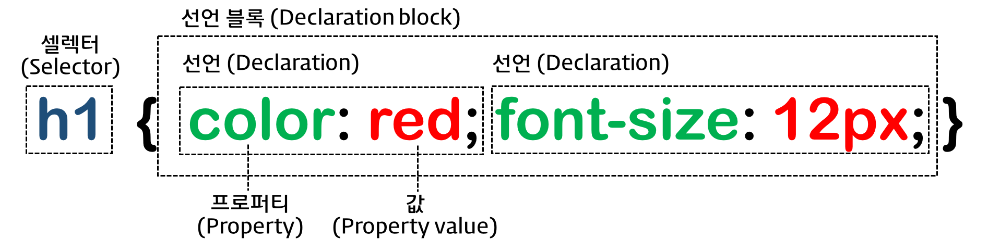
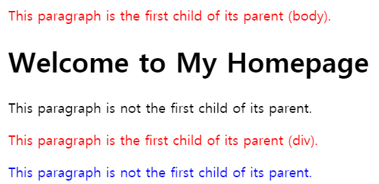

# 선택자(셀럭터)
HTML에 style을 적용하고자 하는 HTML 요소를 특정하는 목적으로 선택자(selector)를 사용합니다.


복수개의 선택자를 쉼표(,)를 이용해 구분할 수 있다.
✨ **예시**

```css
h1, p { color: red; }
```

## 1. 선택자의 종류
### 1) 전체 셀렉터(Universal Selector)
|패턴|Description|
|---|---|
|*|HTML 문서 내의 요소를 선택한다. (head 요소도 포함)|

✨ **예시**

```css
    /* 모든 요소를 선택 */
    * { color: red; }
```

## 2. 주요 선택자 - Type, Class, ID
### 1) 태그 셀렉터(Type Selector)
문서의 전체 웹 페이지에서 일관성있게 적용하는 스타일이 있을 때 타입 셀렉터를 사용합니다. 보통 상단에 모아서 사용합니다. 특정 요소를 선택할 때 ID Selector와 Class Selector를 사용합니다. 
|패턴|Description|
|---|---|
|태그명|지정한 태그명을 가지는 요소를 선택|

✨ **예시**

```css
/* 모든 p 태그 요소를 선택 */
    p { color: red; }
```

### 2) ID 셀렉터 (ID Selector)
|패턴|Description|
|---|---|
|#id 어트리뷰트 값|id 어트리뷰트 값을 지정하여 일치하는 요소를 선택한다. id 어트리뷰트 값은 중복될 수 없는 유일한 값이다.|

✨ **예시**

```css
 /* id 어트리뷰트 값이 p1인 요소를 선택 */
    #p1 { color: red; }
```

### 3) 클래스 셀렉터 (Class Selector)
|패턴|Description|
|---|---|
|.class 어트리뷰트 값|class 어트리뷰트 값을 지정하여 일치하는 요소를 선택한다. class 어트리뷰트 값은 중복될 수 있다.|

✨ **예시**

```css
    /* class 어트리뷰트 값이 container인 모든 요소를 선택 */
    /* color 어트리뷰트는 자식 요소에 상속된다. */
    .container { color: red; }
```

class 속성 값은 공백으로 구분하여 여러 개 지정할 수 있습니다. **재사용**에 유용

✨ **예시**

```html
<!DOCTYPE html>
<html>
<head>
  <style>
    /* class 어트리뷰트 값이 text-center인 모든 요소를 선택 */
    .text-center { text-align: center; }
    /* class 어트리뷰트 값이 text-large인 모든 요소를 선택 */
    .text-large  { font-size: 200%; }
    /* class 어트리뷰트 값이 text-red인 모든 요소를 선택 */
    .text-red    { color: red; }
    /* class 어트리뷰트 값이 text-blue인 모든 요소를 선택 */
    .text-blue   { color: blue; }
  </style>
</head>
<body>
  <p class="text-center">Center</p>
  <p class="text-large text-red">Large Red</p>
  <p class="text-center text-large text-blue">Center Large Blue</p>
</body>
</html>
```
  
🧪 **실행결과**
  


## 3. 속성 선택자(Attribute Selector) -  [attr], [attr=value]
|패턴|Description|
|---|---|
|셀렉터[어트리뷰트]|지정된 어트리뷰트를 갖는 모든 요소를 선택|
|셀렉터[어트리뷰트=”값”]|지정된 어트리뷰트를 가지며 지정된 값과 어트리뷰트의 값이 일치하는 모든 요소를 선택|

✨ **예시**

```css
/* 1. [attr] */
a[target]{
  color: hotpink;
}

/* 2. [attr=value] */
a[href="https://example.org"]{
  color: indigo;
}

input[type="submit"]{
  background-color: green;
}
```

🧪 **[실행결과](attrEx1.html)**


## 4. 속성 선택자 - [attr^], [attr$], [attr*]
|패턴|Description|
|---|---|
|셀렉터[어트리뷰트^=”값”]|지정된 어트리뷰트 값으로 **시작**하는 요소를 선택|
|셀렉터[어트리뷰트$=”값”]|지정된 어트리뷰트 값으로 **끝나는** 요소를 선택|
|셀렉터[어트리뷰트*=”값”]|지정된 어트리뷰트 값을 **포함**하는 요소를 선택|

✨ **예시**

```css
/* 1. [attr^=value] */
a[href^="https://"]{
  font-style: italic;
}

/* 2. [attr$=value] */
a[href$=".com"]{
  color: silver;
}

/* 3. [attr*=value] */
a[href*="example"]{
  color: sienna;
}
```

🧪 **[실행결과](attrEx2.html)**


## 5. 가상 클래스 선택자(Pseudo-Class Selector) - first-child, last-child, nth-child
가상 클래스는 요소의 **특정 상태**에 따라 스타일을 정의할 때 사용합니다. **특정 상태**란 예를 들어 다음과 같습니다. 
- 마우스가 올라와 있을때

- 링크를 방문했을 때와 아직 방문하지 않았을 때

- 포커스가 들어와 있을 때<br>
이러한 특정 상태에는 원래 클래스가 존재하지 않지만 가상 클래스를 임의로 지정하여 선택하는 방법입니다. 가상 클래스는 <strong>콜론(:)</strong>을 사용하고 CSS 표준에 미리 정의된 이름을 사용합니다.
선택자(selector)보다 더 좁은 범위를 스타일 변경합니다.

|pseudo-class|Description|
|---|---|
|:first-child|셀렉터에 해당하는 모든 요소 중 첫번째 자식인 요소를 선택|
|:last-child|셀렉터에 해당하는 모든 요소 중 마지막 자식인 요소를 선택|

### 1) first-child

✨ **예시**

```css
/* 1. first-child */
li:first-child {
  color: green;
}
```
  
🧪 **[실행결과](childEx1.html)**


### 2) last-child

✨ **예시**

```html
<!DOCTYPE html>
<html>
<head>
  <style>
    /* p 요소 중에서 첫번째 자식을 선택 */
    p:first-child { color: red; }

    /* p 요소 중에서 마지막 자식을 선택 */
    /* body 요소의 두번째 p 요소는 마지막 자식 요소가 아니다.
       body 요소의 마지막 자식 요소는 div 요소이다. */
    p:last-child { color: blue; }
  </style>
</head>
<body>
  <p>This paragraph is the first child of its parent (body).</p>

  <h1>Welcome to My Homepage</h1>
  <p>This paragraph is not the first child of its parent.</p>

  <div>
    <p>This paragraph is the first child of its parent (div).</p>
    <p>This paragraph is not the first child of its parent.</p>
  </div>
</body>
</html>
```
  
🧪 **[실행결과](childEx2.html)**



|pseudo-class|Description|
|---|---|
|:nth-child(n)|셀렉터에 해당하는 모든 요소 중 앞에서 n번째 자식인 요소를 선택|
|:nth-last-child(n)|셀렉터에 해당하는 모든 요소 중 뒤에서 n번째 자식인 요소를 선택|

n은 0부터 시작하는 정수이다. 0과 음수는 생략되기 때문에 2n+1과 2n-1, 3n-2와 3n+1은 결과적으로 같은 수열을 생성한다.

✨ **예시**

```css
/* 3. nth-child */
li:nth-child(2n){
  color: hotpink
}
```
  
🧪 **[실행결과](childEx3.html)**


✨ **예시**

```css
```


🧪 **실행결과**


