# 선택자(셀렉터)
HTML에 style을 적용하고자 하는 HTML 요소를 특정하는 목적으로 선택자(selector)를 사용합니다. 복수개의 선택자를 쉼표(,)를 이용해 구분할 수 있습니다.


✨ **예시**

```css
h1, p { color: red; }
```

## 1. 선택자의 종류
### 1) 전체 셀렉터(Universal Selector)
모든 태그에 대해 전역으로 속성을 지정하는 태그입니다. 
전체 선택자는 주의해서 쓰고 CSS 가장 상단에 쓸 것!!!

|패턴|Description|
|---|---|
|*|HTML 문서 내의 요소를 선택한다. (head 요소도 포함)|

✨ **예시**

```css
/* 모든 요소를 선택 */
* { 
  color: red;
 }

```
✨ **예시**

```html
<!DOCTYPE html>
<html>
<head>
  <style>
    p + * {
      color: greenyellow;
    }

    div > * {
      background-color: rosybrown;
    }
  </style>
</head>
<body>
  <div>
      <ul>
        <li>Coffee</li>
        <li>Tea</li>
        <li>Milk</li>
      </ul>
  </div>

  <div>
    <p>The first paragraph.</p>
    <ul>
      <li>Coffee</li>
      <li>Tea</li>
      <li>Milk</li>
    </ul>
  </div>

  <div>A range of document</div>
    <h2>Another list</h2>
    <ul>
      <li>Coffee</li>
      <li>Tea</li>
      <li>Milk</li>
    </ul>
</body>
</html>
```

🧪 **실행결과**

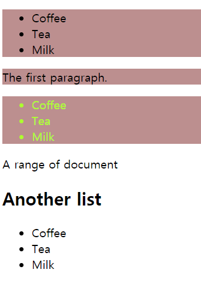

## 2. 주요 선택자 - Type, ID, Class
### 1) 태그 셀렉터(Type Selector)
문서의 전체 웹 페이지에서 일관성있게 적용하는 스타일이 있을 때 타입 셀렉터를 사용합니다. 보통 상단에 모아서 사용합니다. 특정 요소를 선택할 때 ID Selector와 Class Selector를 사용합니다. 


|패턴|Description|
|---|---|
|태그명|지정한 태그명을 가지는 요소를 선택|

✨ **예시**

```css
/* 모든 p 태그 요소를 선택 */
p { color: red; }
```

### 2) ID 셀렉터 (ID Selector)


|패턴|Description|
|---|---|
|#id 어트리뷰트 값|id 어트리뷰트 값을 지정하여 일치하는 요소를 선택. id 어트리뷰트 값은 중복될 수 없는 유일한 값|

✨ **예시**

```css
/* id 어트리뷰트 값이 p1인 요소를 선택 */
#p1 { color: red; }
```

### 3) 클래스 셀렉터 (Class Selector)

|패턴|Description|
|---|---|
|.class 어트리뷰트 값|class 어트리뷰트 값을 지정하여 일치하는 요소를 선택. class 어트리뷰트 값은 중복 가능|

✨ **예시**

```css
/* class 어트리뷰트 값이 container인 모든 요소를 선택 */
/* color 어트리뷰트는 자식 요소에 상속된다. */
.container { color: red; }
```

class 속성 값은 공백으로 구분하여 여러 개 지정할 수 있습니다. **재사용**에 유용

✨ **예시**

```html
<!DOCTYPE html>
<html>
<head>
  <style>
    /* class 어트리뷰트 값이 text-center인 모든 요소를 선택 */
    .text-center { text-align: center; }
    /* class 어트리뷰트 값이 text-large인 모든 요소를 선택 */
    .text-large  { font-size: 200%; }
    /* class 어트리뷰트 값이 text-red인 모든 요소를 선택 */
    .text-red    { color: red; }
    /* class 어트리뷰트 값이 text-blue인 모든 요소를 선택 */
    .text-blue   { color: blue; }
  </style>
</head>
<body>
  <p class="text-center">Center</p>
  <p class="text-large text-red">Large Red</p>
  <p class="text-center text-large text-blue">Center Large Blue</p>
</body>
</html>
```
  
🧪 **실행결과**
  


## 3. 속성 선택자(Attribute Selector) -  [attr], [attr=value]
|패턴|Description|
|---|---|
|셀렉터[어트리뷰트]|지정된 어트리뷰트를 갖는 모든 요소를 선택|
|셀렉터[어트리뷰트=”값”]|지정된 어트리뷰트를 가지며 지정된 값과 어트리뷰트의 값이 일치하는 모든 요소를 선택|

✨ **예시**

```css
/* 1. [attr] */
a[target]{
  color: hotpink;
}

/* 2. [attr=value] */
a[href="https://example.org"]{
  color: indigo;
}

input[type="submit"]{
  background-color: green;
}
```

🧪 **[실행결과](attrEx1.html)**

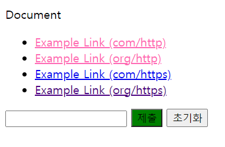


```css
/* class="check"로 되어 있는 모든 `<input type="checkbox">` 요소의 스타일을 선택하는 Selector */
input[type="checkbox"].check
```


## 4. 속성 선택자 - [attr^], [attr$], [attr*]
|패턴|Description|
|---|---|
|셀렉터[속성^=”값”]|지정된 속성 값으로 **시작**하는 요소를 선택|
|셀렉터[속성$=”값”]|지정된 속성 값으로 **끝나는** 요소를 선택|
|셀렉터[속성*=”값”]|지정된 속성 값을 **포함**하는 요소를 선택|

✨ **예시**

```css
/* 1. [attr^=value] */
a[href^="https://"]{
  font-style: italic;
}

/* 2. [attr$=value] */
a[href$=".com"]{
  color: silver;
}

/* 3. [attr*=value] */
a[href*="example"]{
  color: sienna;
}
```

🧪 **[실행결과](attrEx2.html)**

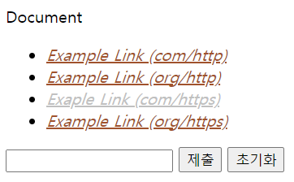

## 5. 가상 클래스 선택자(Pseudo-Class Selector) - first-child, last-child, nth-child
가상 클래스는 요소의 **특정 상태**에 따라 스타일을 정의할 때 사용합니다.


이러한 특정 상태에는 원래 클래스가 존재하지 않지만 가상 클래스를 임의로 지정하여 선택하는 방법입니다. 가상 클래스는 <strong>콜론(:)</strong>을 사용하고 CSS 표준에 미리 정의된 이름을 사용합니다.
선택자(selector)보다 더 좁은 범위를 스타일 변경합니다.

|pseudo-class|Description|
|---|---|
|:first-child|셀렉터에 해당하는 모든 요소 중 **첫번째 자식인 요소**를 선택|
|:last-child|셀렉터에 해당하는 모든 요소 중 **마지막 자식인 요소**를 선택|

### 1) first-child

✨ **예시**

```css
li:first-child {
  color: green;
}
```
  
🧪 **[실행결과](childEx1.html)**

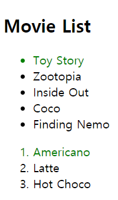

### 2) last-child

✨ **예시**

```html
<!DOCTYPE html>
<html>
<head>
  <style>
    /* p 요소 중에서 첫번째 자식을 선택 */
    p:first-child { 
      color: red; 
    }

    /* p 요소 중에서 마지막 자식을 선택 */
    /* body 요소의 두번째 p 요소는 마지막 자식 요소가 아니라 body 요소의 마지막 자식 요소는 div 요소이다. */
    p:last-child { 
      color: blue; 
    }
  </style>
</head>
<body>
  <p>This paragraph is the first child of its parent (body).</p>

  <h1>Welcome to My Homepage</h1>
  <p>This paragraph is not the first child of its parent.</p>

  <div>
    <p>This paragraph is the first child of its parent (div).</p>
    <p>This paragraph is not the first child of its parent.</p>
  </div>
</body>
</html>
```
  
🧪 **[실행결과](childEx2.html)**

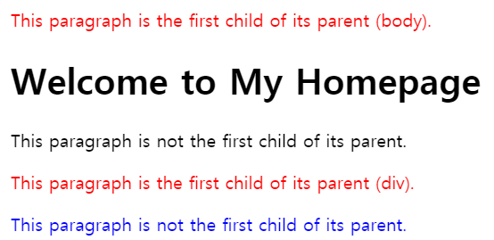

### 3) nth-child

|pseudo-class|Description|
|---|---|
|:nth-child(n)|셀렉터에 해당하는 모든 요소 중 **앞에서 n번째 자식**인 요소를 선택|
|:nth-last-child(n)|셀렉터에 해당하는 모든 요소 중 **뒤에서 n번째 자식**인 요소를 선택|

n은 0부터 시작하는 정수이다. 0과 음수는 생략되기 때문에 2n+1과 2n-1, 3n-2와 3n+1은 결과적으로 같은 수열을 생성한다. odd(2n+1), even(2n)도 가능

✨ **예시**

```css
li:nth-child(2n){
  color: hotpink
}
```
  
🧪 **[실행결과](childEx3.html)**

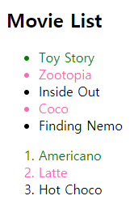


## 6. 가상 클래스 선택자 - first-of-type, last-of-type, nth-of-type 
|pseudo-class|Description|
|---|---|
|:first-of-type|셀렉터에 해당하는 요소의 부모 요소의 자식 요소 중 첫번째 등장하는 요소를 선택|
|:last-of-type|셀렉터에 해당하는 요소의 부모 요소의 자식 요소 중 마지막에 등장하는 요소를 선택|
|:nth-of-type(n)|셀렉터에 해당하는 요소의 부모 요소의 자식 요소 중 앞에서 n번째에 등장하는 요소를 선택|

✨ **예시**

```html
<!DOCTYPE html>
<html>
<head>
  <style>
    /* p 요소의 부모 요소의 자식 요소 중 첫번째 등장하는 p 요소 */
    p:first-of-type  { color: red; }
    /* p 요소의 부모 요소의 자식 요소 중 마지막 등장하는 p 요소 */
    p:last-of-type   { color: blue; }
    /* p 요소의 부모 요소의 자식 요소 중 앞에서 2번째에 등장하는 p 요소 */
    p:nth-of-type(2) { color: green; }
    /* p 요소의 부모 요소의 자식 요소 중 뒤에서 2번째에 등장하는 p 요소 */
    p:nth-last-of-type(2) { color: orange;}
    /* p 요소 중에서 첫번째 자식을 선택 */
    p:first-child { background: purple;}
  </style>
</head>
<body>
  <h1>This is a heading</h1>
  <p>The first paragraph.</p>
  <p>The second paragraph.</p>
  <p>The third paragraph.</p>
  <p>The fourth paragraph.</p>
  <div>
    <h1>This is a heading</h1>
    <p>The first paragraph.</p>
    <p>The second paragraph.</p>
    <p>The third paragraph.</p>
    <p>The fourth paragraph.</p>
  </div>
</body>
</html>
```

🧪 **[실행결과](pseudoEx.html)**

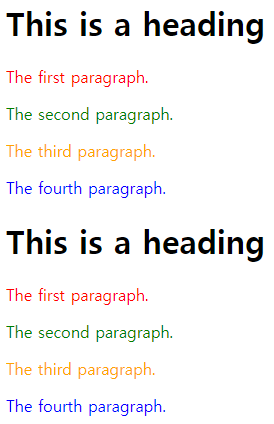


### :nth-child와 :nth-of-type의 차이점
두가지 한정자는 전혀 다른 선택 결과를 나타냅니다. `p:nth-child(2)`는 "내용1"을 선택하지만 `p:nth-of-type(2)`는 "내용2"를 선택합니다.

✨ **예시**

```html
<!DOCTYPE html>
<html lang="en">
<head>
  <style>
    p:nth-child(2) {
      color: indianred
    }
    p:nth-of-type(2) {
      color: navy
    }
  </style>
</head>
<body>
  <div>
    <h1>제목</h1>
    <p>내용1</p>
    <p>내용2</p>
  </div>
</body>
</html>
```

🧪 **실행결과**

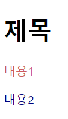


✨ **예시**

```html
<!DOCTYPE html>
<html lang="en">
<head>
  <style>
    p:nth-child(2) {
      color: indianred
    }
    p:nth-of-type(2) {
      color: navy
    }
  </style>
</head>
<body>
  <div>
    <h1>제목</h1>
    <h2>서브제목</h2>
    <p>내용1</p>
    <p>내용2</p>
  </div>
</body>
</html>
```

🧪 **실행결과**

.png)


"nth-child"는 순서에 따라 2번째 요소를 먼저 선택한 후 그 중에서 태그가 "p"인 것을 찾습니다. 따라서 2번째 자식 요소인 `<h2>서브제목</h2>`를 보고 "p" 태그 인지를 판단했기 때문에 선택된 요소가 없게 됩니다.

반면, "nth-of-type"은 "p"태그인 자식 요소(들)을 먼저 선택한 후, 그 중에서 2번째를 찾습니다. 


 ## 7. 가상 클래스 선택자 - not
|pseudo-class|Description|
|---|---|
|:not(셀렉터)|셀렉터에 해당하지 않는 모든 요소를 선택한다.|

✨ **예시**

```html
<!DOCTYPE html>
<html>
<head>
  <style>
    /* input 요소 중에서 type 어트리뷰트의 값이 password가 아닌 요소를 선택 */
    input:not([type=password]) {
      background: yellow;
    }
  </style>
</head>
<body>
  <input type="text" value="Text input">
  <input type="email" value="email input">
  <input type="password" value="Password input">
</body>
</html>
```

🧪 **[실행결과](notEx1.html)**

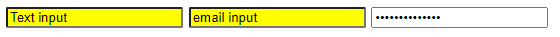

## 8. `<a>` 하이퍼링크 기상 클래스
HTML 요소의 상태에 따라 바뀌는 동적 가상 클래스 선택자 

|가상 클래스|	설명|
|---|---|
|:link |방문하지 않은 링크|
|:visited |	방문한 링크|
|:hover	| 하이퍼링크 태그(`<a>`) 요소 위로 마우스 커서를 위치했을 때 상태. :hover는 하이퍼링크 태그 뿐만 아닐 일반 태그에도 사용할 수 있습니다.|
|:active|	활성화된 링크. |
|:focus|	셀렉터에 포커스가 들어와 있을 때|

input은 type에 따라 생김새가 달라지기 때문에 style 적용할 때, attr을 추가해주는 것이 좋습니다.
**LVHA순서(:link - :visited - :hover - :active)** 따라 :active 규칙을 다른 모든 링크 규칙보다 뒤에 배치하세요.

✨ **예시**

```html
<!DOCTYPE html>
<html>
<head>
  <style>
    /* a 요소가 방문하지 않은 링크일 때 */
    a:link { color: orange; }

    /* a 요소가 방문한 링크일 때 */
    a:visited { color: green; }

    /* a 요소에 마우스가 올라와 있을 때 */
    a:hover { font-weight: bold; }

    /* a 요소가 클릭된 상태일 때 */
    a:active { color: blue; }

    /* text input 요소와 password input 요소에 포커스가 들어와 있을 때 */
    input[type=text]:focus,
    input[type=password]:focus {
      color: red;
    }
    </style>
  </head>
<body>
  <a href="#" target="_blank">This is a link</a><br>
  <input type="text" value="I'll be red when focused"><br>
  <input type="password" value="I'll be red when focused">
</body>
</html>
```

🧪 **[실행결과](userClass.html)**

link 예제

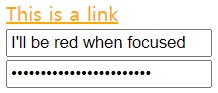

visited 예제

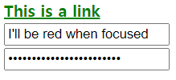

hover 예제

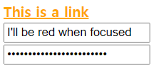

active 예제

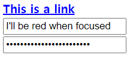

focus 예제

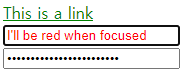


## 9. 가상 클래스 선택자 - enabled, disabled, checked

|가상 클래스	|설명|
|---|---|
|:enabled	|사용 가능한 상태인 입력 요소(`<input>`)를 선택. ":disabled"로 설정하지 않은 입력 요소는 모두 ":enabled" 입니다.|
|:disabled|	사용 불가 상태인 입력 요소 (`<input>`)를 선택|
|:checked	|체크한 입력 요소(`<input>`)를 선택. 라디오버튼과 체크박스 한정|


✨ **예시**

```html
<!DOCTYPE html>
<html>
  <head>
    <style>
    /* input 요소가 사용 가능한 상태일 때*/
    input[type=text]:enabled {
      background-color: skyblue;
    }

    /* input 요소가 사용 불가능한 상태일 때*/
    input[type=text]:disabled {
      background-color: silver;
    }

    /* input 요소 radio button 체크된 상태일 때*/
    input[type=radio]:checked {
      outline: 3px solid red;
    }

    /* input 요소 checkbox 체크된 상태일 때*/
    input[type=checkbox]:checked {
      outline: 3px solid blue;
    }
  </style>
</head>
<body>
  <div>
    <input type="text" placeholder="1">
    <input type="text" placeholder="2">
    <input type="text" placeholder="3" disabled>
  </div>

  <div>
    <input type="radio" checked="checked" value="male" name="gender"> <span>Male</span><br>
  <input type="radio" value="female" name="gender"> <span>Female</span><br>
  <input type="radio" value="neuter" name="gender" disabled> <span>Neuter</span><hr>
  </div>  

  <div>
    <input type="checkbox" checked="checked" value="bicycle"> <span>I have a bicycle</span><br>
  <input type="checkbox" value="car"> <span>I have a car</span><br>
  <input type="checkbox" value="motorcycle" disabled> <span>I have a motorcycle</span>
  </div>
</body>
</html>
```
    
🧪 **[실행결과](uiElementStates.html)**

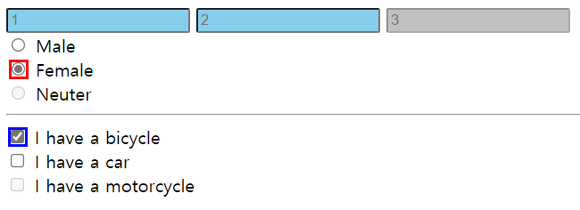

## 9. 가상 요소 선택자 - ::first-letter, ::first-line, ::before, ::after, ::selection
클래스가 없지만 있는 것처럼 개념을 붙였다 하여 가상 클래스 선택자라 합니다. 가상 요소는 요소의 특정 부분에 스타일을 적용하기 위해 사용됩니다.
- 요소 콘텐트의 첫글자 또는 첫줄
- 요소 콘텐트의 앞 또는 뒤
- **::before**나 **::after**를 사용할 땐 이름이 content인 property를 추가합니다.

가상 요소에는 두 개의 콜론(::)을 사용합니다. CSS 표준에 미리 정의된 이름을 사용합니다.

|선택자	|설명|
|---|---|
|::before|블록 요소 앞에 내용을 삽입|
|::after|블록 요소 뒤에 내용을 삽입|
|::first-letter|블록의 첫 음절을 선택|
|::first-line|블록의 첫 줄을 선택|
|::selection|사용자가 드래그로 선택한 블록 전체|

✨ **예시**

```html
<!DOCTYPE html>
<html>
<head>
  <style>
    /* p 요소 콘텐츠의 첫글자를 선택 */
    p::first-letter {
      font-size: 3em;
    }

    /* p 요소 콘텐츠의 첫줄을 선택 */
    p::first-line {
      color: red
    }

    /* h1 요소 콘텐츠의 앞 공간에 content 속성 값 삽입 */
    h1::before {
      content: "HTML!!!";
      color: blue;
    }

    /* h1 요소 콘텐츠의 뒷 공간에 content 속성 값 삽입 */
     h1::after {
       content: "CSS3!!!";
       color: red;
     }

    /* 드래그한 콘텐츠를 선택 */
    ::selection{
      color: red;
      background: yellow;
    }

  </style>
</head>
<body>
  <h1>This is a heading</h1>
  <p>Lorem ipsum dolor sit amet, consectetur adipisicing elit. Explicabo illum sunt distinctio sed, tempore, repellat rerum et ea laborum voluptatum! Quisquam error fugiat debitis maiores officiis, tenetur ullam amet in!</p>
</body>
</html>
```

🧪 **실행결과**

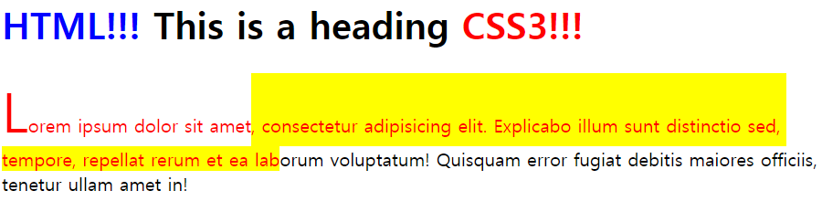


## 10. 선택자 결합 - 하위, 자식

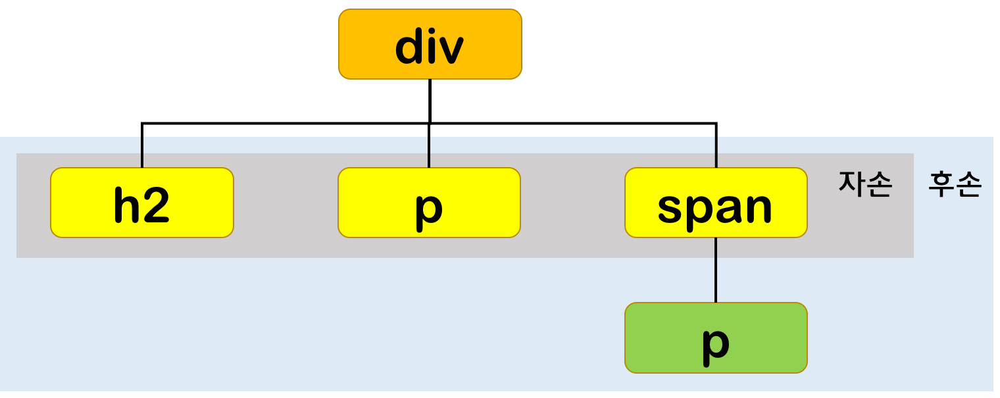

자신의 1 level 상위에 속하는 요소를 **부모 요소**, 1 level 하위에 속하는 요소를 **자손 요소(자식 요소)** 라 합니다. 자신보다 n level 하위에 속하는 요소는 **후손 요소(하위 요소)** 라 합니다. 첫번째 선택자를 작성하고 spacing을 추가하고 뒤에 넣고 싶은 선택자를 작성

### 1) 하위 셀렉터, 후손 셀렉터 (Descendant Combinator) 셀렉터A 셀렉터B


✨ **예시**

```html
<!DOCTYPE html>
<html lang="en">
<head>
  <style>
    /* ul 요소의 후손 요소 p 요소 중 부모 요소의 자식 요소 중 마지막 등장하는 p 요소 */
    ul li:last-of-type {
      color: red
    }

    /* ID가 olList 요소의 후손 요소 p 요소 중 부모 요소의 자식 요소 중 마지막 등장하는 p 요소*/
    #olList li:last-of-type {
      color: gold
    }
  </style>
</head>
<body>
  <ul>
    <li>리스트1</li>
    <li>리스트2</li>
    <li>리스트3</li>
    <li>리스트4</li>
  </ul>

  <ol id="olList">
    <li>리스트1</li>
    <li>리스트2</li>
      <ul>
        <li>리스트(1)</li>
        <li>리스트(2)</li>
      </ul>
    <li>리스트3</li>
    <li>리스트4</li>
  </ol>
</body>
</html>
```

🧪 **실행결과**

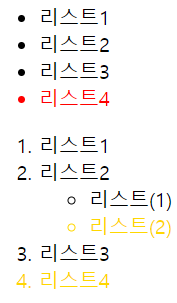


### 2) 자식 셀렉터 (Child Combinator) 셀렉터A > 셀렉터B
자손 셀렉터는 셀렉터 A의 모든 **자식 요소** 중 셀렉터 B와 일치하는 요소를 선택합니다.

✨ **예시**

```html
<!DOCTYPE html>
<html lang="en">
<head>
  <style>
    #olList > li:last-of-type {
      color: cyan
    }
  </style>
</head>
<body>
  <ul>
    <li>리스트1</li>
    <li>리스트2</li>
    <li>리스트3</li>
    <li>리스트4</li>
  </ul>

  <ol id="olList">
    <li>리스트1</li>
    <li>리스트2</li>
      <ul>
        <li>리스트(1)</li>
        <li>리스트(2)</li>
      </ul>
    <li>리스트3</li>
    <li>리스트4</li>
  </ol>
</body>
</html>
```

🧪 **실행결과**

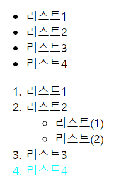

## 11. 형재 선택자, 그룹화

### 1) 일반 형제 선택자 결합(General Sibling Combinator) 셀렉터A ~ 셀렉터B

셀렉터A의 형제 요소 중 셀렉터A 뒤에 위치하는 셀렉터B 요소를 **모두** 선택합니다.

✨ **예시**

```html
<!DOCTYPE html>
<html>
<head>
  <style>
    /* p 요소의 형제 요소 중에 p 요소 뒤에 위치하는 ul 요소를 모두 선택한다.*/
    p ~ ul { color: palevioletred; }
  </style>
</head>
<body>
  <div>A div element.</div>
  <ul>
    <li>Coffee</li>
    <li>Tea</li>
    <li>Milk</li>
  </ul>

  <p>The first paragraph.</p>
  <ul>
    <li>Coffee</li>
    <li>Tea</li>
    <li>Milk</li>
  </ul>

  <h2>Another list</h2>
  <ul>
    <li>Coffee</li>
    <li>Tea</li>
    <li>Milk</li>
  </ul>
</body>
</html>
```

🧪 **실행결과**

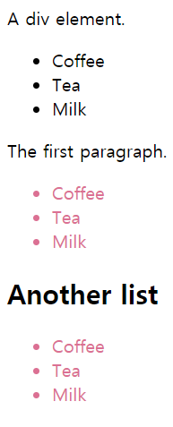

### 2) 인접 형제 셀렉터(Adjacent Sibling Combinator) 셀렉터A + 셀렉터B

셀렉터 A의 형제 요소 중 셀렉터 A **바로 뒤**에 위치하는 첫번째 셀렉터 B 요소를 선택합니다. A와 B 사이에 다른 요소가 존재하면 선택되지 않습니다.

✨ **예시**

```html
<!DOCTYPE html>
<html>
<head>
  <style>
    /* p 요소의 형제 요소 중에 p 요소 바로 뒤에 위치하는 ul 요소를 선택한다. */
    .many + ul { color: red; }
  </style>
</head>
<body>
  <div>A div element.</div>
  <ul>
    <li>Coffee</li>
    <li>Tea</li>
    <li>Milk</li>
  </ul>

  <p class="many">The first paragraph.</p>
  <ul>
    <li>Coffee</li>
    <li>Tea</li>
    <li>Milk</li>
  </ul>

  <h2>Another list</h2>
  <ul>
    <li>Coffee</li>
    <li>Tea</li>
    <li>Milk</li>
  </ul>
</body>
</html>
```

🧪 **실행결과**

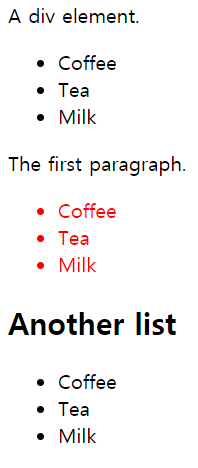

## 12. 상속 제어하기 - initial, inherit, unset
자신에게 스타일이 적용되지 않았을 때 부모 스타일을 상속받습니다. 

✨ **예시**

```html
<!DOCTYPE html>
<html lang="en">
<head>
  <style>
    div {
      border: 1px solid silver;
      margin: 2px;
    }

    .parent {
      color: greenyellow;
    }

    .child2 {
      color: gold;
    }
  </style>
</head>
<body>
  <div class="parent"> parent
    <div class="child1">child1</div>
    <div class="child2">child2</div>
  </div>
</body>
</html>
```

🧪 **실행결과**

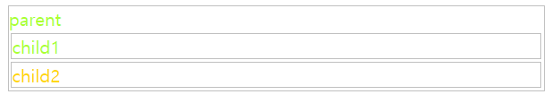

### 1) initial
상속을 끊어내는 initial 
`object.style.property="initial"` 예시) #p2 { color: initial;}

✨ **예시**

```html
<!DOCTYPE html>
<html lang="en">
<head>
  <style>
    div {
      border: 1px solid silver;
      margin: 2px;
    }

    .parent {
      color: greenyellow;
    }

    .child2 {
      all: initial;
    }
  </style>
</head>
<body>
  <div class="parent"> parent
    <div class="child1">child1</div>
    <div class="child2">child2</div>
  </div>
</body>
</html>
```

🧪 **실행결과**


### 2) inherit
항상 부모 요소를 상속 받습니다.

✨ **예시**

```html
<!DOCTYPE html>
<html lang="en">
<head>
  <style>
    div {
      border: 1px solid silver;
      margin: 2px;
    }

    .child1 {
      color: red;
    }

    .parent1, .parent2 {
      color: blue;
    }

    .parent2 * {
      color: inherit;
    }
  </style>
</head>
<body>
  <div class="parent1"> parent1
    <div class="child1">child1</div>
    <div class="child2">child2</div>
  </div>
  
  <div class="parent2"> parent2
    <div class="child1">child1</div>
    <div class="child2">child2</div>
  </div>
</body>
</html>
```

🧪 **실행결과**

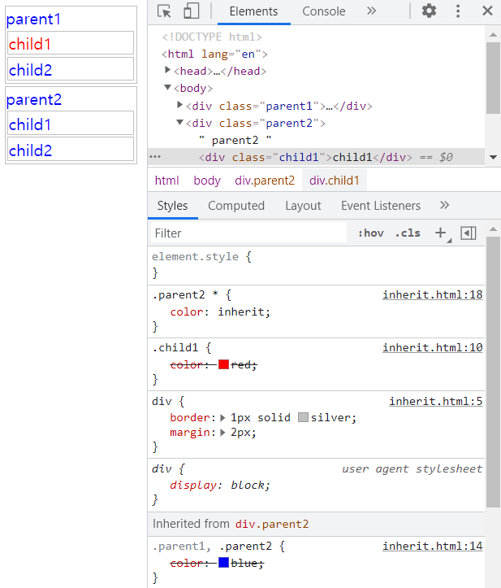

### 3) unset
- inherit: 부모로부터 상속받을 값이 있을 때
- initial: 부모로부터 상속받을 값이 없을 때

✨ **예시**

```html
<!DOCTYPE html>
<html lang="en">
<head>
  <style>
    div {
      border: 1px solid silver;
      margin: 2px;
    }

    .child1 {
      color: red;
    }

    .parent1, .parent2 {
      color: blue;
    }

    .parent2 .child1 {
      all: unset;
    }
  </style>
</head>
<body>
  <div class="parent1"> parent1
    <div class="child1">child1</div>
    <div class="child2">child2</div>
  </div>
  
  <div class="parent2"> parent2
    <div class="child1">child1</div>
    <div class="child2">child2</div>
  </div>
</body>
</html>
```

🧪 **실행결과**

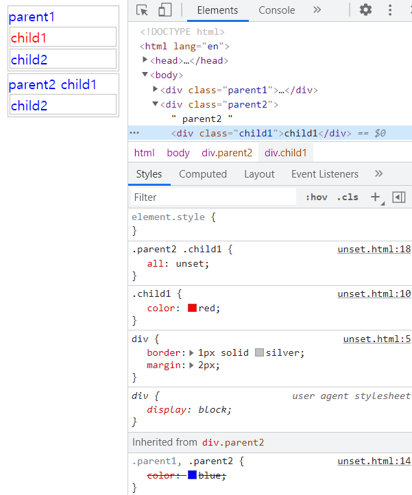

부모로부터 받은 color: blue는 유지되지만 이외에 전부 기본값

## 13. 우선순위
### 1. 선언된 곳
1) `<head>` 요소안의 style 요소
2) `<style>` 요소안의 @import 문
3) `<link>` 요소로 연결된 CSS 파일
4) `<link>` 요소로 연결한 CSS 파일 안의 @import 문
5) 최종 사용자가 연결한 CSS 파일
6) 브라우저의 기본 스타일시트

### 2. 명시도(적용범위가 적을수록 명시도가 높은 것!)
```css
!important
inline style > 
ID > 
Class / Attribute / Pseudo Class >
Type (Tag) > 
* > 
inherited
```

### 3. 코드 위치


## 참고 자료 및 강의📑

- 제로베이스 강의 - HTML/CSS
- HTML & CSS 마스터북 도서
- [PoiemaWeb](https://poiemaweb.com/)