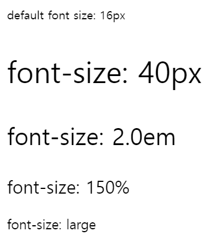
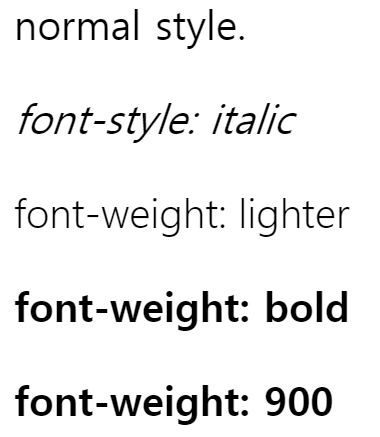
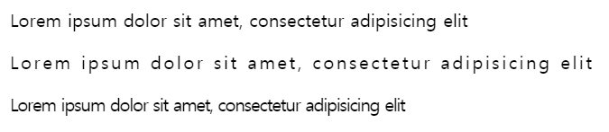
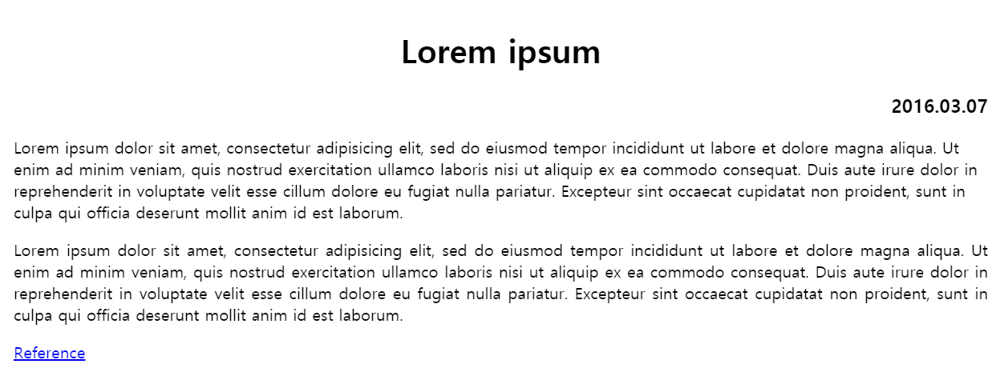
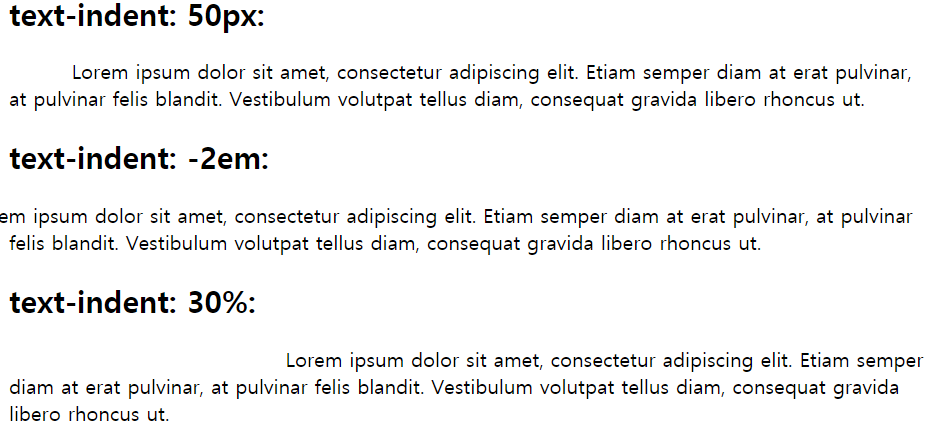
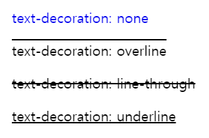
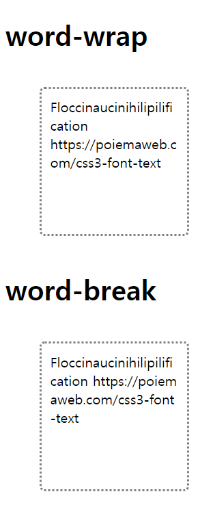
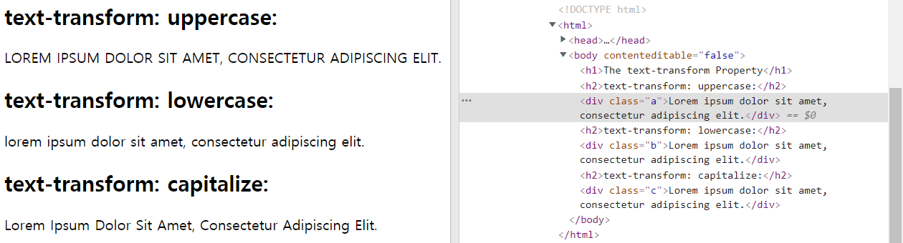

# 폰트 관련 속성
## 1. font-size, font-style, font-weight
### 1) font-size
텍스트의 크기를 정의. 브라우저 기본 값 16px

"%"와 "em"은 부모 요소에 대한 상대적인 크기입니다. font-size로 "em"을 쓰는 것을 추천합니다. 

✨ **예시**

```html
<!DOCTYPE html>
<html>
<head>
  <style>
    .font-size-40 { font-size: 40px; }
    .font-size-2x { font-size: 2.0em; }
    .font-size-150ps { font-size: 150%; }
    .font-size-large { font-size: large; }
  </style>
</head>
<body>
  <p>default font size: 16px</p>
  <p class='font-size-40'>font-size: 40px</p>
  <p class='font-size-2x'>font-size: 2.0em</p>
  <p class='font-size-150ps'>font-size: 150%</p>
  <p class='font-size-large'>font-size: large</p>
</body>
</html>
```

🧪 **실행결과**




### 2) font-style, font-weight
`font-style` 보통 **이텔릭체**를 쓰기 위해 사용하는 속성. 

사용 값: normal, italic, oblique(기울임)

`font-weight` 폰트 굵기 지정. 

사용 값: normal, bold, 100 ~ 900, bolder, lighter

✨ **예시**

```html
<!DOCTYPE html>
<html>
<head>
  <style>
    p { font-size: 2.0em; }

    /*
      font-style
      normal / italic / oblique(기울임)
    */
    .italic {
      font-style: italic;
    }

    /*
      font-weight
      100 ~ 900 or normal(400) / bold(700) / lighter / bolder
    */
    .light {
      font-weight: lighter;
    }
    .thick {
      font-weight: bold;
    }
    .thicker {
      font-weight: 900;
    }
  </style>
</head>
<body>
  <p>normal style.</p>
  <p class="italic">font-style: italic</p>
  <p class="light">font-weight: lighter</p>
  <p class="thick">font-weight: bold</p>
  <p class="thicker">font-weight: 900</p>
</body>
</html>
```

🧪 **실행결과**



## 2. font-family
폰트 지정. 폰트는 여러 개를 동시에 지정이 가능합니다. 첫번째 지정한 폰트가 클라이언트 컴퓨터에 설치되어 있지 않은 경우, 다음에 지정된 폰트를 적용합니다. 따라서 마지막은 대부분의 OS에 기본적으로 설치되어 있는 generic-family 폰트(Serif, Sans-serif, Mono space)를 지정하는 것이 일반적입니다. 공백으로 분리된 이름을 가진 글꼴명은 따옴표로 감싸야 합니다.

속성 값을 여러 개 나열할 수 있는 속성은 속성 값들을 쉼표(,)로 구분해 속성 값을 표시하고 대표적인 예가 "font-family" 속성입니다. 


✨ **예시**

```css
.p {
      font-family: "Times New Roman", Times, serif;
    }
```

## 3. line-height
텍스트의 높이를 지정. 글꼴마다 높이(`line-height`)가 다 다른데 이를 동일한 높이 글꼴로 사용할 수 있습니다. 
`line-height`는 인라인 요소의 수직 가운데 정렬을 구현하기 위해서도 널리 이용됩니다. 

line-height:1 = line-height:100%

line-height:1.5 = line-height:150%

✨ **예시**

```css
.small {
  line-height: 70%; /* 16px * 70% */
}
.big {
  line-height: 1.2; /* 16px * 1.2 */
}
.lh-3x {
  line-height: 3.0; /* 16px * 3 */
}
```


✨ **예시**
```html
<!DOCTYPE html>
<html>
<head>
  <style>
    /* a 요소의 line-height 값과 a 요소를 감싸는 div 요소의 height 값을 일치시킵니다. */
    .button {
      width: 150px;
      height: 70px;
      background-color: #FF6A00;
      border-radius: 30px;
      box-shadow: 5px 5px 5px #A9A9A9;
    }
    .button > a {
      display: block;
      font: italic bold 2em/70px Arial, Helvetica, sans-serif;
      text-decoration: none;
      text-align: center;
    }
  </style>
</head>
<body>
  <div class="button">
    <a href="#">Click</a>
  </div>
</body>
</html>
```

🧪 **실행결과**


## 4. font와 단축속성(Shorthand)
- 필수로 `font-size`, `font-family` 속성 값을 포함해야 합니다.
- `line-height`는 `font-size`위에 슬래시(/)를 함께 붙입니다.


**Shorthand Syntax**

```css
font : font-style(optional) font-variant(optional) font-weight(optional) font-size(mandatory) line-height(optional) font-family(mandatory)
```


```css
/* size | family */
font: 2em "Open Sans", serif;

/* style | size | family */
font: italic 2em "Open Sans", sans-serif;

/* style | variant | weight | size/line-height | family */
font: italic small-caps bolder 16px/1.2 monospace;

/* style | variant | weight | size/line-height | family */
font: italic small-caps bolder 16px/3 cursive;
/* font-variant: small-caps; 대문자로 표시하면서 소문자형으로 나타내는 속성*/
```


**font-variant: small-caps 예시** 


## 5. letter-spacing, word-spacing
### 1) letter-spacing
글자 사이의 간격을 지정. 

속성 값: 정수px

✨ **예시**

```html
<!DOCTYPE html>
<html>
<head>
  <style>
    .loose {
      letter-spacing: 2px;
    }
    .tight {
      letter-spacing: -1px;
    }
  </style>
</head>
<body>
  <p>Lorem ipsum dolor sit amet, consectetur adipisicing elit</p>

  <p class="loose">Lorem ipsum dolor sit amet, consectetur adipisicing elit</p>

  <p class="tight">Lorem ipsum dolor sit amet, consectetur adipisicing elit</p>
</body>
</html>
```

🧪 **실행결과**




### 2) word-spacing
단어 사이의 간격

✨ **예시**
```html
<!DOCTYPE html>
<html>
<head>
  <style>
    p.a { 
      word-spacing: normal;
    }

    p.b { 
      word-spacing: 30px;
    }

    p.c { 
      word-spacing: 1cm;
    }
  </style>
</head>
<body>
  <h2>word-spacing: normal:</h2>
  <p class="a">This is some text. This is some text.</p>

  <h2>word-spacing: 30px:</h2>
  <p class="b">This is some text. This is some text.</p>

  <h2>word-spacing: 1cm:</h2>
  <p class="c">This is some text. This is some text.</p>
</body>
</html>
```

🧪 **실행결과**


## 6. text-align
텍스트의 수평 정렬. `text-align`은 블록 요소만 정렬할 수 있습니다. 

인라인 요소는 width 프로퍼티가 없어 중앙 개념이 존재하지 않습니다. 
인라인 요소를 정렬하기 위한 방법 (인라인 대표 예로 `<a>`태그)
1. `<a>` 태그 요소의 부모 요소로 블록 요소를 두고 `text-align` 프로퍼티를 사용하세요.
2. `<a>` 태그 요소에 `display: block;`을 지정하면 중앙 정렬이 가능합니다.

✨ **예시**

```html
<!DOCTYPE html>
<html>
<head>
  <style>
    h1 { text-align: center; }
    h3 { text-align: right; }
    p.left  { text-align: left; }
    p.justify  { text-align: justify; } /* justify 속성은 div의 폭에 맞춰 글을 정렬하는 것이다. */
    a  { text-align: center; }
  </style>
</head>
<body>
  <h1>Lorem ipsum</h1>
  <h3>2016.03.07</h3>

  <p class="left">Lorem ipsum dolor sit amet, consectetur adipisicing elit, sed do eiusmod tempor incididunt ut labore et dolore magna aliqua. Ut enim ad minim veniam, quis nostrud exercitation ullamco laboris nisi ut aliquip ex ea commodo consequat. Duis aute irure dolor in reprehenderit in voluptate velit esse cillum dolore eu fugiat nulla pariatur. Excepteur sint occaecat cupidatat non proident, sunt in culpa qui officia deserunt mollit anim id est laborum.</p>
  <p class="justify">Lorem ipsum dolor sit amet, consectetur adipisicing elit, sed do eiusmod tempor incididunt ut labore et dolore magna aliqua. Ut enim ad minim veniam, quis nostrud exercitation ullamco laboris nisi ut aliquip ex ea commodo consequat. Duis aute irure dolor in reprehenderit in voluptate velit esse cillum dolore eu fugiat nulla pariatur. Excepteur sint occaecat cupidatat non proident, sunt in culpa qui officia deserunt mollit anim id est laborum.</p>
  <a href='#'>Reference</a>
</body>
</html>
```

🧪 **실행결과**




## 7. text-indent
블록 요소 첫 번째 단락에서 들여쓰기 지정. 인라인 요소는 적용 안됨.

✨ **예시**

```html
<!DOCTYPE html>
<html>
<head>
  <style>
    div.a {
      text-indent: 50px;
    }

    div.b {
      text-indent: -2em;
    }

    div.c {
      text-indent: 30%;
    }
  </style>
</head>
<body>
  <h2>text-indent: 50px:</h2>
  <div class="a">
    <p>Lorem ipsum dolor sit amet, consectetur adipiscing elit. Etiam semper diam at erat pulvinar, at pulvinar felis blandit. Vestibulum volutpat tellus diam, consequat gravida libero rhoncus ut.</p>
  </div>

  <!-- 음수는 페이지 밖으로 나가게 됨 -->
  <h2>text-indent: -2em:</h2>
  <div class="b">
    <p>Lorem ipsum dolor sit amet, consectetur adipiscing elit. Etiam semper diam at erat pulvinar, at pulvinar felis blandit. Vestibulum volutpat tellus diam, consequat gravida libero rhoncus ut.</p>
  </div>

  <h2>text-indent: 30%:</h2>
  <div class="c">
    <p>Lorem ipsum dolor sit amet, consectetur adipiscing elit. Etiam semper diam at erat pulvinar, at pulvinar felis blandit. Vestibulum volutpat tellus diam, consequat gravida libero rhoncus ut.</p>
  </div>
</body>
</html>
```

🧪 **실행결과**



## 8. text-decoration

### 1) text-decoration
- 텍스트에 라인을 긋는 효과를 지정합니다. 
- 2개 이상 중복 지정 가능합니다. 
- `<a>` 태그 링크 underline을 제거할 수 있습니다.
- 속성 값: none, underline, overline, line-through

✨ **예시**

```html
<!DOCTYPE html>
<html>
<head>
  <style>
    a { text-decoration: none; }
    p:nth-of-type(1) { text-decoration: overline; }
    p:nth-of-type(2) { text-decoration: line-through; }
    p:nth-of-type(3) { text-decoration: underline; }
  </style>
</head>
<body>
  <a href="#">text-decoration: none</a>
  <p>text-decoration: overline</p>
  <p>text-decoration: line-through</p>
  <p>text-decoration: underline</p>
</body>
</html>
```

🧪 **실행결과**



### 2) text-decoration-style 

``` css
text-decoration-style: solid;
text-decoration-style: double;
text-decoration-style: dotted;
text-decoration-style: dashed;
text-decoration-style: wavy;
```

### 3) text-decoration-color

### 4) text-decoration (Shorthand)


```css
text-decoration: black line-through underline wavy 2px;
```

순서는 없으나 같은 프로퍼티 다중 사용 시 붙여 씁니다.


## 9. word-break
한 단어의 길이가 길어서 부모 영역을 벗어난 텍스트의 처리 방법을 정의합니다. `word-wrap` 프로퍼티는 단어를 어느 정도는 고려하여 개행하지만(.,- 등을 고려한다) `word-break: break-all;`는 단어를 고려하지 않고 부모 영역에 맞추어 강제 개행합니다.


✨ **예시**

```html
<!DOCTYPE html>
<html>
<head>
  <meta charset="utf-8">
  <style>
    div {
      width: 150px;
      height: 150px;
      padding: 10px;
      margin: 40px;
      border-radius: 6px;
      border-color: gray;
      border-style: dotted;
    }

    .word-wrap  { 
      word-wrap: break-word; 
    }
    
    .word-break { 
      word-break: break-all; 
    }
  </style>
</head>
<body>
  <h1>word-wrap</h1>
  <div class="word-wrap">
    Floccinaucinihilipilification https://poiemaweb.com/css3-font-text
  </div>

  <h1>word-break</h1>
  <div class="word-break">
    Floccinaucinihilipilification https://poiemaweb.com/css3-font-text
  </div>
</body>
</html>
```

🧪 **실행결과**



## 10. text-transform
한글은 불가능. 
기본값 none. 크롬 개발자 도구에서 확인하면 알 수 있듯 글이 변경되는 것이 아닌 css만 처리됩니다.(변경을 원한다면 자바스크립트에서~)

✨ **예시**

```css
p { 
  text-transform: none | capitalize | uppercase | lowercase 
  }
```

✨ **예시**

```html
<!DOCTYPE html>
<html>
<head>
  <style>
    div.a {
      text-transform: uppercase;
    }

    div.b {
      text-transform: lowercase;
    }

    div.c {
      text-transform: capitalize;
    }
  </style>
</head>
<body>
  <h2>text-transform: uppercase:</h2>
  <div class="a">Lorem ipsum dolor sit amet, consectetur adipiscing elit.</div>

  <h2>text-transform: lowercase:</h2>
  <div class="b">Lorem ipsum dolor sit amet, consectetur adipiscing elit.</div>

  <h2>text-transform: capitalize:</h2>
  <div class="c">Lorem ipsum dolor sit amet, consectetur adipiscing elit.</div>
</body>
</html>
```

🧪 **실행결과**




## 참고 자료 및 강의📑

- 제로베이스 강의 - HTML/CSS
- HTML & CSS 마스터북 도서
- [PoiemaWeb](https://poiemaweb.com/)
- [수직 가운데 정렬](https://ofcourse.kr/css-course/%EC%88%98%EC%A7%81-%EA%B0%80%EC%9A%B4%EB%8D%B0-%EC%A0%95%EB%A0%AC)