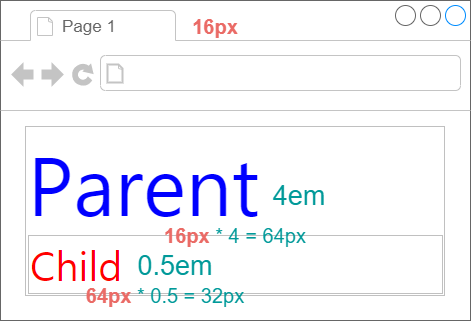
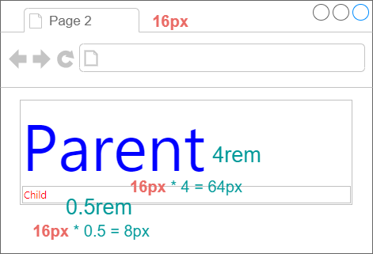

# 단위와 값
## 1. 크기 단위
- CSS에서 사용하는 대표적인 크기 단위는 px, em, %를 사용합니다. 
- px은 절대값이고 em, %는 상대값입니다. 
- 대부분 브라우저의 폰트 사이즈 기본값은 16px, 1em, 100%, 12pt

## 2. 절대 길이 - px
pixel(픽셀)

## 3. 상대 유닛 단위
|유닛단위|설명|예|
|---|---|------|
|em|부모 요소의 크기에 대한 자신의 상대 크기를 정합니다. 글자 크게이 적용할 경우 **부모 요소의 글자 크기**에 대한 상대 크기를 배율로 표시합니다. |p {<br>&nbsp;line-height: 1.2em;<br>}|
|rem|루트 요소의 크기에 대한 자신의 상대 크기를 정합니다. 글자 크기에 적용할 경우 루트 요소의 글자 크기에 대한 상대 크기를 배율로 표시합니다.|h1 {<br>&nbsp;line-height: 1.25rem;<br>}|
|%|부모 요소의 크기에 대한 자신의 상대 크기를 정합니다. em 단위와 같은 방식으로 크기가 상대 값으로 정해지며, 퍼센트 값으로 표현하는 차이만 있습니다.|div {<br>&nbsp;width:100%;<br>&nbsp; height:50%;<br>}|
|fr|"fraction"의 약어. 그리드(Grid) 셀을 배분하는 비율을 표시하는 용도로 사용합니다.|.grid{<br>&nbsp;grid-template-columns: 1fr 1fr 2fr;<br>}|
|vw, vh|vw(Viewport Width), vh(Viewport Height)의 약어입니다. 뷰포트(Viewport) 너비/높이에 대한 상대 크기를 표현하는 단위로, 1wh는 뷰포트 너비의 1%가 됩니다. 뷰포트 크기에 대한 %표현을 단위화 한 것입니다. <br> 뷰포트 크기를 기준으로 내부 요소들의 크기를 상대적으로 정해야 할 때 사용합니다.|.sidebar {<br>&nbsp;width: 20vw;<br>}|
     

## 4. 상대 길이 - em, rem
### 1) 상속되는 em 단위 글자
요소에 지정된 사이즈(상속된 사이즈나 디폴트 사이즈)에 상대적인 사이즈를 설정합니다. 예를 들어 1em은 요소에 지정된 사이즈와 같고 2em은 요소에 지정된 사이즈의 2배입니다.

✨ **예시**

```html
<!DOCTYPE html>
<html lang="en">
<head>
  <style>
    div {
      border: 1px solid silver;
      padding: 1px;
    }

    /* 1em === 부모의 font-size */
    .parent {
      color: blue;
      font-size: 4em;
    }

    .child {
      color: red;
      font-size: 0.5em;
    }
  </style>
</head>
<body>
  <div class="parent">
    안녕~!
    <div class="child">
      안녕!
    </div>
  </div>
</body>
</html>
```

🧪 **실행결과**




### 2) rem
em의 기준은 상속의 영향으로 바뀔 수 있는데, **rem**은 **최상위 요소(html)의 사이즈**를 기준으로 삼습니다. rem의 r은 root를 의미. rem 단위를 사용하게 되면 웹 브라우저에 따른 접근성을 해결할 수 있습니다. ( Chrome의 경우, 설정 > 고급 설정 표시 > 웹 콘텐츠 > 글꼴 맞춤 설정 )


✨ **예시**

```html
<!DOCTYPE html>
<html lang="en">
<head>
  <style>
    div {
      border: 1px solid silver;
      padding: 1px;
    }

    /* 1rem === root의 font-size */
    .parent {
      color: blue;
      font-size: 4rem;
    }

    .child {
      color: red;
      font-size: 0.5rem;
    }
  </style>
</head>
<body>
  <div class="parent">
    안녕~!
    <div class="child">
      안녕!
    </div>
  </div>
</body>
</html>
```

🧪 **실행결과**




## 5. 상대길이 Viewport 단위 - vw, vh, vmin, vmax
상속에 의해 부모 요소에 상대적 영향을 받습니다.
|단위|Description|
|---|---|
|vw|viewport 너비의 1/100|
|vh|viewport 높이의 1/100|
|vmin|	viewport 너비 또는 높이 중 작은 쪽의 1/100|
|vmax|viewport 너비 또는 높이 중 큰 쪽의 1/100|


예를 들어 viewport 너비가 1000px, 높이가 600px인 경우,
- 1vw : viewport 너비 1000px의 1%인 10px
- 1vh : viewport 높이 600px의 1%인 6px
- vmin : viewport 높이 600px의 1%인 6px
- vmax : viewport 너비 1000px의 1%인 10px


✨ **예시**

```html
<!DOCTYPE html>
<html>
<head>
  <style>
    body { margin: 0px; }
    .item {
      width: 50vw;
      height: 100vh;
      text-align: center;
      line-height: 100vh;
      font-size: 4rem;
      color: white;
    }
    .item1 { 
      background-color: red; 
    }
    .item2 { 
      background-color: orange; 
    }
  </style>
</head>
<body>
  <div class='item item1'>item1</div>
  <div class='item item2'>item2</div>
</body>
</html>
```

🧪 **실행결과**

예제 1) vw 길이가 vmax, vh 길이가 vmin
 

예제 2) vh 길이가 vmax, vw 길이가 vmin


## 6. 퍼센트 %
%는 백분률 단위의 상대 단위. 백퍼센트 기준은 부모 객체입니다.

✨ **예시**

```html
<!DOCTYPE html>
<html lang="en">
<head>
  <style>
    body {
      margin: 0;
    }

    /* 너비는 전체 길이의 50% */
    .parent {
      width: 50%;
      height: 100px;
      background-color: pink;
    }

    /* 부모 너비 길이의 50% */
    .child {
      width: 50%;
      height: 30px;
      background-color: indianred;
    }

  </style>
</head>
<body>
  <div class="parent">
    <div class="child"></div>
  </div>
</body>
</html>
```

🧪 **실행결과**


% 단위로 CSS 적용해도 부모 요소와 뷰포트에 따라 CSS가 px로 계산해서 화면에 보여 줍니다. (개발자 도구 > computed를 들어가면 알 수 있음.)

## 7. 함수표기법
### 1) calc()
단위를 섞어서 사용 가능합니다. 괄호 사이에 사칙연산(+, -, /, *) 계산식을 넣습니다. **`+`와 `-` 연산자는 좌우에 공백이 있어야 합니다.**

### 2) min()
반응형으로 작은 값을 브라우저가 자동으로 선택해줍니다. 

### 3) max()
반응형으로 큰 값을 브라우저가 자동으로 선택해줍니다. 

✨ **예시**

```css
.container {
  width: calc(100% - 50px);
}

.container {
  width: min(100%, 500px)
}

.container {
  width: max(100%, 500px)
}
```


## 참고 자료 및 강의📑

- 제로베이스 강의 - HTML/CSS
- HTML & CSS 마스터북 도서
- [PoiemaWeb](https://poiemaweb.com/)
- [CSS 단위별 폰트사이즈(px,pt,em,%)](https://jsunnylab.tistory.com/24)
- [Approximate Conversion from Points to Pixels(and Ems and %)](https://reeddesign.co.uk/test/points-pixels.html) 