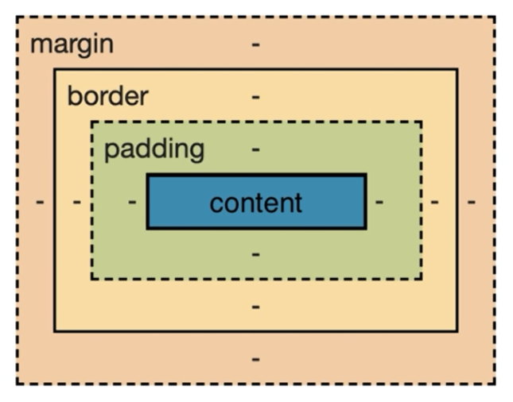
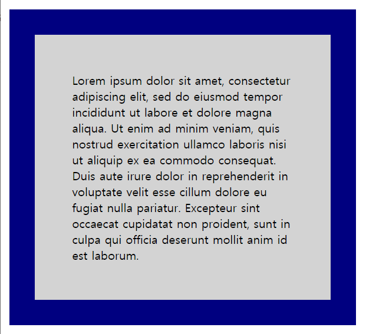
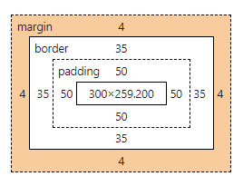
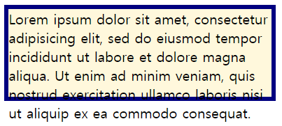
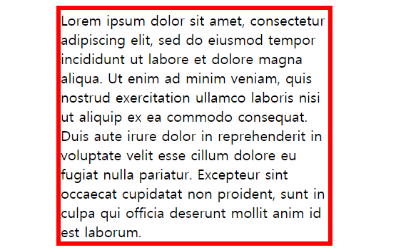
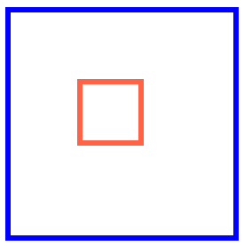
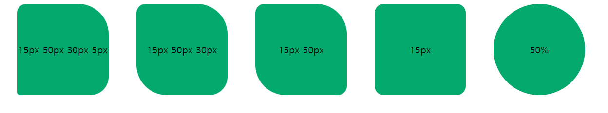
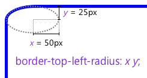

# 1. 박스모델
## 1. 박스 모델이란
브라우저는 박스 모델의 크기와 프로퍼티(색, 배경, 모양 등), 위치를 근거로 하여 렌더링을 실행합니다.



|명칭|설명|
|---|---|
|Content|	콘텐츠(요소의 텍스트나 이미지 등)가 표시되는 영역. width, height 프로퍼티가 실선|
|Padding	|콘텐츠와 테두리(Border) 사이의 여백|
|Border	|테두리 영역으로 padding과 margin 사이의 테두리 두께를 의미|
|Margin	| 가장 바깥 쪽 레이어로 content, padding, border를 둘러싸면서 해당박스와다른 요소 사이의 여백 영역|

> width와 height 프로퍼티를 비롯한 모든 박스모델 관련 프로퍼티(margin, padding, border, box-sizing 등)는 상속되지 않습니다.

✨ **예시**

```html
<!DOCTYPE html>
<html>
<head>
  <style>
    div {
      /* 배경색의 지정: 콘텐츠 영역과 패딩 영역에 적용된다. */
      background-color: lightgrey;
      /* 콘텐츠 영역의 너비 */
      width: 300px;
      /* 패딩 영역의 두께 */
      padding: 50px;
      /* 테두리: 두께 형태 색상 */
      border: 35px solid navy;
      /* 마진 영역의 두께 */
      margin: 4px;
    }
  </style>
</head>
<body>
  <h2>Box Model</h2>

  <div>Lorem ipsum dolor sit amet, consectetur adipiscing elit, sed do eiusmod tempor incididunt ut labore et dolore magna aliqua. Ut enim ad minim veniam, quis nostrud exercitation ullamco laboris nisi ut aliquip ex ea commodo consequat. Duis aute irure dolor in reprehenderit in voluptate velit esse cillum dolore eu fugiat nulla pariatur. Excepteur sint occaecat cupidatat non proident, sunt in culpa qui officia deserunt mollit anim id est laborum.</div>
</body>
</html>
```

🧪 **실행결과**






## 2. 크기 - width, height
width와 height 프로퍼티는 요소의 너비와 높이를 지정. 이때 지정되는 요소의 너비와 높이는 **콘텐츠 영역**을 대상으로 합니다. 

- width와 height 프로퍼티 초기값은 `auto`
- 인라인 요소는 width와 height가 내부 content만큼 자동으로 적용. (인라인 요소는 width, height를 지정할 수 없다.)
- 만일 width와 height로 지정한 콘텐츠 영역보다 실제 콘텐츠가 크면 콘텐츠 영역을 넘치게 된다!!

✨ **예시**

```html
<!DOCTYPE html>
<html>
<head>
  <meta charset="UTF-8">
  <style>
    div {
      width: 300px;
      height: 100px;
      background-color: cornsilk;
      border: 5px solid navy;
      
      /* overflow: hidden;을 지정하면 넘친 콘텐츠를 감출 수 있다. */
      /*overflow: hidden;*/
    }
  </style>
</head>
<body>
  <div>
    Lorem ipsum dolor sit amet, consectetur adipisicing elit, sed do eiusmod tempor incididunt ut labore et dolore magna aliqua. Ut enim ad minim veniam, quis nostrud exercitation ullamco laboris nisi ut aliquip ex ea commodo consequat. 
  </div>
</body>
</html>
```

🧪 **실행결과**




## 3. 크기 - max-width, min-width, max-height, min-height

### 1) max-width 
프로퍼티는 요소 너비의 최대값 지정, 프로퍼티는 요소 너비의 최소값을 지정 합니다. 예를 들어 `max-width: 300px;` 의 경우 브라우저의 너비가 요소의 너비보다 좁아질 때 자동으로 요소의 너비가 줄어듭니다. 요소 너비가 브라우저 너비보다 크면 가로 스크롤바가 만들어지는데 이 문제를 해결하기 위해서 `max-width` 프로퍼티를 사용할 수 있습니다.

🧪 **실행결과**



`max-width`로 한계가 있어 더 이상 width가 늘어나지 않습니다. 가로나 세로 넓이의 최소값과 최대값을 지정하고 싶으시다면 함수표기법(04.단위와 값 - 6. 함수표기법)의 min(), max()보다 `max-width`, `min-width`, `max-height`, `min-height` 4가지 프로퍼티를 사용하는 것이 반응형 사이트를 만들 때 유용하게 쓸 수 있는 프로퍼티입니다. 


## 4. 여백 - margin
content의 4개 방향(top, right, left, bottom)에 대하여 지정이 가능합니다. 


**4개의 값을 지정할 때(위 | 오른쪽 | 아래 | 왼쪽)**

margin: 25px 50px 75px 100px;
- margin-top: 25px;
- margin-right: 50px;
- margin-bottom: 75px;
- margin-left: 100px;

**3개의 값을 지정할 때(위 | 가로방향 | 아래)**

margin: 25px 50px 75px;
- margin-top: 25px;
- margin-right: 50px; margin-left: 50px;
- margin-bottom: 75px

**2개의 값을 지정할 때(세로방향 | 가로방향)**

margin: 25px 50px;
- margin-top: 25px; margin-bottom: 25px;
- margin-right: 50px; margin-left: 50px;

**1개의 값을 지정할 때(네 면 모두 적용)**

margin: 25px;
- margin-top: 25px; margin-right: 25px; margin-bottom: 25px; margin-left: 25px;


✨ **예시**

```css
div {
  border: 5px solid red;

  margin:  40px 30px 20px 10px;
  padding: 10px 20px 30px 40px;
}
```

margin 프로퍼티에 `auto` 키워드를 설정하면 해당 요소를 브라우저 중앙에 위치 심킬 수 있습니다. 

✨ **예시**

```html
<!DOCTYPE html>
<html>
  <head>
    <style>
      div {
        border: 5px solid red;
        max-width: 600px;
        margin: auto;
      }
    </style>
  </head>
  <body>
    <div>Lorem ipsum dolor sit amet, consectetur adipiscing elit, sed do eiusmod tempor incididunt ut labore et dolore magna aliqua.</div>
  </body>
</html>
```

🧪 **실행결과**


### 속성
- auto: 브라우저가 여백을 계산합니다.
- length: 여백을 px, pt, cm 등으로 지정합니다.
- 상속: 여백이 부모 요소에서 상속되어야 함을 지정합니다.
- %: 포함하는 요소 너비의 %로 여백을 지정합니다.
  
percentage는 부모의 값으로 자식의 가로 세로 값이 결정됩니다.

✨ **예시**

```html
<!DOCTYPE html>
<html>
<head>
  <style>
    #parent {
      width: 200px;
      height: 200px;
      
      border: 5px solid blue;
    }

    #child {
      width: 50px;
      height: 50px;
      margin: 30%;
      border: 5px solid tomato;
    }
  </style>
</head>
<body>
  <div id="parent">
    <div id="child"></div>
  </div>
</body>
</html>

```

🧪 **실행결과**




## 5. margin collapsing (마진 상쇄, 마진 겹침, 마진 중복)
마진이 겹치게 되면 상쇄가 일어납니다. 

- 여러 블록(block)요소들의 **위/아래** margin이 경우에 따라 **가장 큰 크기를 가진 margin**으로 결합(상쇄)되는 현상
- 아래의 3가지 경우에 일어난다. 

### 1) 인접 형제
- 두 형제 요소의 위/아래 여백이 만나 상쇄


### 2) 부모-자식요소 간
- 부모 블록에 border, padding, inline content가 없어서 부모와 자식의 margin-top이 만나는 경우
- 부모 블록에 border, padding, inline content가 없고 부모-자식을 분리할 height값이 지정되지 않아 부모와 자식의 margin-bottom이 만나는 경우


### 3) 빈 블록
- border, padding, content가 없고, height 또한 존재하지 않으면, 해당 블록의 margin-top과 margin-bottom이 상쇄


## 6. 여백 - padding
content의 4개 방향(top, right, left, bottom)에 대하여 지정이 가능

**4개의 값을 지정할 때(위 | 오른쪽 | 아래 | 왼쪽)**

padding: 25px 50px 75px 100px;
- padding-top: 25px;
- padding-right: 50px;
- padding-bottom: 75px;
- padding-left: 100px;

**3개의 값을 지정할 때(위 | 가로방향 | 아래)**

padding: 25px 50px 75px;
- padding-top: 25px;
- padding-right: 50px; padding-left: 50px;
- padding-bottom: 75px

**2개의 값을 지정할 때(세로방향 | 가로방향)**

padding: 25px 50px;
- padding-top: 25px; padding-bottom: 25px;
- padding-right: 50px; padding-left: 50px;

**1개의 값을 지정할 때(네 면 모두 적용)**

padding: 25px;
- padding-top: 25px; padding-right: 25px; padding-bottom: 25px; padding-left: 25px;

### 속성

- length - px, pt, cm 등으로 패딩을 지정합니다.
- 상속 - 패딩이 부모 요소에서 상속되어야 함을 지정합니다.
- % - 포함하는 요소 너비의 %로 패딩을 지정합니다.

percentage는 부모의 값으로 자식의 가로 세로 값이 결정됩니다.


## 7. 테두리 (border) - border-style, border-width, border-color
shorthand가 가능합니다. 

### 1) [border-style](https://developer.mozilla.org/ko/docs/Web/CSS/border-style)
`border-style` 프로퍼티는 테두리 선의 스타일을 지정.
프로퍼티 값의 갯수에 따라 4개 방향(top, right, left, bottom)에 대하여 지정이 가능합니다.

```css
  p.d1 {
    /* four sides */
    border-style: dashed;
  }

  p.d2 {
    /* horizontal | vertical */
    border-style: dotted solid;
  }

  p.d3 {
    /* top | horizontal | bottom */
    border-style: hidden double dashed;
  }

  p.d4 {
    /* top | right | bottom | left */
    border-style: none solid dotted dashed;
  }
```

### 2) [border-width](https://developer.mozilla.org/ko/docs/Web/CSS/border-width)
`border-width` 프로퍼티는 테두리의 두께를 지정. 프로퍼티 값의 갯수에 따라 4개 방향(top, right, left, bottom)에 대하여 지정이 가능합니다. **`border-width` 프로퍼티는 `border-style`과 함께 사용하지 않으면 적용되지 않습니다. `border-style: none`일 경우 계산되지 않습니다.**

```css
  /* 1px */
  p.one {
    border-width: thin; 
  }

  /* 3px */
  p.two {
    border-width: medium; 
  }

  /* 5px */
  p.three {
    border-width: thick; 
  }

  p.four {
    border-width: 15px;
  }

  p.five {
    border-width: 2px 10px 4px 20px;
  }
```

### 3) [border-color](https://developer.mozilla.org/ko/docs/Web/CSS/border-color)
`border-color` 프로퍼티는 테두리의 색상을 지정. 프로퍼티 값의 갯수에 따라 4개 방향(top, right, left, bottom)에 대하여 지정이 가능합니다. **`border-color` 프로퍼티는 `border-style`과 함께 사용하지 않으면 적용되지 않습니다. `border-style: none`일 경우 계산되지 않습니다.**

```css
  p.one {
    border-color: red;
  }
  p.two {
    border-color: green;
  }
  p.three {
    border-color: red green blue yellow;
  }
```

> 참고: [outline](https://developer.mozilla.org/ko/docs/Web/CSS/outline)은 박스모델이 아닙니다. 탭(tab) 키 누를때...


## 8. border-radius
`border-radius` 프로퍼티는 테두리 모서리를 둥글게 표현하도록 지정. 프로퍼티 값은 길이를 나타내는 단위(px, em 등)와 %를 사용합니다. shorthand가 가능합니다. 


✨ **예시**

```html
<!DOCTYPE html>
<html>
  <head>
    <style>
      div {
        background: #04AA6D;
        display: inline-block;
        width: 150px;
        height: 150px;
        line-height: 150px;
        margin: 0 20px;
        text-align: center;
      }

      .border-fourValues {
        border-radius: 15px 50px 30px 5px;
      }
      .border-threeValues {
        border-radius: 15px 50px 30px;
      }
      .border-twoValues {
        border-radius: 15px 50px;
      }
      .border-onewValue {
        border-radius: 15px;
      }
      .border-circle {
        border-radius: 50%;
      }

    </style>
  </head>
  <body>
    <div class="border-fourValues">15px 50px 30px 5px </div>
    <div class="border-threeValues">15px 50px 30px </div>
    <div class="border-twoValues">15px 50px </div>
    <div class="border-onewValue">15px</div>
    <div class="border-circle">50%</div>
  </body>
</html>
```

🧪 **실행결과**




### 1) 프로퍼티 `border-top-left-radius`

```css
.border-rounded {
  border-top-left-radius: 50px 25px;
}

```



## 9. box-sizing
`box-sizing` 프로퍼티는 width, height 프로퍼티의 대상 영역을 변경 가능

|키워드 |	설명 |
|---|---|
|content-box |	width, height 프로퍼티 값은 content 영역을 의미 (기본값)|
|border-box	|width, height 프로퍼티 값은 content 영역, padding, border가 포함된 값을 의미|

> box-sizing 프로퍼티는 상속되지 않는다. 따라서 box-sizing 프로퍼티를 사용하도록 초기화하려면 아래와 같이 정의한다. 보통 최상단에 코드 작성..!

```css
html {
  box-sizing: border-box;
}

/* or */

* { 
  box-sizing: border-box; 
}
```


[CSS 마진 상쇄(Margin-collapsing) 원리 완벽 이해](https://velog.io/@raram2/CSS-%EB%A7%88%EC%A7%84-%EC%83%81%EC%87%84Margin-collapsing-%EC%9B%90%EB%A6%AC-%EC%99%84%EB%B2%BD-%EC%9D%B4%ED%95%B4)

[CSS Rounded Corners for HTML Elements](https://www.poftut.com/css-rounded-corners-for-html-elements/)

[PoiemaWeb](https://poiemaweb.com/)

