# 레이아웃
## 1. dispaly 프로퍼티 
display 프로퍼티는 상속되지 않습니다.

### 1) inline 레벨 요소
  - 영역의 크기가 내부 콘텐츠 길이나 크기로 정해진다. (content 너비만큼 가로폭 차지)
  - width, height, margin-top, margin-bottom 프로퍼티를 지정할 수 없다. 상, 하 여백은 line-height로 지정한다.
  - 여러 요소가 가로 배치가 된다.
  - inline 레벨 요소 내에 block 레벨 요소를 포함할 수 없다
  - ex) span, a, strong, img, br, input, select, textarea, button

  
### 2) block 레벨 요소 
  - 영역의 크기가 width, height, margin, padding 프로퍼티 지정이 가능하다.
  - width를 지정하지 않으면 가로 전체를 차지한다.(width: 100%)
  - 항상 새로운 라인에서 시작한다.
  - 여러 요소가 세로 배치가 된다. 
  - block 레벨 요소 내에 inline 레벨 요소를 포함할 수 있다
  - ex) div, h1~h6, p, ol, ul, li, hr, table, form

### 3) inline-block 요소
  - inline 레벨 요소와 같이 이어진 여러 요소에 적용하면 원하는 크기를 가진 요소들을 한 줄로 배치할 수 있습니다.
  - block 레벨 요소처럼 width, height, margin, padding 프로퍼티를 모두 정의할 수 있다. 상, 하 여백을 margin과 line-height 두가지 프로퍼티 모두를 통해 제어할 수 있다.
  - content의 너비만큼 가로폭을 차지한다.
- ex) input

### 4) flex
 Item들을 한 방향으로 정렬해 배치하기 편리하기 때문에, 반응형 레이아웃을 만드는데 필수 속성입니다. 

### 5) grid
자식 요소들을 격자 형태로 배치할 수 있도록 해주는 레이아웃 속성입니다. 

## 2. 요소를 없애는 방법 - visibility: hidden, display: none
`visibility` 프로퍼티는 요소를 보이게 할 것인지 안보이게 할 것인지를 정의합니다. 즉, 요소의 렌더링 여부를 결정하는데 `visibility: hidden`은 해당 요소를 보이지 않게 합니다. 

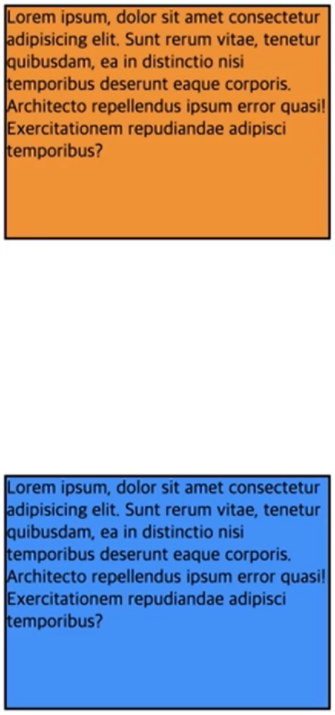

`display: none;`은 해당 요소의 공간까지 사라지게 하지만 `visibility: hidden`은 해당 요소의 공간은 사라지지 않고 남아 있게 됩니다. 예시로 자바스크립트 사용 시 클릭 action으로 보이고 안보이고 하는 부분에 사용.

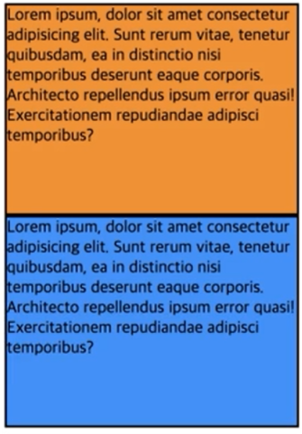

## 3. 위치 제어(1) float
float 프로퍼티는 해당 요소를 다음 요소 위에 둥둥 떠 있게(부유하게) 합니다. float 프로퍼티는 본래 아래 예제와 같이 이미지와 텍스트가 있을 때, **이미지 주위를 텍스트로 감싸기** 위해 만들어진 것입니다.

|프로퍼티값|	Description|
|---|---|
|none|	요소를 떠 있게 하지 않는다. (기본값)|
|left	|요소를 왼쪽으로 유동(Floating) 시킵니다.|
|right|	요소를 오른쪽으로 유동(Floating) 시킵니다.|

✨ **예시**

```html
<!DOCTYPE html>
<html>
<head>
  <style>
    img {
      float: left;
      margin-right: 10px;
    }
  </style>
</head>
<body>
  
  <div>
    Lorem ipsum dolor sit amet, consectetur adipisicing elit, sed do eiusmod tempor incididunt ut labore et dolore magna aliqua. Ut enim ad minim veniam, quis nostrud exercitation ullamco laboris nisi ut aliquip ex ea commodo consequat.
  </div>
</body>
</html>
```

🧪 **실행결과**

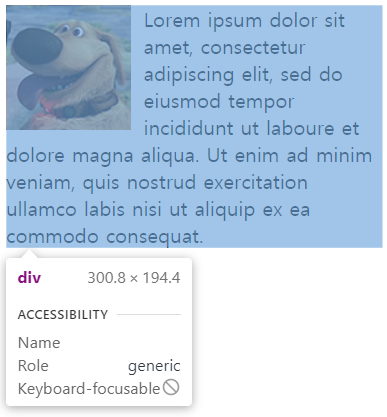

"float: left;" 속성으로 왼쪽에 이미지를 띄워서 배치함. 


## 4. 위치 제어(2) position
position은 HTML 부모 요소의 영역안에 위치하는 방식을 결정합니다. top, bottom, left, right 프로퍼티와 함께 사용하여 위치를 지정

Normal flow: 일반 대열

### position 속성
### 1) static (기본값)
기본적인 요소의 배치 순서에 따라 위에서 아래로, 왼쪽에서 오른쪽으로 순서에 따라 배치되며 부모 요소 내에 자식 요소로서 존재할 때는 **부모 요소의 위치를 기준으로 배치**됩니다. "left", "top" 등과 같은 태그 위치를 지정하는 속성이 적용되지 않아 위치를 임의로 조정할 수 없습니다.


### 2) relative (상대위치) 
🌺**자기 자신**(static으로 지정되었을 때의 위치)을 기준🌺으로 좌표 프로퍼티(top, bottom, left, right)를 사용하여 위치를 이동시킵니다. 좌표 프로퍼티없이 `position: relative;` 선언만 된 경우 static과 동일


✨ **예시**

```html
<!DOCTYPE html>
<html>
<head>
  <style>
    body { margin: 0; }
    .parent {
      width: 150px;
      height: 150px;
      background: #bcbcbc;
      border: 1px solid #bcbcbc;
      margin: 50px;
    }
    .relative-box {
      position: relative; 
      top: 100px; left: 100px;
      background: #7eb822;
      color: #612f61;
      font-weight: bold;
      text-align: center;
      line-height: 150px;
    }
  </style>
</head>
<body>
  <div class="parent">
    <div class="relative-box">relative box</div>
  </div>
</body>
</html>
```

🧪 **실행결과**

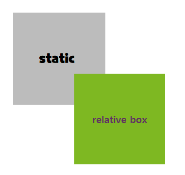

### relative-box 너비와 높이 값?
**width는 100%가 적용되어 부모 요소의 width와 동일한 값을 갖게된 것이고, 너비에 비례한 auto값 height 적용되지만, line-height: 150px이 적용되어 hight가 150px이 됩니다.** 

✨ **예시**

```css
body { margin: 0; }
.parent {
  width: 150px;
  height: 150px;
  background: #bcbcbc;
  border: 1px solid #bcbcbc;
  margin: 50px;
}
.relative-box {
  position: relative;
  top: 50px; left: -10px;
  background: #7eb822;
  color: #612f61;
  font-weight: bold;
  text-align: center;
  line-height: 150px;
}
```

🧪 **실행결과**

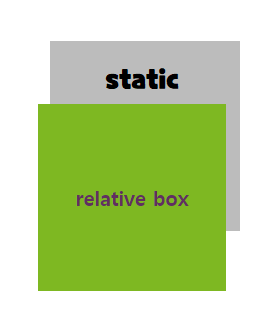

relative는 반대가 되는 값을 동시 적용하면 **top, left**가 우선 적용됩니다.

### 3) absolute (절대위치) 
일반적인 문서 흐름에서 제거하고 부모 요소 또는 가장 가까운 조상 요소에 대해 위치 지정 요소(**position:static이 아닌 요소**)를 찾아 좌표 프로퍼티(top, bottom, left, right)만큼 이동합니다. 부모 또는 조상 요소가 static인 경우 `<body>` 요소에 상대적 배치합니다. **🌺부모 요소(static 아닌)를 기준🌺으로 삼기 위해서는 부모 요소에 relative, absolute, fixed 프로퍼티가 선언돼야 합니다.**


✨ **예시**

```html
<!DOCTYPE html>
<html>
<head>
  <style>
    body { margin: 0; }
    .parent {
      width: 200px;
      height: 200px;
      background: #bcbcbc;
      border: 1px solid #bcbcbc;
      margin: 50px 0 0 300px;
      position: relative;
    }
    .absolute-box {
      position: absolute;
      height: 200px; width: 200px;
      top: 40px; left: 10px;
      background: #7eb822;
      color: #612f61;
      font-weight: bold;
      text-align: center;
      line-height: 200px;
    }
  </style>
</head>
<body>
  <div class="parent">
    <div class="absolute-box">absolute box (in parent)</div>
  </div>
  <div class="absolute-box">absolute box (no parent)</div></body>
</html>
```

🧪 **실행결과**

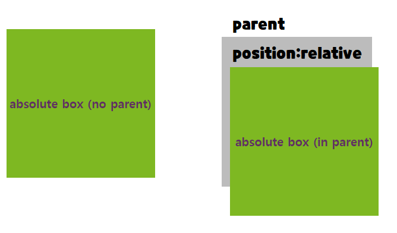

absolute box (in parent) `<div>`는 부모 `<div>`에 대해 top: 40px; left: 10px; 만큼 이동


### 4) fixed 
🌺**Viewport(브라우저 창)를 기준**🌺 좌표 프로퍼티(top, bottom, left, right)을 사용하여 위치를 이동시킵니다. 스크롤이 되더라도 화면에서 사라지지 않고 같은 자리에 위치합니다. 

✨ **예시**

```html
<!DOCTYPE html>
<html>
<head>
  <style>
    div{ 
      width: 200px;
      height: 200px;
      border: 10px solid
    }
    
    #box {
      width: 23px;
      height: 30px;
      
      position: fixed;
      bottom: 40px;
      right: 40px;
    }

  </style>
</head>
<body>
  <div id="parent">
  	<div id="box">🔺</div>
  </div>
  <div></div>
  <div></div>
  <div></div>
  <div></div>
  <div></div>
</body>
</html>
```

🧪 **실행결과**

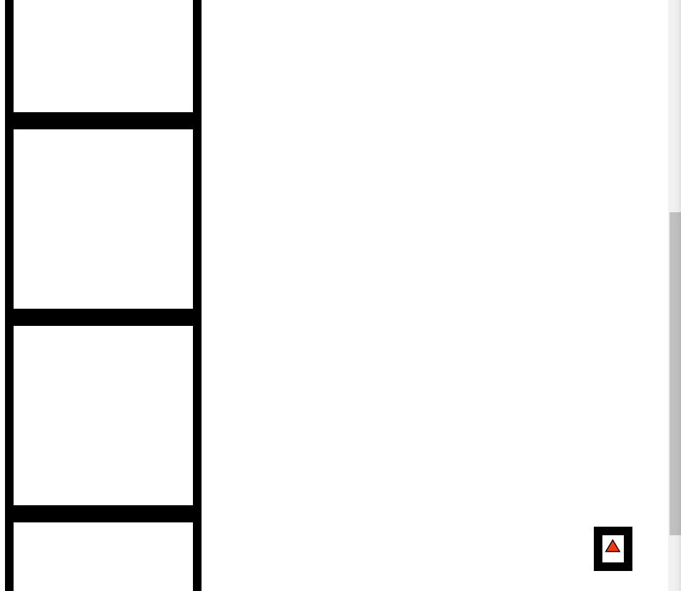

스크롤따라 부모 요소와 함께 움직이는 `position: absolute`와 달리 `position: fixed`는 부모 요소만 움직이고 붕 떠있습니다. 이는 floating button에 쓰입니다.


### 5) sticky
absolute, fixed와 다르게 자기 자리를 찾아 일반적인 문서 흐름에 따라 배치됩니다. 사용자 스크롤에 따라 요소가 같이 스크롤되어 이동합니다.

✨ **예시**

```html
<!DOCTYPE html>
<html>
<head>
  <style> 
    div{ 
      width: 200px;
      height: 200px;
      border: 10px solid
    }

    #parent {
      position: sticky;
      top: 100px;
      left: 100px;
    }
    
    #box {
      width: 150px;
      height: 100px;
      border-color: darkred;
      background-color: darkolivegreen;
      border-radius: 30px;
    }

  </style>
</head>
<body>
  <div></div>
  <div></div>
  <div></div>
  <div></div>
  <div></div>
  <div id="parent">
  	<div id="box"></div>
  </div>
  <div></div>
  <div></div>
  <div></div>
  <div></div>
  <div></div>
</body>
</html>
```

🧪 **실행결과**

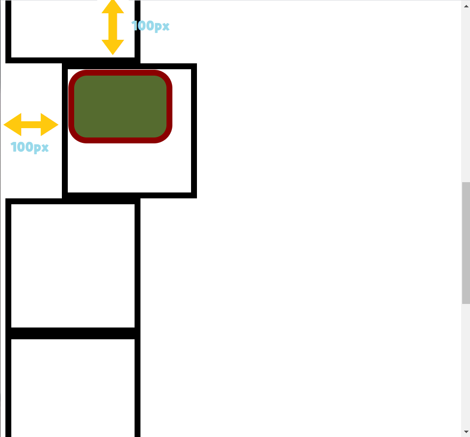

스크롤 할 경우 

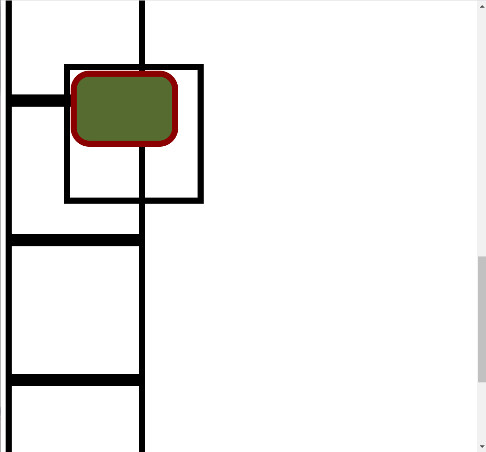

가장 가까운 스크롤 되는 조상을 찾아 특정 위치에서 스티커처럼 딱 붙어있습니다. 조상이 `<body>`가 아닌 경우 sticky 프로퍼티를 살릴 수 없습니다. 

## 9. overflow
기본값 `overflow: visible;`
특정 방향으로만 스크롤을 표시하고자 할 때는 overflow-x 또는 overflow-y 프로퍼티를 사용합니다. `div { overflow-y: auto; }`


✨ **예시**

```html
<!DOCTYPE html>
<html>
<head>
  <style>
    div {
      width: 150px;
      height: 150px;
      padding: 10px;
      margin: 80px;
      font-size: 1.2em;
      border-radius: 6px;
      border-color: gray;
      border-style: dotted;
      float: left;
    }
    .visible { overflow: visible; }
    .hidden  { overflow: hidden; }
    .scroll  { overflow: scroll; }
    /* 사용자 에이전트 즉, 브라우저가 자동으로 지정합니다.  */
    .auto    { overflow: auto; }
  </style>
</head>
<body>
  <h1>overflow</h1>
  <div class="visible"><h3>visible</h3>Lorem ipsum dolor sit amet, consectetur adipisicing elit, sed do eiusmod tempor incididunt ut labore et dolore magna aliqua.</div>
  <div class="hidden"><h3>hidden</h3>Lorem ipsum dolor sit amet, consectetur adipisicing elit, sed do eiusmod tempor incididunt ut labore et dolore magna aliqua.</div>
  <div class="scroll"><h3>scroll</h3>Lorem ipsum dolor sit amet, consectetur adipisicing elit, sed do eiusmod tempor incididunt ut labore et dolore magna aliqua.</div>
  <div class="auto"><h3>auto</h3>Lorem ipsum dolor sit amet, consectetur adipisicing elit, sed do eiusmod tempor incididunt ut labore et dolore magna aliqua.</div>
</body>
</html>
```

🧪 **실행결과**

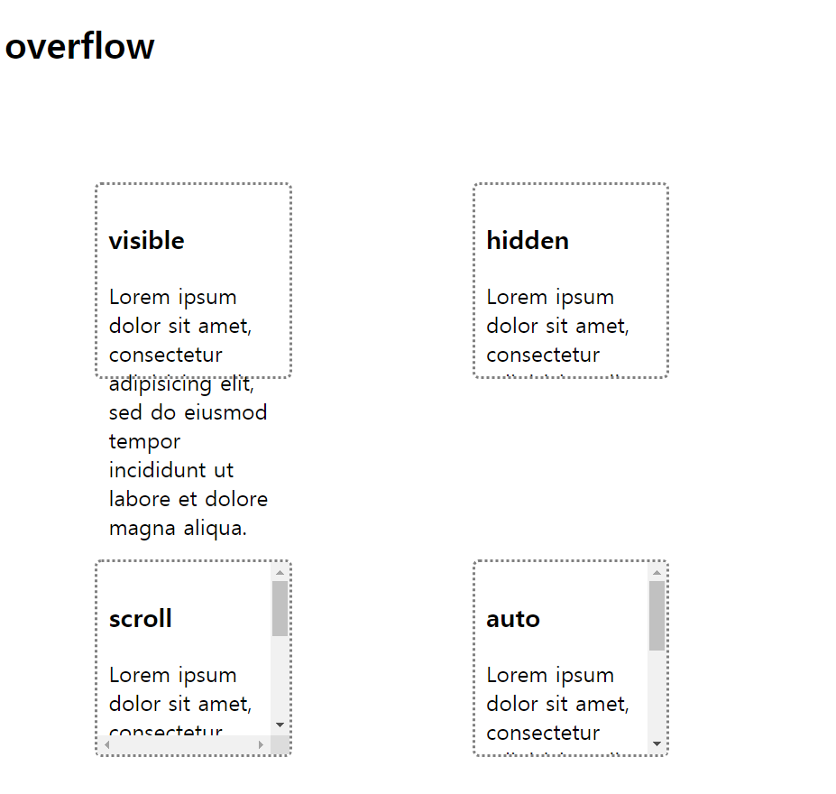


## 10. z-index 프로퍼티
z-index 프로퍼티에 큰 숫자값을 지정할수록 화면 전면에 출력됩니다. 음수값을 줄 수 있습니다. z-index는 position 프로퍼티가 static 이외인 요소에만 적용됩니다. 기본값 z-index: auto | z-index: 0 입니다

### 1) 소스 코드 순서대로 맨 뒤에 있는 코드가 맨 앞에 위치합니다.


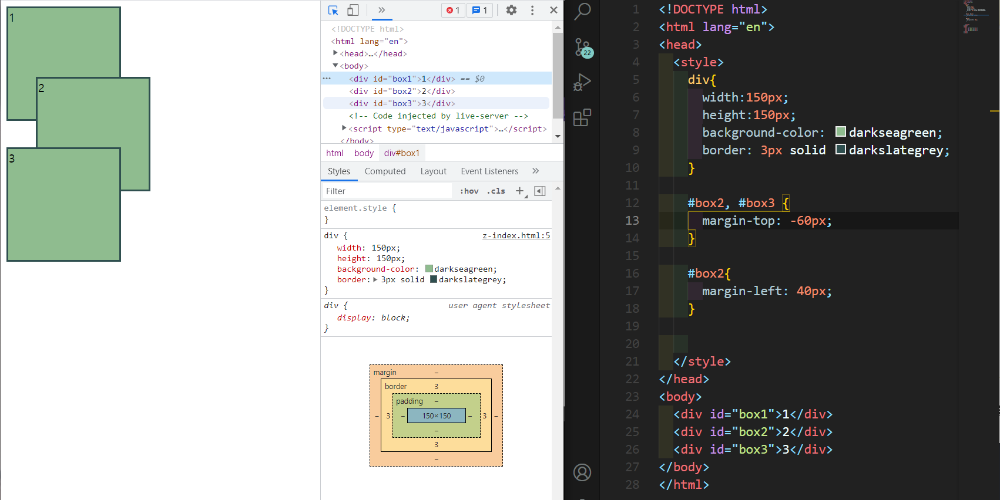
### 2) position: relative;를 쓰면 위로 뜨게 됩니다. 

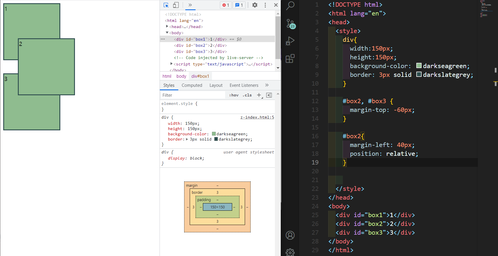
### 3) position: absolute;를 쓰면 normal flow에서 제거되며 붕 뜨게 됩니다.
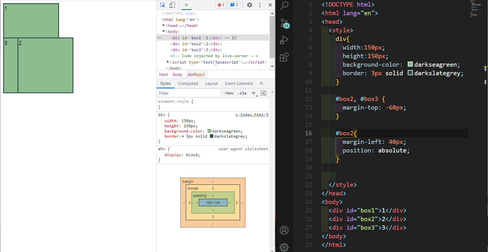


### 4) z-index를 써서 box3을 box2뒤로 보냅니다. 
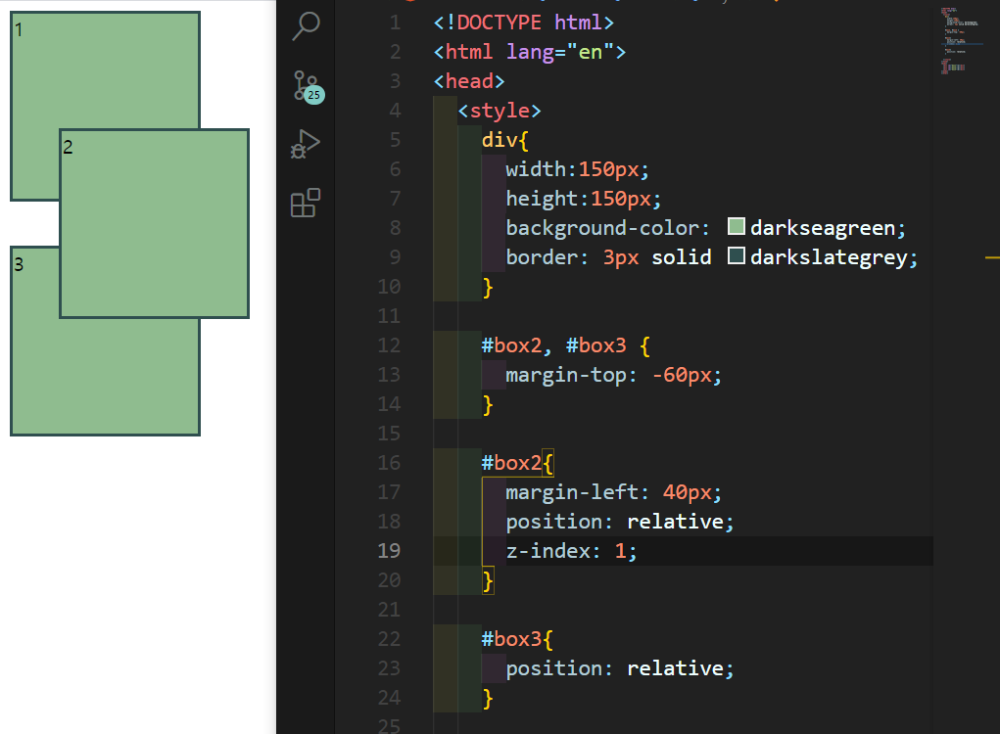


### 5) z-index 음수를 줄 수도 있습니다. 경고창처럼 항상 맨 위로 올라와야하는 경우 z-index를 아주 큰 값으로 지정해서 사용합니다. 
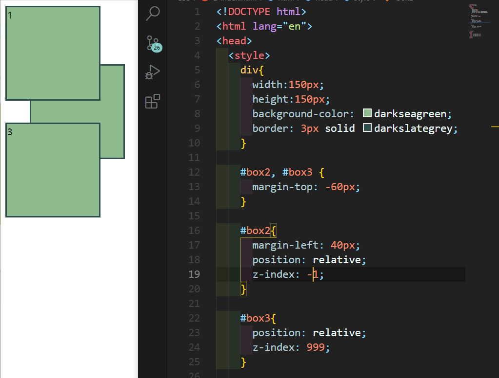


