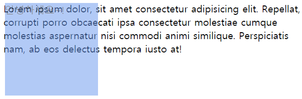
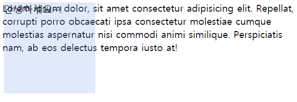
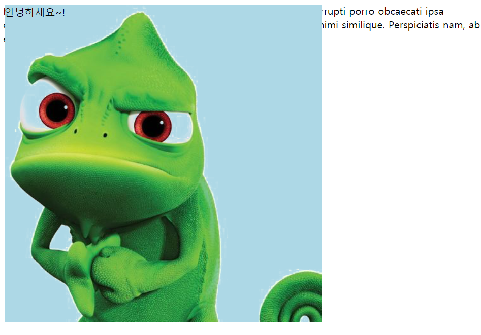
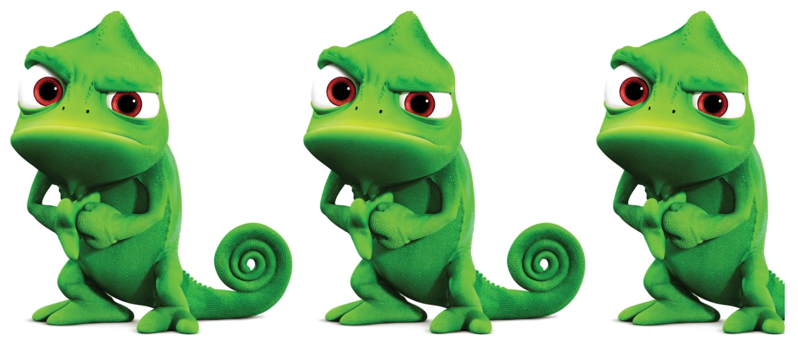
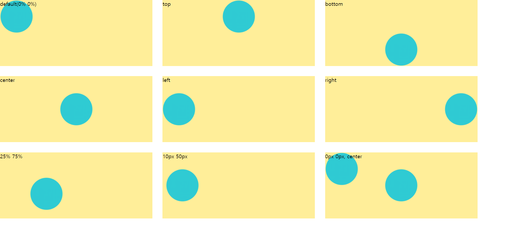
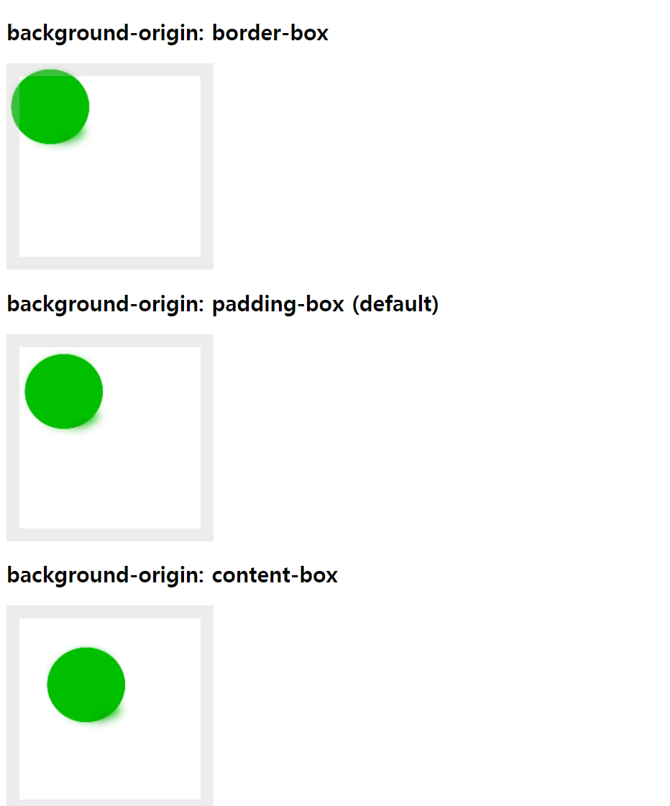
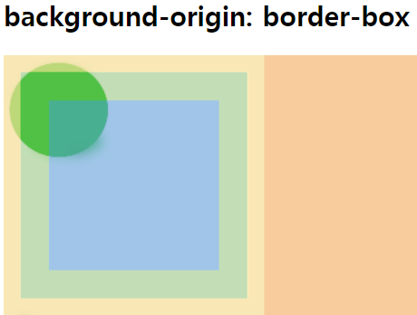
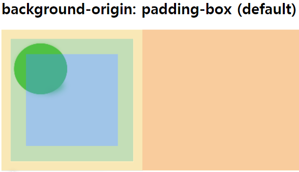
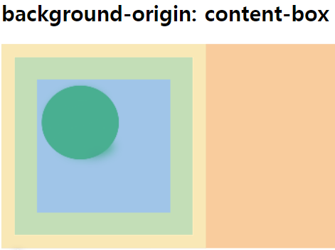
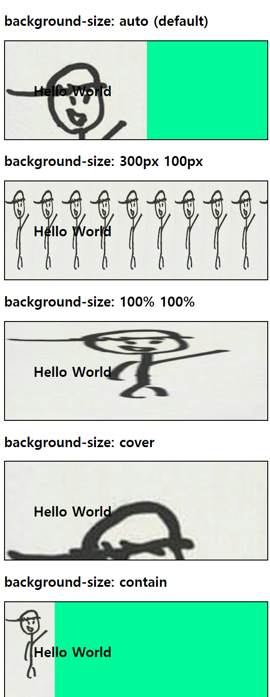

# 색상과 배경
## 1. 색상 - HEX(16진수, rgb, rgba)
`<color>`는 다음 방법으로 정의할 수 있습니다.
- 키워드 사용(참고: transparent 투명도)
- RGB 3차원 좌표계 사용(#과 함께 16진수 표기법 또는 rgb(), rgba() 의 함수형 표기법)
- RGB 색상 값은 색상의 강도를 0에서 255 사이의 정수로 정의합니다. `#000000: black`,  `#ffffff: white`
- RGBA 색상의 불투명도를 지정하는 Alpha channel(0 ~ 1 까지의 소수점 값)이 있습니다. 


## 2. opacity
- `opacity` 프로퍼티는 요소의 투명도를 정의. 
- 0.0 ~ 1.0 값이 입력 가능하고 0.0은 투명, 1.0은 불투명합니다. 
- 내부의 모든 요소(자식 요소)에 영향을 줍니다.

```css
background-color: rgb(100, 149, 237);
opacity: 0.5; 
```




- 내부 자식 요소 불투명을 유지하고 싶다면 `background` 속성을 대신 사용하세요.

```css
background-color: rgb(100, 149, 237, 0.2);
```




## 3. [background-color](https://developer.mozilla.org/en-US/docs/Web/CSS/background-color)
요소의 배경 색상을 지정. 색상값 또는 transparent 키워드를 지정할 수 있습니다. 기본값 transparent

사용 값: 웹 표준 컬러코드(#a8a8a8), RGB컬러(rgb(255,255,255)), RG A컬러(rgba(255,255,255,1))


```css
.whiteBox {
  background-color: rgb(255, 255, 255);
}

.redBox {
  background-color: red;
}
```


## 4. [background-image](https://developer.mozilla.org/en-US/docs/Web/CSS/background-image)
요소에 배경 이미지 URL 지정. 기본값이 repeat입니다. 설정된 이미지의 크기가 화면보다 작으면 자동으로 이미지가 반복 출력됩니다. background-color, background-image 둘 다 있는 경우 background-color가 뒤로 갑니다.

사용 값: URL

✨ **예시**

```css
background-image: url("./images/pngegg.png");
background-color: lightblue;
```

🧪 **실행결과**




## 5. [background-repeat](https://developer.mozilla.org/en-US/docs/Web/CSS/background-repeat)
배경 이미지의 반복 여부 지정. 수직, 수평 또는 수직/ 수평 모두의 반복을 지정할 수 있습니다. 요소의 배경 영역을 채울 때까지 이미지를 반복합니다. 

|속성 값|설명|
|---|---|
|repeat|가로/세로 반복|
|no-repeat|반복 없음|
|repeat-x|가로 방향 반복|
|repeat-y|세로 방향 반복|
|space||


✨ **예시**

```html
<!DOCTYPE html>
<html lang="en">
<head>
  <style>
    /* opacity */
    .floating-box {
      width: 1500px;
      height: 1500px;

      position: fixed;
      top: 10px;
      left: 10px;

      background-image: url("./images/pngegg.png");
      background-repeat: repeat-x;
    }

  </style>
</head>
<body>
  <div class="floating-box"></div>
</body>
</html>
```

🧪 **실행결과**




## 6. background-position
일반적으로 `background-image`는 좌상단부터 이미지를 출력합니다. `background-image`를 사용하면 이미지의 좌표(x축, y 축)를 지정할 수 있습니다. 

사용 값: %, 픽셀, 가로 위치 정렬(left, center, right), 세로 위치 정렬(top, center, bottom) 

✨ **예시**

```html
<!DOCTYPE html>
<html>
<head>
  <style>
    body {
      margin: 0;
    }

    div {
      background-image: url("http://poiemaweb.com/img/bg/dot.png");
      background-color: #FFEE99;
      background-repeat: no-repeat;
      width: 30vw;
      height: 200px;
      margin-bottom: 2vw;
      float: left;
    }

    div:not(:nth-of-type(3n+1)) {
      margin-left: 2vw;
    }

    .example1 {
      background-position: top;
    }

    .example2 {
      background-position: bottom;
    }

    .example3 {
      background-position: center;
    }

    .example4 {
      background-position: left;
    }

    .example5 {
      background-position: right;
    }

    .example6 {
      /* <percentage> values */
      background-position: 25% 75%;
    }

    .example7 {
      /*
        <length> values
        xpos ypos
      */
      background-position: 10px 50px;
    }

    .example8 {
      background-image: url("http://poiemaweb.com/img/bg/dot.png"), url("http://poiemaweb.com/img/bg/dot.png");
      background-position: 0px 0px, center;
    }
  </style>
</head>

<body>
  <div>default(0% 0%)</div>
  <div class="example1">top</div>
  <div class="example2">bottom</div>
  <div class="example3">center</div>
  <div class="example4">left</div>
  <div class="example5">right</div>
  <div class="example6">25% 75%</div>
  <div class="example7">10px 50px</div>
  <div class="example8">0px 0px, center</div>
</body>
</html>
```

🧪 **실행결과**




## 7. background-origin
배경 이미지가 표시되는 왼쪽 위 끝 원점 위치를 지정. `background-origin" 속성으로 지정하는 위치 값의 (0,0) 원점이 됨.

|속성 값|설명|
|---|---|
|border-box|테두리 선(border) 영역 왼쪽 위 모서리가 원점이 됨.|
|padding-box|안쪽 여백(padding) 영역 왼쪽 위 모서리가 원점이 됨.(default)|
|content-box|내용 표시(content) 영역 왼쪽 위 모서리가 원점이 됨.|

`background-origin` 속성은 경계선과 패딩이 있어야 하며 `<body>`에서 직접 적용되지 않아 내용물을 `<div>` 태그 안에 넣어야 합니다. 

✨ **예시**

```html
<!DOCTYPE html>
<html lang="en">
<head>
  <style>
    
  #example1 {
    width: 150px;
    height: 150px;
    border: 15px solid rgb(192, 192, 192, 0.3);
    padding: 25px;
    background: url("./images/circle\(1\).png");
    background-repeat: no-repeat;
    background-origin: border-box;
  }

  #example2 {
    width: 150px;
    height: 150px;
    border: 15px solid rgb(192, 192, 192, 0.3);
    padding: 25px;
    background: url("./images/circle\(1\).png");
    background-repeat: no-repeat;
    background-origin: padding-box;
  }
    
  #example3 {
    width: 150px;
    height: 150px;
    border: 15px solid rgb(192, 192, 192, 0.3);
    padding: 25px;
    background: url("./images/circle\(1\).png");
    background-repeat: no-repeat;
    background-origin: content-box;
  }
    

  </style>
</head>
<body>
  <h2>background-origin: border-box</h2>
  <div id="example1"></div>
  <h2>background-origin: padding-box (default)</h2>
  <div id="example2"></div>
  <h2>background-origin: content-box</h2>
  <div id="example3"></div>
</div>
</body>
</html>
```

🧪 **실행결과**



border-box



padding-box (default)



content-box




## 8. [background-size](https://developer.mozilla.org/en-US/docs/Web/CSS/background-size)
배경 이미지 크기 지정. 첫번째 값은 width, 두번째 값은 height를 의미하는데, 하나의 값만을 지정한 경우 지정한 값은 width를 의미하게 되며 height는 auto로 지정됩니다. 

|속성 값|설명|
|---|---|
|auto|배경 이미지 크기 1:1로 출력|
|length|너비와 높이를 지정|
|%|부모 엘리먼트의 크기에 대한 백분율로 크기를 지정|
|cover|배경을 다 채우도록 배경 이미지 크기 조절. HTML 문서 상단이나 전체 배경으로 많이 사용됨. 배경 이미지 크기가 요소보다 크거나 같음.|
|contain|배경 이미지가 다 보이도록 배경 이미지 크기 조절. 배경 이미지 크기가 요소보다 작거나 같음.|


✨ **예시**

```html
<!DOCTYPE html>
<html>
<head>
  <style>
  #example1 {
    border: 2px solid black;
    padding: 50px;
    background: url("./images/markDraw.png");
    background-repeat: no-repeat;
    background-size: auto;
    background-color: mediumspringgreen;
  }

  #example2 {
    border: 2px solid black;
    padding: 50px;
    background: url("./images/markDraw.png");
    background-size: 50px 200px;
    background-color: mediumspringgreen;
  }

  #example3 {
    border: 2px solid black;
    padding: 50px;
    background: url("./images/markDraw.png");
    background-size: 100% 100%;
    background-color: mediumspringgreen;
  }

  #example4 {
    border: 2px solid black;
    padding: 50px;
    background: url("./images/markDraw.png");
    background-size: cover;
    background-color: mediumspringgreen;
  }

  #example5 {
    border: 2px solid black;
    padding: 50px;
    background: url("./images/markDraw.png");
    background-size: contain;
    background-repeat: no-repeat;
    background-color: mediumspringgreen;
  }
  </style>
</head>
<body>
  <h2>background-size: auto (default)</h2>
  <div id="example1">
    <h2>Hello World</h2>
  </div>

  <h2>background-size: 300px 100px</h2>
  <div id="example2">
    <h2>Hello World</h2>
  </div>

  <h2>background-size: 100% 100%</h2>
  <div id="example3">
    <h2>Hello World</h2>
  </div>

  <h2>background-size: cover</h2>
  <div id="example4">
    <h2>Hello World</h2>
  </div>

  <h2>background-size: contain</h2>
  <div id="example5">
    <h2>Hello World</h2>
  </div>
</body>
</html>

```

🧪 **실행결과**




## 9. [background Shorthand](https://developer.mozilla.org/en-US/docs/Web/CSS/background)
background-color, background-image, background-repeat, background-position을 한번에 정의

단축 속성에 지정하지 않으면 기본값으로 적용됩니다.

```css
background: color || image || repeat || attachment || position
```


HTML5+ CSS3 정복 : 실습 위주의 친절한 HTML5 자습서