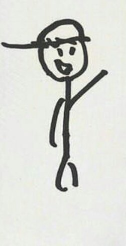
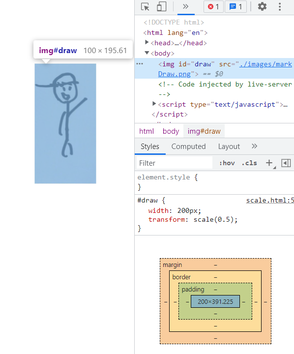
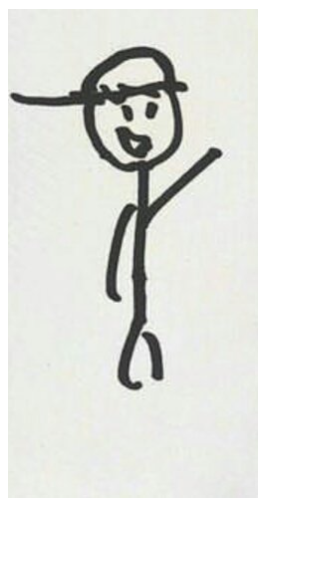
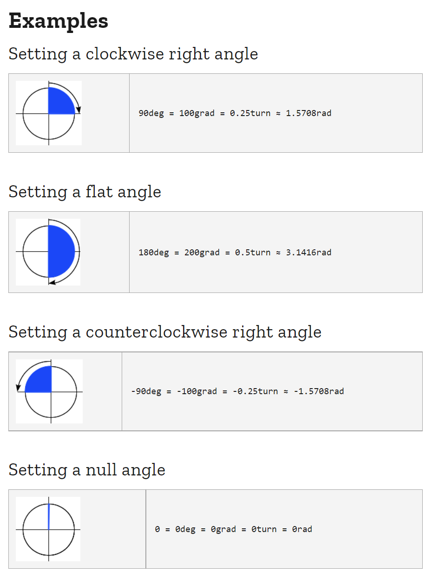
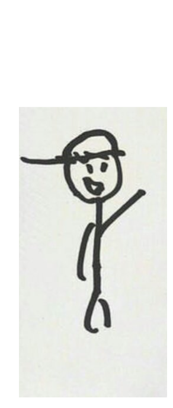
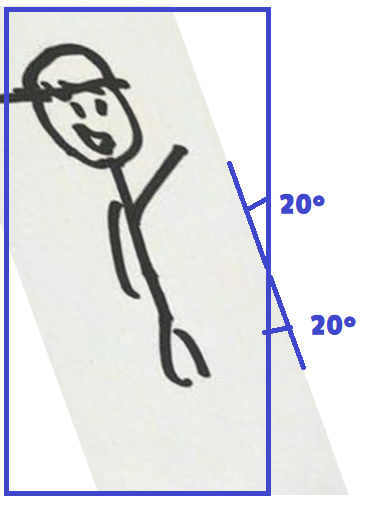
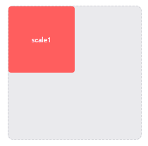
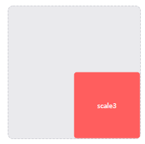

# Transform
들어가기 앞서, CSS 애니메이션을 구현하는데 있어서는 몇 가지 중요한 속성 및 기능 키워드를 알아야 합니다. 대표적으로 **"transform", "transition", "@keyframes", "animation"** 키워드를 반드시 알아 두어야 합니다. 

CSS 애니메이션의 속성은 **블록 요소(Block Element)** 에 적용되는 것을 기본으로 합니다. 특별한 경우가 아니면 블록 요소(`<div>`)에 애니메이션을 적용하게 되며, 블록 요소가 아닌 요소들은 블록 요소로 감싸서 블록 요소를 애니메이션 하는 것이 기본적인 사용 방법입니다. 


## 1. Transform (변형) 개요
- 요소를 이동하거나, 크기를 변경하는 요소의 크기, 위치, 색상 등의 속성 값을 바꾸는 동작을 하며, **시간 개념은 없습니다.**
- 원본이 유지됩니다. 
- 여러 함수를 함께 사용할 땐 오른쪽부터 적용됩니다. 
- transform은 속성 값으로 변환함수(transform function)를 사용하는데, 변환함수는 다음과 같습니다.

|transform function |	설명 |	단위|
|---|---|---|
|scale(x,y) |	요소의 크기를 X축으로 x배, Y축으로 y배 확대 또는 축소 시킨다. |	0과 양수|
|rotate(angle) |	요소를 angle만큼 회전시킨다. |	+/- 각도(deg)|
|translate(x,y) |	요소의 위치를 X축으로 x만큼, Y축으로 y만큼 이동시킨다. |	px, %, em 등|
|skew(x-angle,y-angle) |	요소를 X축으로 x 각도만큼, Y축으로 y 각도만큼 기울인다. |	+/- 각도(deg)|

변형 함수를 공백으로 띄워서 여러 개의 변형 함수를 동시에 요소에 적용할 수 있습니다. 

transform: 변형함수1(파라메터) 변형함수2(파라메터) 변형함수3(파라메터);

```css
/* 오른쪽 아래로 200px 이동하면서 요소의 가운데를 중심으로 360도 회전합니다. */
transform: translate(-200px, 200px) rotate(360deg);
```


## 2. 크기 - scale
HTML 요소 박스의 크기를 변형하는 기능입니다. 자료형은 number로 적용됩니다. 2d만 사용가능. 3d는 불가능. 

```html
transform: scale(1.4) <!-- x축 y축이 1.4 확대 -->
transform: scale(0.5, 2) <!-- x축이 0.5 축소, y축이 2 확대-->
```


✨ **예시**

```html
<!DOCTYPE html>
<html lang="en">
<head>
  <style>
    #draw {
      width: 200px;
      transform: scale(0.5);
    }
  </style>
</head>
<body>
  
</body>
</html>
```

🧪 **실행결과**

transform: scale(0.5); 를 지정해 0.5만큼 축소되었는데, 콘텐츠 크기는 width: 200px이고 이 상태에서 한번 더 scale을 지정해서 width: 100px임을 볼 수 있습니다.



width:200px일 때의 이미지




## 3. rotate
HTML 요소 박스를 평면상에서 회전하는 기능으로, 함수의 값으로 회전 각도(deg)를 지정할 수 있습니다. 하나의 값만 받을 수 있습니다.

**자료형**




✨ **예시**

```html
<!DOCTYPE html>
<html lang="en">
<head>
  <style>
    #draw {
      width: 200px;
      transform: rotate(45deg);
    }
  </style>
</head>
<body>
  
</body>
</html>
```

🧪 **실행결과**

.png)


## 4. translate
 HTML 요소 박스를 평면상에서 수평 이동하는 기능입니다. `translateX( )`와 `translateY( )` 함수로 이동거리를 방향별로 각각 지정할 수 있습니다.

```html
    transform: translate(30px); <!-- (0,0)을 기준으로(30px, 0) -->
    transform: translate(10%, 20%);
```


✨ **예시**

```html
<!DOCTYPE html>
<html lang="en">
<head>
  <style>
    #draw {
      width: 200px;
      transform: translate(10%, 35%);
    }
  </style>
</head>
<body>
  
</body>
</html>
```

🧪 **실행결과**




## 5. skew
HTML 요소 박스의 기울임을 지정하는 기능. rotate( ) 함수와 마찬가지로 함수 값에 기울기의 각도(deg)를 지정할 수 있으며, `skewX( )`와 `skewY( )`로 각 축 방향별 요소의 기울기를 지정할 수도 있습니다.

```html
transform: skew(30deg); <!-- (30º, 0) -->
transform: skew(30deg, 0); <!-- (30º, 0) -->
}

✨ **예시**

```html
<!DOCTYPE html>
<html lang="en">
<head>
  <style>
    #draw {
      width: 200px;
      transform: skewX(20deg);
    }
  </style>
</head>
<body>
  
</body>
</html>
```

🧪 **실행결과**



## 6. transform-origin

`transform-origin`은 `transform`과 별도의 function입니다. 요소의 기본 기준점을 설정할 때 사용됩니다. 기본기준점은 요소의 정중앙은(50%,50%) 입니다. 설정값으로 %, px, top left, bottom right을 사용할 수 있다. 0, 0은 top left, 100% 100%는 bottom right과 같은 값입니다.


✨ **예시**

```html
<!DOCTYPE html>
<html>
<head>
  <style>
  .box {
    width: 150px;
    height: 150px;
    line-height: 150px;
    color: white;
    text-align: center;
    border-radius: 6px;
  }
  .original {
    margin: 20px;
    border: 1px dashed #cecfd5;
    background: #eaeaed;
    float: left;
  }
  .child {
    background: #ff5e5e;
    cursor: pointer;
  }
  .scale1:hover {
    transition: transform 1s linear;
    transform-origin: 0 0;
    transform: scale(.5);
  }
  .scale2:hover {
    transition: transform 1s linear;
    transform-origin: 50% 50%;
    transform: scale(.5);
  }
  .scale3:hover {
    transition: transform 1s linear;
    transform-origin: 100% 100%;
    transform: scale(.5);
  }
  </style>
</head>
<body>
  <div class="original box">
    <div class="child box scale1">scale1</div>
  </div>
  <div class="original box">
    <div class="child box scale2">scale2</div>
  </div>
  <div class="original box">
    <div class="child box scale3">scale3</div>
  </div>
</body>
</html>
```

🧪 **실행결과**

topleft 예제



(50, 50) 예제

.png)

bottomRight 예제




[Transfor(변형)](https://seulbinim.github.io/WSA/transform.html#transform-%EC%86%8D%EC%84%B1)