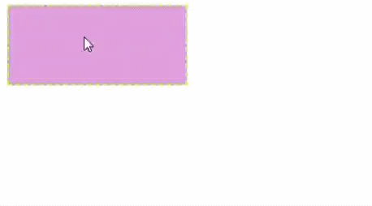
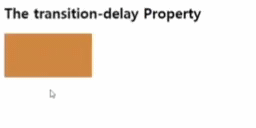

# transition 
## 1. transition 개요
**트랜지션(transition)**은 CSS 프로퍼티 값이 변화할 때, 프로퍼티 값의 변화를 부드럽게 하기 위해 일정 시간(duration)에 걸쳐 일어나도록 하는 것입니다. 

> div 셀렉터의 룰셋에 트랜지션을 설정하면 마우스가 올라갈 때(hover on)와 마우스가 내려올 때(hover off) 모두 트랜지션이 발동한다. 하지만 div:hover 셀렉터의 룰셋에 트랜지션을 설정하면 마우스가 올라갈 때(hover on)는 트랜지션이 발동하지만 마우스가 내려올 때(hover off)는 트랜지션이 발동하지 않는다.

transition의 프로퍼티는 아래와 같습니다. 

|프로퍼티	|설명|	기본값|
|---|---|---|
|transition-property|	트랜지션의 대상이 되는 CSS 프로퍼티를 지정한다|	all|
|transition-duration|	트랜지션이 일어나는 지속시간(duration)을 초 단위(s) 또는 밀리 초 단위(ms)로 지정한다	|0s|
|transition-timing-function|	트랜지션 효과를 위한 수치 함수를 지정한다.	|ease|
|transition-delay|	프로퍼티가 변화한 시점과 트랜지션이 실제로 시작하는 사이에 대기하는 시간을 초 단위(s) 또는 밀리 초 단위(ms)로 지정한다|	0s|
|transition	|모든 트랜지션 프로퍼티를 한번에 지정한다 (shorthand syntax)	 ||

## 2. transition-property
트랜지션의 대상이 되는 CSS 프로퍼티명을 지정. 지정하지 않는 경우 모든 프로퍼티가 트랜지션의 대상이 됩니다.. 복수의 프로퍼티를 지정하는 경우 쉼표(,)로 구분합니다.

```css
transition-property: none; /*아무것도 바꾸지 않겠다*/
transition-property: all; /*갖고 있는 모든 css를 바꾸겠다.*/
transition-property: 특정요소(margin,color...);
```

✨ **예시**

```html
<!DOCTYPE html>
<html lang="en">
<head>
  <style>
    div{
      width: 150px;0
      height: 75px;
      border: 2px dashed greenyellow;
      background-color: plum;
      font-size: 30px;
      color: white;

      /* transition-property: all을 쓰면 모두*/
      transition-property: width, background-color; 
      transition-duration: 1s, 3s;
    }

    div:hover{
      width: 300px;
      background-color: red;
    }

  </style>
</head>
<body>
  <div></div>
</body>
</html>
```

🧪 **실행결과**




## 3. transition-duration
트랜지션에 일어나는 지속시간(duration)을 초 단위(s) 또는 밀리 초 단위(ms)로 지정한다. **프로퍼티 값을 지정하지 않을 경우 기본값 0s가 적용되어 어떠한 트랜지션 효과도 볼 수 없습니다.** 0.5s === 500ms

```css
/* margin-right 프로퍼티 3초, color 프로퍼티 1초 */
transition-duration: 3s, 1s;
transition-property: margin-right, color;
```

```css
/* width 프로퍼티는 2초, opacity 프로퍼티는 1초, left 프로퍼티는 2초, top 프로퍼티는 1초 */
transition-property: width, opacity, left, top;
transition-duration: 2s, 1s;
```

```css
/* shorthand syntax */
transition: width 2s, opacity 4s;
```


## 4. transition-delay
 **transition-delay**로 대기 사간을 초 단위(s) 또는 밀리 초 단위(ms)로 지정하여 프로퍼티의 값이 변화하여도 즉시 트랜지션이 실행되지 않고, 일정 시간 대기한 후 트랜지션이 실행되도록 합니다.

✨ **예시**

```html
<!DOCTYPE html>
<html lang="en">
<head>
  <style>
    div{
      width: 150px;
      height: 75px;
      background-color: peru;
      
      /* transition-property: all을 쓰면 모두*/
      transition-property: width; 
      transition-duration: 1s;
      transition-delay: 2s;
    }
    
    div:hover{
      width: 300px;
    }

  </style>
</head>
<body>
  <h2>The transition-delay Property</h2>
  <div></div>
</body>
</html>
```

🧪 **실행결과**




## 5. transition-timing-function
트랜지션 효과의 변화 흐름, 시간에 따른 변화 속도와 같은 일종의 변화의 리듬을 지정. 기본값은 ease이다.

|프로퍼티값| 	효과 | 	그래프| 
|---|---|---|
|ease	| 기본값. 느리게 시작하여 점점 빨라졌다가 느리지면서 종료(ease-in보다 시작이 빠름)	|  |
|linear | 	시작부터 종료까지 등속 운동	| |
|ease-in | 	느리게 시작한 후 일정한 속도에 다다르면 그 상태로 등속 운동	|  |
|ease-out | 	일정한 속도의 등속으로 시작해서 점점 느려지면서 종료	|  |
|ease-in-out | 	ease와 비슷하게 느리게 시작하여 느리지면서 종료	|  |


## 6. transition shorthand
transition-duration은 반드시 지정해야 합니다.

```css
transition: property duration function delay
```

✨ **예시**

```html
<!DOCTYPE html>
<html lang="en">
<head>
  <style>
    div{
      width: 165px;
      height: 75px;
      background-color: blue;
      font-size: 30px;
      color: white;

    /*
      transition-property: all;
      transition-duration: 3s;
      transition-delay: 1s;
      transition-timing-function: ease-in-out;
    */
      transition: all 3s ease-in-out 1s;

    }

    div:hover{
      height: 200px;
      background-color: yellowgreen;
    }

  </style>
</head>
<body>
  <div>HOVER ME!</div>
</body>
</html>
```

🧪 **실행결과**


