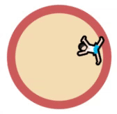
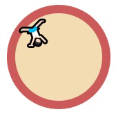
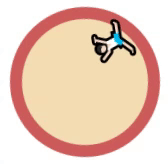
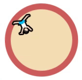

# 애니메이션
## 1. 애니메이션 개요
**transition**의 경우 사용자의 Action의 Trigger(:hover와 같은 가상 클래스 선택자 혹은 Javascript Event)가 있어야 움직이지만 **animation**은 특정 Action이 없더라도 자동으로 동작하게 할 수 있습니다. **애니메이션(animation)** 효과는 `@keyframes`를 이용해 HTML 요소에 적용되는 CSS 스타일을 다른 CSS 스타일로 부드럽게 변화시킵니다.

|프로퍼티|	설명|	기본값|
|---|---|---|
|animation-name|	@keyframes 애니메이션 효과 이름을 설정	 ||
|animation-duration	|한 싸이클의 애니메이션에 소요되는 시간을 초 단위(s) 또는 밀리 초 단위(ms)로 지정	|0s|
|animation-delay	|요소가 로드된 시점과 애니메이션이 실제로 시작하는 사이에 대기하는 시간을 초 단위(s) 또는 밀리 초 단위(ms)로 지정|0s|
|animation-timing-function|	애니메이션 효과를 위한 타이밍 함수를 지정|	ease|
|animation-direction|	애니메이션이 종료된 이후 반복될 때 진행하는 방향을 지정한다.|	normal|
|animation-play-state	|애니메이션 재생 상태(재생 또는 중지)를 지정한다.|	running|
|animation-fill-mode|	애니메이션 미실행 시(종료 또는 대기) 요소의 스타일을 지정한다.|	 |
|animation|	모든 애니메이션 프로퍼티를 한번에 지정 (shorthand syntax)	||


## 2. @keyframes
 @keyframes rule을 사용해 시간 흐름에 따라 애니메이션을 정의할 수 있습니다.  

 from, to 키워드를 사용해 애니메이션의 시작과 끝을 정의할 수 있습니다.

```css
@keyframes 이름 {
  /* Start */
  from{
    내용
  }

  /* End */
  to {
      내용
  }
}
```

시작과 끝 키프레임 사이에 % 단위로 키프레임을 삽입할 수 있습니다.

```css
@keyframes 이름 {
  0% { 내용 }
  50% { 내용 }
  100% { 내용 }
}
```

✨ **예시**

```html
<!DOCTYPE html>
<html lang="en">
<head>
  <style>
    div{
      width: 100px;
      height: 100px;
      border: 10px solid seagreen;
      background-color: beige;
      border-radius: 30px;
      font-size: 60px;

      animation: myAnimation 2s infinite;
    }

    @keyframes myAnimation {
      from { width: 100px; }
      to { width: 300px; }
    }

  </style>
</head>
<body>
  <div>🍱</div>
</body>
</html>
```

🧪 **실행결과**

.gif)


애니메이션이 돌아갈 때 부자연스러움을 `animation-direction: alternate;` 프로퍼티 값을 설정하거나 `0%와 100%`에 같은 값을 설정해 자연스러운 효과를 적용할 수 있습니다. 

**animation-direction: alternate;**

```css
animation: myAnimation 2s infinite alternate;
```

**0%와 100%에 동일 값**

```css
    @keyframes myAnimation {
      0% {}
      50% { width: 300px; }
      100% {}
      /*
      0% { width: 100px; }
      50% { width: 300px; }
      100% { width: 100px; }
      와 동일
      */
    }
```

🧪 **실행결과**

.gif)


## 3. animation-name
**@keyframes** 뒤에 애니메이션이 설정된 임의의 이름을 적어줍니다.

|값|설명|
|---|---|
|none| 기본값. @keyframes가 없음을 나타냄.|
|`<custom-ident>`|대소문자, 숫자, (_), (-), none, unset, initial, inherit 만 사용 가능|

✨ **예시**

```html
<!DOCTYPE html>
<html>
<head>
  <style>
    div {
      position: absolute;
      width: 100px;
      height: 100px;
      animation-name: move, fadeOut
      animation-duration: 3s;
      animation-iteration-count: infinite;
    }

    @keyframes move {
      from { left: 0; }
      to   { left: 300px; }
    }

    @keyframes fadeOut {
      from { opacity: 1; }
      to   { opacity: 0; }
    }
  </style>
</head>
<body>
  <div></div>
</body>
</html>
```

## 4. animation-duration
한 싸이클을 완료하는 애니메이션에 소요되는 시간을 초 단위(s) 또는 밀리 초 단위(ms)로 지정합니다. **음수 사용 불가**, **animation-duration은 반드시 지정해야합니다.** 지정하지 않는다면 기본값 0s로 모든 애니메이션이 실행되지 않습니다. 

## 5. animation-delay
요소가 로드된 시점과 애니메이션이 실제로 시작하는 사이에 대기하는 시간을 초 단위(s) 또는 밀리 초 단위(ms)로 지정합니다. **음수 사용 가능( 1초 전에 이미 시작 )**

✨ **예시**

```html
<!DOCTYPE html>
<html lang="en">
<head>
  <style>
     div{
      width: 100px;
      height: 100px;
      border: 5px double olive;
      background-color: beige;
      border-radius: 30px;
    } 

    .box1 {
      background-color: lightpink;
      animation: myAnimation 1s infinite;
      animation-delay: 0;
    }

    .box2 {
      background-color: oldlace;
      animation: myAnimation 1s infinite;
      animation-delay: 0.3s;
    }

    .box3 {
      background-color: mintcream;
      animation: myAnimation 1s infinite;
      animation-delay: 0.6s;
    }

    @keyframes myAnimation {
      0%{
       font-size: 20px; 
      }
      
      50%{
        width: 250px;
        font-size: 20px; 
      }
      
      100%{
        font-size: 20px; 
      }
    }

  </style>
</head>
<body>
  <div class="box1">💙</div>
  <div class="box2">💚</div>
  <div class="box3">🖤</div>
</body>
</html>
```

🧪 **실행결과**


## 6. [animation-timing-function](https://developer.mozilla.org/en-US/docs/Web/CSS/animation-timing-function)
애니메이션 효과를 위한 수치 함수를 지정합니다.ease, ease-in-out 쓰는 것을 추천. 기본값은 ease.


## 7. animation-iteration-count
애니메이션 주기의 재생 횟수를 지정. 기본값은 1이며 infinite로 무한반복 할 수 있습니다.

|값|설명|
|---|---|
|infinite| repeat forever|
|`<number>`|숫자. 음수 사용 불가능|


✨ **예시**

```html
<!DOCTYPE html>
<html lang="en">
<head>
  <style>
    div{
      width: 100px;
      height: 100px;
      border: 10px solid indianred;
      background-color:wheat;
      font-size: 30px       ;
      border-radius: 50%;
    }

    .box1 {
      animation-name: rotate;
      animation-duration: 3s;
      animation-timing-function: linear;
      animation-iteration-count: infinite;
    }

    @keyframes rotate {
      from { transform: rotate(0) }
      to { transform: rotate(360deg) }
    }

  </style>
</head>
<body>
  <div class="box1">🤸🏻‍♂️</div>
</body>
</html>
```

🧪 **실행결과**




```css
animation-iteration-count: 0.5;
```




## 8. animation-direction
애니메이션이 종료된 이후 반복될 때 진행하는 방향을 지정합니다.

|값	|설명|
|---|---|
|normal	|기본값으로 from(0%)에서 to(100%) 방향으로 진행|
|reverse|	to에서 from 방향으로 진행|
|alternate|	홀수번째는 normal로, 짝수번째는 reverse로 진행|
|alternate-reverse	|홀수번째는 reverse로, 짝수번째는 normal로 진행|

✨ **예시**

```html
<!DOCTYPE html>
<html lang="en">
<head>
  <style>
    div{
      width: 100px;
      height: 100px;
      border: 10px solid indianred;
      background-color:wheat;
      font-size: 30px       ;
      border-radius: 50%;
    }

    .box1 {
      animation-name: rotate;
      animation-duration: 3s;
      animation-timing-function: linear;
      animation-iteration-count: infinite;
      animation-direction: alternate;
    }

    @keyframes rotate {
      from { transform: rotate(0) }
      to { transform: rotate(360deg) }
    }

  </style>
</head>
<body>
  <div class="box1">🤸🏻‍♂️</div>
</body>
</html>
```

🧪 **실행결과**




```css
animation-direction: alternate-reverse;
```




## 9. animation-play-state
애니메이션 재생 상태(재생 또는 중지)를 지정. 기본값은 running

|값	|설명|
|---|---|
|paused	| 애니메이션 동작|
|running|	애니메이션 정지|

✨ **예시**

```html
<!DOCTYPE html>
<html lang="en">
<head>
  <style>
    div{
      width: 100px;
      height: 100px;
      border: 10px solid royalblue;
      background-color:skyblue;
      font-size: 30px       ;
      border-radius: 50%;
    }

    .box1 {
      animation-name: rotate;
      animation-duration: 3s;
      animation-timing-function: linear;
      animation-iteration-count: infinite;
      animation-play-state: paused;
    }

    .box1:hover {
      animation-play-state: running ;
    }

    @keyframes rotate {
      from { transform: rotate(0) }
      to { transform: rotate(360deg) }
    }

  </style>
</head>
<body>
  <div class="box1">🏄🏻‍♀️</div>
</body>
</html>
```

🧪 **실행결과**

.gif)

```css
.box1 {
  animation-name: rotate;
  animation-duration: 3s;
  animation-timing-function: linear;
  animation-iteration-count: infinite;
  animation-play-state: running;
}

.box1:hover {
  animation-play-state: paused;
}
```

.gif)


## 10. animation-fill-mode
애니메이션 미실행 시(대기 또는 종료) 요소의 스타일을 지정

|프로퍼티값	|상태|	설명|
|---|---|---|
|none	|대기|	시작 프레임(from)에 설정한 스타일을 적용하지 않고 대기한다.|
| 	|종료|	애니메이션 실행 전 상태로 애니메이션 요소의 프로퍼티값을 되돌리고 종료한다.|
|forwards|	대기|	시작 프레임(from)에 설정한 스타일을 적용하지 않고 대기한다.|
| |	종료|	종료 프레임(to)에 설정한 스타일을 적용하고 종료한다.|
|backwards|	대기|	시작 프레임(from)에 설정한 스타일을 적용하고 대기한다.|
| |	종료|	애니메이션 실행 전 상태로 애니메이션 요소의 프로퍼티값을 되돌리고 종료한다.|
|both	|대기|	시작 프레임(from)에 설정한 스타일을 적용하고 대기한다.|
| |	종료|	종료 프레임(to)에 설정한 스타일을 적용하고 종료한다.|


✨ **예시**

```html
<!DOCTYPE html>
<html lang="en">
<head>
  <style>
    div {
      width: 100px;
      height: 100px;
      border: 10px dotted hotpink;
    }

    .box1 {
      background-color: powderblue;
      animation: fill-mode 3s linear 1s;
      animation-fill-mode: none;
    }

    @keyframes fill-mode {
      0%{
        background-color: red;
      }
      
      50%{
        width: 200px;
      }
      
      100%{
        background-color: seagreen;
      }
    }
  </style>
</head>
<body>
  <div class="box1">HELLO~!</div>
</body>
</html>
```

🧪 **실행결과**


```css
animation-fill-mode: forwards;
```


```css
animation-fill-mode: backwards;
```


```css
animation-fill-mode: both;
```


## 11. animation shorthand

값을 지정하지 않은 프로퍼티에는 기본값이 지정되고 **@keyframes**이 있을 땐 name이 지정해야하고 **animation-duration**은 반드시 지정해야 합니다.

```css
animation: name duration timing-function delay iteration-count direction fill-mode play-state
```


