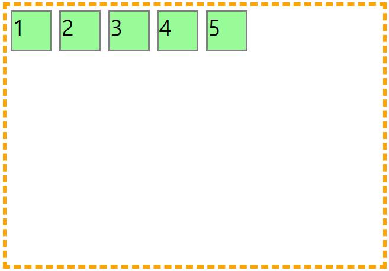
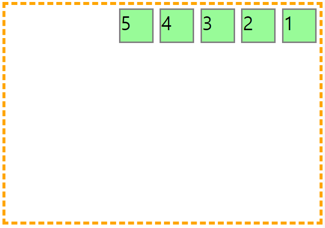
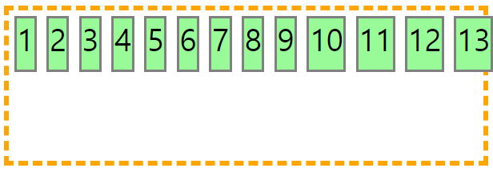
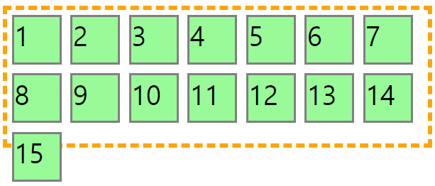
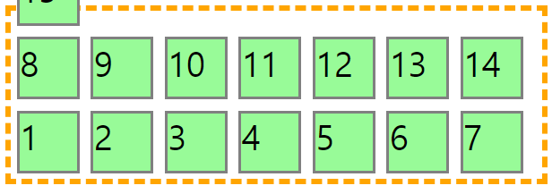
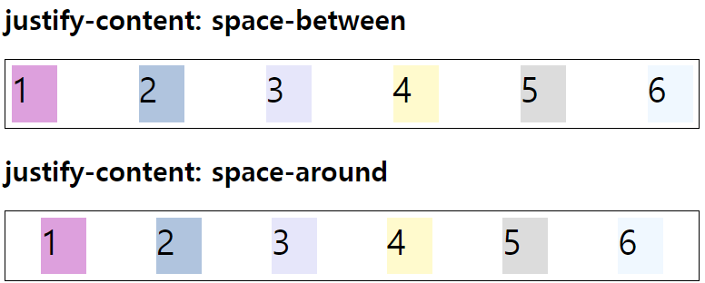
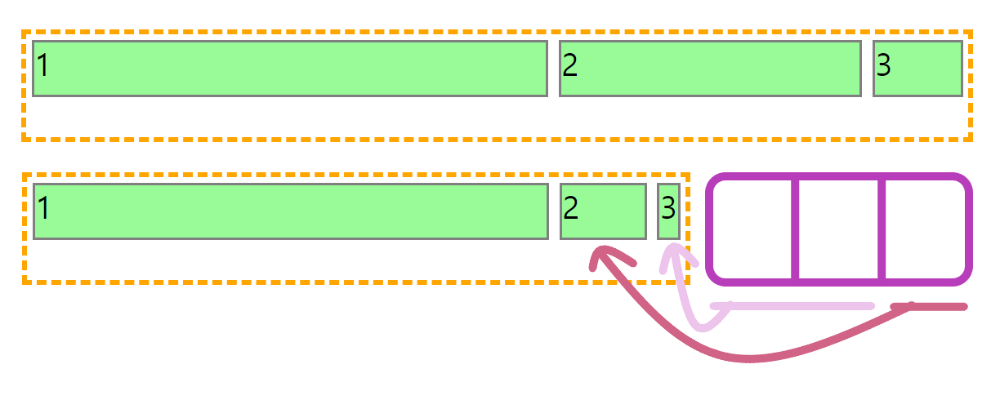

# Flexbox
## 1. Flexbox 개요
Flex 속성
- Container에 적용하는 속성
- Item에 적용하는 속성 

Flex 설명
- 1행 수평 정렬
- 요소의 상하좌우 정렬, 순서 변경
- 요소 간 간격 조절


## 2. 용어

- Flex Container: 상위 부모 요소
- Flex Item: 복수 자식 요소
- Main Axis: 주축, 자식 요소가 배치된 방향
- Cross Axis: 교차축, 주축과 수직


## 3. Container - display

우선, Flex를 사용하기 위해서 배치하려는 요소(Flex Item)를 감싸는 <strong>Flex Container(부모 요소)</strong>를 flexbox로 만들어야합니다. 기본값 **display: flex;** 로 선언.

```css
container {
	display: flex;
}
```

Flex Item들은 가로 방향으로 배치되고, Item 각자의 Content width만큼 너비가 됩니다. **height는 부모인 Container 에 맞게 차게 됩니다.**


```css
container {
	display: inline-flex;
}
```

부모 요소가 inline인 경우 **display: inline-flex;** 를 지정해 Container와 주변 요소 정렬을 도모합니다. 

## 4. Flexbox Container 속성 
### 1) flex-direction (배치 방향 설정)
flex-direction 프로퍼티는 Flex Container의 **① 주축(main axis)의 위치**와 **② 주축의 방향**을 설정합니다. 

|값|설명|
|---|---|
|row|Item을 행 방향 왼쪽에서 오른쪽으로 수평 배치|
|row-reverse|Item을 해 방향 오른쪽에서 왼쪽으로 수평 배치|
|column|Item을 열 방향 위쪽에서 아래쪽으로 수직 배치|
|column-reverse|Item을 열 방향 아래쪽에서 위쪽으로 수직 배치|


```css
container {
  flex-direction: row;
}
```



```css
container {
  flex-direction: row-reverse;
}
```




```css
container {
  flex-direction: column;
}
```


```css
container {
  flex-direction: column-reverse;
}
```


### 💡 [참고] Container height가 Items보다 작으면 Item은 밖으로 나갑니다.


✨ **예시**

```html
<!DOCTYPE html>
<html lang="en">
<head>
  <style>
    .container {
      height: 150px;
      border: 5px dashed orange;
      display: flex;
      flex-direction: column;
    }

    .item{
      width: 50px;
      height: 50px;
      margin: 5px;
      background-color: palegreen;
      border: 3px solid grey;
      font-size: 30px;
    }
  </style>
</head>
<body>
  <div class="container">
    <div class="item">1</div>
    <div class="item">2</div>
    <div class="item">3</div>
    <div class="item">4</div>
    <div class="item">5</div>
  </div>
</body>
</html>
```

🧪 **실행결과**

.png)


```css
container {
  flex-direction: column-reverse;
}
```

.png)


### 2) flex-wrap (Flex 항목(Items) 개행 처리 설정)
기본적으로 Items는 주축 방향을 따라 한 줄 배치되지만, **flex-wrap**을 사용하면 복수행 배치가 가능합니다. 


|값|설명|
|---|---|
|nowrap|기본값. Flex 항목(Items)을 한 줄에 표시하고 Container 너비보다 Items width 합계가 더 큰 경우 Container를 삐져나갑니다.|
|wrap|Flex 항목(Items)을 복수행 배치합니다.|
|wrap-reverse|Flex 항목(Items)을 복수행 역방향 배치합니다.|


```css
container {
  flex-wrap: nowrap;
}
```




```css
container {
  flex-wrap: wrap;
}
```


🧪 **실행결과**




```css
container {
  flex-wrap: wrap-reverse;
}
```

🧪 **실행결과**




### 3) flex-flow 
**flex-direction**과 **flex-wrap**을 한 번에 지정하는 Shorthand

```css
container {
  /* 
  flex-direction: column;
  flex-wrap: wrap; 
  */

  flex-wrap: column wrap;
}
```


## 5. Flexbox Container 정렬
### 1) justify-content (주축 방향 정렬)
Flex Container의 main axis를 기준으로 Flex Item을 수평 정렬합니다. 

|값|설명|미리보기|
|---|---|---|
|flex-start|기본값. main start(주축의 시작점)을 기준으로 정렬||
|flex-end|main end(주축의 끝점)을 기준으로 정렬||
|center|Flex Container 중앙에 정렬||
|space-between|첫번째와 마지막 Flex Item은 좌우 측면에 정렬되고 나머지 Item들의 사이(between)에 균등한 간격으로 정렬 ||
|space-around|모든 Flex Item은 균등한 간격으로 정렬 ||


✨ **예시**

```html
<!DOCTYPE html>
<html>
<head>
<style> 
.container {
  border: 1px solid black;
  margin-bottom: 20px;
  display: flex;
}

.container div {
  width: 40px;
  height: 50px;
  margin: 5px;
  font-size: 30px;
}

.container:nth-child(2) {
  justify-content: space-between;
}

.container:nth-child(4) {
  justify-content: space-around;
}
</style>
</head>
<body>
<h2>justify-content: space-between</h2>
<div class="container">
  <div style="background-color:plum;">1</div>
  <div style="background-color:lightsteelblue;">2</div>
  <div style="background-color:lavender;">3</div>
  <div style="background-color:lemonchiffon;">4</div>
  <div style="background-color:gainsboro;">5</div>
  <div style="background-color:aliceblue;">6</div>
</div>
<h2>justify-content: space-around</h2>
<div class="container">
  <div style="background-color:plum;">1</div>
  <div style="background-color:lightsteelblue;">2</div>
  <div style="background-color:lavender;">3</div>
  <div style="background-color:lemonchiffon;">4</div>
  <div style="background-color:gainsboro;">5</div>
  <div style="background-color:aliceblue;">6</div>
</div>
</body>
</html>

```

🧪 **실행결과**




### 2) align-content (여러 행 정렬)
`flex-wrap: wrap;`이 설정된 상태에서, Flex Container의 cross axis를 기준으로 Flex Item을 수직 정렬합니다. 사용하는 속성 값은 justify-content의 속성 값과 동일. 

|값|설명|미리보기|
|---|---|---|
|stretch|기본값. ||
|flex-start|cross start(교차축의 시작점)을 기준으로 정렬||
|flex-end|cross end(교차축의 끝점)을 기준으로 정렬||
|center|Flex Container 중앙에 정렬||
|space-between|첫번째 Flex Item의 행은 Flex Container의 상단에 마지막 Flex Item의 행은 Flex Container의 하단에  정렬되고 나머지 Item들의 행 사이(between)에 균등한 간격으로 정렬 ||
|space-around|모든 Flex Item은 균등한 간격으로 정렬 ||


## 6. Flexbox Item 속성 
### 1) order (배치 순서)
각 아이템들의 "시각적" 나열 순서를 결정하는 속성입니다. HTML 소스 코드 변경은 없으나 order 속성을 이용하면 배치 순서를 바꿀 수 있습니다. order 값이 같은 경우 소스 코드 순서대로 정렬됩니다. 자료형은 정수값만 사용 가능. 기본값 0


✨ **예시**

```html
<!DOCTYPE html>
<html lang="en">
<head>
  <style>
    .container {
      height: 100px;
      border: 5px dashed orange;
      display: flex;
    }

    .item{
      width: 50px;
      height: 50px;
      margin: 5px;
      background-color: palegreen;
      border: 3px solid grey;
      font-size: 30px;
    }

    .item:nth-child(3) {
      order: 1;
    }

    .item:nth-child(5) {
      order: 7;
    }

    .item:nth-child(4) {
      order: -10;
    }
  </style>
</head>
<body>
  <div class="container">
    <div class="item">1</div>
    <div class="item">2</div>
    <div class="item">3</div>
    <div class="item">4</div>
    <div class="item">5</div>
  </div>
</body>
</html>
```

🧪 **실행결과**


### 2) flex-grow (유연하게 늘리기)
Flex Item의 너비 지정. Itme들의 flex-basis를 제외한 여백 부분을 flex-grow에 지정된 숫자의 비율로 나누어 가집니다.기본값은 0. 자료형은 `<number>`지만 음수값은 허용되지 않습니다. 


✨ **예시**

```html
<!DOCTYPE html>
<html lang="en">
<head>
  <style>
    .container {
      height: 100px;
      border: 5px dashed orange;
      display: flex;
    }

    .item{
      width: 50px;
      height: 50px;
      margin: 5px;
      background-color: palegreen;
      border: 3px solid grey;
      font-size: 30px;
    }

    .item:nth-child(2) {
      flex-grow: 2;
    }
    
    .item:nth-child(3) {
      flex-grow: 1;
    }

  </style>
</head>
<body>
  <div class="container">
    <div class="item">1</div>
    <div class="item">2</div>
    <div class="item">3</div>
  </div>
</body>
</html>
```

🧪 **실행결과**

.png)

여백을 0:2:1로 나눠가졌습니다.

.png)


### 3) flex-shrink
grow는 늘어나는데 비해 shrink는 줄어듭니다. Flex Item 요소의 크기가 Flex Container 요소의 크기보다 클 때 속성을 적용할 수 있습니다. 기본값 1. 


✨ **예시**

```html
<!DOCTYPE html>
<html lang="en">
<head>
  <style>
    .container {
      height: 100px;
      border: 5px dashed orange;
      display: flex;
    }

    .item{
      width: 500px;
      height: 50px;
      margin: 5px;
      background-color: palegreen;
      border: 3px solid grey;
      font-size: 30px;
    }

    .item:nth-child(1) {
      flex-shrink: 0;
    }
    
    .item:nth-child(3) {
      flex-shrink: 2;
    }

  </style>
</head>
<body>
  <div class="container">
    <div class="item">1</div>
    <div class="item">2</div>
    <div class="item">3</div>
  </div>
</body>
</html>
```

🧪 **실행결과**

.png)


Items가 0:1:2로 줄어들었습니다.

 


### 4) flex-basis
flex item의 너비 기본값을 px, % 등의 단위로 초기 크기(initial main size)를 지정합니다. 초기 크기란 **flex-grow** 또는 **flex-shrink** 프로퍼티 되지 않는 기본 영역입니다.  **flex-grow**와 **flex-shrink**는 *flex-basis* 영역을 제외한 부분이 늘어나고 줄어드는 것입니다. 기본값은 auto. 값이 0일 경우, flex-grow와 flex-shrink의 인수 값을 함께 사용하고 auto일 경우, Flex항목의 너비 값을 사용합니다.


✨ **예시**

```html
<!DOCTYPE html>
<html lang="en">
<head>
  <style>
    .container {
      height: 100px;
      border: 5px dashed orange;
      display: flex;
    }

    .item{
      width: 50px;
      height: 50px;
      margin: 5px;
      background-color: palegreen;
      border: 3px solid grey;
      font-size: 30px;

      flex-basis: 0;
    }

    .item:nth-child(1) {
      flex-grow: 5;
    }

    .item:nth-child(2) {
      flex-grow: 1;
    }
    
    .item:nth-child(3) {
      flex-grow: 3;
    }

  </style>
</head>
<body>
  <div class="container">
    <div class="item">FLEX</div>
    <div class="item">!</div>
    <div class="item">!</div>
  </div>
</body>
</html>
```

🧪 **실행결과**


`flex-basis:0` 이라 flex:grow 비율따라 늘어납니다.

### 5) flex
**flex-grow**, **flex-shrink**, **flex-basis**를 한 번에 지정하는 Shorthand. 첫 번째 늘릴 비율, 두 번째 줄일 비율, 세 번째 기본값. 각자 **기본값은 0 1 auto**. 

```html
flex: 1 1 0 /* 늘이거나 줄이지 않음*/
flex: 2 2 0 /* 2배 늘이거나 2배 줄임*/
```


## 7. Flexbox Item 정렬
### 1) align-items (수직축 방향 정렬)
수직축 방향으로 Item을 정렬하는 속성입니다. 

|값|설명|미리보기|
|---|---|---|
|stretch|기본값. Flex Item이 수직축 방향으로 꽉 채웁니다.||
|flex-start|교차축의 시작점을 기준으로 배치합니다.||
|flex-end|교차축의 끝점을 기준으로 배치합니다.||
|center|교차축의 중앙을 기준으로 배치합니다.||


### 2) align-self (수직축 방향 정렬)
**align-items**가 전체 아이템의 수직축 방향 정렬이라면, **align-self**는 해당 아이템의 수직축 방향 정렬입니다.

|값|설명|미리보기|
|---|---|---|
|auto|기본값. Flex Item을 부모 속성 값을 상속받습니다.||
|stretch|Flex Item이 수직축 방향으로 꽉 채웁니다.||
|flex-start|교차축의 시작점을 기준으로 배치합니다.||
|flex-end|교차축의 끝점을 기준으로 배치합니다.||
|center|교차축의 중앙을 기준으로 배치합니다.||


## 8. 중앙 정렬

```css
justify-content: center; 
align-item: center;
```


[flex-property](https://www.w3.org/TR/css-flexbox-1/#flex-property)
[이번에야말로 CSS Flex를 익혀보자](https://studiomeal.com/archives/197)