# 그리드 (Grid)
## 1. Grid 개요
- Flex는 한 방향 레이아웃 시스템이고 (1차원)
- Grid는 두 방향(가로-세로) 레이아웃 시스템 (2차원) 

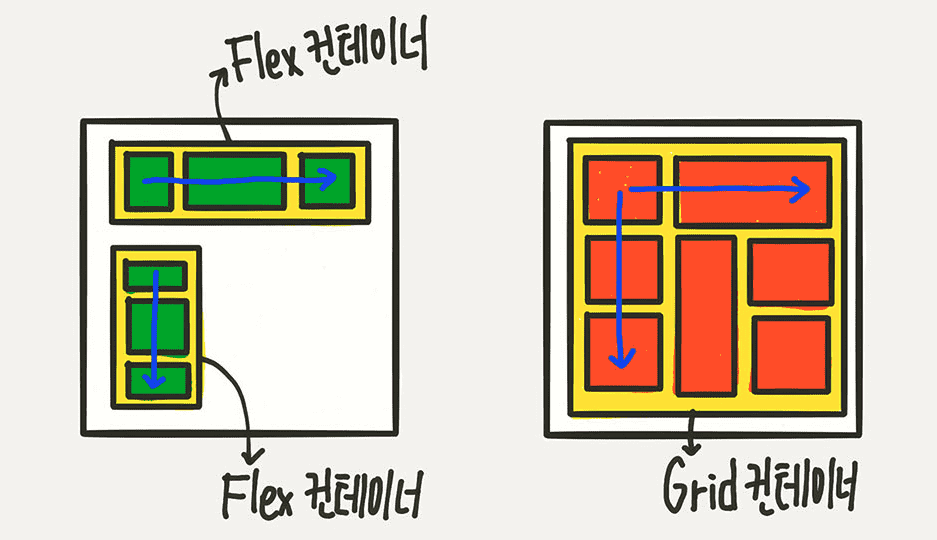


## 2. 용어


## 3. Container - display

우선, Flex를 사용하기 위해서 배치하려는 요소(Grid Item)를 감싸는 **Grid Container(부모 요소)** 를 Grid로 만들어야합니다. **display: grid;** 로 선언.

```css
container {
	display: grid;
  /* display: inline-grid */
}
```

부모 요소가 inline인 경우 **display: inline-grid;** 를 지정해 Container와 주변 요소 정렬을 도모합니다. 


## 4. Grid Container 속성 
### 1) grid-template-rows, grid-template-columns

```css
container {
  grid-template-columns: 200px 200px 500px;
}
```
  
  .png)


```css
container {
  grid-template-columns: 100px 2fr auto;
}
```

.png)


### repeat 함수. 열 반복 처리
**repeat(반복횟수, 반복값)**
'fr'은 "fraction"의 약자입니다. 한글로는 "나눈조각", "분수"라는 뜻입니다.  

```css
container {
  /* grid-template-columns: 1fr 1fr 1fr; */
  /* grid-template-columns: repeat(3, 1fr); */
  grid-template-columns: repeat(3, 60px); 
}
```

.png)


### minmax 함수 열 너비 제한 조절
**minmax(최소 너비, 최대 너비)**
열 안에 표시할 컨텐츠가 최소 너비를 보장해야 하는 경우 또는 컨텐츠 좌우의 여백이 너무 많아지는 것을 원하지 않는 경우에 사용해서 셀의 너비 범위를 제한할 수 있습니다. 

```css
container {
  grid-template-rows: repeat(3, minmax(100px, auto));
}
```

### 열 개수 자동 맞춤 auto-fill과 auto-fit
웹 브라우저 너비에 맞춰서 열의 너비와 개수가 자동으로 조절되도록 하는 기능입니다. 

### 2) 간격 만들기 row-gap, cloumn-gap, gap
그리드 셀 사이 간격을 설정합니다. 

|속성|설명|
|---|---|
|gap|행과 열 사이의 여백 설정. padding, margin처럼 속성 값을 1개만 정의하면 행과 열에 같은 여백 값이 적용. 2개 정의하면 행과 열 여백 값이 적용됩니다.|
|grid-rows-gap|행 사이의 여백 설정|
|grid-column-gap|열 사이의 여백 설정|


```css
container {
	/* row의 간격을 10px로 */
	row-gap: 10px;
	/* column의 간격을 20px로 */
	column-gap: 20px;
}
```

```css
container {
  /* row-gap: 10px; column-gap: 20px; */
	gap: 10px 20px;
}
```

.png)


```css
.container {
	/* row-gap: 2rem; column-gap: 2rem; */
	gap: 2rem;
}
```

.png)

### 3) 영역 이름으로 그리드 정의 grid-template-areas
각 셀마다 차지하는 개수만큼 해당 위치에 이름을 써주고 공백으로 구분합니다. 빈칸은 온점(.)으로 표시합니다.
영역 이름을 정하는 규칙은 다음과 같습니다.
- 이름은 CSS 클래스명을 정하는 규칙을 사용해야 합니다.
- 영역 이름은 페이지 안에서 유일해야 합니다.
- 영역은 페이지 안에서 중복 사용할 수 있습니다. 

✨ **예시**

```html
<!DOCTYPE html>
<html lang="en">
<head>
  <style>
    .container {
      width: 400px;
      height: 400px;
      padding:10px;
      background-color: royalblue;

      display: grid;
      grid-gap:10px;
      grid-template-columns: repeat(5, 1fr);
      grid-template-rows: repeat(3, 1fr);
      grid-template-areas: 
        "h h h h h"
        "m m m s s"
        "f f f f f";
    }

    .item {
      padding: 10px 0;
      background-color: lightcyan;
      font-size: 30px;
    }

    .header {
      grid-area: h;
    }

    .main {
      grid-area: m;
    }

    .sidebar {
      grid-area: s;
    }

    .footer {
      grid-area: f
    }
  </style>
</head>
<body>
  <div class="container">
    <div class="item header">header</div>
    <div class="item main">main</div>
    <div class="item sidebar">sidebar</div>
    <div class="item footer">footer</div>
  </div>
</body>
</html>
```

🧪 **실행결과**

.png)


```css
.container {
  display: grid;
  grid-gap:10px;
  grid-template-columns: repeat(5, 1fr);
  grid-template-rows: repeat(3, 1fr);
  grid-template-areas: 
    "h h h h ."
    "m m m . s"
    "f f f f f";
}
```

.png)


### 4) 그리드 형태를 자동으로 정의 grid-auto-rows,  grid-auto-columns
grid-template-rows, grid-template-columns 는 미리 열과 행의 개수를 알아야 한다는 선제 조건이 있습니다. 이후 들어갈 행과 열의 개수를 모르는 경우 **grid-auto-rows** ,  **grid-auto-columns** 를 사용 합니다. 

- grid-template: 암시적
- grid-auto: 명시적


```css
container {
  grid-template-rows: 30px 80px 130px;
  grid-template-columns: repeat(3, 1fr);
  
  grid-auto-rows: 108px;
}
```

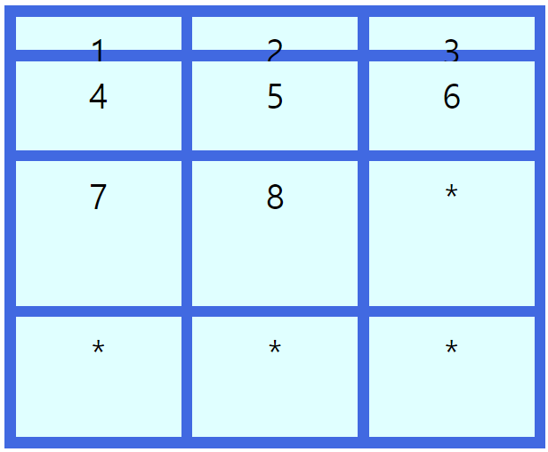


### 5) 자동 배치 grid-auto-flow
Item들의 배치 방향을 결정합니다. 기본값은 row.


```css
.container {
  display: grid;
  grid-gap: 10px;
  grid-template-columns: repeat(3, 1fr);
  grid-template-rows: repeat(3, 1fr);
  grid-auto-flow: row;
}
```


```css
.container {
  display: grid;
  grid-gap: 10px;
  grid-template-columns: repeat(3, 1fr);
  grid-template-rows: repeat(3, 1fr);
  grid-auto-flow: column;
}
```

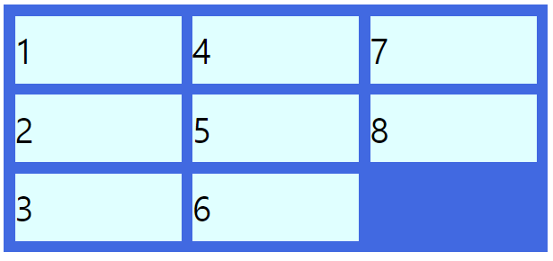


```css
.container {
  display: grid;
  grid-gap: 10px;
  grid-template-columns: repeat(3, 1fr);
  grid-template-rows: repeat(3, 1fr);
  grid-auto-flow: row dense;
}

.itm:nth-child(2) {
  grid-column: span 3
}
```

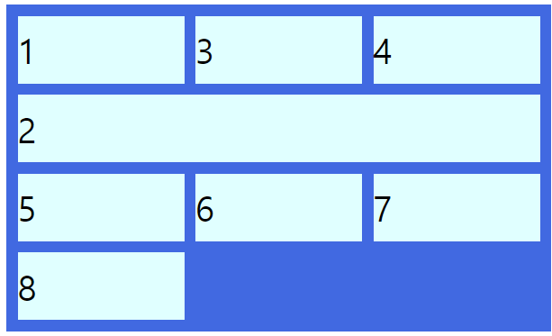


```css
.container {
  display: grid;
  grid-gap: 10px;
  grid-template-columns: repeat(3, 1fr);
  grid-template-rows: repeat(3, 1fr);
  grid-auto-flow: row;
}

.itm:nth-child(2) {
  grid-column: span 3
}
```

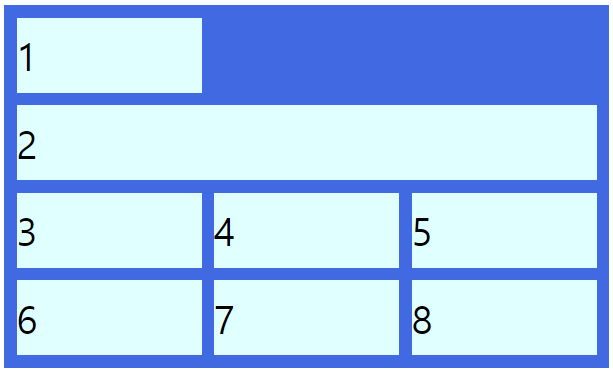


### 6) grid
grid: grid-template-rows grid-template-columns grid-template-areas 


## 5. Grid Container 정렬
### 1) justify-content (주축 방향 정렬)
선행 조건이 Container 너비가 Item 너비 합한 값보다 커야 Item들을 정렬할 수 있습니다. 

```css
justify-content: start;
```


```css
justify-content: end;
```

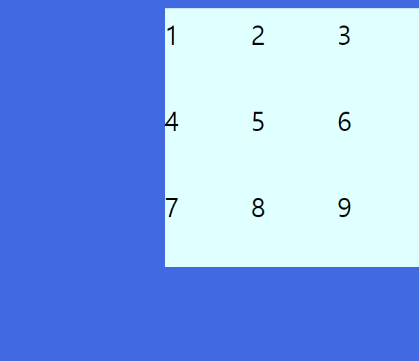


```css
justify-content: center;
```

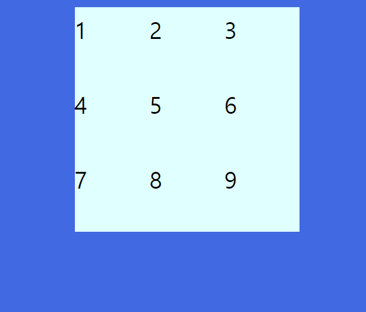


```css
justify-content: space-between;
```

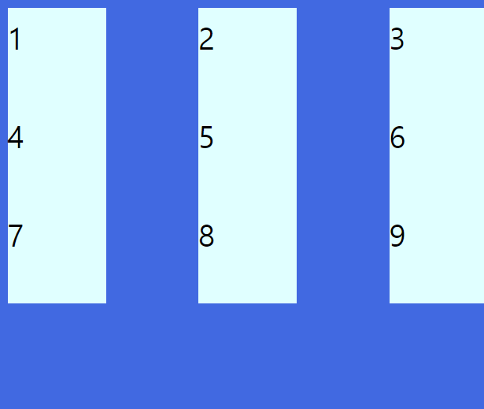


```css
justify-content: space-around;
```

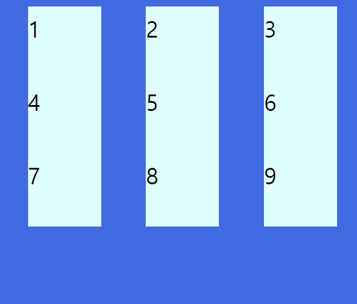


### 2) align-content (교차축 방향 정렬)
선행 조건이 Container 높이가 Item 높이 합한 값보다 커야 Item들을 정렬할 수 있습니다. 


```css
align-content: start;
```

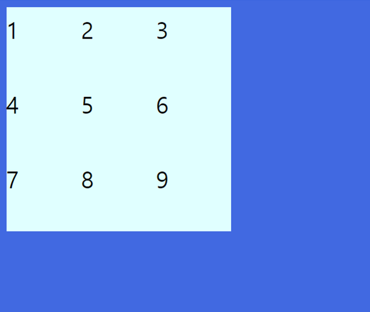


```css
align-content: end;
```

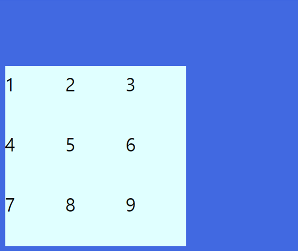


```css
align-content: center;
```

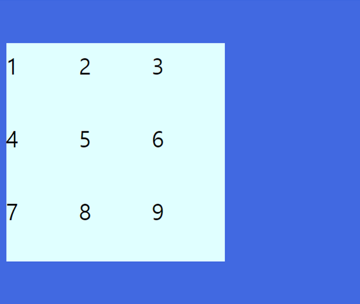


```css
justify-content: center;
align-content: center;
```


```css
align-content: space-between;
```

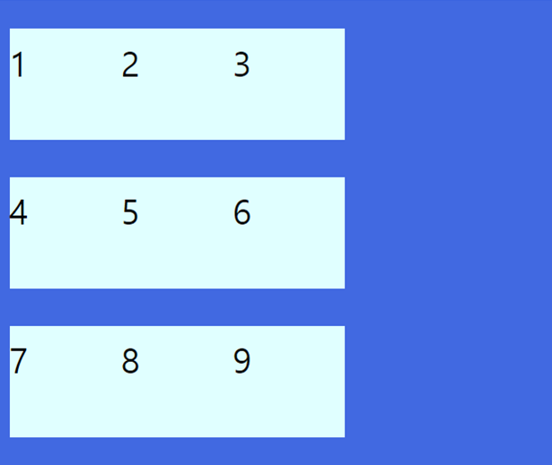


```css
align-content: space-around;
```

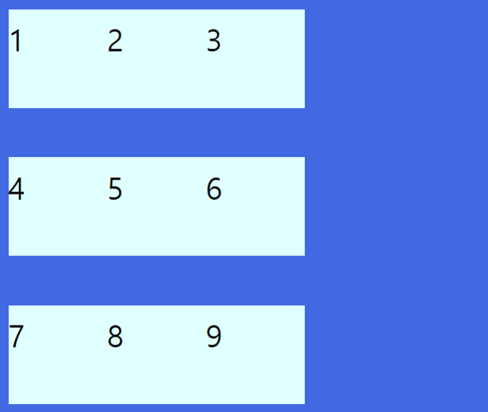


## 6. Grid Item 속성 
### 1) 각 셀의 영역 지정 grid-row-start grid-column-start grid-row-end grid-column-end

start가 시작 번호, end가 끝 번호입니다. 

```css
.item:first-child {
  grid-column-start: 1;
	grid-column-end: 2;
	grid-row-start: 1;
	grid-row-end: 3;
}
```

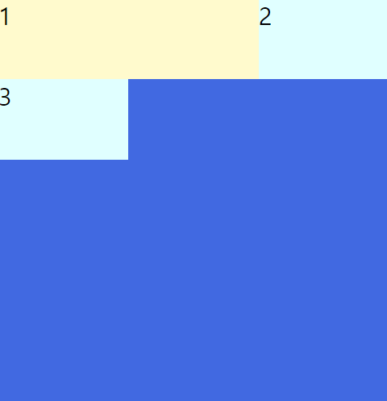

몇 개의 셀을 차지할지 지정

```css
.item:first-child {
  background-color: lightslategrey;
  grid-row: 4 / span 2;
  grid-column: 2 / -1;
}
```

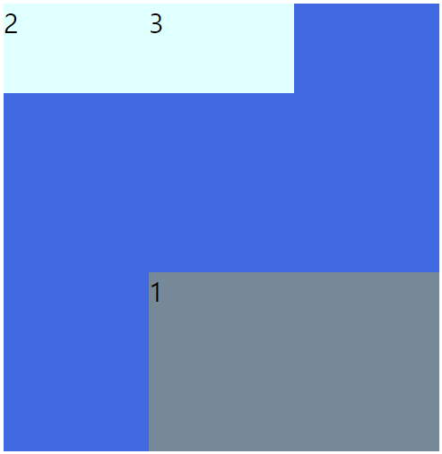


### 2) grid-area
grid-area: grid-row-start grid-column-start grid-row-end grid-column-end

start와 end 속성을 한번에 쓰는 축약형입니다.

```css
  .item:first-child {
    background-color: lemonchiffon;
    grid-row: 1 / 2;
    grid-column: 1 / 3;
  }
```

몇 개의 셀을 차지할지 지정할지 한번에 쓰는 축약형입니다.

```css
.item:first-child {
  grid-area: 4 / 2 / span 2 / -1
}
```

### 3) 배치 순서 order

각 Item들의 "시각적" 나열 순서를 결정하는 속성이예요. 초기값 0. 자료형 정수.


### 4) z-index
z-index로 Z축 정렬을 할 수 있어요. 숫자가 클 수록 위로 올라옵니다.


(CSS Flex와 Grid 제대로 익히기)[https://www.inflearn.com/course/css-flex-grid-%EC%A0%9C%EB%8C%80%EB%A1%9C-%EC%9D%B5%ED%9E%88%EA%B8%B0]