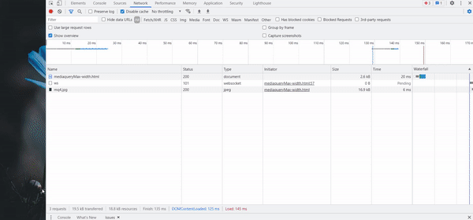
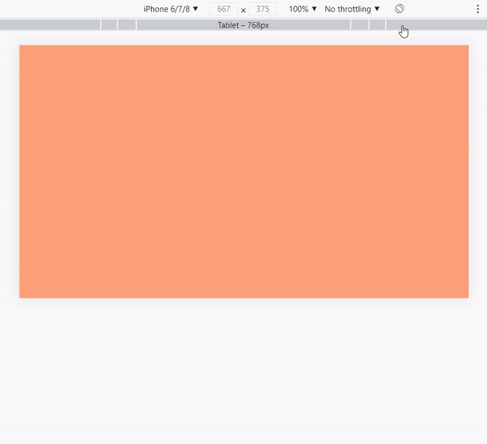
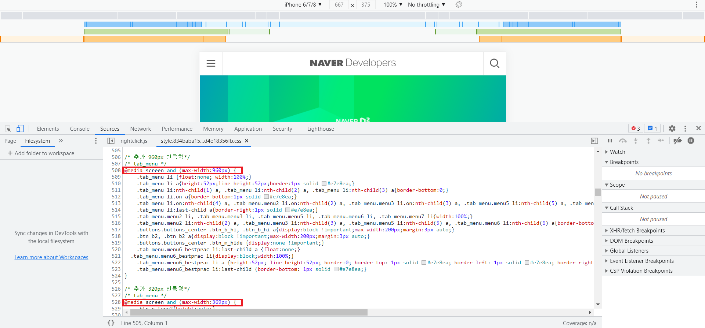

# 미디어 쿼리
## 1. 미디어 쿼리란? 
미디어 쿼리를 사용하면 접속하는 기기의 화면 크기에 따라 레이아웃이 달라집니다. 

## 2. 미디어 쿼리 구문

```css
@media [only | not] 미디어 유형 [and 조건] * [and 조건]
```

미디어 유형이 지정되어야 하고 필요한 경우 and 연산자로 조건을 적용합니다. 

```css
@media screen and (min-width:200px) and (max-width:360px){...}
```


|연산자|설명|
|---|---|
|and|앞의 소스처럼 조건을 계속 추가할 수 있습니다.|
|,(쉼표)|동일한 스타일 유형을 사용할 미디어의 유형과 조건이 있다면 쉼표를 이용해서 추가합니다.|
|only|이 키워드를 사용하면 미디어 쿼리를 지원하지 않는 웹 브라우저에서는 미디어 쿼리를 무시하고 실행하지 않습니다.|
|not|not 다음에 지정하는 미디어 유형을 제외합니다.|

### 1) 미디어 유형의 종류
|미디어 유형|사용 가능한 미디어|
|---|---|
|all|모든 미디어 유형|
|print|인쇄 장치|
|screen|컴퓨터 스크린(스마트폰 스크린 포함)|

## 3. 미디어 쿼리의 조건
주로 화면 크기와 관련된 조건이 많습니다. 

### 1) 웹 문서의 가로 너비와 세로 높이
실제 웹 문서의 내용이 화면에 보이는 영역을 '뷰포트(Viewport)'라고 하는데 뷰포트의 너비와 높이를 미디어 쿼리의 조건으로 사용할 수 있습니다. 이때 height(높이) 값은 미디어에 따라 달라지기 때문에 주의해야 합니다.

|가로, 세로 값 설정하는 속성|설명|
|---|---|
|width, height|웹 페이지의 가로 너비, 세로 높이|
|min-width, min-height|최소 너비, 최소 높이|
|max-width, max-height|최대 너비, 최대 높이|

```css
/* 뷰포트 너비가 600px 이상이고 959px 이하 */
@media all (min-width:600px) and (max-width:959px){...}
```

미디어 쿼리를 이용하면 max-width 값(브라우저 창의 최대 너비 값)에 따라 문서의 배경이미지가 달라지도록 미디어 쿼리 구문을 구성할 수 있습니다. 


✨ **예시**

```css
body{
  background: url(./images/mq1.jpg) no-repeat fixed;
  background-size: cover;
}

@media screen and (max-width:1024px) {
  body{
    background: url(./images/mq2.jpg) no-repeat fixed;
    background-size: cover;
  }
}

@media screen and (max-width:768px) {
  body{
    background: url(./images/mq3.jpg) no-repeat fixed;
    background-size: cover;
  }
}

@media screen and (max-width:320px) {
  body{
    background: url(./images/mq4.jpg) no-repeat fixed;
    background-size: cover;
  }
}
```

🧪 **실행결과**




### 2) 단말기의 가로 너비와 세로 높이
주의할 점은 대부분의 단말기들은 단말기 해상도와 실제 브라우저의 너비가 다릅니다. 예를 들어 아이폰 4의 해상도는 640 x 960이지만 아이폰 4의 사파리 브라우저의 너비는 620 x 480 입니다. 단말기 너비나 높이를 고려해 미디어 쿼리를 작성해야 한다면 다음과 같은 속성을 사용합니다. 

|단말기의 가로, 세로 값을 설정하는 속성|설명|
|---|---|
|device-width, device-height|단말기의 가로 너비, 세로 높이|
|min-device-width, min-device-height|단말기의 최소 너비, 최소 높이|
|max-device-width, max-device-height|단말기의 최대 너비, 최대 높이|


```css
/* 단말기 너비가 320px 이상이고 높이가 480px 이상 */
@media all and (min-device-width:320px) and (min-device-height:480px){...}
```

단말기 크기와 뷰포트 크기를 하나로 통일해 사용하기 위해 뷰포트를 지정할 때 width="device-width"로 놓고 사용합니다.

### 3) 화면 회전
미디어 쿼리를 작성할 경우, orientation 속성을 사용하면 화면 방향을 체크할 수 있습니다. 

|속성|설명|
|---|---|
|orientation: portrait|단말기 세로 방향|
|orientation: landscape|단말기 가로 방향|


✨ **예시**

```css
body{
  background-color: #eee;
}

@media screen and (orientation: landscape) {
  body { 
    background-color: lightsalmon;
  }
}

@media screen and (orientation: portrait) {
  body { 
    background-color: lightsteelblue;
  }
}
```

🧪 **실행결과**




### 4) 화면 비율, 단말기의 물리적 화면 비율
화면 비율은 뷰포트 즉 단말기 브라우저 화면의 너비 값(width)을 높이 값(height)으로 나눈 것으로 숫자 값이나 계산식을 사용할 수 있습니다. 

|속성|설명|
|---|---|
|aspect-ratio|화면 비율(width 값 / height 값)|
|min-aspect-ratio|최소 화면 비율|
|max-aspect-ratio|최대 화면 비율|

반면, 단말기 화면 비율은 단말기의 너비 값(device-width)과 높이 값(device-height)을 이용해 계산합니다. 
|속성|설명|
|---|---|
|device-aspect-ratio|단말기 화면 비율(width 값 / height 값)|
|min-device-aspect-ratio|단말기 최소 화면 비율|
|max-device-aspect-ratio|단말기 최대 화면 비율|


```css
/* 화면 비율이 16:9 */
@media all and (device-aspect-ratio:16/9) {...}

/* 화면 비율이 16:9 이상 */
@media all and (min-device-aspect-ratio:16/9) {...}

/* 화면 비율이 16:9 이하 */
@media all and (max-device-aspect-ratio:16/9) {...}
```

## 4. 외부 CSS 파일 연결하기 
### 1) `<link>` 태그 사용하기
외부 스타일 시트 파일을 연결할 때 `<link>` 태그를 이용하는 방법을 가장 많이 사용합니다. 

```html
<link rel="stylesheet" media="미디어 쿼리 조건" href="css 파일 경로">
```

```html
<link rel="stylesheet" media="screen and (max-width:768px)" href="css/tablet.css">
```

### 2) @import 구문 사용하기
CSS를 정의하는 `<style></style>` 사이에 사용합니다. 

```css
@import url(css 파일 경로) 미디어 쿼리 조건
```

```css
@import url("css/tablet.css") only screen and (min-width:321px) and (max-width:768px);
```

💡 [참고] @import 구문보다 `<link>` 태그가 안정적이고 빠르기 때문에 `<link>` 태그 권장


### 3) 실제 사이트에서 미디어 쿼리 확인하기
네이버 개발자 센터(https://developers.naver.com/) 접속.

막대들이 보이지 않는다면 More options 아이콘을 클릭한 후 [show media queries] 메뉴를 선택합니다. 파란색 막대는 min-width 속성을 사용해 최소 너비를 지정했을 때, 주황색 막대는 max-width 속성을 사용해 최대 너비를 지정했을 때 그리고 중간에 표시도니 초록색 막대는 min-width와 max-width 속성을 모두 사용해 미디어 쿼리를 적용했을 때 나타납니다.




## 참고 자료 및 강의📑
- HTML5 + CSS3 웹 표준의 정석 도서
- [미디어 쿼리를 이용한 제작된 사이트들을 모아 놓은 곳](http://mediaqueri.ex)
- [다양한 모바일 기기의 뷰포트 크기 확인](http://viewportsizes.com/)