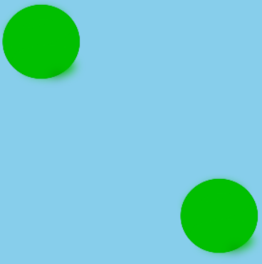
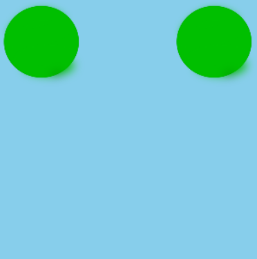
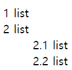
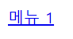

## 1. class="check"로 되어 있는 모든 `<input="checkbox">` 요소의 스타일을 선택하는 Selector

**정답:** input[type="checkbox"].check


## 2. `<a>` 태그 밑줄 제거 style 인라인 태그 
**정답:** style="text-decoration:none"


## 3. 그림과 같이 오른쪽 하단으로 보내기


**🧸 문제 코드**
```html
<head>
  <style>
  .flex {
    width: 300px; 
    height: 300px;
    display: flex;
    justify-content: space-between;
    background: skyblue;
  }

  /* 답 CSS */

  </style>
</head>
<body>
  <div class="flex">
    <span>
    
    </span>
    <div>
    
    </div>
    </div>
</body>
```

**정답:** div:nth-child(2) { align-self : flex-end; }


**👔 해설**


오른쪽 원 하나만 교차축의 끝점을 기준으로 배치합니다.

## 4. 그림과 같이 자동으로 번호 매기기



**🧸 문제 코드**
```html
<head>
  <style>
    ol { 
      counter-reset: list; 
      list-style-type: none; 
    } 

    li::before { 
      content: [A] (list, '.') ' '; 
      [B]: list; 
    }
  </style>
</head>
<body>
  <ol>
    <li>list</li>
    <li>list</li>
    <ol>
      <li>list</li>
      <li>list</li>
    </ol> 
  </ol>
</body>
```


**👔 해설**
```css
  ol {
    counter-reset: section;     /* ol 요소마다 이름이 section인 새 인스턴스를 생성합니다. */
    list-style-type: none;
  }

  li::before {
    content: counters(section, ".") " ";   /* section 카운터 값을 마침표(.)로 구분해 결합하여 표시합니다. */
    counter-increment: section;            /* 해당 인스턴스 안에서 section 카운터 값 증가 */
  }
  </style>
```


## 5. @media query types
- all: 모든 장치에 적합합니다.
- print: 인쇄 미리 보기 모드에서 화면에 표시되는 페이지 자료 및 문서용입니다. 
- screen: 주로 화면용입니다.
- speech: 음성 합성기를 위한 것입니다.


## 6. Async와 Defer 속성 차이
async와 defer 모두 비동기 방식으로 병렬 파싱합니다. 
- async는 스크립트가 사용 가능할 때는 즉시 실행합니다. 실행 순서가 보장되지 않습니다.
- defer는 전체 문서가 파싱된 후에 스크립트가 실행됩니다. 실행 순서가 보장됩니다. 


## 7. white-space 속성
- normal: 연속된 모든 공백을 하나로 통합 후 자동 줄바꿈 출력
- nowrap:  연속된 모든 공백을 하나로 통합 후, 가로 한 줄로 출력.
- pre: 입력된 공백과 줄바꿈 상태 보전.
- pre-line: 라인 공백만 보전한 채, 줄바꿈 시켜 출력
- pre-wrap: 모든 공백 보전한 채로, 자동 줄바꿈 출력


## 8. a 태그의 글자 색상

```html
<head>
  <style>
    header {
      color: red;
    }
  </style>
</head>
<body>
  <header>
    <a href="#">메뉴 1</a>
  </header>
</body>
```




## 9. CSS 우선순위


[중첩 카운터](https://developer.mozilla.org/ko/docs/Web/CSS/CSS_Lists_and_Counters/Using_CSS_counters)
[script async 와 defer의 차이점 및 앞으로 자바스크립트 공부 방향](https://www.youtube.com/watch?v=tJieVCgGzhs&t=855s)
[CSS - white-space 속성](https://homzzang.com/b/css-89)