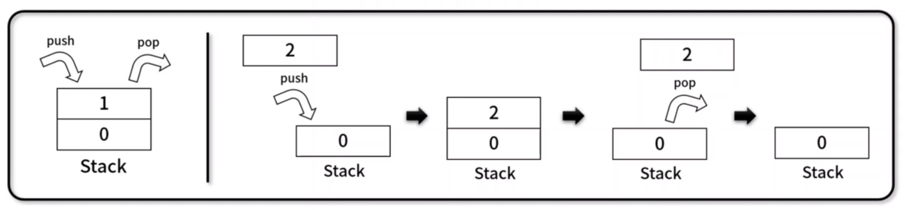
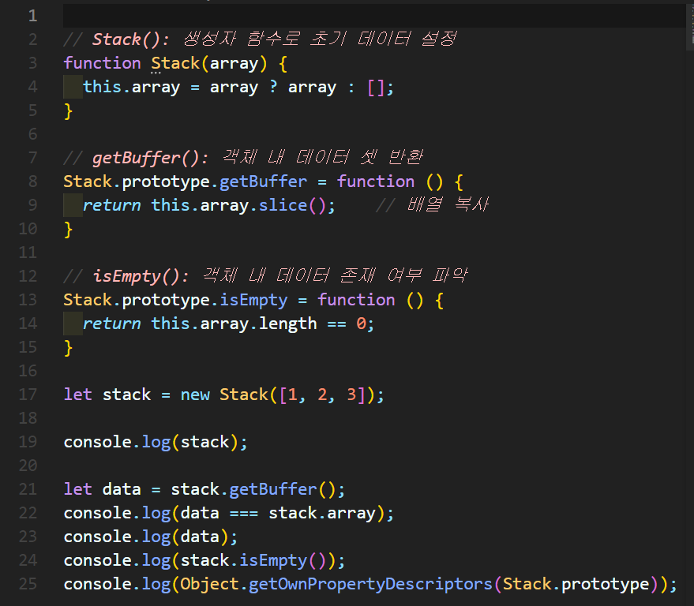
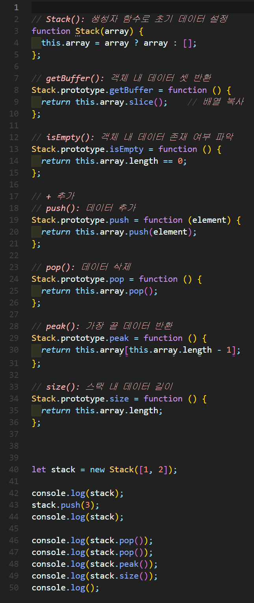
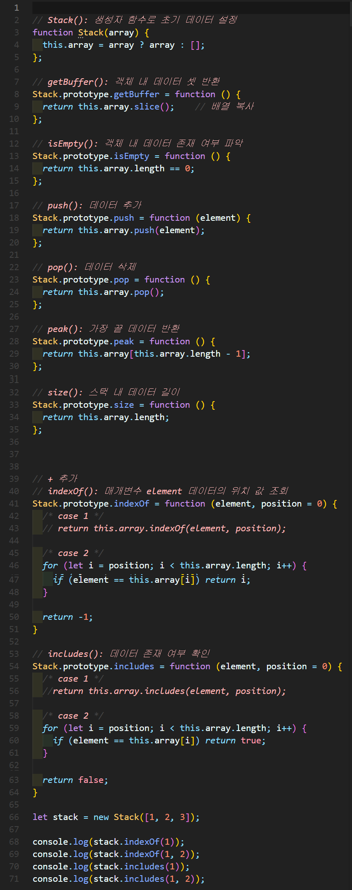

# 스택(Stack)
나중에 넣은 데이터가 먼저 나오는 **LIFO(Last In First Out)** 기반의 선형 자료 구조

- 배열과 함께 자료구조에서 많이 쓰이는 자료구조
- 예시) `ctrl + z` 기능, 브라우저 뒤로가기 기능




## 1. 스택 구현


### 🧪 실행결과


``` javascript
Stack { array: [ 1, 2, 3 ] }
false
[ 1, 2, 3 ]
false
{
  constructor: {
    value: [Function: Stack],
    writable: true,
    enumerable: false,       
    configurable: true       
  },
  getBuffer: {
    value: [Function (anonymous)],
    writable: true,
    enumerable: true,
    configurable: true
  },
  isEmpty: {
    value: [Function (anonymous)],
    writable: true,
    enumerable: true,
    configurable: true
  }
}
```

## 2. 스택 구현



### 🧪 실행결과

``` javascript
Stack { array: [ 1, 2 ] }
Stack { array: [ 1, 2, 3 ] }
3
2
1
1
```


## 3. 스택 구현


### 🧪 실행결과


``` javascript
0
-1
true
false
```


