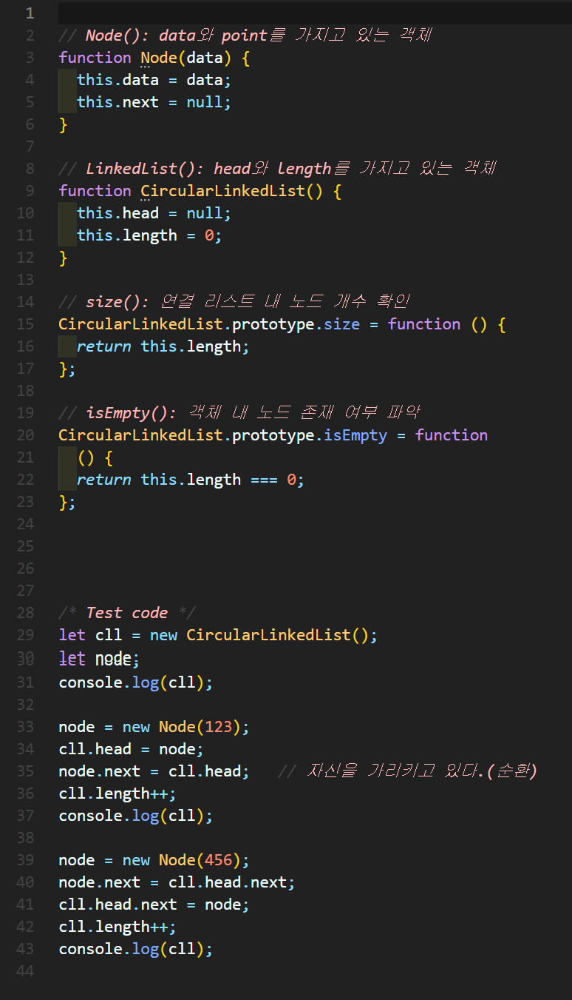
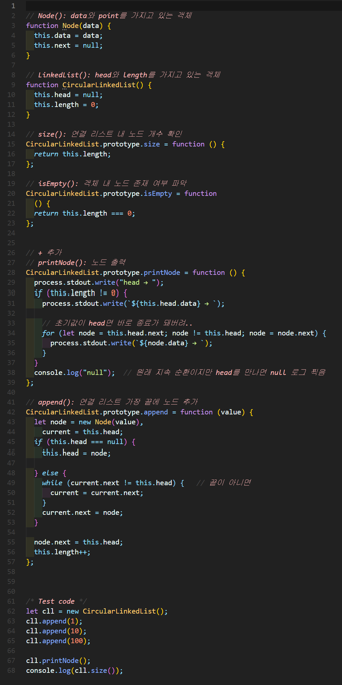
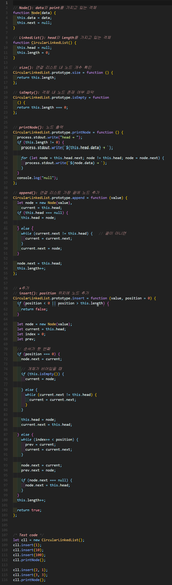
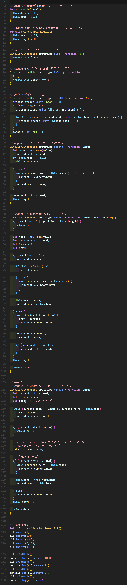
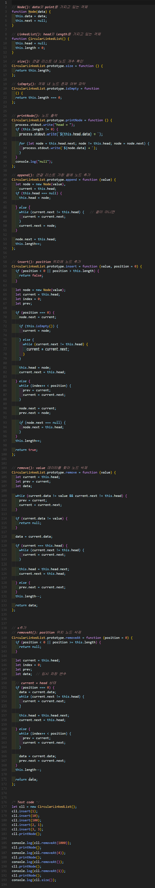
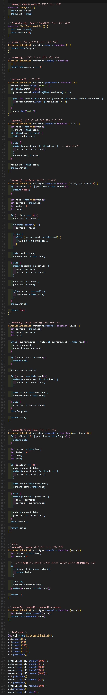

# 원형 연결 리스트(Circle linked List)
각 노드가 데이터와 포인터를 가지며, **원형 형태**로 연결되어 있는 방식으로 데이터를 저장하는 자료 구조

- 마지막 노드는 head를 갖는 노드를 가리킵니다.


## 1. 원형 연결 리스트 구현


### 🧪 실행결과


``` javascript
CircularLinkedList { head: null, length: 0 }
CircularLinkedList {
  head: <ref *1> Node { data: 123, next: [Circular *1] },
  length: 1
}
CircularLinkedList {
  head: <ref *1> Node {
    data: 123,
    next: Node { data: 456, next: [Circular *1] }
  },
  length: 2
}
```

## 2. 원형 연결 리스트 구현



### 🧪 실행결과

``` javascript
head → 1 → 10 → 100 → null
3
```


## 3. 원형 연결 리스트 구현


### 🧪 실행결과


``` javascript
head → 100 → 10 → 1 → null
head → 100 → 2 → 10 → 3 → 1 → null
```


## 4. 원형 연결 리스트 구현



### 🧪 실행결과


``` javascript
head → 100 → 2 → 10 → 3 → 1 → null
null
head → 100 → 2 → 10 → 3 → 1 → null
1
head → 100 → 2 → 10 → 3 → null
2
head → 100 → 10 → 3 → null
100
head → 10 → 3 → null
2
```


## 5. 원형 연결 리스트 구현



### 🧪 실행결과


``` javascript
head → 100 → 2 → 10 → 3 → 1 → null
null
head → 100 → 2 → 10 → 3 → 1 → null
1
head → 100 → 2 → 10 → 3 → null
100
head → 2 → 10 → 3 → null
10
head → 2 → 3 → null
2
```


## 6. 원형 연결 리스트 구현



### 🧪 실행결과


``` javascript
head → 100 → 2 → 10 → 3 → 1 → null
-1
4
0
2
null
head → 100 → 2 → 10 → 3 → 1 → null
1
head → 100 → 2 → 10 → 3 → null
2
head → 100 → 10 → 3 → null
100
head → 10 → 3 → null
2
```