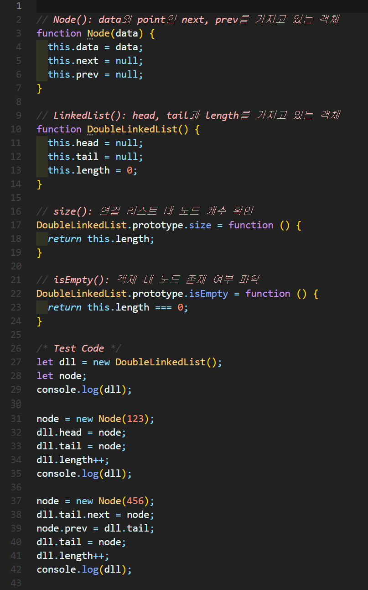
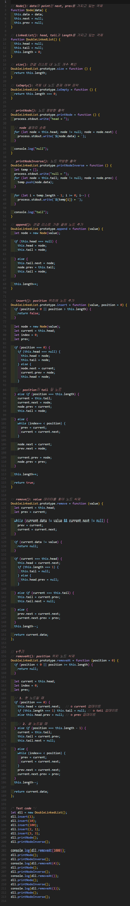
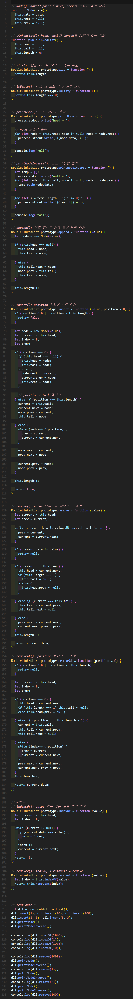

# 이중 연결 리스트(Double linked List)
각 노드가 데이터와 포인터를 가지며, **두 줄**로 연결되어 있는 방식으로 데이터를 저장하는 자료 구조

- prev 포인터가 추가됨
- 이전 객체 접근에 가능
- 뒤에서 탐색이 가능

## 1. 이중 연결 리스트 구현


### 🧪 실행결과


``` javascript
DoubleLinkedList { head: null, tail: null, length: 0 }
DoubleLinkedList {
  head: Node { data: 123, next: null, prev: null },
  tail: Node { data: 123, next: null, prev: null },
  length: 1
}
DoubleLinkedList {
  head: <ref *1> Node {
    data: 123,
    next: Node { data: 456, next: null, prev: [Circular *1] },
    prev: null
  },
  tail: <ref *2> Node {
    data: 456,
    next: null,
    prev: <ref *1> Node {
      data: 123,
      next: [Circular *2],
      prev: null
    }
  },
  length: 2
}
```

## 2. 이중 연결 리스트 구현


### 🧪 실행결과

### 🍒 풀이


``` javascript
head → 1 → 10 → 100 → null
null ← 1 ← 10 ← 100 ← tail
```


## 3. 이중 연결 리스트 구현


### 🧪 실행결과


``` javascript
head → 100 → 10 → 1 → null
null ← 100 ← 10 ← 1 ← tail
head → 100 → 2 → 10 → 3 → 1 → null
null ← 100 ← 2 ← 10 ← 3 ← 1 ← tail
```


## 4. 이중 연결 리스트 구현


### 🧪 실행결과


``` javascript
head → 100 → 2 → 10 → 3 → 1 → null
null ← 100 ← 2 ← 10 ← 3 ← 1 ← tail
null
head → 100 → 2 → 10 → 3 → 1 → null
null ← 100 ← 2 ← 10 ← 3 ← 1 ← tail
1
head → 100 → 2 → 10 → 3 → null
null ← 100 ← 2 ← 10 ← 3 ← tail
2
head → 100 → 10 → 3 → null
null ← 100 ← 10 ← 3 ← tail
100
head → 10 → 3 → null
null ← 10 ← 3 ← tail
```


## 5. 이중 연결 리스트 구현



### 🧪 실행결과


``` javascript
head → 100 → 2 → 10 → 3 → 1 → null
null ← 100 ← 2 ← 10 ← 3 ← 1 ← tail
null
head → 100 → 2 → 10 → 3 → 1 → null
null ← 100 ← 2 ← 10 ← 3 ← 1 ← tail
1
head → 100 → 2 → 10 → 3 → null
null ← 100 ← 2 ← 10 ← 3 ← tail
100
head → 2 → 10 → 3 → null
null ← 2 ← 10 ← 3 ← tail
10
head → 2 → 3 → null
null ← 2 ← 3 ← tail
```


## 6. 이중 연결 리스트 구현



### 🧪 실행결과


``` javascript
head → 100 → 2 → 10 → 3 → 1 → null
null ← 100 ← 2 ← 10 ← 3 ← 1 ← tail
-1
4
0
2
null
head → 100 → 2 → 10 → 3 → 1 → null
null ← 100 ← 2 ← 10 ← 3 ← 1 ← tail
1
head → 100 → 2 → 10 → 3 → null
null ← 100 ← 2 ← 10 ← 3 ← tail
2
head → 100 → 10 → 3 → null
null ← 100 ← 10 ← 3 ← tail
100
head → 10 → 3 → null
null ← 10 ← 3 ← tail
2
```