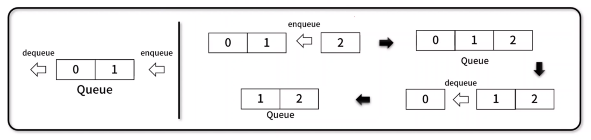
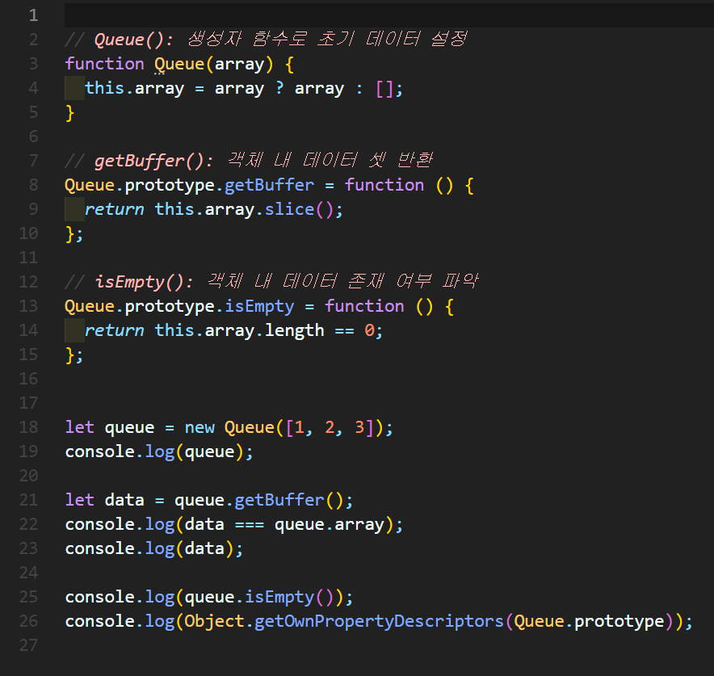
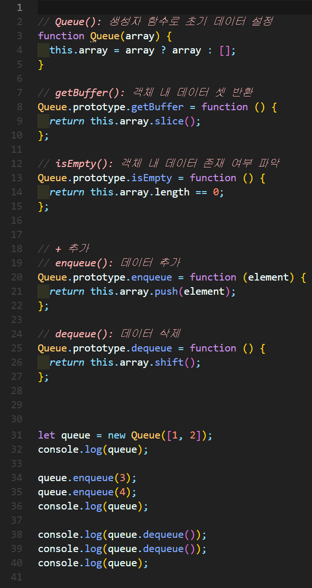
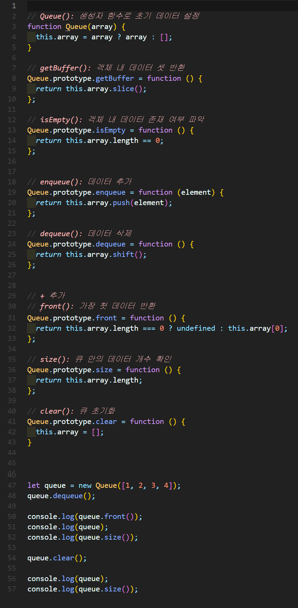

# 큐(Queue)
나중에 넣은 데이터가 먼저 나오는 **FIFO(First In First Out)** 기반의 선형 자료 구조

- 예시) 시간 순서로 먼저 들어온게 먼저 처리됩니다.




## 1. 스택 구현


### 🧪 실행결과


``` javascript
Queue { array: [ 1, 2, 3 ] }
false
[ 1, 2, 3 ]
false
{
  constructor: {
    value: [Function: Queue],
    writable: true,
    enumerable: false,
    configurable: true
  },
  getBuffer: {
    value: [Function (anonymous)],
    writable: true,
    enumerable: true,
    configurable: true
  },
  isEmpty: {
    value: [Function (anonymous)],
    writable: true,
    enumerable: true,
    configurable: true
  }
}
```

## 2. 스택 구현



### 🧪 실행결과

``` javascript
Queue { array: [ 1, 2 ] }
Queue { array: [ 1, 2, 3, 4 ] }
1
2
Queue { array: [ 3, 4 ] }
```


## 3. 스택 구현


### 🧪 실행결과


``` javascript
2
Queue { array: [ 2, 3, 4 ] }
3
Queue { array: [] }
0
```


