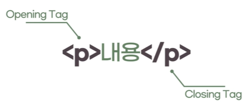

# HTML이란?

## 1. HTML은 어떻게 생겼을까?

- 웹 페이지를 구성하고 있는 <strong>요소(element)</strong> 하나하나를 <strong>'태그'</strong>라는 표기법을 작성
- 태그를 통해 어떤 요소인지 (제목, 본문, 이미지, 비디오 등) 명시
- HTML 요소는 여는 태그와 닫는 태그 사이에 위치한 content로 구성됩니다.



> 1.  여는 태그(Opening tag): <요소의 이름>
> 2.  닫는 태그(Closing tag): </요소의 이름>
> 3.  내용(Content): 요소의 내용
> 4.  요소(Element): 여는 태그, 닫는 태그, 내용을 통틀어 요소(element)라고 한다.

웹 페이지(HTML document)는 요소(Element)들의 집합을 이루어집니다.

## 2. 빈 요소(Empty Element)

내용(content)을 가질 수 없는 요소를 빈 요소라 부르고 이 경우 닫는 태그를 추가로 명시하지 않아도 됩니다.
빈 요소 중 대표적인 요소는 아래와 같다.

- br
- hr
- img
- input
- link
- meta

✨ **예시**

```html
<br />
<hr />

<meta charset="utf-8" />
<input type="text" name="name" />
```

## 3. 요소의 중첩(Nested Element)

요소는 중첩될 수 있습니다. 여러 요소가 중첩될 경우에는 열린 순서의 **반대**로 닫혀야만 합니다. 서로의 **포함관계(부자관계)**를 구분하기 위하여 **들여쓰기**를 사용합니다.
부모 태그 안에 자식태그가 들어가 있어야합니다. 자식 태그가 모두 닫히고 부모 태그가 닫히는 형태입니다. 이런 **포함관계(부자관계)**를 시각적으로 파악하기 쉽게 **indent(들여쓰기)**를 활용합니다.

✨ **예시**

```html
<ul>
  <li>하나</li>
  <li>둘</li>
  <li>셋</li>
</ul>
```

HTML문법상 들여쓰기가 필요하진 않지만, 가독성을 위해 들여쓰기를 씁니다.
태그 안의 내용으로는 첫번째는 **태그**이고 두번째는 **다른 요소**가 될 수 있습니다.

## 4. 주석

코드에 메모를 추가하거나, 혹은 사용하지 않는 코드를 임시로 처리하기 위함입니다.

<!-- 안녕하세요 -->

## 5. HTML 문서의 구조

어떤 HTML 문서를 열어도 필수적으로 가지고 있는 태그들입니다.

✨ **예시**

```html
<!DOCTYPE html>
<html>
  <head>
    <meta charset="utf-8" />
    <title>Hello World</title>
  </head>
  <body>
    <h1>Hello World</h1>
    <p>안녕하세요! HTML5</p>
  </body>
</html>
```

- `<!DOCTYPE html>`: HTML5 문서는 반드시 `<!DOCTYPE html>`으로 시작하여 문서 형식(document type)을 HTML5로 지정한다.
- `html`: 하나의 HTML 문서에 하나만 있다. html 태그는 모든 HTML 요소의 부모 요소이며 웹페이지에 단 하나만 존재합니다. 즉, 모든 요소는 html 요소의 자식 요소이며 html 요소 내부에 기술해야 합니다.. 단 `<!DOCTYPE>`는 예외
  - `head`: head 요소는 메타데이터를 포함하기 위한 요소이며 웹페이지에 단 하나만 존재합니다.
    - `meta`: 문서의 일반적인 정보와 문자 인코딩을 명시. 전 세계의 모든 문자를 표현할 수 있는 유니코드 표준 인코딩 방식인 "utf-8"을 주로 사용합니다.
    - `title`: (문서의 컨텐츠가 아니라) HTML문서 전체의 타이틀을 표현하기 위한 메타데이터
  - `body`: 웹브라우저에 출력되는 모든 요소가 위치합니다.
- 코드를 읽을 때 가독성을 위해 태그는 모두 **소문자**로 쓰는 것을 권장합니다.
- `<html>`과 `<body>`는 생략하지 않습니다.
- 꼭 닫지 않아도 되는 사항이어도, Html elements는 항상 닫도록 합니다.

## 6. HEAD 태그

- HTML 첫 번째 자식 요소인 HEAD 태그
- HTML `<head>` 요소는 기계가 식별할 수 있는 문서 정보(메타데이터)를 담습니다.
- `<head>`는 생략하지 않습니다.

여기에서 기계는 웹브라우저입니다.

## 7. BODY 태그

- HTML `<body>` 요소는 HTML 문서의 내용을 나타냅니다.
- 한 문서에 하나의 `<body>` 요소만 존재할 수 있습니다.
- `<body>`는 생략하지 않습니다.

## 8. [태그를 구분짓는 특성](https://github.com/canmarkme/Today-ILearned/blob/main/HTML/05.%20%EA%B5%AC%EC%A1%B0%EB%A5%BC%20%EB%82%98%ED%83%80%EB%82%B4%EB%8A%94%20%EC%9A%94%EC%86%8C.md)

`<body>` 영역에 들어가는 태그는 몇 가지 구분으로 나뉠 수 있다.
https://www.w3schools.com/html/html5_semantic_elements.asp

### 1) 구획을 나누는 태그(레이아웃)

- 단독으로 사용했을 땐 눈에 보이지 않는다.
- 여러가지 요소를 묶어서 그룹화

그룹화할 때 하는 태그를 구획을 나누는 태그라고 합니다. 내부 아이템이 없을 때는 눈에 보이지 않습니다.

### 2) 그 자체로 요소인 태그

- 단독으로 사용했을 때에도 눈으로 확인할 수 있습니다.

## 9. 블록(Block)과 인라인(Inline)

태그를 구분 짓는 특성 중 블록과 인라인도 있습니다.

### 1) 블록(Block)

- 영역의 크기를 width, height로 지정할 수 있습니다.
- 요소가 세로로 배치 된다.
- 블록 레벨 요소는 언제나 새로운 줄에서 시작하고 좌우 양쪽으로 최대한 늘어나 가능한 모든 너비를 차지합니다.
- 블록은 본인 너비와 상관없이 한층을 모두 차지합니다. `<body>` 아래에 있다면 보여지는 웹 페이지의 가로 너비를 모두 차지합니다.
- 부모가 허용하는 가로 최대까지 모두 차지합니다.

### 2) 인라인(Inline)

- 영역의 크기가 내부 콘텐츠 크기로 정해집니다.
- 요소가 가로로 배치된다.
- 인라인 요소는 줄의 어느 곳에서나 시작할 수 있습니다.
- 바로 이전 요소가 끝나는 지점부터 시작하며, 요소의 내용(content)만큼만 차지합니다.
- 인라인은 해당 컨텐츠가 가지는 공간만큼 차지합니다.

## 10 콘텐츠 카테고리

하나의 HTML 요소가 여러 콘텐츠 카테고리 내의 포함 관계에 들어갈 수 있습니다.

| 콘텐츠                                  | 설명                                                                                     |
| --------------------------------------- | ---------------------------------------------------------------------------------------- |
| 메타데이터 콘텐츠 (Metadata Content)    | 문서의 메타 데이터(정보). 다른 문서를 가리키는 링크 등을 나타내는 요소                   |
| 플로우 콘텐츠 (Flow Content)            | 웹 페이지상에 메타데이터를 제외하고 거의 모든 요소. 보통 텍스트나 임베디드 콘텐츠를 포함 |
| 섹션 콘텐츠 (Section Conetnt)           | 문서의 구획(Section)을 나눌 때 사용                                                      |
| 헤딩 콘텐츠 (Heading Content)           | 섹션의 제목(heading)과 관련된 요소                                                       |
| 프레이징 콘텐츠 (Phrasing Content)      | 문단에서 텍스트를 마크업 할 때 사용                                                      |
| 임베디드 콘텐츠 (Embedded Content)      | 이미지나 비디오 등 외부 소스를 가져오거나 삽입할 때 사용되는 요소                        |
| 인터랙티브 콘텐츠 (Interactive Content) | 사용자와의 상호작용을 위한 컨텐츠 요소입니다.                                            |


## 참고 자료 및 강의📑

- 제로베이스 강의 - HTML
- 
