# 텍스트 요소

## 1. 제목(Headings) 태그

Heading 태그는 제목을 나타낼 때 사용하며 h1에서 h6까지의 태그가 있다. **h1이 가장 중요한 제목을 의미하며 글자의 크기도 가장 큼**
`<h1>`~`<h6>` 요소는 [전역 특성](https://developer.mozilla.org/ko/docs/Web/HTML/Global_attributes)만 포함합니다.
문서 <u>콘텐츠의 표</u>(목차)를 만드는 등의 작업을 수행할 수 있습니다.
[시맨틱 웹](https://github.com/canmarkme/Today-ILearned/blob/main/HTML/5.%20%EA%B5%AC%EC%A1%B0%EB%A5%BC%20%EB%82%98%ED%83%80%EB%82%B4%EB%8A%94%20%EC%9A%94%EC%86%8C.md)의 의미를 살려서 제목 이외에는 사용하지 않는 것이 좋은데 이는 검색엔진이 제목 태그를 중요한 의미로 받아들일 가능성이 크기 때문입니다. 대신 CSS의 font-size 속성을 사용하세요. 페이지 당 하나의 `<h1>` 만 사용하세요.
제목 단계를 건너뛰는 것을 피하세요. 언제나 `<h1>` 으로 시작해서, `<h2>` , 순차적으로 기입하세요.

✨ **예시**

```html
<!DOCTYPE html>
<html>
  <body>
    <h1>heading 1</h1>
    <h2>heading 2</h2>
    <h3>heading 3</h3>
    <h4>heading 4</h4>
    <h5>heading 5</h5>
    <h6>heading 6</h6>
  </body>
</html>
```

🧪 **실행결과**

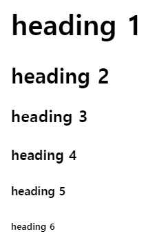

## 2. 본문- p

단락 (Paragraphs)을 지정.
HTML `<p>` 요소는 하나의 문단을 나타냅니다. 문단은 블록 레벨 요소이며, 자신의 닫는 태그(`</p>`) 이전에 다른 블록 레벨 태그가 분석되면 자동으로 닫힙니다. - "[태그 생략(Tag omission)](https://en.wikipedia.org/wiki/Tag_omission)"

태그 생략을 사용하지 않은 HTML 문서<br/>
✨ **예시**

```html
<document>
  <title>Tag Omission</title>
  <p>first paragraph</p>
  <p>second paragraph</p>
  <p>third paragraph</p>
</document>
```

태그 생략를 사용한 HTML 문서<br/>
✨ **예시**

```html
<document>
  Tag Omission
  <p>first paragraph</p>
  <p>second paragraph</p>
  <p>third paragraph</p></document
>
```

## 3. 본문- br

Line-break 의 약자로 개행을 위한 태그입니다. `<br>` 태그는 빈 요소로 종료태그가 없습니다.

> <strong>참고</strong>: 문단 사이에 여백을 두기 위한 용도로 `<br>`을 사용하지 마세요. 대신 `<p>` 요소로 감싼 후 CSS의 margin 속성으로 여백의 크기를 조절하세요.

## 4. 본문- blockquote, q

**속성**
`cite`
전역속성. 인용문의 출처 문서나 메시지를 가리키는 URL. 인용문의 맥락 혹은 출처 정보를 가리킬 용도입니다. 브라우저만 알 수 있고 **최종 결과에는 보이지 않습니다.**

### 1) `<blockquote>`: **블록** 인용 요소

긴 인용문 블록을 지정한다. 브라우저는 blockquote 요소를 들여쓰기한다. css를 이용하여 다양한 style을 적용할 수 있다.
HTML `<blockquote>` 요소는 `<q>`태그와 달리 안쪽의 텍스트가 긴 인용문에서 사용됩니다. cite 속성을 이용할 수 있습니다.

✨ **예시**

```html
<p>Here is a quote from WWF's website:</p>

<blockquote cite="http://www.worldwildlife.org/who/index.html">
  For 50 years, WWF has been protecting the future of nature. The world's
  leading conservation organization, WWF works in 100 countries and is supported
  by 1.2 million members in the United States and close to 5 million globally.
</blockquote>
```

🧪 **실행결과**

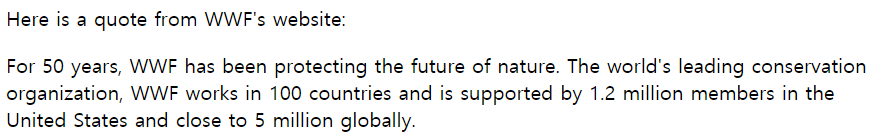

### 2) `<q>`: **인라인** 인용문 요소

HTML `<q>`는 단락을 구분하지 않는 **짧은 인용문(quotation)**을 위해 사용합니다. 브라우저는 인용부호(큰따옴표/quotation marks)로 q 요소를 감쌉니다. cite 속성을 이용할 수 있습니다.

✨ **예시**

```html
<p>
  When Dave asks HAL to open the pod bay door, HAL answers:
  <q cite="https://www.imdb.com/title/tt0062622/quotes/qt0396921"
    >I'm sorry, Dave. I'm afraid I can't do that.</q
  >
</p>
```

🧪 **실행결과**

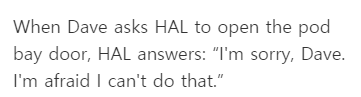

## 5. 본문- pre

Preformatted. HTML `<pre>` 요소는 미리 서식을 지정한 텍스트를 나타내며, HTML에 작성한 내용 그대로 표현합니다. 텍스트는 보통 **고정폭 글꼴**을 사용해 렌더링하고, 요소 내 공백문자를 그대로 유지합니다.

✨ **예시**

```html
<pre>
  L          TE
    A       A
      C    V
       R A
       DOU
       LOU
      REUSE
      QUE TU
      PORTES
    ET QUI T'
    ORNE O CI
     VILISÉ
    OTE-  TU VEUX
     LA    BIEN
    SI      RESPI
            RER       - Apollinaire
</pre>
```

🧪 **실행결과**

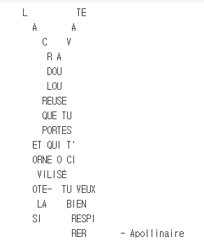

## 6. 본문- figure, figcaption

HTML `<figure>` 요소는 그림, 도표, 사진 코드 목록과 같은 독립적인 콘텐츠를 표현합니다. `<figcaption>` 요소는 캡션을 추가하는 데 사용합니다.

✨ **예시**

```html
<figure>
  
  <figcaption>An elephant at sunset</figcaption>
</figure>
```

🧪 **실행결과**


## 7. 본문- hr

수평선 horizon

## 8. 본문- abbr, address, cite, bdo

### 1) `<abbr>`: 약어 요소

마우스에 반응하여 나타나는 글자(툴팁으로 나타남)를 만들 경우에 주로 사용하며 약자의 해설 등에 쓰입니다. 주의해야 할 점이 있는데 `<abbr title="내용">`에서 내용에 들어가는 텍스트는 공백이나 탭, 줄바꿈을 `<pre>`처럼 쓰였던 그대로를 반영합니다.

✨ **예시**

```html
<p>
  You can use <abbr title="Cascading Style Sheets">CSS</abbr> to style your
  <abbr title="HyperText Markup Language">HTML</abbr>.
</p>
```

🧪 **실행결과**

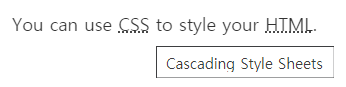

### 2) `<address>`: 연락처 주소 요소

사람이나 사람 또는 조직에 대한 연락처 정보를 제공하는 것을 나타냅니다. 이텔릭체에 파란색 밑줄로 표시됩니다.

✨ **예시**

```html
<address>
  <a href="mailto:jim@rock.com">jim@rock.com</a><br />
  <a href="tel:+13115552368">(311) 555-2368</a>
</address>
```

🧪 **실행결과**

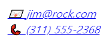

### 3) `<cite>`: 인용 요소

`<cite>` 는 `blockquote` 나 `q` 에서 쓰이는 cite 속성과 달리, 영화나 공연, 책, 그림 같은 창작품의 제목을 지정할 때 사용됩니다. 또한 **이탤릭체**로 표시됩니다.

✨ **예시**

```html
<p>
  아무 소리를 들을 수 없던 철수가 가던 길에 멈춰 섰다. 그리고 그는 뒤에 있던
  우리를 향해 천천히 고개를 돌렸다. 해맑은 표정으로 웃음짓는 철수는 우리에게
  나즈막히 작별인사를 했다...(중략) 우리는 다같이 앞을 나아갔다.
  <cite>- 김아무개, 그들이가는길, 1997</cite>
</p>
```

🧪 **실행결과**

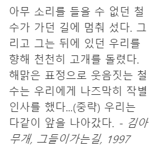

### 4) `<bdo>`: 양방향 텍스트 재정의 요소

Bi-Directional Override. 텍스트를 반대 방향으로 재정의합니다. `<bdo>`태그는 현재 텍스트 방향을 무시하는 데 사용됩니다.

✨ **예시**

```html
<p>This paragraph will go left-to-right.</p>
<p><bdo dir="rtl">This paragraph will go right-to-left.</bdo></p>
```

🧪 **실행결과**

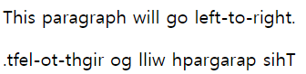

## 9. 글자 형태 (Text Formatting) 태그 - b, strong

텍스트에 포매팅한다는 것은 모양을 다르게 해서 주의를 끌게합니다. `<b>`, `<strong>`은 둘 다 텍스트를 굵게 만듭니다. 그러나 **강조의 차이**가 있습니다.

### 1) `<b>`

Bold체를 지정합니다. 제목 태그와 같이 의미론적(Semantic) 중요성의 의미는 없음.
문장 전체로 쓰지 않습니다. **요약의 키워드**, **리뷰의 제품 이름**

✨ **예시**

```html
<p>
  The two most popular science courses offered by the school are
  <b class="term">chemistry</b> (the study of chemicals and the composition of
  substances) and <b class="term">physics</b> (the study of the nature and
  properties of matter and energy).
</p>
```

🧪 **실행결과**

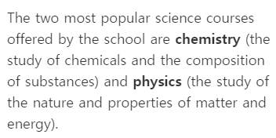

### 2) `<strong>`: 높은 중요도 요소

`<b>` 태그와 동일하게 bold체를 지정하지만 **의미론적(Semantic) 중요성**의 의미를 갖고 있습니다.
표현되는 외양은 `<b>` 태그와 동일하지만 웹 표준을 준수하고자 한다면 `<strong>`을 사용하는 것이 바람직합니다.

✨ **예시**

```html
<p>
  ... the most important rule, the rule you can never forget, no matter how much
  he cries, no matter how much he begs:
  <strong>never feed him after midnight</strong>.
</p>
```

🧪 **실행결과**

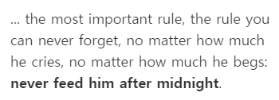

## 10. 글자 형태 (Text Formatting) 태그 - i, em

기울임꼴로 표시합니다.

### 1) `<i>`

Italic체를 지정합니다. 의미론적(Semantic) 중요성의 의미는 없음.
기술 용어, 외국어 구절, 등장인물의 생각 등에 표시합니다.

✨ **예시**

```html
<p>I looked at it and thought <i>This can't be real!</i></p>
```

🧪 **실행결과**

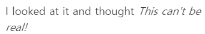

### 2) `<em>`: 강세 요소

Emphasized(강조, 중요한) text를 지정합니다. `<i>` tag와 동일하게 Italic체로 표현. **의미론적(Semantic) 중요성**의 의미를 갖습니다.

✨ **예시**

```html
<p>Get out of bed <em>now</em>!</p>

<p>We <em>had</em> to do something about it.</p>

<p>This is <em>not</em> a drill!</p>
```

🧪 **실행결과**

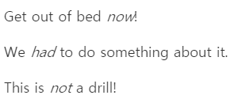

> 두 태그 사이에 차이점이 없어 보이지만 브라우저는 b태그나 i태그는 단순 색상의 변경 또는 형태로, **strong** 태그나 **em** 태그는 중요성이 강조된 단어로 인식합니다. 따라서, 스크린 리더와 같은 TTS 음성지원 앱이 작동하면 strong 태그나 em 태그 부분에서는 강한 억양을 사용하게 됩니다.

## 11. 글자 형태 (Text Formatting) 태그 - mark, small, sub, sup

### 1) `<mark>`

highlighted text를 지정. 현재 맥락에 관련이 깊거나 중요해 하이라이트 표시를 해 특정 문장이나 단어를 강조하는 경우 사용합니다.

✨ **예시**

```html
<p>
  Several species of <mark>salamander</mark> inhabit the temperate rainforest of
  the Pacific Northwest.
</p>
```

🧪 **실행결과**

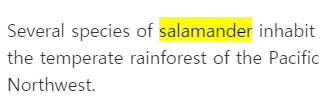

### 2) `<small>`: 덧붙임 글 요소

덧붙이는 글이나, 저작권과 법률 표기 등의 **작은** 텍스트를 나타냅니다.

✨ **예시**

```html
<p>
  MDN Web Docs is a learning platform for Web technologies and the software that
  powers the Web.
</p>

<hr />

<p>
  <small
    >The content is licensed under a Creative Commons Attribution-ShareAlike 2.5
    Generic License.</small
  >
</p>
```

🧪 **실행결과**

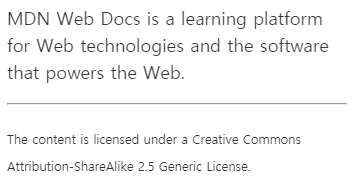

### 3) `<sub>`: 아래 첨자 요소

Subscript(아랫 첨자). 첨자로 표시해야 요소를 지정 인라인 텍스트입니다.

✨ **예시**

```html
<p>
  Almost every developer's favorite molecule is
  C<sub>8</sub>H<sub>10</sub>N<sub>4</sub>O<sub>2</sub>, also known as
  "caffeine."
</p>
```

🧪 **실행결과**

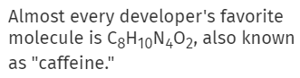

### 4) `<sup>`: 위 첨자 요소

Superscript(윗첨자). 지수, 서수 ...

✨ **예시**

```html
<p>
  <var>a<sup>2</sup></var> + <var>b<sup>2</sup></var> = <var>c<sup>2</sup></var>
</p>
```

🧪 **실행결과**

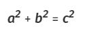

## 12. 글자 형태 (Text Formatting) 태그 - del, ins, code, kbd

### 1) `<del>`

deleted (removed) text를 지정합니다.

### 2) `<ins>`

inserted (added) text를 지정합니다.

### 3) `<code>`

짧은 코드 조각을 나타냅니다.
여러 줄의 코드를 나타내려면 `<code>` 요소를 `<pre>`로 감싸세요.

### 4) `<kbd>`

키보드, 음성 입력, 또는 기타 텍스트 입력 장치로부터 사용자 입력 텍스트를 나타내는 인라인 텍스트 범위를 나타낸다.

✨ **예시**

```html
<blockquote>
  There is <del>nothing</del> <ins>no code</ins> either good or bad, but
  <del>thinking</del> <ins>running it</ins> makes it so.
</blockquote>

<p>
  The <code>push()</code> method adds one or more elements to the end of an
  array and returns the new length of the array.
</p>

<p>
  Please press <kbd>Ctrl</kbd> + <kbd>Shift</kbd> + <kbd>R</kbd> to re-render an
  MDN page.
</p>
```

🧪 **실행결과**

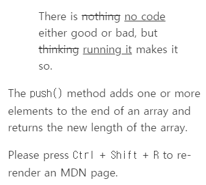

## 13. 하이퍼링크(hyperlink)

HTML link는 hyperlink를 의미하며 `<a>`(anchor) 태그가 그 역할을 담당합니다.
`<a>`태그는 한 페이지에서 다른 링크를 사용하는 하이퍼 링크를 정의한다.
Anchor: 닻 특정한 위치에 닻을 내려서 다른 위치에서도 그 곳으로 이동할 수 있게 해줍니다.

**속성**
<br>
`href`
하이퍼링크가 가리키는 URL입니다. 한 페이지에서 다른 링크를 사용하는 하이퍼링크르 정의합니다.

| Value               | Description                                                    |
| ------------------- | -------------------------------------------------------------- |
| 절대 URL            | 웹사이트 URL (href=”http://www.example.com/default.html”)      |
| 상대 URL            | 자신의 위치를 기준으로한 대상의 URL (href=”html/default.html”) |
| fragment identifier | 페이지 내의 특정 id를 갖는 요소에의 링크 (href=”#top”)         |
| 메일                | mailto:                                                        |
| script              | href=”javascript:alert(‘Hello’);”                              |

`target`<br>
링크 클릭 시, 창의 형태를 지정합니다.
| Value | Description |
---|---
|\_self|링크를 클릭했을 때 연결문서를 현재 윈도우에서 오픈(기본값). 현재 브라우징 컨텍스트.|
|\_blank|링크를 클릭했을 때 연결문서를 새로운 윈도우나 탭에서 오픈|

## 14. 엔티티(Entity)

<, >, &, 예약어
일부 특수 문자는 HTML에서 사용하도록 예약되어 있습니다. 즉, 브라우저에서 해당 문자를 HTML 코드로 구문 분석합니다.
|Character|Entity|
|---|---|
|&|`&amp;`|
|<|`&lt;`|
|>|`&gt;`|
|"|`&quot;`|
|'|`&apos;`|
|spacing|`&nbsp;`|

&nbsp;는 HTML에서 2칸 이상의 공백을 표시하기 위해 사용됩니다.

## 비슷한 태그

- `<strong>` vs `<b>` vs `<em>`
  공통점은 의미론적 중요성을 갖습니다.

- `<cite>` vs `<blockquote>` vs `<q>`
  HTML `<blockquote>` 요소는 `<q>`태그와 달리 안쪽의 텍스트가 긴 인용문에서 사용됩니다. 둘은 공통적으로 cite 속성을 이용할 수 있습니다.

## 참고 자료 및 강의📑

- 제로베이스 강의 - HTML
- [<blockquote>, <q>, <cite> 올바르게 사용하기](https://frontdev.tistory.com/entry/blockquote-q-cite-%EC%98%AC%EB%B0%94%EB%A5%B4%EA%B2%8C-%EC%82%AC%EC%9A%A9%ED%95%98%EA%B8%B0)
- [blockquote, cite, q](https://m.blog.naver.com/PostView.naver?isHttpsRedirect=true&blogId=bugman002&logNo=221567851912)
- [HTML5, <b> <strong> <i> <em> 태그 알아 보기](https://itfix.tistory.com/646)
