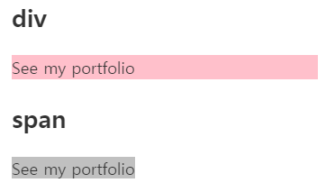
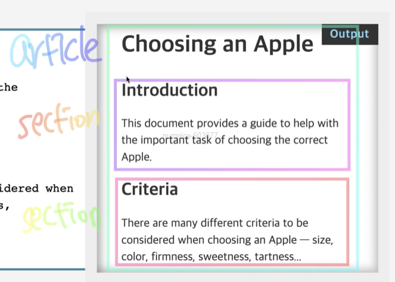

# 구조를 나타내는 요소

## 1. 컨테이너(div, span) Non-Semantic 요소

이 태그는 Ccontent에 대한 어떠한 설명도 하지 않습니다.

### 1) `<div>`: 콘텐츠 분할 요소

`<div>`태그는 Division(영역) 의미 글자로 **블록 요소**의 특징으로 부모 태그 가로 끝까지 채워집니다.

### 2) `<span>`

구문 컨텐츠를 위한 **인라인 요소**이며 Ccontent 길이만큼 늘어납니다.

✨ **예시**

```html
<h2>div</h2>
<div>See my portfolio</div>

<h2>span</h2>
<span> See my portfolio </span>
```

🧪 **실행결과**



## 2. 시멘틱 웹(Semantic Web)이란?

**시맨틱 웹이란 웹에 존재하는 수많은 웹 페이지들에 메타데이터(Metadata)를 부여하여, 기존의 잡다한 데이터 집합이었던 웹 페이지를 ‘의미’와 ‘관련성’을 가지는 거대한 데이터베이스로 구축하고자 하는 발상입니다.**


예전에는 `<table>`태그를 레이아웃에 많이 활용했으나, HTML5에서 새로 추가된 시맨틱 태그는 태그로 섹션을 정의하면 이 섹션이 무슨 용도인지 바로 알 수 있습니다. 검색 엔진은 시멘틱 태그를 기준으로 웹 페이지의 내용을 판단하고 인덱싱을 합니다. 시멘틱 태그 종류에 따라 중요 정보 여부를 판단하고, 검색 결과의 우선 순위에도 반영을 합니다.


### 의미론적인 마크업을 사용하면 아래와 같은 이점이 있습니다:

- **시맨틱 태그란 브라우저, 검색엔진, 개발자 모두에게 콘텐츠의 의미를 명확히 설명하는 역할을 합니다.**
- 시각 장애가 있는 사용자가 스크린리더로 페이지를 탐색할 때 의미론적 마크업을 말로써 사용할 수 있습니다.
- 의미가 없는 끊임없는 `<div>` 들을 탐색하는 것보다, 의미있는 코드 블록을 찾는 것이 훨씬 쉽습니다.

### 1) header 문서 메타데이터(헤더) 요소

소개 및 탐색에 도움을 주는 콘텐츠를 나타냅니다. 제목, 로고, 검색 폼, 작성자 이름 등의 요소도 포함할 수 있습니다.

### 2) nav

네비게이션을 의미합니다. 현재 페이지 내의 탐색도 용이하게 합니다. 현재 웹 페이지 기준으로 상위 요소나 현재 페이지 개요를 나타냅니다.

### 3) main

주요 컨텐츠 부분. body 태그의 바로 하위 태그로 문서 내 하나의 태그만 사용 가능합니다.

### 4) aside

사이드에 위치한 공간을 의미합니다. 주요 내용과 직접적으로 관련은 없지만 간접적으로 연관된 부분을 나타냅니다. 예시) 블로그 사이드 광고

### 5) section

보통 `<section>`은 제목을 포함하지만, 항상 그런 것은 아닙니다. 본문의 여러 내용(article)을 포함하는 공간을 의미합니다.



### 6) article

분문의 주내용이 들어가는 공간을 의미합니다.
사용 예제로 게시판과 블로그 글, 매거진이나 뉴스 기사 등이 있습니다. 하나의 문서가 여러 개의 `<article>`을 가질 수 있습니다. 예컨대 사용자가 스크롤하면 계속해서 다음 글을 보여주는 블로그의 경우, 각각의 글이 `<article>` 요소가 되며, 그 안에는 또 여러 개의 `<section>` 이 존재할 수 있습니다. 그 반대도 가능합니다.

### 7) footer

구획의 작성자, 저작권 정보, 관련 문서 등의 내용을 담습니다.


## HTML5에 새로 추가된 태그들

- `<article>`
- `<aside>`
- `<figure>`
- `<footer>`
- `<header>`
- `<nav>`
- `<section>`


## 참고 자료 및 강의📑

- 제로베이스 강의 - HTML
