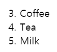
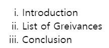
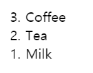
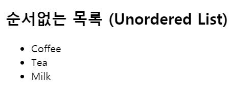
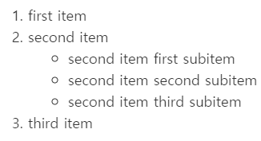
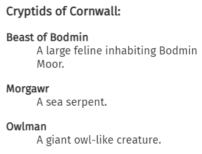
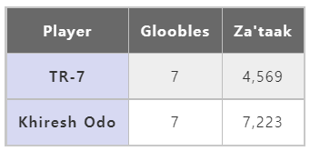
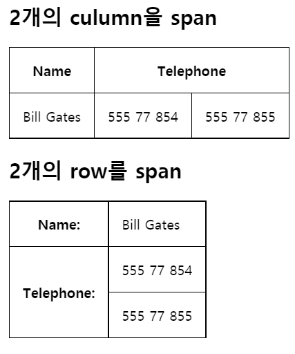
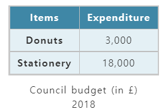

# 목록과 표

## 1. 목록 - ul, ol, li

### 1) 순서있는 목록 ol(Ordered List)

`start`
start 속성으로 리스트의 시작값을 지정할 수 있습니다. 번호 type가 문자나 로마 숫자인 경우에도 항상 아라비아 숫자(1, 2, 3 등) 입니다. 예를 들어 문자 "d" 또는 로마 숫자 "iv"에서 요소의 번호를 매기기 시작하려면 start="iv"를 사용합니다.

✨ **예시**

```html
<ol start="3">
  <li>Coffee</li>
  <li>Tea</li>
  <li>Milk</li>
</ol>
```

🧪 **실행결과**


`type`
type 속성을 사용하여 순서를 나타내는 문자를 지정.

| Value | Description     |
| ----- | --------------- |
| “1”   | 숫자 (기본값)   |
| “A”   | 대문자 알파벳   |
| “a”   | 소문자 알파벳   |
| “I”   | 대문자 로마숫자 |
| “i”   | 소문자 로마숫자 |

`type` 둘러싸인 `<li>` 요소에 다른 속성이 사용되지 않는 한 지정된 유형이 **전체 목록에 사용**됩니다 .

✨ **예시**

```html
<ol type="i">
  <li>Introduction</li>
  <li>List of Greivances</li>
  <li>Conclusion</li>
</ol>
```

🧪 **실행결과**



`reversed`
리스트의 순서값을 역으로 표현.

✨ **예시**

```html
<ol reversed>
  <li>Coffee</li>
  <li>Tea</li>
  <li>Milk</li>
</ol>
```

🧪 **실행결과**



### 2) 순서없는 목록 ul(Unordered List)

✨ **예시**

```html
<!DOCTYPE html>
<html>
  <body>
    <h2>순서없는 목록 (Unordered List)</h2>
    <ul>
      <li>Coffee</li>
      <li>Tea</li>
      <li>Milk</li>
    </ul>
  </body>
</html>
```

🧪 **실행결과**



### 3) 중첩 목록

목록 태그는 내비게이션 메뉴를 만들 때 자주 사용합니다.

✨ **예시**

```html
<ol>
  <li>first item</li>
  <li>
    second item
    <!-- closing </li> tag not here! -->
    <ul>
      <li>second item first subitem</li>
      <li>second item second subitem</li>
      <li>second item third subitem</li>
    </ul>
  </li>
  <li>third item</li>
</ol>
```

🧪 **실행결과**



## 2. 정의 목록 - dl, dt, dd

### 1) <dl>: The Description List element

`<dl>`은 `<dt>`(요소를 사용하여 지정됨) 및 `<dd>`(요소에서 제공됨) 그룹 목록을 묶습니다. 용어 사전 구현이나 메타데이터(키-값 쌍 목록)를 표시하는 것입니다.
하나의 용어에 하나의 정의 형태로 이루어져 있다.

### 2) <dt>: The Description Term element 용어

### 3) <dd>: <dd>: The Description Details element 설명

✨ **예시**

```html
<p>Cryptids of Cornwall:</p>

<dl>
  <dt>Beast of Bodmin</dt>
  <dd>A large feline inhabiting Bodmin Moor.</dd>

  <dt>Morgawr</dt>
  <dd>A sea serpent.</dd>

  <dt>Owlman</dt>
  <dd>A giant owl-like creature.</dd>
</dl>
```

🧪 **실행결과**



### 이름-값 그룹을 `<div>`로 감싸기

```html
<dl>
  <div>
    <dt>Name</dt>
    <dd>Godzilla</dd>
  </div>
</dl>
```

`<div>`로 감싸는 건 가능하지만 dt와 dd의 형제 태그로 사용은 불가능하다.

## 3. 표 - table, tr, th, td

| tag   | Description                       |
| ----- | --------------------------------- |
| table | 표를 감싸는 태그                  |
| tr    | 표 내부의 행 (table row)          |
| th    | 행 내부의 제목 셀 (table heading) |
| td    | 행 내부의 일반 셀 (table data)    |

### 1) `<tr>`

**속성**

`scope`
`<th>` 가 갖을 수 있는 특성이 있습니다. scope 표준에 맞게 접근성을 높여줍니다.

- row: 헤더가 속한 **행**의 모든 ​​셀과 관련됩니다.
- col: 헤더가 속한 **열**의 모든 셀과 관련됩니다.

✨ **예시**

```html
<table>
  <tr>
    <th scope="col">Player</th>
    <th scope="col">Gloobles</th>
    <th scope="col">Za'taak</th>
  </tr>
  <tr>
    <th scope="row">TR-7</th>
    <td>7</td>
    <td>4,569</td>
  </tr>
  <tr>
    <th scope="row">Khiresh Odo</th>
    <td>7</td>
    <td>7,223</td>
  </tr>
</table>
```

🧪 **실행결과**



### 2) `<td>`

| attribute | Description                     |
| --------- | ------------------------------- |
| rowspan   | 해당 셀이 점유하는 행의 수 지정 |
| colspan   | 해당 셀이 점유하는 열의 수 지정 |

✨ **예시**

```html
<h2>2개의 culumn을 span</h2>
<table>
  <tr>
    <th>Name</th>
    <th colspan="2">Telephone</th>
  </tr>
  <tr>
    <td>Bill Gates</td>
    <td>555 77 854</td>
    <td>555 77 855</td>
  </tr>
</table>

<h2>2개의 row를 span</h2>
<table>
  <tr>
    <th>Name:</th>
    <td>Bill Gates</td>
  </tr>
  <tr>
    <th rowspan="2">Telephone:</th>
    <td>555 77 854</td>
  </tr>
  <tr>
    <td>555 77 855</td>
  </tr>
</table>
```

🧪 **실행결과**



## 4. thead, tbody, tfoot

테이블도 thead, tbody, tfoot로 나눠서 마크업이 가능합니다.

✨ **예시**

```html
<table>
  <caption>
    Council budget (in £) 2018
  </caption>
  <thead>
    <tr>
      <th scope="col">Items</th>
      <th scope="col">Expenditure</th>
    </tr>
  </thead>
  <tbody>
    <tr>
      <th scope="row">Donuts</th>
      <td>3,000</td>
    </tr>
    <tr>
      <th scope="row">Stationery</th>
      <td>18,000</td>
    </tr>
  </tbody>
</table>
```

🧪 **실행결과**



## 5. caption: 표 설명 요소

- 부모 `<table>` 요소의 **첫 번째 자식**이어야 합니다.
- 가운데 정렬로 들어갑니다.
- `<caption>` 요소를 가진 `<table>` 요소가 만약 `<figure>` 요소의 유일한 자식인 경우 `<figcaption>`을 대신 사용합니다.

## 참고 자료 및 강의📑

- 제로베이스 강의 - HTML
