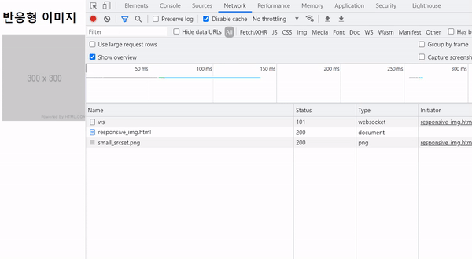
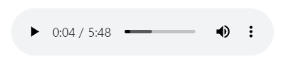
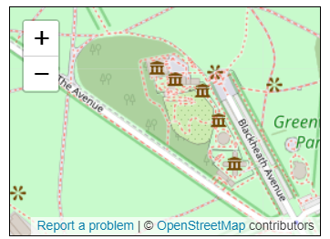

# 임베디드 요소

임베디드 요소는 코드로 내용 작성하는 것이 아니라 외부 소스를 불러와서 내부에 삽입하는 것을 말합니다.

## 1. 이미지 속성 - src, alt, width, height

`` 태그를 사용합니다.

| 속성 |사용값| 설명 |
| --- | --- |--- |
| src   | URL   | 이미지 파일 경로 지정 |
| alt     | 문자열  | alternative text. 이미지 파일이 없을 경우 표시되는 문장 |
| width   | px | 이미지의 너비 (CSS에서 지정하는 것이 일반적)            |
| height  |px  | 이미지의 높이 (CSS에서 지정하는 것이 일반적)            |
| title  | 문자열  | 그림에 마우스를 올렸을 때 툴팁 설명을 보여줍니다.       |


✨ **예시**

```html

```

🧪 **실행결과**


## 2. 웹에서 사용하는 이미지 유형

| Abbreviation | MIME type       | File extension(s)                          | Summary                                                                                   |
| ------------ | --------------- | ------------------------------------------ | ----------------------------------------------------------------------------------------- |
| JPEG(JPG)         | `image/jpeg`    | `.jpg`, `.jpeg`, `.jfif`, `.pjpeg`, `.pjp` | 정지 이미지의 손실 압축에 적합하다. (현재 가장 많이 사용됨)                               |
| PNG          | `image/png`     | `.png`                                     | PNG는 원본 이미지를 보다 정확하게 보여주거나 투명도가 필요한 경우 JPEG보다 선호됩니다. |
| GIF          | `image/gif`     | `.gif`                                     | 여러장의 이미지로 이루어진 애니메이션 표현 가능합니다.                                    |
| WEBP         | `image/webp`    | `.webp`                                    | 구글이 만든 이미지 포맷, 품질, 압축률 등이 훨씬 우수 하나 지원 브라우저가 제한적입니다.   |
| SVG          | `image/svg+xml` | `.svg`                                     | 다양한 크기로 정확하게 그려야 하는 아이콘, 다이어그램 등에 사용됩니다.유일한 벡터이미지   |

래스터 이미지는 격자 형태로 만들어졌고 벡터 이미지는 아이콘과 UI 요소들에 많이 쓰입니다.

## 3. 반응형 이미지 속성 - srcset, sizes

**srcset**을 이용해 화면 너비를 기준으로 다른 이미지를 표시할 수 있습니다.

| 속성 |사용값| 설명 |
| --- | --- |--- |
|srcset|URL|sizes 속성과 함께 사용 가능. 반응형 웹, 또는 다양한 해상도의 이미지를 표시해야 하는 경우, 해상도별 이미지 경로를 세트로 표시해 조건에 맞춰 표시되도록 할 수 있습니다. |
|sizes||각각의 페이지 레이아웃 이미지 크기 지정|


- 이미지의 URL
- 선택적으로, 공백과 함께 그 뒤를 잇는...
  - **너비 서술자**(양의 정수와 바로 뒤의 '**w**' 문자). 너비 서술자의 값을 sizes 특성으로 지정한 소스 크기로 나눠서 픽셀 밀도를 구합니다.
  - **픽셀 밀도 서술자**(양의 실수와 바로 뒤의 '**x**' 문자). 서술자를 포함하지 않은 경우 기본값인 1x 로 간주합니다.

환경에 따라 이미지 크기가 변하게 됩니다.
ps. 실행이 안될 경우, 개발자 모드 > Network 탭 > Disable cashe 선택합니다.
크롬은 이미지를 저장소에 저장하여 재방문하면 같은 이미지를 보여주기 때문.

✨ **예시**

```html

```

🧪 **실행결과**




## 4. video

`<video>` 태그는 HTML5에서 새롭게 추가된 태그.
이미지 태그는 내부에 자식 요소를 가질 수 없으나 비디오는 자식 태그를 가질 수 있습니다.

| attribute | Description                                                                                                                                                                                                                                            |
| --------- | ------------------------------------------------------------------------------------------------------------------------------------------------------------------------------------------------------------------------------------------------------ |
| src       | 동영상 파일 경로                                                                                                                                                                                                                                       |
| poster    | 동영상 준비 중에 표시될 이미지 파일 경로                                                                                                                                                                                                               |
| preload   | 재생 전에 동영상 파일을 모두 불러올 것인지 지정                                                                                                                                                                                                        |
| autoplay  | 동영상 파일을 자동의 재생 개시할 것인지 지정. 비디오 자동 재생을 비활성화하려면 <strong>autoplay="false"</strong> 작동하지 않습니다. 속성이 `<video>` 태그에 있는 경우 동영상이 자동 재생됩니다. 자동 재생을 제거하려면 속성을 완전히 제거해야 합니다. |
| loop      | 동영상을 반복할 것인지 지정                                                                                                                                                                                                                            |
| controls  | 동영상 재생 도구를 표시할 것인지 지정. 재생도구의 외관은 브라우저마다 차이가 있다.                                                                                                                                                                     |
| width     | 동영상의 너비를 지정                                                                                                                                                                                                                                   |
| height    | 동영상의 높이를 지정                                                                                                                                                                                                                                   |
| muted     | 설정하면 오디오가 처음에 무음으로 설정됩니다. 기본값 false은 비디오가 재생될 때 오디오가 재생됨을 의미하는 입니다.                                                                                                                                     |

✨ **예시**

```html
<video width="640" height="360" controls>
  <source src="assets/video/wildlife.mp4" type="video/mp4" />
  <source src="assets/video/wildlife.webm" type="video/webm" />
</video>
```

## 5. audio

`<audio>` 태그는 HTML5에서 새롭게 추가된 태그.

| attribute | Description                                                                       |
| --------- | --------------------------------------------------------------------------------- |
| src       | 음악 파일 경로                                                                    |
| preload   | 재생 전에 음악 파일을 모두 불러올 것인지 지정                                     |
| autoplay  | 음악 파일을 자동의 재생 개시할 것인지 지정                                        |
| loop      | 음악을 반복할 것인지 지정                                                         |
| controls  | 음악 재생 도구를 표시할 것인지 지정. 재생 도구의 외관은 브라우저마다 차이가 있음. |

✨ **예시**

```html
<audio src="assets/audio/Kalimba.mp3" controls></audio>
```

🧪 **실행결과**



### `<audio>` with multiple `<source>` elements

✨ **예시**

웹 브라우저 별로 지원 가능한 음악 파일 형식이 다릅니다. `<source>` 태그를 사용하여 파일 형식 문제를 해결할 수 있습니다.

```html
<audio controls>
  <source src="assets/audio/Kalimba.mp3" type="audio/mpeg" />
  <source src="assets/audio/Kalimba.ogg" type="audio/ogg" />
</audio>
```

`<video>` 태그는 muted를 써서 영상 바로 시작이 가능하지만 오디오는 불가능합니다.

## 6. canvas(The Graphics Canvas element)

HTML `<canvas>`요소는 JavaScript를 통해 즉석에서 그래픽을 그리는 데 사용됩니다. `<canvas>`요소는 Container이고 실제로 그래픽을 그리려면 JavaScript를 사용해야 합니다.


✨ **예시**

**html**

```html
<canvas width="300" height="300">
  An alternative text describing what your canvas displays.
</canvas>
```

**javascript**

```javascript
const canvas = document.querySelector("canvas");
const ctx = canvas.getContext("2d");
ctx.fillStyle = "green";
ctx.fillRect(10, 10, 100, 100);
```

🧪 **실행결과**


## 7. iframe(The Inline Frame element)

현재 문서 안에 다른 HTML 페이지를 삽입합니다. 구글 웹, 유튜브 동영상을 HTML 문서에 배치하는 방법으로 많이 사용합니다. 인라인 프레임으로 허용된 url만 사용 가능합니다. 유튜브에서 기본으로 제공하는 영상 링크가 `<iframe>`으로 제공됩니다. 

✨ **예시**

```html
<iframe
  id="inlineFrameExample"
  title="Inline Frame Example"
  width="300"
  height="200"
  src="https://www.openstreetmap.org/export/embed.html?bbox=-0.004017949104309083%2C51.47612752641776%2C0.00030577182769775396%2C51.478569861898606&layer=mapnik"
>
</iframe>
```

🧪 **실행결과**




유튜브 동영상 연결에 사용하는 전용 태그 속성들은 다음과 같습니다. 기본적인 속성은 가로/세로 크기와 미디어 경로정도지만,모바일 기기 지원을 위한 몇몇 속성은 반응형 웹이나 모바일 웹을 지원해야할 경우 해당 옵션들을 넣어주는 것이 좋습니다. 

|속성|값|설명|
|---|---|---|
|weight|픽셀, % 값으로 너비 지정 가능 (100%일 때 웹 브라우저 화면 전체 너비)||
|height|픽셀, % 값으로 너비 지정 가능 (100%일 때 웹 브라우저 Viewport 전체 높이)||
|src|동영상 경로 URL||
|allow|accelerometer: 스마트폰 같은 가속도 센서 지원 기기에서 가로/세로 전환 자동 지원<br>autoplay: 자동 재생 지원. URL 뒤에 "?autoplay=1"을 추가로 붙여야 동작<br> encrypted-media: 암호화된 영상 재생 지원<br>picture-in-picture: 스마트폰에서 떠있는 작은 화면으로 동영상 재생 지원|유튜브 전용 속성|
|allowfullscreen|allowfullscreen|속성이 있으면 Full 화면 재생 버튼 활성화. 없다면 비활성화 (또는 allowfullscreen="" 도 동일함)|

```html
<iframe 
  width="560" 
  height="315" 
  src="https://www.youtube.com/embed/K88uy97Tu2Q" 
  title="YouTube video player" 
  frameborder="0" 
  allow="accelerometer; autoplay; clipboard-write; encrypted-media; gyroscope; picture-in-picture" 
allowfullscreen>
</iframe>
```


## 참고 자료 및 강의📑

- 제로베이스 강의 - HTML/CSS
- HTML & CSS 마스터북 도서
- [PoiemaWeb](https://poiemaweb.com/)
- [caniuse](https://caniuse.com/)
- [Google map iframe](https://developers.google.com/maps/documentation/embed/get-started)
- [placeholder.com](http://placeholder.com)
- [이미지 만드는 법](https://via.placeholder.com/150)
- [w3schoools - HTML Canvas Graphics](https://www.w3schools.com/html/html5_canvas.asp)
- [iframe 유튜브 예제](https://www.youtube.com/watch?v=K88uy97Tu2Q)