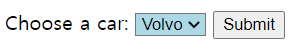

# 폼 관련 요소

## 1. form 소개
폼을 구성하는 구성 요소들은 크게 2가지로 나눌 수 있습니다. 하나는 키보드로 내용을 입력하는 "입력 필드"이고 다른 하나는 키보드, 또는 마우스로 선택할 수 있는 항목을 하나 이상 선택하는 "선택 요소"입니다. 입력필드는 "text", "textarea"가 있습니다. 

## 2. form 태그

### 1) name 
폼 이름 지정. HTML 페이지 안에서 유일해야 합니다.

### 2) action
폼을 전송할 URL을 입력합니다. 

### 3) method
입력 데이터(form data) 전달 방식 지정.
양식을 제출할 때 사용할 [HTTP](https://developer.mozilla.org/en-US/docs/Web/HTTP) 프로토콜을 이용해서 사용자 입력 데이터를 서버에 전달하는 방식을 나타냅니다. <br>

- POST
  - POST 방식은 양식 데이터를 요청 본문(Request body)으로 전송합니다.

- GET
  - GET 방식은 양식 데이터를 `action` URL 과 `?` 구분자 뒤에 이어 붙여서 전송합니다.
  - key-value형태의 데이터를 추가. 1개 이상의 전송 데이터는 ‘&’로 구분합니다.
  - 예) http://jsonplaceholder.typicode.com/posts?userId=1&id=1
  - 실제로는 검색 결과 등 URL을 저장해야 할 필요가 있는 경우에만 사용됩니다. 

### 4) enctype
`enctype="multipart/form-data"` 은 파일, 이미지 업로드가 있는 폼은 반드시 이 타입으로 지정해야 파일 업로드(전송)가 되며, 서버에 파일을 저장해 처리할 수 있게됩니다. 

## 3. label과 input

### 1) label

"for"는 `<label>` 태그 전용 속성입니다. 폼 필드와 함께 쌍으로 묶어서 사용하는 라벨 `<label>` 태그에는 속성으로 "for"가 사용됩니다. "이 라벨은 어떤 폼 필드를 위한 것이다" 라고 명시적으로 알려주는 용도입니다. 속성값으로는 연결하는 폼 필드의 "id"를 사용합니다. 체크박스와 라디오버튼을 사용할 때 라벨 태그와 "for" 속성이 아주 중요한 역할을 합니다. 

```html
<label for="fname">해당 이름:</label>
<input type="text" id="fname" name="fname">
```

먼저 `<label>` 태그를 앞서 만든 로그인 아이디 입력 요소에 붙입니다. 라벨 태그의 텍스트 "해당 이름:" 텍스트 라벨을 클릭하면 id 입력 요소에 포커스가 가면서 입력 커서가 깜박거리는 것을 볼 수 있습니다. 예시로 "로그인 상태 유지" 라벨을 클릭하면 체크박스가 체크되는 것을 확인할 수 있습니다. 


### 2) input

`<input>` 태그는 다양한 종류가 있는데 type 어트리뷰트에 의해 구분됩니다. 특성을 지정하지 않은 경우, 기본값은 **text** 입니다.


name 값은 하나의 form 내에서 구분하는 것이고 id는 라벨링할 때 사용됩니다.

<!--
🧪 **실행결과**


형제 요소로 쓰는 경우 for를 쓰지만 자식 요소로 쓰는 경우 쓰지 않는다.

🧪 **실행결과**

 -->

## 4. fieldset, legend

`<fieldset>` 태그는 관련된 입력 양식들을 그룹화할 때 사용합니다.
`<form>` 안에 `<input>`과 `<label>`이 많을 때 묶여서 하나의 역할을 `<fieldset>`과 `<legend>`를 사용합니다.

✨ **예시**

```html
<form>
  <fieldset>
    <legend>Choose your favorite monster</legend>

    <input type="radio" id="kraken" name="monster" />
    <label for="kraken">Kraken</label><br />

    <input type="radio" id="sasquatch" name="monster" />
    <label for="sasquatch">Sasquatch</label><br />
  </fieldset>
</form>
```

🧪 **실행결과**


위의 예제에서 보듯, `<fieldset>` 요소는 HTML 양식 속에서 그룹을 만들 수 있으며 `<legend>` 요소로 그룹의 설명을 제공할 수 있습니다. `<fieldset>`요소의 `<legend>`가 첫 번째 자식이어야 합니다.
`<fieldset>`은 별도의 블록으로 묶이는 것입니다.

### 속성

### disabled

지정한 경우, 모든 자손 컨트롤을 비활성화합니다.

✨ **예시**

```html
<form action="#">
  <fieldset disabled>
    <legend>Disabled fieldset</legend>
    <div>
      <label for="name">Name: </label>
      <input type="text" id="name" />
    </div>
    <div>
      <label for="pwd">Archetype: </label>
      <input type="password" id="pwd" />
    </div>
  </fieldset>
</form>
```

🧪 **실행결과**


## 5. input - type 속성 ( text, password, email, tel, number, range, date, month, time, reset, submit, button )

```html
<div>
  <label>TEXT :<input type="text" name="text" minlength="5" maxlength="20" /></label>
</div>
<div>
  <label>PASSWORD:<input type="password" name="pwd" minlength="5" maxlength="20" /></label>
</div>
<div>
  <label>EMAIL :<input type="email" name="email" /></label>
</div>
<div>
  <label>TEL :<input type="tel" name="tel" /></label>
</div>
<div>
  <label>NUMBER :<input type="number" name="number" /></label>
</div>
<div>
  <label>RANGE :<input type="range" name="range" /></label>
</div>
<div>
  <label>DATE :<input type="date" name="date" /></label>
</div>
<div>
  <label>MONTH :<input type="month" name="month" /></label>
</div>
<div>
  <label>TIME :<input type="time" name="time" /></label>
</div>
<input type="reset" />
<input type="submit" />
<input type="button" value="빈 버튼" />
```

🧪 **실행결과**

<br>


## 6. input - type 속성( radio, checkbox )

### 1) 라디오버튼
이름(name) 속성이 같은 라디오버튼들은 하나의 그룹으로 묶여서 하나로 동작하며, 그룹안의 항목 중 한개만 선택 가능합니다.  옵션으로 checked 써주면 선택된 상태가 됩니다.

```html
<h3>radio</h3>
<input type="radio" name="gender" value="male" checked /> 남자<br />
<input type="radio" name="gender" value="female" /> 여자<br />
<hr />
```

🧪 **실행결과**


### 2) 체크박스
이름(name) 속성이 같은 체크버튼들은 하나의 그룹으로 묶여서 폼을 전송할 때 체크한 값들만 전송됩니다.  


```html
<h3>checkbox</h3>
<input type="checkbox" name="fruit1" value="apple" checked /> 사과<br />
<input type="checkbox" name="fruit2" value="grape" /> 포도<br />
<input type="checkbox" name="fruit3" value="peach" /> 복숭아<br />
<hr />
```

🧪 **실행결과**


## 7. input 속성 - name, placeholder, autocomplete, required

### 1) name
요소의 이름. 요소를 개별적으로 구분하는데 사용

### 2) placeholder
입력필드 등에 예상되는 추천 값을 힌트로 미리보기로 보여주는 용도로 사용. 해당 `<input>` 태그에 포커스 되면 사라집니다.

✨ **예시**

```html
<input type="text" id="name" name="name" placeholder="이름" size="10" />
```

🧪 **실행결과**


### 3) autocomplete
"on" 또는 "off" 입력 필드에 자동 완성 기능을 사용할지 여부를 지정

✨ **예시**

```html
<input
  type="text"
  id="name"
  name="name"
  placeholder="이름"
  size="10"
  autocomplete="on"
/>
```

🧪 **실행결과**


### 4) required
해당 입력 필드에 값이 반드시 입력되어 있어야만 폼이 전송 가능해집니다. required가 지정된 필드에 입력된 내요이 없을 경우 다음과 같은 경고 메시지가 표시되고 폼이 전송되지 않습니다. 


🧪 **실행결과**


## 8. input 속성 - disabled, readonly

### 1) disabled
미사용 상태, 요소가 회색으로 변하면서 요소 사용 불가능 상태가 됩니다. 페이지 로딩 시점에 값이 미리 있더라도 폼 전송 시점의 해당 요소 값은 전송되지 않습니다.  


### 2) readonly
읽기 전용. 페이지 로딩 시점에 지정된 value 값은 그대로 유지되며 disabled 와 달리 폼 전송 시점에 값도 전송됩니다. 


## 9. input 속성 - step, min, max
### 1) step
사용 값: "숫자"

숫자(number) 입력 필드에 입력 포커스가 되면 오른쪽에 업/다운 화살표가 표시됩니다. 이 떄 배수 단위 값으로 입력을 제한하는 것이 "step" 속성입니다. 

🧪 **실행결과**


-10 0 10

### 2) min
사용 값: "숫자", "날짜"

요소의 최솟값 지정.

### 3) max
사용 값: "숫자", "날짜"

요소의 최댓값 지정.


## 10. button

클릭 가능한 요소.
`<input type="button">`과 유사하지만 `<input>` 태그는 빈 태그인 반면 `<button>` 태그는 그렇지 않습니다.
`<button>` 요소에는 텍스트나 이미지 같은 콘텐츠를 사용할 수 있습니다.

### 속성

### type

- submit : 버튼이 서버로 양식 데이터를 제출합니다. 지정하지 않은 경우 기본값이며, 유효하지 않은 일때도 사용합니다.
- reset: `<input type "reset">` 처럼, 모든 컨트롤을 초깃값으로 되돌립니다.
- button: 기본 행동이 없으며 클릭했을 때 아무것도 하지 않습니다. 클라이언트 스크립트와 연결할 수 있습니다.

### 아이콘 버튼

아이콘만 사용해 기능을 표현하는 버튼은 접근 가능한 이름을 갖지 않습니다.

## 11. 드롭다운 리스트 select, option, optgroup

껍데기 역할인 `<select>`와 `<option>`을 함께 사용합니다. 

### 1) `<select>` 태그 속성

|속성|값|설명|
|---|---|---|
|name|텍스트|`<select>` 태그 이름|
|required|required|필수 선택 항목이 됩니다. |
|size| 숫자| 드롭다운 리스트에서 표시하는 옵션의 개수(줄 수). "multiple" 속성이 부여된 경우 "size" 속성 유무와 무관하게 아래 펼침 속성이 사라지므로 주의해야 합니다. |
||multiple|드롭다운 리스트 옵션을 2개 이상 선택할 수 있도록 합니다. |
|disabled|disabled|드롭다운 리스트 사용불가 상태로 만듭니다.|
|autofocus|autofocus|페이지 로딩 후 자동으로 해당 드롭다운 리스트로 포커스가 가도록 합니다|


**autofocus**
✨ **예시**

```html
<!DOCTYPE html>
<html>
<head>
  <style> 
  select[autofocus] { 
    background-color: lightblue;
  } 
  
  </style>
</head>
<body>
<form action="">
  <label for="cars">Choose a car:</label>
  <select name="cars" id="cars" autofocus>
    <option value="volvo">Volvo</option>
    <option value="saab">Saab</option>
    <option value="opel">Opel</option>
    <option value="audi">Audi</option>
  </select>
  <input type="submit" value="Submit">
</form>
</body>
</html>

```

🧪 **실행결과**




### 2) `<option>` 태그 속성
|속성|값|설명|
|---|---|---|
|selected|selected|옵션이 기본 선택된 상태가 됩니다. 없을 경우 첫번째 옵션이 선택된 상태가 됩니다. |
|value|텍스트|옵션 값. 전송시 서버로 전송되는 값|
|label|텍스트|옵션을 위한 짧은 표시 라벨을 지정합니다.|
|disabled|disabled|드롭다운 리스트 사용불가 상태로 만듭니다.|

.png)


<!--
🧪 **실행결과**


 
첫 번째 값이 value 속성을 안넣고 required를 써줬지만 제출이 됩니다.


value="" 빈 값을 넣어주면 제출이 안됩니다.


옵션값 selected


optgroup -->

# 13. input - list 속성과 datalist

`<datalist>` 요소는 다른 컨트롤에서 고를 수 있는 선택지를 나타내는 `<option>` 요소를 담습니다.

✨ **예시**

```html
<label for="ice-cream-choice">Choose a flavor:</label>
<input list="ice-cream-flavors" id="ice-cream-choice" name="ice-cream-choice" />

<datalist id="ice-cream-flavors">
  <option value="Chocolate"></option>
  <option value="Coconut"></option>
  <option value="Mint"></option>
  <option value="Strawberry"></option>
  <option value="Vanilla"></option>
</datalist>
```

🧪 **실행결과**


# 14. textarea

`<textarea>` 태그는 여러 줄을 입력할 수 있는 텍스트 내용 입력 전용 태그

✨ **예시**

```html
<textarea name="message" rows="10" cols="30">
It was a dark and stormy night...</textarea
>
```

🧪 **실행결과**


## 참고 자료 및 강의📑

- 제로베이스 강의 - HTML
