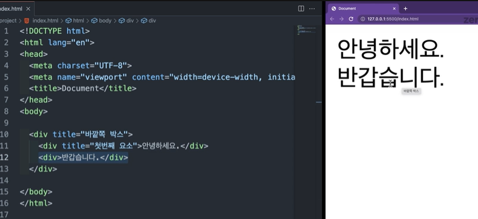
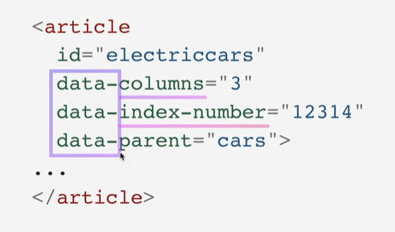

# 전역속성(HTML Global Attribute)

글로벌 어트리뷰트는 모든 HTML 요소가 공통으로 사용할 수 있는 속성입니다.

## 1. class와 id

### 1) id

유일한 고유식별자(id)를 요소에 지정합니다. 중복 지정이 불가합니다. 값에 공백을 포함 안됩니다.

### 2) class

스타일 시트에 정의된 class를 요소에 지정합니다. 중간에 공백을 써서 하나의 요소가 여러 개를 가질 수 있습니다. 중복 지정이 가능합니다.

## 2. style

CSS파일을 외부에 만들고 불러오는 것을 권장하고 바로 쓰는 경우라면 일시적으로 쓰는 경우만 사용합니다.

## 3. title

요소에 관한 제목을 지정합니다.

🧪 **실행결과**



부모 요소가 있어도 자식 요소의 툴팁이 보이게 됩니다.

## 4. lang: 언어 태그 구문

언어를 정의합니다. 웹 접근성을 높이기 위해 사용됩니다.

## 5. data- : 데이터 속성 사용하기

🧪 **실행결과**



## 6. draggable

이미지는 기본값이 드래그가 됩니다. 자바스크립트에서 요소를 끌어 이벤트를 정의할 수 있기 때문에 이 속성을 사용합니다.

✨ **예시**

```html

```

## 7. hidden

css의 hidden과는 다르게 의미상으로도 브라우저에 노출되지 않습니다. 기본값이 false

## 참고 자료 및 강의📑

- 제로베이스 강의 - HTML/CSS
- [Global attributes](https://developer.mozilla.org/en-US/docs/Web/HTML/Global_attributes)
