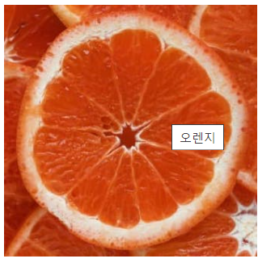

# 임베디드 요소

임베디드 요소는 코드로 내용 작성하는 것이 아니라 외부 소스를 불러와서 내부에 삽입하는 것을 말합니다.

## 1. img - src, alt, width, height

- `src` 속성은 필수로 이미지 경로를 지정합니다.
- `alt` alternative text: 대체 텍스트. 속성을 읽어 사용자에게 이미지를 설명하므로, 접근성 차원에서 매우 유용합니다.
- `title` 그림에 마우스를 올렸을 때 툴팁 설명을 보여줍니다.
- width 가로 길이를 변경하면 height도 맞게 변합니다.

✨ **예시**

```html

```

🧪 **실행결과**



## 2. 웹에서 사용하는 이미지 유형

| Abbreviation | MIME type       | File extension(s)                          | Summary                                                                                   |
| ------------ | --------------- | ------------------------------------------ | ----------------------------------------------------------------------------------------- |
| JPEG         | `image/jpeg`    | `.jpg`, `.jpeg`, `.jfif`, `.pjpeg`, `.pjp` | 정지 이미지의 손실 압축에 적합하다. (현재 가장 많이 사용됨)                               |
| PNG          | `image/png`     | `.png`                                     | PNG는 원본 이미지를 보다 정확하게 보여주거나 투 . 명도가 필요한 경우 JPEG보다 선호됩니다. |
| GIF          | `image/gif`     | `.gif`                                     | 여러장의 이미지로 이루어진 애니메이션 표현 가능합니다.                                    |
| WEBP         | `image/webp`    | `.webp`                                    | 구글이 만든 이미지 포맷, 품질, 압축률 등이 훨씬 우수 하나 지원 브라우저가 제한적입니다.   |
| SVG          | `image/svg+xml` | `.svg`                                     | 다양한 크기로 정확하게 그려야 하는 아이콘, 다이어그램 등에 사용됩니다.유일한 벡터이미지   |

래스터 이미지는 격자 형태로 만들어졌고 벡터이미지는 아이콘과 UI 요소들에 많이 쓰입니다.

검색창에 can i use 검색. https://caniuse.com/


# 4. 반응형 이미지 - srcset


환경에 따라 이미지 크기가 변하게 됩니다.

이미지 만드는 법 [placeholder.com](http://placeholder.com)

300

450

600


# 5. 반응형 이미지 - sizes

srcset은 작은화면은 작은 이미지 등등 뷰 포트에 따라 다른 이미지를 주는 경우

sizes

min-width 가장최소너비(이 보다 커야됨)


# 6. video


mp4 파일 하나 준비


이미지 태그는 내부에 자식 요소를 가질 수가 없으나 비디오는 자식 태그를 가질 수 있습니다.


src가 선택사항입니다.


비디오 추가로 보여지는 속성이 controle


소리, 전체화면 등등 옵션값을 줄 수 있습니다.


autoplay는 새로고침한 경우 비디오가 재생되지 않습니다.


인스타그램처럼 사운드 없이 비디오가 시작되게 할 수 있습니다.


autoplay와 muted를 같이 써주면 비디오가 시작되는 것을 볼 수 있습니다.

poster로 썸네일 띄울 수 있습니다.


# 7. audio


multiple source elements


브라우저가 지원가능한 소스들을 찾게됩니다.


비디오는 muted를 써서 사용 가능하지만


# 8. canvas, iframe


마크업을 html로 하고 내부 그림을 그리기 위해서 자바스크립트를 이용합니다.


소스를 외부에서 불러와서 프레임안에 씁니다.

예제는 다른 html을 띄어준 것 입니다.


보통 구글 웹 같은 것 삽입할 때 많이 사용합니다.

인라인 프레임으로 허용된 url만 사용 가능합니다. ( 그래서 네이버지도는 안될 수도 있습니다....)

검색에 google map iframe


