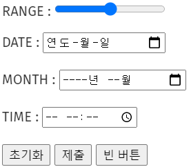
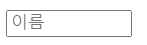
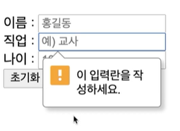
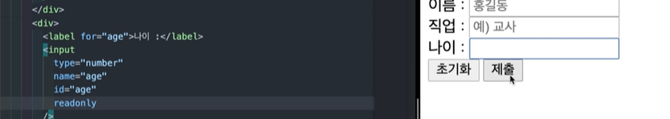
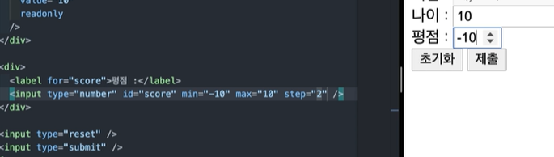
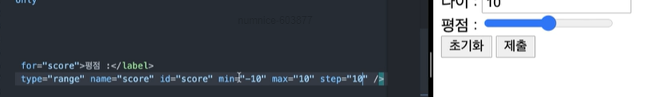
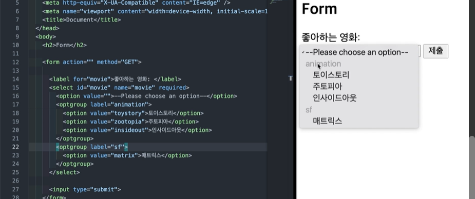

# 폼 관련 요소

## 1. form 소개

`<form>` 요소는 정보를 제출하기 위한 대화형 컨트롤을 포함하는 문서 구획을 나타냅니다. 사용자가 정보를 입력할 수 있게 장치를 마련해줍니다. 정보를 서버나 페이지로 전달합니다.

## 2. form - action, method 속성

`action`
양식 데이터를 처리할 프로그램의 URL, `<button>`, `<input type="submit">`, `<input type="image>` 요소의 formaction(for one form multi action) 특성으로 재정의할 수 있습니다.

`method`
양식을 제출할 때 사용할 [HTTP](https://developer.mozilla.org/en-US/docs/Web/HTTP) 메서드. <br>

- post: POST 메서드. 양식 데이터를 요청 본문으로 전송합니다.
- get: GET 메서드. 양식 데이터를 `action` URL과 `?` 구분자 뒤에 이어 붙여서 전송합니다.

## 3. label과 input

### 1) label

`<label>` 요소는 사용자 인터페이스 항목의 설명을 나타냅니다.

### 2) input

`<input>` 요소의 동작 방식은 **type** 특성에 따라 현격히 달라지므로, 각각의 유형은 별도의 참고 문서에서 더 자세히 확인할 수 있습니다. 특성을 지정하지 않은 경우, 기본값은 **text** 입니다.

**속성**<br>
`<for>`
같은 문서 내의 `<label>` 요소로서, for 속성값과 일치하는 id를 가진 문서의 첫 번째 요소는 그 label 요소의 labeled control라고 합니다. `<label>`은 본인 짝을 id로 구분함.

name 값은 하나의 form 내에서 구분하는 것이고 id는 라벨링할 때 사용됩니다.

🧪 **실행결과**


형제 요소로 쓰는 경우 for를 쓰지만 자식 요소로 쓰는 경우 쓰지 않는다.

🧪 **실행결과**


## 4. fieldset, legend

폼안에 input과 label이 많을 때 묶여서 하나의 역할을 fieldset과 legend를 사용합니다.

✨ **예시**

```html
<form>
  <fieldset>
    <legend>Choose your favorite monster</legend>

    <input type="radio" id="kraken" name="monster" />
    <label for="kraken">Kraken</label><br />

    <input type="radio" id="sasquatch" name="monster" />
    <label for="sasquatch">Sasquatch</label><br />
  </fieldset>
</form>
```

🧪 **실행결과**


위의 예제에서 보듯, `<fieldset>` 요소는 HTML 양식 속에서 그룹을 만들 수 있으며 `<legend>` 요소로 그룹의 설명을 제공할 수 있습니다. `<fieldset>`요소의 `<legend>`가 첫 번째 자식이어야 합니다.
`<fieldset>`은 별도의 블록으로 묶이는 것입니다.

**속성**<br>
`<disabled>`
지정한 경우, 모든 자손 컨트롤을 비활성화합니다.

✨ **예시**

```html
<form action="#">
  <fieldset disabled>
    <legend>Disabled fieldset</legend>
    <div>
      <label for="name">Name: </label>
      <input type="text" id="name" />
    </div>
    <div>
      <label for="pwd">Archetype: </label>
      <input type="password" id="pwd" />
    </div>
  </fieldset>
</form>
```

🧪 **실행결과**


## 5. input - type 속성 1

✨ **예시**

```html
<div>
  <label
    >TEXT :
    <input type="text" name="text" minlength="5" maxlength="20" />
  </label>
</div>
<div>
  <label
    >PASSWORD:
    <input type="password" name="pwd" minlength="5" maxlength="20" />
  </label>
</div>
<div>
  <label
    >EMAIL :
    <input type="email" name="email" />
  </label>
</div>
<div>
  <label
    >TEL :
    <input type="tel" name="tel" />
  </label>
</div>
<div>
  <label
    >NUMBER :
    <input type="number" name="number" />
  </label>
</div>
<div>
  <label
    >RANGE :
    <input type="range" name="range" />
  </label>
</div>
<div>
  <label
    >DATE :
    <input type="date" name="date" />
  </label>
</div>
<div>
  <label
    >MONTH :
    <input type="month" name="month" />
  </label>
</div>
<div>
  <label
    >TIME :
    <input type="time" name="time" />
  </label>
</div>

<input type="reset" />
<input type="submit" />
<input type="button" value="빈 버튼" />
```

🧪 **실행결과**




## 6. input - type 속성 2

라디오 버튼은 이름이 같으면 동시 선택이 불가능하게됩니다. 옵션으로 checked 써주면 check 된 상태가 됩니다.

🧪 **실행결과**


## 7. input - name, placeholder, autocomplete, required 속성

input마다 꼭 name을 써줘야 form data에서 구분이 됩니다.

### 1) placeholder

✨ **예시**

```html
<input type="text" id="name" name="name" placeholder="이름" size="10" />
```

🧪 **실행결과**



### 2) autocomplete

✨ **예시**

```html
<input
  type="text"
  id="name"
  name="name"
  placeholder="이름"
  size="10"
  autocomplete="on"
/>
```

🧪 **실행결과**


### 3) required

🧪 **실행결과**



## 8. input - disabled, readonly 속성

### 1) required

🧪 **실행결과**


input 값을 사용하지 않을때, 필드 데이터를 서버로 전송하지 않습니다. 값 입력 안됨.

### 2) readonly

🧪 **실행결과**


readonly는 값 입력이 안되지만 전송됨. 수정 안되는 기본값 value 설정할 수 있음.


## 9. input - step, min, max

step 간격

🧪 **실행결과**




-10 0 10

## 10. button

클릭 가능한 요소. 버튼의 이름, 제출할 때, 버튼의 value 특성과 함께 양식 데이터의 일부를 구성합니다.

**속성**

`type`
버튼의 행동 방식, 가능한 값은 다음과 같습니다.

- `submit` : 버튼이 서버로 양식 데이터를 제출합니다. 지정하지 않은 경우 기본값이며, 유효하지 않은 일때도 사용합니다.
- `reset`: `<input type "reset">` 처럼, 모든 컨트롤을 초깃값으로 되돌립니다.
- `button` : 기본 행동이 없으며 클릭했을 때 아무것도 하지 않습니다. 클라이언트 스크립트와 연결할 수 있습니다.

**아이콘 버튼**<br>
아이콘만 사용해 기능을 표현하는 버튼은 접근 가능한 이름을 갖지 않습니다.

## 11. select, option, optgroup

🧪 **실행결과**


첫 번째 값이 value 속성을 안넣고 required를 써줬지만 제출이 됩니다.


value="" 빈 값을 넣어주면 제출이 안됩니다.


옵션값 selected


optgroup

# 13. input - list 속성과 datalist

`<datalist>` 요소는 다른 컨트롤에서 고를 수 있는 선택지를 나타내는 `<option>` 요소를 담습니다.

✨ **예시**

```html
<label for="ice-cream-choice">Choose a flavor:</label>
<input list="ice-cream-flavors" id="ice-cream-choice" name="ice-cream-choice" />

<datalist id="ice-cream-flavors">
  <option value="Chocolate"></option>
  <option value="Coconut"></option>
  <option value="Mint"></option>
  <option value="Strawberry"></option>
  <option value="Vanilla"></option>
</datalist>
```

🧪 **실행결과**


# 14. textarea


