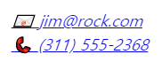
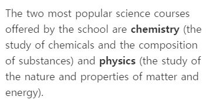
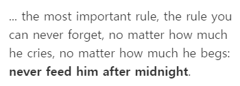
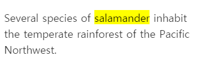

# 텍스트 요소

## 1. 제목 h1

제목이라는 뜻의 heading을 딴 태그

- 사용자 에이전트가 제목의 정보(`<h1>`~`<h6>`)를 사용해 자동으로 문서 콘텐츠의 표(목차)를 만드는 등의 작업을 수행할 수 있습니다.
- 글씨 크기를 위해 제목 태그를 사용하지 마세요. 대신 CSS의 font-size 속성을 사용하세요.
- 제목 단계를 건너뛰는 것을 피하세요. 언제나 `<h1>` 로 시작해서, `<h2>` , 순차적으로 기입하세요.
- 페이지 당 하나의 `<h1>` 만 사용하세요.

## 2. 본문- p

HTML `<p>` 요소는 하나의 문단을 나타냅니다. 문단은 블록 레벨 요소이며, 자신의 닫는 태그(`</p>`) 이전에 다른 블록 레벨 태그가 분석되면 자동으로 닫힙니다.

## 3. 본문- br

line-break 약자로 개행을 위한 태그입니다.

> <strong>참고</strong>: 문단 사이에 여백을 두기 위한 용도로 `<br>`을 사용하지 마세요. 대신 `<p>` 요소로 감싼 후 CSS의 margin 속성으로 여백의 크기를 조절하세요.

## 4. 본문- blockquote, q

### 1) `<blockquote>`: 인용 블록 요소

HTML `<blockquote>` 요소는 안쪽의 텍스트가 긴 인용문임을 나타냅니다.

`cite`
인용문의 출처 문서나 메시지를 가리키는 URL. 인용문의 맥락 혹은 출처 정보를 가리킬 용도입니다. 브라우저만 알 수 있고 최종 결과에는 보이지 않습니다.

✨ **예시**

```html
<figure>
  <blockquote cite="https://www.huxley.net/bnw/four.html">
    <p>
      Words can be like X-rays, if you use them properly—they’ll go through
      anything. You read and you’re pierced.
    </p>
  </blockquote>
  <figcaption>—Aldous Huxley, <cite>Brave New World</cite></figcaption>
</figure>
```

🧪 **실행결과**


### 2) `<q>`: 인라인 인용문 요소

HTML `<q>`요소는 둘러싼 텍스트가 짧은 인라인 인용문이라는것을 나타냅니다. 대부분의 브라우저에서는 앞과 뒤에 따옴표를 붙여 표현합니다.

✨ **예시**

```html
<p>
  When Dave asks HAL to open the pod bay door, HAL answers:
  <q cite="https://www.imdb.com/title/tt0062622/quotes/qt0396921"
    >I'm sorry, Dave. I'm afraid I can't do that.</q
  >
</p>
```

🧪 **실행결과**


## 5. 본문- pre

HTML `<pre>` 요소는 미리 서식을 지정한 텍스트를 나타내며, HTML에 작성한 내용 그대로 표현합니다. 텍스트는 보통 **고정폭 글꼴**을 사용해 렌더링하고, 요소 내 공백문자를 그대로 유지합니다.

## 6. 본문- figure, figcaption

HTML `<figure>` 요소는 독립적인 콘텐츠를 표현합니다. `<figcaption>` 요소를 사용해 설명을 붙일 수 있습니다.

✨ **예시**

```html
<figure>
  
  <figcaption>An elephant at sunset</figcaption>
</figure>
```

🧪 **실행결과**


## 7. 본문- hr

수평선 horizon

## 8. 본문- abbr, address, cite, bdo

### 1) `<abbr>`: 약어 요소

텍스트 관련 태그. 텍스트에 마우스를 가져가면 원래 의미를 툴팁으로 나타낼 때 쓰입니다.

✨ **예시**

```html
<p>
  You can use <abbr title="Cascading Style Sheets">CSS</abbr> to style your
  <abbr title="HyperText Markup Language">HTML</abbr>.
</p>
```

🧪 **실행결과**


### 2) `<address>`: 연락처 주소 요소

사람이나 사람 또는 조직에 대한 연락처 정보를 제공하는 것을 나타냅니다. 기울림

✨ **예시**

```html
<address>
  <a href="mailto:jim@rock.com">jim@rock.com</a><br />
  <a href="tel:+13115552368">(311) 555-2368</a>
</address>
```

🧪 **실행결과**



### 3) `<cite>`: 인용 요소

`<blockquote>`와 예제 동일

### 4) `<bdo>`: 양방향 텍스트 재정의 요소

텍스트를 반대 방향으로 재정의합니다.

## 9. 포매팅 - b, strong

텍스트에 포매팅한다는 것은 모양을 다르게 해서 주의를 끌게합니다. `<b>`, `<strong>`은 둘 다 텍스트를 굵게 만듭니다.

### 1) `<b>`

b 태그는 문장 전체로 쓰지 않습니다. 요약의 키워드, 리뷰의 제품 이름

✨ **예시**

```html
<p>
  The two most popular science courses offered by the school are
  <b class="term">chemistry</b> (the study of chemicals and the composition of
  substances) and <b class="term">physics</b> (the study of the nature and
  properties of matter and energy).
</p>
```

🧪 **실행결과**



### 2) `<strong>`: 높은 중요도 요소

✨ **예시**

```html
<p>
  ... the most important rule, the rule you can never forget, no matter how much
  he cries, no matter how much he begs:
  <strong>never feed him after midnight</strong>.
</p>
```

🧪 **실행결과**



## 10. 포매팅 - i, em

기울임꼴로 표시합니다.

### 1) `<b>`

기술 용어, 외국어 구절, 등장인물의 생각 등 기울임꼴로 표시합니다.

✨ **예시**

```html
<p>I looked at it and thought <i>This can't be real!</i></p>
```

🧪 **실행결과**


### 2) `<em>`: 강세 요소

✨ **예시**

```html
<p>Get out of bed <em>now</em>!</p>

<p>We <em>had</em> to do something about it.</p>

<p>This is <em>not</em> a drill!</p>
```

🧪 **실행결과**


## 11. 포매팅 - mark, small, sub, sup

### 1) `<mark>`

현재 맥락에 관련이 깊거나 중요해 표시 또는 하이라이트한 부분을 나타냅니다.

✨ **예시**

```html
<p>
  Several species of <mark>salamander</mark> inhabit the temperate rainforest of
  the Pacific Northwest.
</p>
```

🧪 **실행결과**



### 2) `<small>`: 덧붙임 글 요소

덧붙이는 글이나, 저작권과 법률 표기 등의 작은 텍스트를 나타냅니다.

✨ **예시**

```html
<p>
  MDN Web Docs is a learning platform for Web technologies and the software that
  powers the Web.
</p>

<hr />

<p>
  <small
    >The content is licensed under a Creative Commons Attribution-ShareAlike 2.5
    Generic License.</small
  >
</p>
```

🧪 **실행결과**


### 3) `<sub>`: 아래 첨자 요소

첨자로 표시해야 요소를 지정 인라인 텍스트입니다.

✨ **예시**

```html
<p>
  Almost every developer's favorite molecule is
  C<sub>8</sub>H<sub>10</sub>N<sub>4</sub>O<sub>2</sub>, also known as
  "caffeine."
</p>
```

🧪 **실행결과**


### 4) `<sup>`: 위 첨자 요소

지수, 서수 ...

✨ **예시**

```html
<p>
  <var>a<sup>2</sup></var> + <var>b<sup>2</sup></var> = <var>c<sup>2</sup></var>
</p>
```

🧪 **실행결과**


## 12. 포매팅 - del, ins, code, kbd

### 1) `<del>`

문서에서 삭제된 텍스트의 범위를 나타냅니다.

### 2) `<ins>`

문서에서 추가된 텍스트의 범위를 나타냅니다.

### 3) `<code>`

짧은 코드 조각을 나타냅니다.
여러 줄의 코드를 나타내려면 `<code>` 요소를 `<pre>`로 감싸세요.

### 4) `<kbd>`

키보드, 음성 입력, 또는 기타 텍스트 입력 장치로부터 사용자 입력 텍스트를 나타내는 인라인 텍스트 범위를 나타낸다.

✨ **예시**

```html
<blockquote>
  There is <del>nothing</del> <ins>no code</ins> either good or bad, but
  <del>thinking</del> <ins>running it</ins> makes it so.
</blockquote>

<p>
  The <code>push()</code> method adds one or more elements to the end of an
  array and returns the new length of the array.
</p>

<p>
  Please press <kbd>Ctrl</kbd> + <kbd>Shift</kbd> + <kbd>R</kbd> to re-render an
  MDN page.
</p>
```

🧪 **실행결과**


## 13. `<a>`: Anchor 요소

Anchor: 닻 특정하 위치에 닻을 내려서 다른 위치에서도 그 곳으로 이동할 수 있게 해줍니다.

`href`
하이퍼링크가 가리키는 URL입니다. 링크는 HTTP 기반 URL로 제한되지 않으며 브라우저에서 지원하는 모든 URL 스키마를 사용할 수 있습니다.

`target`
링크된 URL을 브라우징 컨텍스트 의 이름으로 표시할 위치 (탭, 창 또는 `<iframe>`). 다음 키워드는 URL을 로드할 위치에 대해 특별한 의미를 갖습니다.
`_self`: 현재 브라우징 컨텍스트. (기본)
`_blank`: 일반적으로 새 탭이지만 사용자는 대신 새 창을 열도록 브라우저를 구성할 수 있습니다.
`_parent`: 현재의 부모 브라우징 컨텍스트. 상위 항목이 없으면 로 동작합니다 `_self`.
`_top`: 최상위 브라우징 컨텍스트 (현재 컨텍스트의 조상인 "가장 높은" 컨텍스트). 상위 항목이 없으면 로 동작합니다 `_self`.

## 14. 엔티티(Entity)

<, >, &, 예약어
일부 특수 문자는 HTML에서 사용하도록 예약되어 있습니다. 즉, 브라우저에서 해당 문자를 HTML 코드로 구문 분석합니다.
|Character|Entity|
|---|---|
|&|`&amp;`|
|<|`&lt;`|
|>|`&gt;`|
|"|`&quot;`|
|'|`&apos;`|
|spacing|`&nbsp;`|
