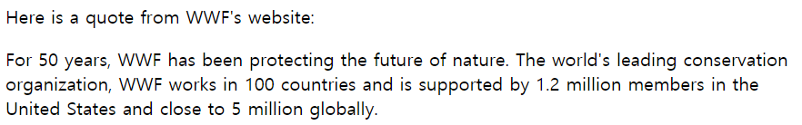

# 텍스트 요소

## 1. 제목 h1

제목이라는 뜻의 heading을 딴 태그

- 사용자 에이전트가 제목의 정보(`<h1>`~`<h6>`)를 사용해 자동으로 문서 콘텐츠의 표(목차)를 만드는 등의 작업을 수행할 수 있습니다.
- 글씨 크기를 위해 제목 태그를 사용하지 마세요. 대신 CSS의 font-size 속성을 사용하세요.
- 제목 단계를 건너뛰는 것을 피하세요. 언제나 `<h1>` 로 시작해서, `<h2>` , 순차적으로 기입하세요.
- 페이지 당 하나의 `<h1>` 만 사용하세요.

## 2. 본문- p

HTML `<p>` 요소는 하나의 문단을 나타냅니다. 문단은 블록 레벨 요소이며, 자신의 닫는 태그(`</p>`) 이전에 다른 블록 레벨 태그가 분석되면 자동으로 닫힙니다.

## 3. 본문- br

line-break 약자로 개행을 위한 태그입니다.

> <strong>참고</strong>: 문단 사이에 여백을 두기 위한 용도로 `<br>`을 사용하지 마세요. 대신 `<p>` 요소로 감싼 후 CSS의 margin 속성으로 여백의 크기를 조절하세요.

## 4. 본문- blockquote, q

### 1) `<blockquote>`: 인용 블록 요소

HTML `<blockquote>` 요소는 안쪽의 텍스트가 긴 인용문임을 나타냅니다.

### 2) `<q>`: 인라인 인용문 요소

HTML `<q>`요소는 둘러싼 텍스트가 짧은 인라인 인용문이라는것을 나타냅니다. 대부분의 브라우저에서는 앞과 뒤에 따옴표를 붙여 표현합니다.

`cite`
인용문의 출처 문서나 메시지를 가리키는 URL. 인용문의 맥락 혹은 출처 정보를 가리킬 용도입니다. 브라우저만 알 수 있고 최종 결과에는 보이지 않습니다.

✨ **예시**

```html
<figure>
  <blockquote cite="https://www.huxley.net/bnw/four.html">
    <p>
      Words can be like X-rays, if you use them properly—they’ll go through
      anything. You read and you’re pierced.
    </p>
  </blockquote>
  <figcaption>—Aldous Huxley, <cite>Brave New World</cite></figcaption>
</figure>
```

🎤 **실행결과**



## 5. 본문- pre

HTML `<pre>` 요소는 미리 서식을 지정한 텍스트를 나타내며, HTML에 작성한 내용 그대로 표현합니다. 텍스트는 보통 **고정폭 글꼴**을 사용해 렌더링하고, 요소 내 공백문자를 그대로 유지합니다.

## 6. 본문- figure, figcaption

HTML `<figure>` 요소는 독립적인 콘텐츠를 표현합니다. `<figcaption>` 요소를 사용해 설명을 붙일 수 있습니다.

## 7. 본문- hr

수평선 horizon
