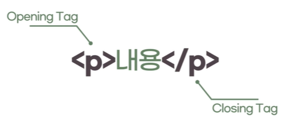

# 1. HTML은 어떻게 생겼을까

- 웹 페이지를 구성하고 있는 요소(element) 하나하나를 <strong>'태그'</strong>라는 표기법을 작성
- 태그를 통해 어떤 요소인지 (제목, 본문, 이미지, 비디오 등) 명시



> 1.  여는 태그(Opening tag): <요소의 이름>
> 2.  닫는 태그(Closing tag): </요소의 이름>
> 3.  내용(Content): 요소의 내용
> 4.  요소(Element): 여는 태그, 닫는 태그, 내용을 통틀어 요소(element)라고 한다.

웹 페이지는 요소들이 나열되어 구성합니다. 코드를 읽을 때 가독성을 위해 될 수 있으면 태그는 모두 **소문자**로 쓰는 것을 권장합니다.

# 2. 빈 요소

HTML은 각각 요소들이 나열되어 있는 형태고 그 요소들은 태그로 구성되어 있습니다. 내용이 없는 요소를 빈 요소라 부르고 이 경우 닫는 태그를 추가로 명시하지 않아도 됩니다. 빈 요소로 쓸 수 있는 태그들은 웹 표준에 정해져있습니다.

✨ **예시**

```html
<br />
<hr />

<meta charset="utf-8" />
<input type="text" name="name" />
```

# 3. 요소의 중첩

태그 안에 text뿐 아니라 다른 요소를 넣어 **포함관계**를 성립할 수 있습니다. 여러 요소가 중첩될 경우에는 열린 순서의 **반대**로 닫혀야만 합니다. 서로의 포함관계(부자관계)를 구분하기 위하여 **들여쓰기**를 사용합니다.

✨ **예시**

```html
<ul>
  <li>하나</li>
  <li>둘</li>
  <li>셋</li>
</ul>
```

HTML문법상 들여쓰기가 필요하진 않지만, 가독성을 위해 들여쓰기를 씁니다.
내용으로 두 가지가 될 수 있는데 첫번째는 태그이고 두번째는 다른 요소입니다.

# 4. 주석

코드에 메모를 추가하거나, 혹은 사용하지 않는 코드를 임시로 처리하기 위함입니다.

# 5. HTML 문서의 구조

어떤 HTML 문서를 열어도 필수적으로 가지고 있는 태그들입니다.

✨ **예시**

```html
<!DOCTYPE html>
<html lang="en">
  <head>
    <meta charset="UTF-8" />
    <meta http-equiv="X-UA-Compatible" content="IE=edge" />
    <meta name="viewport" content="width=device-width, initial-scale=1.0" />
    <title>Document</title>
  </head>
  <body></body>
</html>
```

- `<!DOCTYPE html>`: (없어도 문제는 없으나)선언이 관습화 됨
- `html`: 하나의 HTML 문서에 하나만 있다. 모든 요소들은 html 태그 안에 들어가야 합니다. 페이지 전체의 컨텐츠를 감싸는 루트(root) 요소
  - `head`: 웹 브라우저 화면에 직접적으로 나타나진 않는 웹페이지의 정보
    - meta tag: 문서의 일반적인 정보와 문자 인코딩을 명시
    - title: (문서의 컨텐츠가 아니라) HTML문서 전체의 타이틀 표현하기 위한 메타데이터
  - `body`: body는 그 외 모든것. 웹 브라우저 화면에 나타나는 모든 콘텐츠

# 6. HEAD 태그

- HTML 첫 번째 자식요소인 head 태그
- HTML <head> 요소는 기계가 식별할 수 있는 문서 정보(메타데이터)를 담습니다.
  여기에서 기계는 웹브라우저입니다.

# 7. BODY 태그

- HTML <body> 요소는 HTML 문서의 내용을 나타냅니다.
- 한 문서에 하나의 <body> 요소만 존재할 수 있습니다.

# 8. 태그를 구분짓는 특성

body 영역에 들어가는 태그는 몇 가지 구분으로 나뉠 수 있다.

### 1) 구획을 나누는 태그

- 단독으로 사용했을 때에는 눈에 보이지 않는다.
- 여러가지 요소를 묶어서 그룹화

그룹화할때 하는 태그를 구획을 나누는 태그라고 합니다. 내부 아이템이 없을 때는 눈에 보이지 않습니다.

### 2) 그 자체로 요소인 태그

- 단독으로 사용했을 때에도 눈으로 확인할 수 있다.

# 9. 블록(Block)과 인라인(Inline)

태그를 구분 짓는 특성 중 블록과 인라인도 있습니다.

### 1) 블록(Block)

- 블록 레벨 요소는 언제나 새로운 줄에서 시작하고 좌우 양쪽으로 최대한 늘어나 가능한 모든 너비를 차지합니다.

블록은 본인 너비와 상관없이 한층을 모두 차지합니다. body 아래에 있다면 보여지는 웹 페이지의 가로 너비를 모두 차지합니다. 부모가 허용하는 가로 최대까지 모두 차지합니다.

### 2) 인라인(Inline)

- 인라인 요소는 줄의 어느 곳에서나 시작할 수 있습니다.
- 바로 이전 요소가 끝나는 지점부터 시작하며, 요소의 내용(content)만큼만 차지합니다.

인라인은 해당 컨텐츠가 가지는 공간만큼 차지합니다.

# 10 콘텐츠 카테고리

- 하나의 HTML 요소가 여러 콘텐츠 카테고리 내의 포항관계에 들어갈 수 있습니다.

|                                         |                                                                                          |
| --------------------------------------- | ---------------------------------------------------------------------------------------- |
| 메타데이터 콘텐츠 (Metadata Content)    | 문서의 메타 데이터(정보). 다른 문서를 가리키는 링크 등을 나타내는 요소                   |
| 플로우 콘텐츠 (Flow Content)            | 웹 페이지상에 메타데이터를 제외하고 거의 모든 요소. 보통 텍스트나 임베디드 콘텐츠를 포함 |
| 섹션 콘텐츠 (Section Conetnt)           | 문서의 구획(Section)을 나눌 때 사용                                                      |
| 헤딩 콘텐츠 (Heading Content)           | 섹션의 제목(heading)과 관련된 요소                                                       |
| 프레이징 콘텐츠 (Phrasing Content)      | 문단에서 텍스트를 마크업 할 때 사용                                                      |
| 임베디드 콘텐츠 (Embedded Content)      | 이미지나 비디오 등 외부 소스를 가져오거나 삽입할 때 사용되는 요소                        |
| 인터랙티브 콘텐츠 (Interactive Content) | 사용자와의 상호작용을 위한 컨텐츠 요소입니다.                                            |
