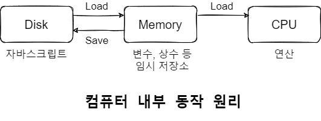
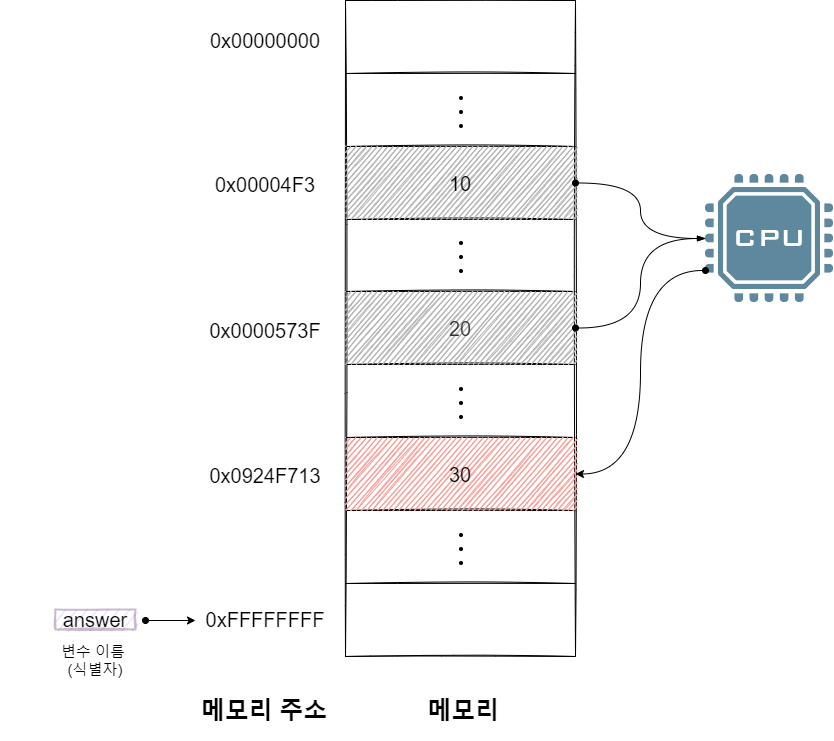
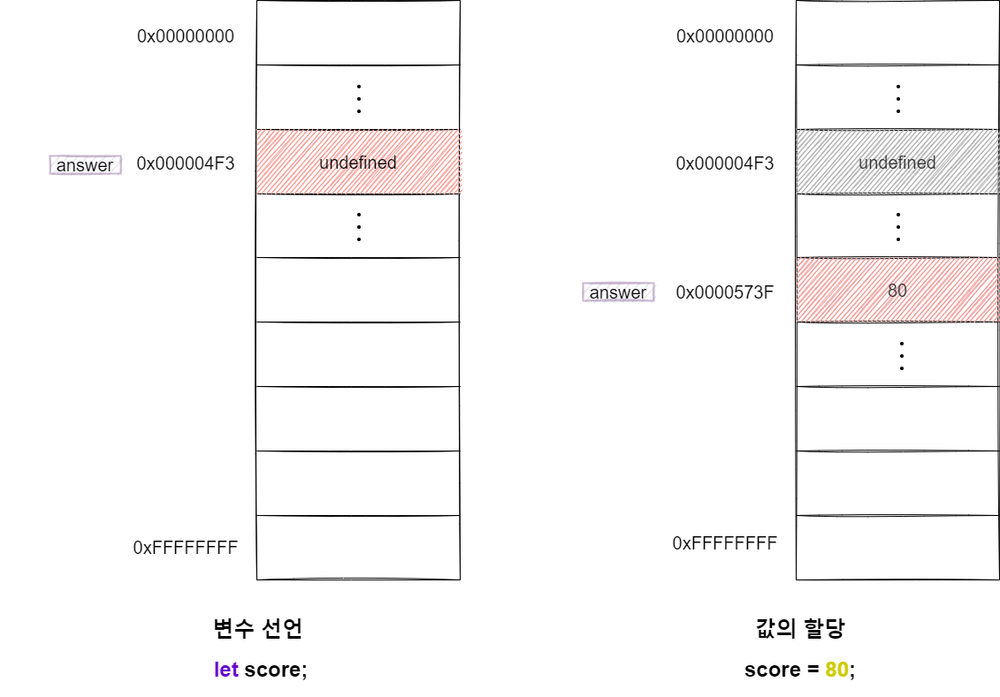
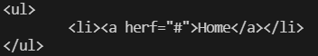

# 데이터 타입
컴퓨터는 연산과 기억을 수행하는 컴포넌트가 나눠져 있습니다. 컴퓨터는 CPU를 사용해 연산하고 메모리를 사용해 데이터를 기억합니다. 


메모리는 데이터를 저장훌 수 있는 셀의 집합체입니다. 메모리 셀 하나의 크기는 1바이트이며 컴퓨터는 메모리 셀의 크기 데이터를 저장(write)하거나 읽어(read) 들입니다. 

## 1. 변수란 무엇인가? 
**변수(Variable)는 하나의 값을 저장하기 위해 확보한 메모리 공간 자체 또는 그 메모리 공간을 식별하기 위해 붙인 이름을 말합니다.** 간단히 변수는 프로그래밍 언어에서 값을 저장하고 참조하는, **값의 위치를 가리키는 상징적인 이름**입니다. 개발자가 직접 메모리 주소를 통해 값을 저장하고 참조하지 않고 변수를 통해 프로그래밍 언어의 인터프리터에 의해 값이 저장된 메모리 공간의 주소로 치환되어 실행됩니다.

> 변수: 재사용할 수 있도록 값이 저장된 메모리 공간에 상징적인 이름을 붙인 것


```javascript
let answer = 10 + 20;
```

10 + 20은 연산을 통해 30을 생성합니다. 그리고 연산을 통해 생성된 값 30은 메모리 공간에 저장됩니다. 이때 메모리 공간에 저장된 값 30을 다시 읽어 들여 재사용할 수 있도록 값이 저장된 메모리 공간에 상징적인 이름을 붙인 것이 변수입니다. 



메모리 공간에 저장된 값을 식별할 수 있는 고유한 이름(위 예제에서는 result)을 **변수명**이라 하고 변수에 저장된 값(위 예제에서는 30)을 **변수 값**이라고 합니다. 변수에 값을 저장하는 것을 **할당(Assignment)**이라 하고 변수에 저장된 값을 읽어 들이는 것을 **참조(Reference)**라 합니다. 

변수 이름을 **식별자(Identifier)**라고도 합니다. 식별자는 값이 아니라 메모리 주소를 기억하고 있습니다. 실별자라는 용어는 변수 이름에만 국한해서 사용하지 않고 메모리 상에 존재하는 어떤 값을 식별할 수 있는 이름은 모두 식별자라고 부릅니다. 예를 들어, 변수, 함수, 클래스 등

### 1) 호이스팅(Hoisting)
- 코드에 선언된 변수 및 함수를 유효한 범위의 코드 상단으로 끌어 올리는 작업
- var 변수 / 함수의 선언만 위로 올려지고 할당은 올려지지 않음
- let / const 변수 선언과 함께 표현식에서는 호이스팅 발생하지 않음


```javascript
// using var
console.log(score);   // output: undefined
var score = 50;
console.log(score);   // output: 50

// hoisting
var name;             // output: undefined
name = "john";
console.log(name);    // output: "john"

// using let / const
// ReferenceError: Cannot access 'name_2' before initialization
consol.log(score_2);
let score_2 = 80;
```

자바스크립트 엔진은 변수 선언이 소스 코드 어디에 있든 상관없이 다른 코드보다 먼저 실행합니다. 위 예제의 코드가 순차적으로 실행되는 런타임에 변수 선언이 실행된다면 console.log(score); 가 실행되는 시점에는 아직 변수가 선언되기 전이라 참조 에러(ReferenceError)가 발생해야 하지만 undefined가 출력됩니다. 

이는 변수 선언(선언과 초기화)이 소스 코드가 순차적으로 실행되는 런타임 이전 단계에 먼저 실행되었기 때문이고 이처럼 **변수 선언문이 코드의 선두로 끌어 올려진 것처럼 동작하는 자바스크립트 고유의 특징을 변수 호이스팅**이라고 합니다.

### 2) 값의 할당
주의할 점은 변수 선언과 값의 할당 실행 시점이 다릅니다. **변수 선언은 소스 코드가 순차적으로 실행되는 시점인 런타임 이전에 먼저 실행됨지만 값의 할당은 소스 코드가 순차적으로 실행되는 시점인 런타임에 실행됩니다.**

```javascript
console.log(score);   // output: undefined
let score = 80;       // ① 변수 선언 ② 값의 할당
console.log(score);   // output: 80
```

① 변수 선언은 런타임 이전에 먼저 실행되고 ② 값의 할당은 런타임에 실행됩니다.




### 3) 값의 재할당
재할당은 변수에 저장된 값을 다른 값으로 변경합니다. 만약 값을 재할당할 수 없어서 변수에 **저장된 값을 변경할 수 없다면 변수가 아니라 상수(Constant)** 라 합니다.


현재 score 변수의 값은 90입니다. 어떤 식별자와도 연결되어 있지 않습니다. 이것은 undefined와 80이 더 이상 필요하지 않다는 것을 의미합니다. 이러한 불필요한 값들은 가비지 콜렉터에 의해 메모리에서 자동 해제됩니다. 

> 가비지 콜렉터는 어플리케이션이 할당한 메모리 공간을 주기적으로 검사하여 더 이상 사용되지 않는 메모리를 해제하는 기능을 말합니다. 더 이상 사용되지 않는 메모리란 어떤 식별자도 참조하지 않는 메모리 공간을 의미합니다. 가비지 콜렉터를 통해 메모리 누수를 방지합니다.

## 2. 자료형 종류
자바스크립트(ES6)는 7개의 데이터 타입을 제공합니다. 6개의 원시 타입(Primitive Type)과 객체 타입(Object / Reference Type)으로 분류할 수 있습니다. 


|데이터 타입|설명|
|---|---|
|숫자 타입|숫자. 정수와 실수 구분 없이 하나의 숫자 타입만 존재|
|문자열 타입|문자열|
|불리언 타입|논리적 참(true)과 거짓(false)|
|undefined 타입|선언 후 값을 할당하지 않은 변수|
|null 타입|값이 없다는 것을 의도적으로 명시할 때 사용하는 값|
|심벌 타입|ES6에서 추가. 문자열과 함께 객체 propery로 사용|
|객체 타입|객체, 함수, 배열 등과 같이 복잡한 개체 저장 가능|


## 3. 숫자 타입
자바스크립트의 숫자 타입은 모든 수를 실수 처리 합니다. 따라서 정수로 표시되는 수끼리 나누더라도 실수가 나올 수 있습니다. 

```javascript
console.log(1 === 1.0); // true 
```

숫자 타입은 추가적으로 세 가지 특별한 값도 표현할 수 있습니다. 
- Infinity: 양의 무한대
- -Infinity: 음의 무한대
- NaN: 산술 연산 불가(Not a Number)


### 4. 문자열 타입
```javascript
let str = hello;  // ReferenceError: heelo is not defined
```

자바스크립트의 문자열은 원시 타입이며 변경 불가능한 값(Immutable Value)입니다. 


## 5. 템플릿 리터럴
템플릿 리터럴은 멀티라인 문자열(Multi-Line String), 표현식 삽입(Expression Interpolation), 태그드 템플릿(Tagged Template) 등 편리한 문자열 처리 기능을 제공합니다. 

### 1) 멀티라인 문자열(Multi-Line String)
일반 문자열 내에서는 줄바꿈(개행)이 허용되지 않습니다. 

|이스케이프 시퀀스(Escape Sequence)|의미|
|---|---|
|`\0`|Null|
|`\b`|백스페이스|
|`\n`|개행(Line Feed): 다음 행으로 이동|
|`\r`|개행(Carriage Return): 커서를 처음으로 이동|
|`\t`|탭(수평)|
|`\v`|탭(수직)|
|`\uXXXX`|유니코드|
|`\'`|작은따옴표|
|`\"`|큰따옴표|
|`\\`|백슬래시|


```javascript
let template = '<ul>\n\t<li><a herf="#">Home</a></li>\n</ul>';
console.log(template);
```




### 2) 표현식 삽입(Expression Interpolation)
템플릿 리터럴 내에서는 표현식 삽입을 통해 간단히 문자열을 삽입할 수 있습니다. 이를 통해 문자열 연산자(+)보다 가독성 좋고 간편하게 문자열을 조합할 수 있습니다. 

```javascript
let fruit = "orange";

//ES6: 표현식 삽입
console.log(`My favorite fruit is ${fruit}`);
```


## 6. undefined 타입
undefined 타입 값은 undefined가 유일합니다. 변수를 참조했을 때 undefined가 반환된다면 참조한 변수가 선언 이후 값이 할당된 적이 없는 **초기화되지 않은 변수**라는 것을 간파할 수 있습니다. 자바스크립트 엔진이 변수를 초기화하는 데 사용하는 undefined를 개발자가 의도적으로 변수에 할당한다면 undefined의 본래 취지와 어긋나기 때문에 null을 할당한다.

> undefined를 직역하면 "정의되지 않은" 이다.

## 7. null 타입
null 타입의 값은 null이 유일합니다. 변수에 null을 할당하는 것은 변수가 이전에 참조하던 값을 더 이상 참조하지 않겠다는 의미입니다. 이는 이전에 할당되어 있던 값에 대한 참조를 명시적으로 제거하는 것을 의미합니다. 

```javascript
let foo = '🎃';
foo = null;
```


함수가 유효한 값을 반환할 수 없는 경우 명시적으로 null을 반환하기도 합니다. 

```html
<body>
  <script>
    let element = document.querySelector('.myClass');
    
    // HTML 문서에 myClass 클래스를 갖는 요소가 없다면 null을 반환합니다.
    console.log(element); // output: null 
  </script>
</body>

```

## 8. 심벌 타입
ES6에서 추가된 7번째 타입으로 변경 불가능한 원시 타입의 값입니다. 심벌 값은 다른 값과 중복되지 않는 유일무이한 값입니다. 따라서 주로 이름이 충돌할 위험이 없는 객체의 유일한 프로퍼티 키를 만들기 위해 사용합니다. 생성된 심벌 값은 외부에 노출되지 않으며 다른 값과 절대 중복되지 않는 유일무이한 값입니다. 


## 9. 동적 타이핑
### 1) 동적 타입 언어와 정적 타입 언어
자바스크립트는 정적 타입 언어와 다르게 변수를 선언할 때 타입을 선언하지 않습니다. 다만 let, const 키워드를 사용해 변수를 선언할 뿐입니다. 자바스크립트의 변수는 정적 타입 언어와 같이 미리 선언한 데이터 타입의 값만 할당할 수 있는 것이 아니라 어떠한 데이터 타입의 값이라도 자유롭게 할당할 수 있습니다.  

자바스크립트의 변수는 **선언이 아닌 할당에 의해 타입이 결정(타입 추론 Type Inference)** 됩니다. 그리고 **재할당에 의해 변수의 타입은 언제든 동적으로 변할 수 있습니다.** 이러한 특징을 동적 타이핑(Dynamic Typing)이라고 하며 정적타입 언어와 구별하기 위해 자바스크립트는 **동적 타입언어**라 합니다.


## 10. 암묵적 타입 변환
### 1) 문자열 타입으로 변환

```javascript
// 숫자 타입
0 + ''              // "0"
-0 + ''             // "0"
1 + ''              // "1"
-1 + ''             // "-1"
NaN + ''            // "NaN"
Infinitiy + ''      // "Infinitiy"
-Infinitiy + ''     // "-Infinitiy"

// 불리언 타입
true + ''           // "true"
false + ''          // "false"

// null 타입
null + ''           // "null"

// undefined 타입
undefined + ''      // "undefined"

// 심벌 타입
(Symbol()) + ''     // TypeError: Cannot conver a Symbol value to a string

// 객체 타입
({}) + ''           // "[object Object]"
Math + ''           // "[object Math]"
[] + ''             // ""
[10, 20] + ''       // "10, 20"
(function(){}) + '' // "function(){}"
Array + ''          // "function Array() { [native code] }"
```

### 2) 숫자 타입으로 변환

```javascript
// 문자열 타입
+ ''                // 0
+ '0'               // 0
+ '1'               // 1
+ 'string'          // NaN

// 불리언 타입
+true               // 1
+false              // 0

// null 타입
+null               // 0

// undefined 타입
+undefined          // NaN

// 심벌 타입
+Symbol()           // TypeError: Cannot conver a Symbol value to a number

// 객체 타입
+{}                 // NaN
+[]                 // 0
+[10, 20]           // NaN
+(function(){})     // NaN
```

### 3) 불리언 타입으로 변환
자바스크립트 엔진은 불리언 타입이 아닌 값을 Truthy 값(참으로 평가되는 값) 또는 Falsy 값(거짓으로 평가되는 값)으로 구분됩니다. 아래 값들은 Falsy 값입니다.
- false
- undefined
- null
- 0, -0
- NaN
- ''(빈 문자열)

## 11. 명시적 타입 변환
명시적으로 타입을 변경하는 방법은 다양합니다. 표준 빌트인 생성자 함수(String, Number,Boolean)를 new 연산자 없이 호출하는 방법과 빌트인 메서드를 사용하는 방법 그리고 앞에서 살펴본 암묵적 타입 변환을 이용하는 방법이 있습니다. 

### 1) 문자열 타입으로 변환
- String 생성자 함수를 new 연산자 없이 호출하는 방법
- Object.prototype.toString 메서드를 사용하는 방법
- 문자열 연결 연산자를 이용하는 방법

### 2) 숫자 타입으로 변환
- Number 생성자 함수를 new 연산자 없이 호출하는 방법
- parseInt, parseFloat 함수를 사용하는 방법(문자열만 숫자 타입으로 변환 가능)
- `+` 단항 산술 연산자를 이용하는 방법
- `*` 산술 연산자를 이용하는 방법

### 3) 불리언 타입으로 변환
- Boolean 생성자 함수를 new 연산자 없이 호출하는 방법
- ! 부정 논리 연산자를 두 번 사용하는 방법


## 참고 자료 및 강의📑

- 제로베이스 강의 - 자바스크립트
- 모던 자바스크립트 Deep Dive 도서