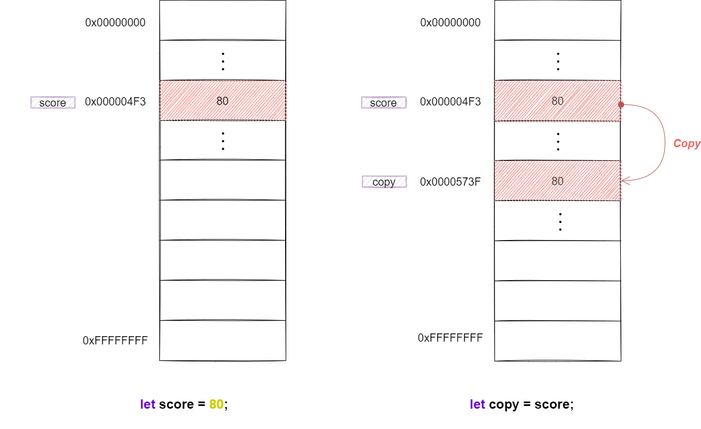
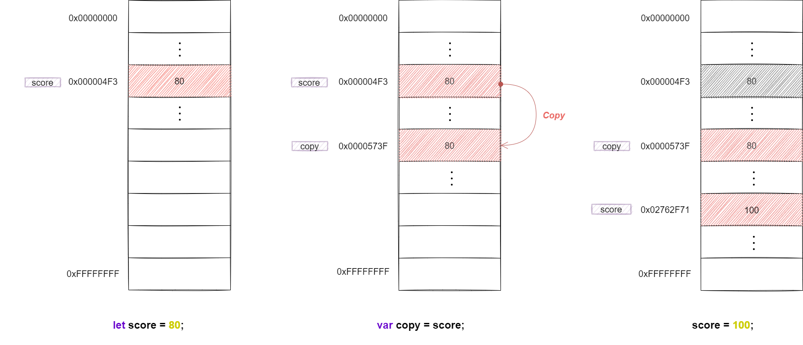
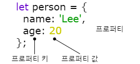
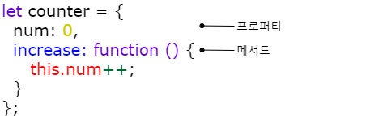
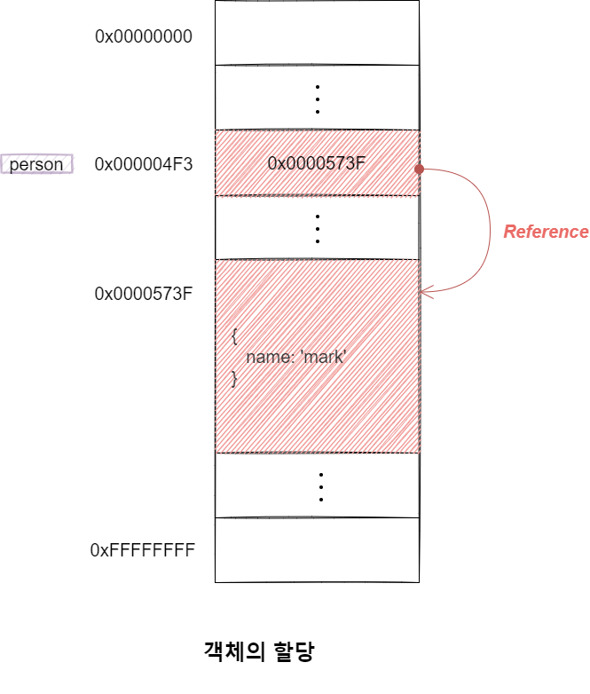
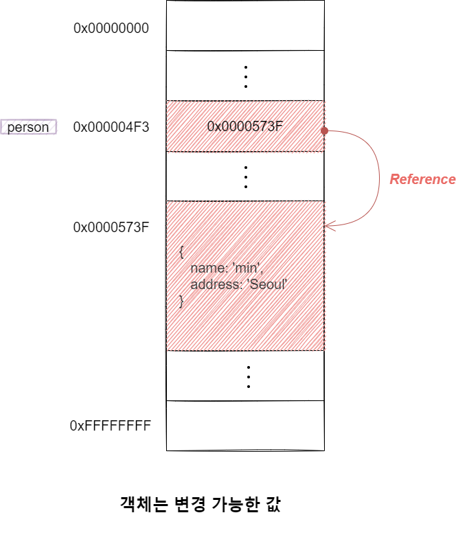
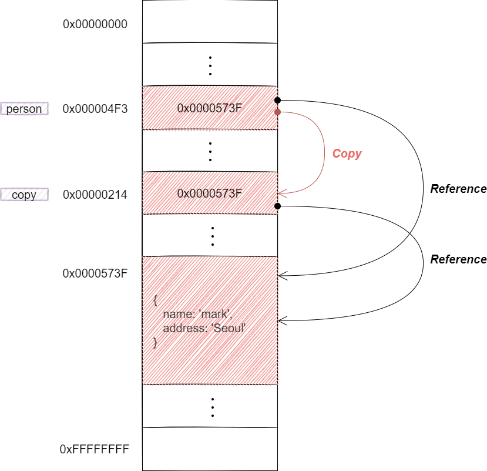

# 객체

## 원시값과 객체의 비교
자바스크립가 제공하는 7가지 데이터 타입(숫자, 문자열, 불리언, null, undefined, 심벌, 객체 타입)은 크게 원시 타입(Primitive Type)과 객체 타입(Object / Reference Type)으로 구분할 수 있습니다. 


원시 값을 제외한 나머지 값(함수, 배열, 정규 표현식 등)은 모두 객체다. 원시 타입은 단 하나의 값만 나타내지만 객체 타입(Object / Reference Type)은 다양한 타입의 값(원시 값 또는 다른 객체)을 하나의 단위로 구성한 복합적인 자료구조(Data Structure)다. 


|원시 값(primitivie)|객체(Object)|
|---|---|
|원시 타입의 값, 즉 원시 값은 변경 불가능한 값(Immutable Value) 입니다.|객체(참조) 타입의 값, 즉 객체는 변경 가능한 값(Mutable Value)입니다.|
|원시 값을 변수에 할당하면 변수(확보된 메모리 공간)에는 실제 값이 저장됩니다.|객체를 변수에 할당하면 변수(확보된 메모리 공간)에는 참조 값이 저장됩니다.|
|원시 값을 갖는 변수를 다른 변수에 할당하면 원본의 원시 값이 복사되어 전달됩니다. → 값에 의한 전달(Pass by value)|객체를 가리키는 변수를 다른 변수에 할당하면 원보의 참조 값이 복사되어 전달됩니다. -> 참조에 의한 전달(Pass by reference)|
|원시 타입은 단 하나의 값만 나타냅니다.|객체 타입(Object / Reference Type)은 다양한 타입의 값(원시 값 또는 다른 객체)을 하나의 단위로 구성한 복합적인 자료구조(Data Structure)입니다.|
|- 숫자(Number)<br>- 문자열(String)<br>- 불리언(Boolean)<br>- undefined<br>- null<br>- Symbol(ES6)<br>|- 배열(Array)<br>- 함수(Function)<br>- 정규표현식<br>|


## 1. 원시 값
### 1) 변경 불가능한 값
**원시 타입(Primitive Type)의 값, 원시 값은 변경 불가능한 값**입니다. 변수와 값은 구분해서 생각해야 합니다. **변경 불가능하다는 것은 변수가 아니라 값에 대한 진술입니다.** 상수는 재할당이 금지된 변수입니다. 변수는 언제든지 재할당을 통해 변수 값을 변경할 수 있습니다. 

```javascript
const o = {};

// const 키워드를 사용해 사용한 변수에 할당한 원시 값(상수)은 변경할 수 없습니다.
// 하지만 const 키워드를 사용해 선언한 변수에 할당한 객체는 변경할 수 있습니다.
o.a = 1;
console.log(o);   // {a: 1}
```

원시 값은 변경 불가능한 값. 원시 값을 할당한 변수에 새로운 원시 값을 재할당하면 메모리 공간에 저장되어 있는 재할당 이전의 원시 값을 변경하는 것이 아니라 새로운 메모리 공간을 확보하고 재할당한 원시 값을 저장한 후, 변수는 새롭게 재할당한 원시 값을 가리킨다. 변수 값을 변경하기 위해 원시 값을 재할당하면 새로운 메모리 공간을 확보하고 재할당한 값을 저장한 후, 변수가 참조하던 메모리 공간의 주소를 변경합니다. 값의 이러한 특성을 **불변성(Immutability)**이라 합니다.


### 2) 값에 의한 전달

```javascript
let score = 80;
let copy = score;


score = 100;

console.log(score);   // 100
console.log(copy);    // 80

```

변수에 원시 값을 갖는 변수를 할당하면 할당받는 변수(copy)에는 할당되는 변수(score)의 원시 값이 복사되어 전달됩니다. 이를 값에 의한 전달이라 합니다. 

```javascript
let score = 80;
let copy = score;

console.log(score);   // 80
console.log(copy);    // 80
console.log(score === copy);    // 80
```

socre 변수와 copy 변수의 값 80은 다른 메모리 공간에 저장된 별개의 값입니다.




```javascript
let score = 80;
let copy = score;

score = 100;
console.log(score, copy);       // 100 80
console.log(score === copy);    // false
```

score 변수와 copy 변수의 값 80은 다른 메모리 공간에 저장된 별개의 값이라 score 변수의 값을 변경해도 copy 변수의 값에는 어떠한 영향도 주지 않습니다. 



엄격하게 표현하면 **변수에는 값이 전달되는 것이 아니라 메모리 주소가 전달됩니다.** 변수와 같은 식별자는 값이 아니라 메모리 주소를 기억하고 있기 때문입니다. 식별자는 메모리 주소에 붙인 이름이라고 할 수 있습니다. ""값에 의한 전달"이 사실은 메모리 주소를 전달하는 것 입니다. 단, 전달된 메모리 주소를 통해 메모리 공간에 접근하면 값을 참조할 수 있습니다. 

중요한 것은 변수에 원시 값을 갖는 변수를 할당하면 변수 할당 시점이든, 두 변수 중 어느 하나의 변수에 값을 재할당하는 시점이든 score 변수와 copy 변수의 원시 값은 **서로 다른 메모리 공간에 저장된 별개의 값이 되어 어느 한쪽에서 재할당을 통해 값을 변경하더라도 서로 간섭할 수 없다는 것**입니다. 


### 2 객체
### 1) 객체란?
객체란 0개 이상의 프로퍼티로 구성된 집합이며 프로퍼티는 키(Key)와 값(Value)으로 구성됩니다. 객체는 프로퍼티의 개수가 정해져 있지 않으며, 동적으로 추가되고 삭제할 수 있습니다. 원시 값과 같이 확보해야 할 메모리 공간의 크기를 사전에 정해 둘 수 없습니다.



자바스크립트에서 사용할 수 있는 모든 값은 프로퍼티 값이 될 수 있습니다. 함수도 프로퍼티가 될 수 있습니다. 프로퍼티 값이 함수일 경우 일반 함수와 구분하기 위해 메서드(Method)라 부릅니다. 



- 프로퍼티: 객체의 상태를 나타내는 값(data)
- 메서드: 프로퍼티(상태 데이터)를 참조하고 조작활 수 있는 동작

이처럼 객체는 객체의 상태를 나타내는 값(프로퍼티)과 프로퍼티를 참조하고 조작할 수 있는 동작(메서드)을 모두 포함할 수 있기 때문에 상태와 동작을 하나의 단위로 구조화할 수 있어 유용합니다. 

### 2) 변경 가능한 값
객체(참조) 타입의 값, 즉 객체는 변경 가능한 값(Mutable Value)이다. 먼저 원시 값을 할당한 변수는 메모리 주소를 통해 메모리 공간에 접근하면 원시 값 자체를 값으로 갖습니다. 그러나 객체를 할당한 변수가 기억하는 메모리 주소를 통해 메모리 공간에 접근하면 참조 값(Reference Value)에 접근할 수 있습니다. 참조 값은 생성된 객체가 저장된 메모리 공간의 주소, 그 자체. 객체를 할당한 변수를 참조하면 메모리에 저장되어 있는 참조 값을 통해 실제 객체에 접근합니다.




```javascript
// 할당이 이뤄지는 시점에 객체 리터럴이 해석되고 그 결과 객체가 생성됩니다.
let person = {
  name = 'mark'
}

// person 변수에 저장되어 있는 참조 값으로 실제 객체에 접근합니다.
console.log(person);    // {name: "mark"}
```

원시 값은 변경 불가능한 값이라 원시 값을 갖는 변수의 값을 변경하려면 **재할당** 외에는 방법이 없다. 하지만 객체는 변경 가능한 값으로 재할당 없이 **프로퍼티를 동적으로 추가할 수도 있고 프로퍼티 값을 갱신할 수도 있으며 프로퍼티 자체를 삭제할 수도 있습니다.** 이떄 객체를 할당한 변수에 재할당을 하지 않았으므로 객체를 할당한 변수의 참조 값은 변경되지 않습니다.

```javascript
// 프로퍼티 값 갱신
person.name = 'min';

// 프로퍼티 동적 생성
person.address = 'Seoul';

console.log(person);    // {name: "min", address: "Seoul"}
```




## 3. 객체 리터럴에 의한 객체 생성
자바 같은 클래스 기반 객체지향 언어는 클래스를 사전에 정의하고 필요한 시점에 new 연산자와 함께 생성자(Constructor)를 호출하여 인스턴스를 생성하는 방식으로 객체를 생성합니다. 

💡 [참고] 인스턴스(Instance)란 클래스에 의해 생성되어 메모리에 저장된 실체를 말합니다. 객체지향 프로그래밍에서 객체는 클래스와 인스턴스와 인스턴스를 포함한 개념입니다. 클래스는 인스턴스를 생성하기 위한 템플릿의 역할을 합니다. 인스턴스는 객체가 메모리에 저장되어 실제로 존재하는 것에 초점을 맞춘 용어입니다. 

자바스크립트는 프로토타입 기반 객체지향 언어로서 클래스 기반 객체지향 언어와는 달리 다양한 객체 생성 방법을 지원합니다. 

- 객체 리터럴
- Object 생성자 함수
- 생성자 함수
- Object.create 메서드
- 클래스(ES6)

가장 일반적이고 간단한 방법인 **객체 리터럴**은 중괄호({...}) 내에 0개 이상의 프로퍼티를 정의합니다. 변수에 할당되는 시점에 자바스크립트 엔진은 리터럴을 해석해 객체를 생성합니다. 

💡 [참고] 리터럴(Literal)은 사람이 이해할 수 있는 문자 또는 약속된 기호를 사용해 값을 생성하는 표기법(Notation)을 말합니다. 자바스크립트 엔진은 코드가 실행되는 시점인 런타임(Runtime)에 리터럴을 평가해 값을 생성합니다. 즉, 리터럴은 값을 생성하기 위해 미리 약속한 표기법이라고 할 수 있습니다. 

```javascript
let person = {
  name: 'mark', 
  sayHello: function () {
    console.log(`Hello! My name is ${this.name}.`);
  }
};
```

객체 리터럴 중괄호는 코드 블록이 아닙니다. 코드 블록의 닫는 중괄호 뒤에는 세미콜론을 붙이지 않습니다. 객체 리터럴은 값으로 평가되는 표현식이라 객체 리터럴의 닫는 중괄호 뒤에는 세미콜론을 붙입니다. 

자바스크립트는 객체를 생성하기 위해 클래스를 먼저 정의하고 new 연산자와 함께 생성자를 호출할 필요 없이 리터럴로 객체를 생성합니다. 객체 리터럴에 프로퍼티를 포함시켜 객체를 생성함과 동시에 프로퍼티를 만들 수도 있고 객체를 생성한 이후에 프로퍼티를 동적으로 추가할 수도 있습니다. 

## 4. 메서드
프로퍼티 값이 함수일 경우 일반 함수와 구분하기 위해 메서드라고 부릅니다. 

 ```javascript
let circle = {
  radius: 5,     // 프로퍼티

  // 원의 지름
  getDiameter: function() {   // 메서드
    return 2 * this.radius;   // this는 circle을 가리킨다.
  }
}
```
메서드 내부에서 사용한 this 키워드는 객체 자신을 가리키는 참조변수입니다. 


## 5. 프로퍼티
**객체는 프로퍼티의 집합이며, 프로퍼티는 키와 값으로 구성됩니다.**

```javascript
let parson = {
  // 프로퍼티 키는 name, 프로퍼티 값은 'mark'
  name: 'mark',
  // 프로퍼티 키는 age, 프로퍼티 값은 20
  age: 20
};
```

- 프로퍼티 키: 빈 문자열을 포함하는 모든 문자열 또는 심벌 값
- 프로퍼티 값: 자바스크립트에서 사용할 수 있는 모든 값

이미 존재하는 프로퍼티 키를 중복 선언하면 나중에 선언한 프로퍼티가 먼저 선언한 프로퍼티를 덮어씁니다. 에러 발생X


### 1) 프로퍼티 접근
프로퍼티 접근 방법 두 가지
- 마침표 프로퍼티 접근 연산자(.)를 사용하는 **마침표 표기법(Dot Notation)**
- 대괄호 프로퍼티 접근 연산자([...])를 사용하는 **대괄호 표기법(Bracket Notation)**

```javascript
let person = {
  name: 'mark'
};

// 마침표 표기법에 의한 프로퍼티 접근
console.log(person.name);   // mark

// 대괄호 표기법에 의한 프로퍼티 접근. 프로퍼티 키는 따옴표로 감싼 문자열
console.log(person['name']);   // mark
```

### 2) 프로퍼티 동적 생성
존재하지 않는 프로퍼티에 값을 할당하면 프로퍼티가 동적으로 생성되어 추가되고 프로퍼티 값이 할당됩니다. 

```javascript
let person = {
  name: 'mark'
};

// person 객체에 age 프로퍼티가 동적으로 생성되고 값이 할당됨
person.age = 20;

console.log(person);   // {name: 'mark', age: 20}
```

### 3) 프로퍼티 삭제
delete 연산자는 객체의 프로퍼티를 삭제합니다. 
```javascript
let person = {
  name: 'mark'
};

person.age = 20;

delete person.age;

// person 객체에 address 프로퍼티가 존재하지 않습니다.
// 따라서 delete 연산자로 address 프로퍼티를 삭제할 수 없습니다. 이때 에러는 발생하지 않습니다. 
delete person.address;

console.log(person);   // {name: 'mark'}
```

## 6. 얕은 복사(Shallow Copy)와 깊은 복사(Deep Copy)

가리키는 대상 전체를 복사하는 방법은 ① 객체를 프로퍼티 값으로 갖는 객체의 경우 얕은 복사는 한 단계까지만 복사하는 것을 말하고 ② 깊은 복사는 객체에 중첩되어 있는 객체까지 모두 복사하는 것을 말합니다. 

### 1) 참조에 의한 전달
객체를 가리키는 변수(원본, person)를 다른 변수(사본, admin)에 할당하면 원본의 참조 값이 복사되어 전달됩니다. 이를 참조에 대한 전달이라고 합니다. 




이때 원본 person과 사본 admin은 저장된 메모리 주소는 다르지만 동일한 참조 값을 갖습니다. 모두 동일한 객체를 가리켜 두 개의 식별자가 하나의 객체를 공유합니다. 따라서 원본 또는 사본 중 어느 한쪽에서 객체를 변경(변수에 새로운 객체를 재할당하는 것이 아니라 객체의 프로퍼티 값을 변경하거나 프로퍼티를 추가, 삭제)하면 서로 영향을 주고 받습니다. 


```javascript
let person = {
  name: 'mark',
  address: 'Seoul'
}

let copy = person;

// copy와 person은 동일한 객체를 참조한다.
console.log(copy === person);    // true

copy.name = 'heart';

console.log(copy.name);    // "heart"
console.log(person.name);   // "heart"

person.address = 'Canada';
console.log(copy.address);     // "Canada"
console.log(person.address);    // "Canada"

console.log(copy);       // {name: "heart", address: "Canada"}
console.log(person);     // {name: "heart", address: "Canada"}
```


✨ **문제**

```javascript
let person1 = {
  name: 'mark'
}

let person2 = {
  name: 'mark'
}

console.log(person1 === person2);     // ①
console.log(person1.name === person2.name);     // ②
```

객체 리터럴은 평가될 때마다 객체를 생성합니다. 따라서 person1 변수와 person2 변수가 가리키는 객체는 내용은 같지만 다른 메모리에 저장된 별개의 객체입니다. ①은 참조 값이 다른 false입니다. 그러나 person1.name과 person2.name은 값으로 평가될 수 있는 표현식입니다. 두 표현식 모두 원시 값 'mark'로 평가됩니다. ②는 true입니다.


## 7. ES6에서 추가된 객체 리터럴의 확장 기능
### 1) 프로퍼티 축약 표현
```javascript
// ES5
let x = 1, y = 2;

let obj = {
  x: x,
  y: y
};

console.log(obj);   // {x: 1, y: 2}

```

```javascript
// ES6
let x = 1, y = 2;

// 프로퍼티 축약 표현
let obj = { x, y };

console.log(obj);   // {x: 1, y: 2}
```

### 2) 계산된 프로퍼티 이름

```javascript
// ES5
let perfix = 'prop';
let i = 0;

let obj = {};

// 계산된 프로퍼티 이름으로 프로퍼티 키 동적 생성
obj[prefix + '_' + ++i] = i;
obj[prefix + '_' + ++i] = i;
obj[prefix + '_' + ++i] = i;

console.log(obj);   // {prop-1: 1, prop-2: 2, prop-3: 3}
```


```javascript
// ES6
let perfix = 'prop';
let i = 0;

// 객체 리터럴 내부에서 계산된 프로퍼티 이름으로 프로퍼티 키 동적 생성
const obj = {
  [`${prefix}-${++i}`]: i,
  [`${prefix}-${++i}`]: i,
  [`${prefix}-${++i}`]: i
};

console.log(obj);   // {prop-1: 1, prop-2: 2, prop-3: 3}
```

### 3) 메서드 축약 표현

```javascript
// ES5
let obj = {
  name = 'mark',
  sayHi = function() {
    console.log('Hi!' + this.name);
  }
};
 
console.log(obj);   // Hi! mark
```


```javascript
// ES6
let obj = {
  name = 'mark',
  sayHi() {
    console.log('Hi!' + this.name);
  }
};
 
console.log(obj);   // Hi! mark
```


