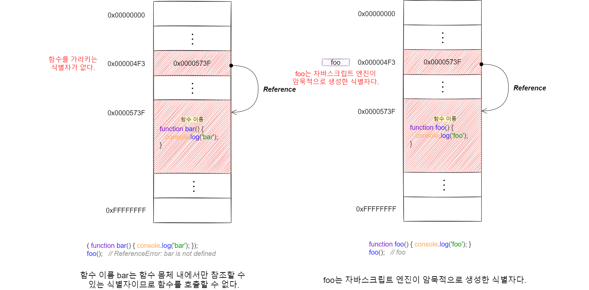
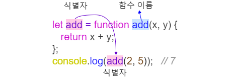
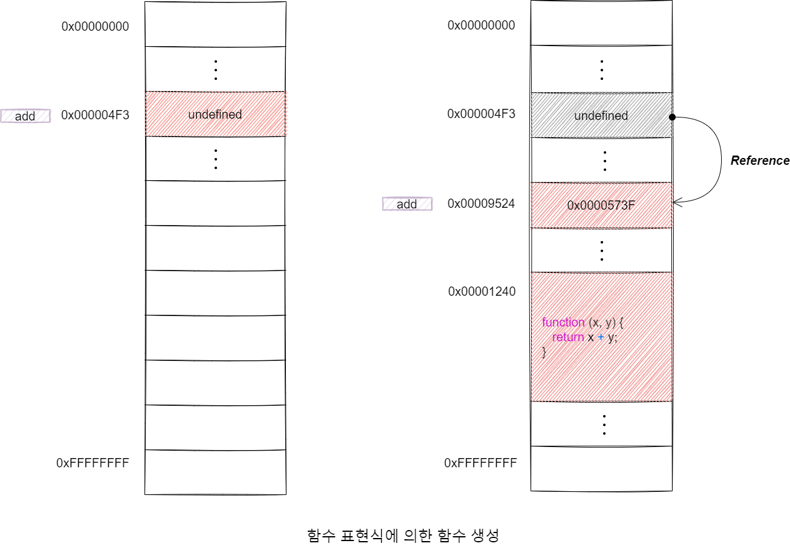

# 함수
## 1. 함수 정의

|함수 정의 방식|예시|
|---|---|
|함수 선언문|function add(x,y) {<br>&nbsp;return x + y;<br>}|
|함수 표현식|let add = function (x,y) {<br>&nbsp;return x + y;<br>};|
|Function 생성자 함수|let add = new Function('x', 'y', 'return x + y');|
|화살표 함수(ES6)|let add = (x, y) => x + y;|

### 1) 함수 선언문
함수 리터럴과 형태가 동일합니다. 함수 리터럴은 함수 이름을 생략할 수 있으나 함수 선언문은 함수 이름을 생략할 수 없습니다. 

```javascript
// 함수 선언문
function add(x, y) {
  return x + y;
}

// 함수 참조
// console.dir은 console.log와는 달리 함수 객체의 프로퍼티까지 출력합니다.
console.dir(add);     // f add(x, y)


// 함수 호출
console.log(add(2, 5));   // 7
```

함수 선언문은 표현식이 아닌 문이므로 변수에 할당할 수 없습니다. 




자바스크립트 엔진은 함수 선언문을 해석해 함수 객체를 생성합니다. 이때 함수 이름은 함수 몸체 내부에서만 유효한 식별자이므로 함수 이름과는 별도로 생성된 함수 객체를 가리키는 식별자가 필요합니다. 함수 객체를 가리키는 식별자가 없으면 생서된 함수 객체를 참조할 수 없으므로 호출할 수도 없습니다. 따라서 **자바스크립트 엔진은 생성된 함수를 호출하기 위해 함수 이름과 동일한 이름의 식별자를 암묵적으로 생성하고 거기에 함수 객체를 할당합니다.**



**함수는 함수이름으로 호출하는 것이 아니라 함수 객체를 가리키는 식별자로 호출합니다.** 결론적으로 자바스크립트 엔진은 함수 선언문을 함수 표현식으로 변환해 함수 객체를 생성한다고 생각할 수 있습니다. 


### 2) 함수 표현식
함수 리터럴로 생성한 함수 객체를 변수에 할당할 수 있는데 이러한 함수 정의 방식을 함수 표현식(Function Expression)이라 합니다.

```javascript
// 함수 표현식
let add = function foo(x, y) {
  return x + y;
}

// 함수 객체를 가리키는 식별자로 호출
console.log(add(2, 5));   // 7

// 함수 이름으로 호출하면 ReferenceError가 발생합니다.
// 함수 이름은 함수 몸체 내부에서만 유효한 식별자
console.log(foo(2, 5));   // ReferenceError: foo is not defined
```

함수 선언문은 "표현식이 아닌 문"이고 함수 표현식은 "표현식인 문"입니다. 


## 2. 함수 생성 시점과 함수 호이스팅

```javascript
// 함수 참조
console.dir(add);   // f add(x, y)
console.dir(sub);   // undefined

// 함수 호출
console.log(add(2, 5));   // 7
console.log(sub(2, 5));   // TypeError: sub is not a function

// 함수 선언문
let add (x, y) {
  return x + y;
}

// 함수 표현식
let sub = function (x, y) {
  return x - y;
};
```

함수 선언문으로 정의한 함수는 함수 선언문 이전에 호출할 수 있습니다. 그러나 함수 표현식으로 정의한 함수는 함수 표현식 이전에 호출할 수 없습니다. 이는 **함수 선언문으로 정의한 함수와 함수 표현식으로 정의한 함수의 생성 시점이 다르기 때문입니다.**

함수 선언문으로 함수를 정의하면 런타임 이전에 자바스크립트 엔진에 의해 먼저 실행됩니다. 함수 선언문으로 함수를 정의하면 런타임 이전에 함수 객체가 먼저 생성됩니다. 그리고 자바스크립트 엔진은 함수 이름과 동일한 이름의 식별자를 암묵적으로 생성하고 생성된 함수 객체를 할당합니다. 

즉, 코드가 한 줄씩 순차적으로 실행되기 시작하는 런타임에는 이미 함수 객체가 생성되어 있고 함수 이름과 동일한 식별자에 할당까지 완료된 상태라 함수 선언문 이전에 함수를 참조할 수 있어 호출할 수 있습니다. 이처럼 **함수 선언문이 코드의 선두로 끌어 올려진 것처럼 동작하는 자바스크립트 고유의 특징을 함수 호이스팅(Function Hoisting)이라 합니다.**


### 1) 함수 호이스팅과 변수 호이스팅
공통점: 변수 선언문과 함수 선언문은 런타임 이전에 자바스크립트 엔진에 의해 먼저 실행되어 식별자를 생성


|함수 선언문|변수 선언문|
|---|---|
|함수 선언문으로 암묵적으로 생성된 식별자는 함수 객체로 초기화|let 키워드를 사용한 변수 선언문 이전에 변수를 참조하면 변수 호이스팅에 의해 undefined로 초기화|
|변수에 할당되는 값이 함수 리터럴 문으로 변수 선언문과 변수 할당문을 한 번에 기술한 축약 표현과 동일하게 동작| 변수 할당문의 값은 할당문이 실행되는 시점, 즉 런타임에 평가되므로 함수 표현식의 함수 리터럴도 할당문이 실행되는 시점에 평가되어 함수 객체가 됩니다.|

따라서 **함수 표현식으로 함수를 정의하면 함수 호이스팅이 발생하는 것이 아니라 변수 호이스팅이 발생합니다.**





