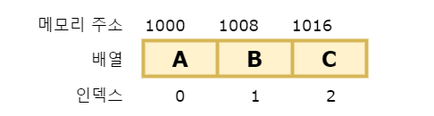
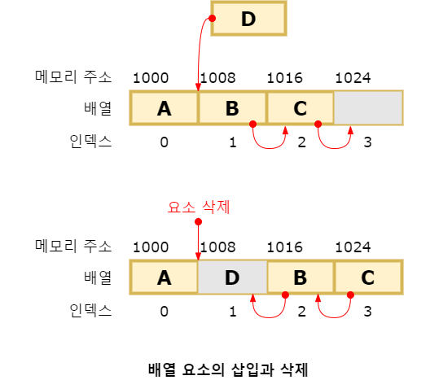
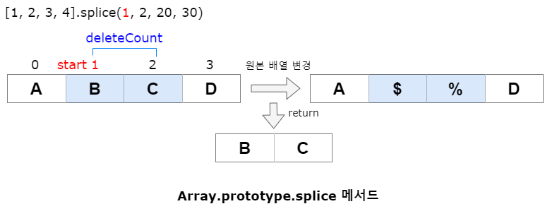
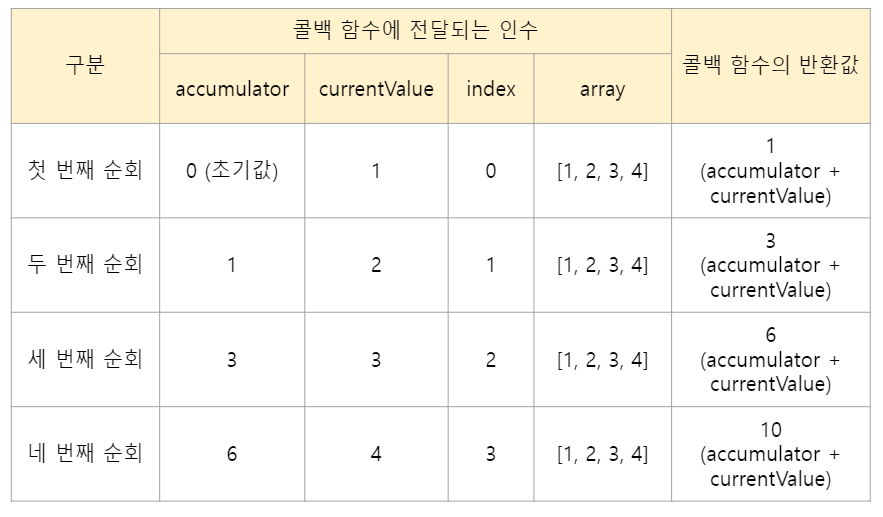

# 배열
## 1. 배열이란?
배열이 가지고 있는 값을 요소(Element)라고 부릅니다. 자바스크립트의 모든 값은 배열의 요소가 될 수 있습니다. 

## 2. 자바스크립트 배열은 배열이 아니다.
자료구조에서 말하는 배열은 동일한 크기의 **메모리 공간이 빈틈없이 연속적으로 나열된 자료구조**를 말하는데 이러한 배열을 밀집 배열(Dense Array)라 합니다. 



이처럼 연속적으로 이어져 있으면 인덱스를 통해 단 한 번의 연산으로 임의의 요소에 접근(임의 접근(Random Access), 시간복잡도O(1))할 수 있습니다. 이는 매우 효율적이고 빠르게 동작합니다. 

이처럼 배열은 인덱스를 통해 효율적으로 요소에 접근할 수 있다는 장점이 있는데, 정렬되지 않은 배열에서 특정하 요소를 검색하는 경우 배열의 모든 요소를 처음부터 특정 요소를 바견할 때까지 차례대로 검색(선형 검색(Linear Search), 시간 복잡도 O(n))해야 합니다. 

 ```javascript
// 선형 검색을 통해 배열(Array)에 특정 요소(Target)가 존재하는지 확인한다.
// 배열에 특정 요소가 존재하면 특정 요소의 인덱스를 반화하고 존재하지 않으면 -1을 반환
function linearSearch(array, target) {
  const length = array.length;

  for ( let i = 0; i < length; i++ ) {
    if ( array[i] === target ) return i;
  }

  return -1;
}

console.log(linearSearch([1, 2, 3, 4, 5, 6], 3));   // 2
console.log(linearSearch([1, 2, 3, 4, 5, 6], 0));   // -1
```

또한 배열에 요소를 삽입하거나 삭제하는 경우 배열의 요소를 연속적으로 유지하기 위해 요소를 이동시켜야 하는 단점이 있습니다.




자바스크립트의 배열은 자료구조에서 말하는 일반적인 의미의 배열과 다릅니다. 즉, 배열의 요소를 위한 각각의 메모리 공간은 동일한 크기를 갖지 않아도 되며, 연속적으로 이어져 있지 않을 수도 있습니다. **배열의 요소가 연속적으로 이어져 있지 않는 배열을 희소 배열(Sparse Array)**이라 합니다. **자바스크립트의 배열은 일반적인 배열의 동작을 흉내 낸 특수한 객체입니다.** 자바스크립트에서 사용할 수 있는 모든 값은 객체의 프로퍼티 값이 될 수 있으므로 어떤 타입의 값이라도 배열의 요소가 될 수 있습니다. 

###  일반적인 배열과 자바스크립트 배열의 장단점
- 일반적인 배열은 인덱스로 요소에 빠르게 접근할 수 있습니다. 하지만 특정 요소를 검색하거나 요소를 삽입 또는 삭제하는 경우에는 효율적이지 않습니다.
- 자바스크립트 배열은 **해시 테이블**로 구현된 객체이므로 인덱스로 요소에 접근하는 경우 일반적인 배열보다 성능적인 면에서 느릴 수밖에 없는 구조적인 단점이 있습니다. 하지만 특정 요소를 검색하거나 요소를 삽입 또는 삭제하는 경우에는 일반적인 배열보다 빠른 성능을 기대할 수 있습니다.

## 3. length 프로퍼티와 희소 배열
length 프로퍼티 값은 요소의 개수를 임의의 숫자 값을 명시적으로 할당할 수 있습니다. 

```javascript
const arr1 = [1, 2, 3, 4, 5]; // output: [1, 2, 3]
arr1.length = 3;

const arr2 = [1];             // output: [1, empty x 2]
arr1.length = 3;

```

empty x 2는 실제로 추가된 배열의 요소가 아닙니다. 즉, arr[1], arr[2]에는 값이 존재하지 않습니다. 일반적인 배열의 length는 배열의 요소의 개수, 즉 배열의 길이와 일치합니다. 그러나 희소 배열은 length와 배열 요소의 개수가 일치하지 않습니다. 희소 배열의 length는 희소 배열의 실제 요소 개수보다 언제나 큽니다. 배열을 생성할 경우에는 희소 배열을 생성하지 않도록 주의하고 배열에는 같은 타입의 요소를 연속적으로 위치시키는 것이 최선입니다. 

## 4. 배열 생성
### 1) 배열 리터럴

```javascript
// 배열 리터럴에 요소를 하나도 추라하지 않으면 배열의 길이는 0인 빈 배열이 됩니다.
const arr1 = [];

// 배열 리터럴에 요소를 생략하면 희소 배열이 생성됩니다.
const arr2 = [1, , 3];  // output: [1, empty, 3]
console.log(arr2[1]);   // output: undefined
```

### 2) Array 생성자 함수
Object 생성자 함수를 통해 객체를 생성할 수 있듯이 Array 생성자 함수를 통해 배열을 생성할 수도 있습니다. Array 생성자 함수는 전달된 인수의 개수에 따라 다르게 동작!

```javascript
const arr = new Array(10);     // output: [empty x 10]
```

전달된 인수가 없는 경우 빈 배열 생성. 배열 리터럴 []과 같습니다.

```javascript
new Array();                   // output: []
```

전달된 인수가 2개 이상이거나 숫자가 아닌 경우 인수를 요소로 갖는 배열을 생성합니다.. 전달된 인수가 1개지만 숫자가 아니면 인수를 요소로 갖는 배열을 생성합니다.

```javascript
new Array(1, 2, 3);            // output: [1, 2, 3]

new Array({});                 // output: [{}}]        
```

Array 생성자 함수는 new 연산자와 함께 호출하지 않고 일반 함수로 호출해도 배열을 생성하는 생성자 함수로 동작합니다. 이는 Array 생성자 함수 내부에서 new.target을 확인하기 때문입니다. 

```javascript
Array(1, 2, 3);                // output: [1, 2, 3]
```


### 3) Array.of
ES6에서 도입된 Array.of 메서드는 **전달된 인수를 요소**로 갖는 배열을 생성합니다. 

✨ **예시**

```javascript
Array.of(1);                   // output: [1] 
Array.of(1, 2, 3);             // output: [1, 2, 3]
Array.of('string');            // output: ['string']
```

### 4) Array.from
ES6에서 도입된 Array.from 메서드는 유사 배열 객체(Array-Like Object) 또는 이터러블 객체(Iterable Object)를 인수로 전달받아 배열로 변환하여 반환합니다. 

✨ **예시**

```javascript
// 유사 배열 객체를 변환하여 배열을 생성합니다.
Array.form({ length: 2, 0: 'a', 1: 'b'});

// 이터러블을 변환하여 배열을 생성합니다. 문자열은 이터러블입니다.
Array.from('Hello');    // ['H', 'e', 'l', 'l', 'o']

```


## 5. 배열 요소의 추가와 갱신
인덱스는 요소의 위치를 나타내므로 반드시 0이상의 정수(또는 정수 형태의 문자열)를 사용해야 합니다. 만약 정수 이외의 값을 인덱스처럼 사용하면 요소가 생성되는 것이 아니라 **프로퍼티가 생성**됩니다. 이때 추가된 프로퍼티는 length 프로퍼티 값에 영향을 주지 않습니다.

✨ **예시**

```javascript
const arr = [];

// 배열 요소의 추가
arr[0] = 1;
arr['1'] = 2;

// 프로퍼티 추가
arr['foo'] = 3;
arr.bar = 4;
arr[1.1] = 5;
arr[-1] = 6;

console.log(arr);                // [1, 2, foo: 3, bar: 4, '1.1': 5, '-1': 6]

// 프로퍼티는 length에 영향을 주지 않습니다.
console.log(arr.length);        // 2
```


## 6. 배열 요소의 삭제
배열은 사실 객체이기 때문에 배열의 특정 요소를 삭제하기 위해 delete 연산자를 사용할 수 있습니다. delete 연산자는 객체의 프로퍼티를 삭제합니다. 따라서 delete array[1]은 array에서 프로퍼티 키가 '1'인 프로퍼티를 삭제합니다. 이때 배열은 희소 배열이 되며 length 프로퍼티 값은 변하지 않습니다. 따라서 희소 배열을 만드는 delete 연산자는 사용하지 않는 것이 좋습니다. 희소 배열을 만들지 않으면서 배열의 특정 요소를 **완전히 삭제하려면 Array.prototype.splice 메서드**를 사용합니다. 

✨ **예시**

```javascript

// delete 연산자 사용
const array1 = [1, 2, 3];

// 배열 요소의 삭제
delete array1[1];

console.log(array1);             // [1, empty, 3]
console.log(array1.length);      // 3


// splice 메서드 사용
const array2 = [1, 2, 3];

// Array.prototype.splice(시작 인덱스, 요소 수)
// array2[1]부터 1개의 요소를 제거
array2.splice(1, 1);

console.log(array2);             // [1, 3]
console.log(array2.length);      // 2
```


## 7. 배열 메서드
Array 생성자 함수는 정적 메소드를 제공하며 배열 객체의 프로토타입인 Array.prototype은 프로토타입 메서드를 제공합니다. 배열에는 원본 배열(배열 메서드를 호출한 배열, 즉 배열 메서드의 구현체 내부에서 this가 가리키는 객체)을 직접 변경하는 메서드(Mutator Method)와 원본 배열을 직접 변경하지 않고 새로운 배열을 생성하여 반환하는 메서드(Accessor Method)가 있습니다. 

✨ **예시**

```javascript
const arr = [1];

// push 메서드는 원본 배열(arr)을 직접 변경합니다. 
arr.push(2);
console.log(arr);             // [1, 2]

// concat 메서드는 원본 배열(arr)을 직접 변경하지 않고 새로운 배열을 생성하여 반환합니다.
const result = arr.concat(3);
console.log(arr);             // [1, 2]
console.log(result);          // [1, 2, 3]
```

### 1) Array.isArray
Array.isArray는 Array 생성자 함수의 정적 메서드입니다. Array.of와 Array.from도 Array 생성자 함수의 정적 메서드입니다. 
Array.isArray 메서드는 전달된 인수가 배열이면 true, 배열이 아니면 false를 반환합니다.


✨ **예시**

```javascript
// true 반환
Array.isArray([]);
Array.isArray([1]);
Array.isArray(new Array());
Array.isArray(new Array('a', 'b', 'c', 'd'));
Array.isArray(new Array(3));
// Array.prototype은 스스로도 배열입니다
Array.isArray(Array.prototype);

// false 반환
Array.isArray();
Array.isArray({});
Array.isArray(null);
Array.isArray(undefined);
Array.isArray(17);
Array.isArray('Array');
Array.isArray(true);
Array.isArray(false);
Array.isArray({ __proto__: Array.prototype });
Array.isArray({ 0: 1, length: 1 });
```

### 2) Array.prototype.indexOf
indexOf 메서드는 원본 배열에서 인수로 전달된 요소를 검색하여 인덱스르 반환합니다.
- 원본 배열에 인수로 전달한 요소와 중복되는 요소가 여러 개 있다면 첫 번째로 검색된 요소의 인덱스를 반환합니다.
- 원본 배열에 인수로 전달한 요소가 존재하지 않으면 -1 반환

✨ **예시**

```javascript
const arr = [1, 2, 2, 3];

arr.indexOf(2);                   // output: 1              
arr.indexOf(4);                   // output: -1

// 두 번째 인수는 검색을 시작할 인덱스입니다.
arr.indexOf(2, 2);                // output: 2
```

indexOf 메서드는 배열에 특정 요소가 존재하는지 확인할 때 유용합니다.

✨ **예시**

```javascript
const foods = ['apple', 'banana', 'orange'];

if (foods.indexOf('orange') === -1) foods.push('orange');
```

indexOf 메서드 대신 ES7에서 도입된 **Array.prototype.includes** 메서드를 사용하면 가독성이 더 좋습니다.

✨ **예시**

```javascript
const foods = ['apple', 'banana', 'orange'];

if (!foods.includes('orange')) foods.push('orange');
```

### 3) Array.prototype.push
push 메서드는 인수로 전달받은 모든 값을 원본 **배열의 마지막 요소로 추가**하고 변경된 length 프로퍼티 값을 반환합니다. push 메서드는 원본 배열을 직접 변경합니다. push 메서드는 성능 면에서 좋지 않습니다. 마지막 요소로 추가할 요소가 하나뿐이라면 **length 프로퍼티**를 사용하여 배열 마지막에 요소를 직접 추가할 수도 있습니다. 

✨ **예시**

```javascript
const arr = [1, 2];

arr[arr.length] = 3;
console.log(arr);             // [1, 2, 3]
```

ES6의 스프레드 문법을 사용하면 함수 호출 없이 표현식으로 마지막에 요소를 추가할 수 있으며 부수 효과도 없습니다. 

✨ **예시**

```javascript
const arr = [1, 2];

// ES6 스프레드 문법
const newArr = [...arr, 3];
console.log(newArr);             // [1, 2, 3]
```

### 4) Array.prototype.pop
pop 메서드는 원본 배열에서 마지막 요소를 제거하고 제거한 요소를 반환합니다. 원본 배열이 빈 배열이면 undefined를 반환합니다. pop 메서드는 원본 배열을 직접 변경합니다. 

✨ **예시**

```javascript
const arr = [1, 2];

// ES6 스프레드 문법
const result = arr.pop();
console.log(result);             // 2
console.log(arr);                // [1]
```

### 5) Array.prototype.unshift
unshift 메서드는 인수로 전달받은 모든 값을 원본 **배열의 선두에 요소로 추가**하고 변경된 length 프로퍼티 값을 반환합니다.  

✨ **예시**

```javascript
const arr = [1, 2];

// 인수로 전달받은 모든 값을 원본 배열의 선두에 요소로 추가하고 변경된 length 값을 반환합니다.
let result = arr.unshift(3, 4);
console.log(result);             // 4

// unshift 메서드는 원본 배열을 직접 변경합니다.
console.log(arr);                // [3, 4, 1, 2]
```

unshift 메서드보다 ES6의 **스프레드 문법**을 사용하면 함수 호출 없이 표현식으로 선두에 요소를 추가할 수 있으며 부수 효과도 없습니다.

✨ **예시**

```javascript
const arr = [1, 2];

let newArr = [3, ...arr];
console.log(newArr);             // [3, 1, 2]
```

### 6) Array.prototype.shift
shift 메서드는 원본 배열에서 첫 번째 요소를 제거하고 제거한 요소를 반환합니다. 원본 배열이 빈 배열이면 undefined를 반환합니다.

✨ **예시**

```javascript
const arr = [1, 2];

// 원본 배열에서 첫 번째 요소를 제거하고 제거한 요소를 반환합니다.
let result = arr.shift();
console.log(result);             // 1

// shift 메서드는 원본 배열을 직접 변경합니다.
console.log(arr);             // [2]
```

### 7) Array.prototype.concat
concat 메서드는 인수로 전달된 값들(배열 또는 원시값)을 원본 배열의 마지막 요소로 추가한 새로운 배열을 반환합니다. 원본 배열은 변경되지 않습니다. 
- 
- 숫자를 원본 배열의 마지막 요소로 추가한 새로운 배열을 반환합니다.
- 배열 숫자를 원본 배열의 마지막 요소로 추가한 새로운 배열을 반환합니다.


✨ **예시**

```javascript
const arr1 = [1, 2];
const arr2 = [3, 4];

// 인수로 전달한 값이 배열인 경우 배열을 해체하여 새로운 배열의 요소로 추가합니다. 
let result = arr1.concat(arr2);
console.log(result);             // [1, 2, 3, 4]

result = arr1.concat(3);
console.log(result);             // [1, 2, 3]

result = arr1.concat(arr2, 5);
console.log(result);             // [1, 2, 3, 4, 5]

console.log(arr1);               // [1, 2]
```

**push와 unshift 메서드는 원본 배열을 직접 변경하지만 concat 메서드는 원본 배열을 변경하지 않고 새로운 배열을 반환합니다.** concat 메서드는 ES6의 스프레드 문법으로 대체할 수 있습니다. 


✨ **예시**

```javascript
// concat 메서드
let result = [1, 2].concat([3, 4]);
console.log(result);             // [1, 2, 3, 4]


// ES6의 스프레드 문법
result = [...[1, 2], ...[3, 4]];
console.log(result);             // [1, 2, 3, 4]
```

> 결론적으로 push/unshift 메서드와 concat 메서드를 사용하는 대신 ES6의 스프레드 문법을 일관성 있게 사용하는 것을 권장!


### 8) Array.prototype.splice(start: number, deleteCount=this.length-start, …items: T[]): T[]
원본 배열의 중간에 요소를 추가하거나 중간에 있는 요소를 제거하는 경우 splice 메서드를 사용합니다. 
- start: 시작 인덱스. 음수는 배열의 끝에서 인덱스.
- deleteCount: 제거할 요소의 개수 (Optional)
- items: 제거한 위치에 삽입할 요소들의 목록. (Optional)

✨ **예시**

```javascript
const arr = [1, 2, 3, 4];

// 원본 배열의 인덱스 1부터 2개의 요소를 제거하고 그 자리에 새로운 요소 20, 30을 삽입합니다.
const result = arr.splice(1, 2, 20, 30);

// 제거한 요소가 배열로 반환합니다.
console.log(result);            // [2, 3]
// splice 메서드는 원본 배열을 직접 변경합니다.
console.log(arr);               // [1, 20, 30, 4]
```



deleteCount 매개변수 개수를 0으로 지정하면 아무런 요소도 제거하지 않고 새로운 요소들을 삽입합니다. 
✨ **예시**

```javascript
const arr = [1, 2, 3, 4];

// 원본 배열의 인덱스 1부터 2개의 요소를 제거
const result = arr.splice(1, 2);

// 원본 배열이 변경됩니다.
console.log(result);            // [1, 4]
// 제거한 요소가 배열로 반환됩니다.
console.log(arr);               // [2, 3]
```

items 매개변수를 지정하지 않으면 원본 배열에서 지정된 요소를 제거하기만 합니다.

✨ **예시**

```javascript
const arr = [1, 2, 3, 4];

// 원본 배열의 인덱스 1부터 모든 요소를 제거
const result = arr.splice(1);

// 원본 배열이 변경됩니다.
console.log(arr);            // [1]
// 제거한 요소가 배열로 반환됩니다.
console.log(result);               // [2, 3, 4]
```

filter 메서드를 이용해 특정 요소를 제거할 수도 있지만 중복된 경우 모두 제거됩니다. 

✨ **예시**

```javascript
const arr = [1, 2, 3, 1, 2];

function removeAll(array, item){
  return array.filter(v => v !== item);
}

console.log(removeAll(arr, 2));            // [1, 3, 1]
```

### 9) Array.prototype.slice
slice 메서드는 인수로 전달된 범위의 요소들을 복사하여 배열로 반환합니다. **원본 배열은 변경되지 않습니다.**
- start: 시작 인덱스. 음수인 경우 배열의 끝에서 인덱스를 나타냅니다. (Optional)
- end: 종료 인덱스 (Optional)

✨ **예시**

```javascript
const arr = [1, 2, 3];

arr.slice(0, 1);             // [1]
arr.slice(1, 2);             // [2]
console.log(arr);            // [1, 2, 3]
```

- end 매개변수를 생략하면 start 매개변수 인수로 전달받은 인덱스부터 모든 요소를 복사하여 배열로 반환합니다.
- start 매개변수 인수가 음수면 배열 끝에서부터 요소를 복사하여 배열로 반환합니다.
- slice 메서드의 인수를 모두 생략하면 원본 배열의 복사본을 생성하여 반환합니다. 
✨ **예시**

```javascript
const arr = [1, 2, 3];

// arr[1]부터 이후의 모든 요소를 복사하여 반환
arr.slice(1);                // [2, 3]

// 배열 끝에서부터 요소 복사하여 반환
arr.slice(-1);               // [3]
arr.slice(-2);               // [2, 3]

// 원본 배열의 복사본 생성하여 반환
const copy = arr.slice();
console.log(copy);           // [1, 2, 3]
console.log(copy === arr);   // false
```

이때 생성된 복사본은 얕은 복사를 통해 생성됩니다. Array.from 메서드를 사용하면 더욱 간단하게 유사 배열 객체를 배열로 변환할 수 있습니다. Array.from 메서드는 유사 배열 객체 또는 이터러블 객체를 배열로 반환합니다. 이터러블 객체는 ES6의 스프레드 문법을 사용하면 간단하게 배열로 반환할 수 있습니다. 

### 10) Array.prototype.join
join 메서드는 원본 배열의 모든 요소를 문자열로 변환한 후, 인수로 전달받은 문자열, 즉 구분자(Separator)로 연결한 문자열을 반환합니다. 구분자는 생략가능하며 기본 구분자는 쉼표(,)입니다.

✨ **예시**

```javascript
const arr = [1, 2, 3, 4];

arr.join();                  // '1,2,3,4'
arr.join('');                // '1234'
arr.join(':');               // '1:2:3:4'
```

### 11) Array.prototype.reverse
reverse 메서드는 원본 배열의 순서를 반대로 반환합니다. 이때 원본 배열이 변경됩니다.

✨ **예시**

```javascript
const arr = [1, 2, 3];
const result = arr.reverse();

console.log(arr);            // [3, 2, 1]
console.log(reverse);        // [3, 2, 1]
```


### 12) Array.prototype.fill
ES6에서 도입된 fill 메서드는 인수로 전달받은 값을 배열의 처음으로 끝까지 요소로 채웁니다. 이때 원본 배열이 변경됩니다. 

✨ **예시**

```javascript
const arr = [1, 2, 3];

// 인수로 전달받은 값 0을 배열의 처음부터 끝까지 요소로 채웁니다. 
arr.fill(0);

// fill 메서드는 원본 배열을 직접 변경합니다.
console.log(arr);            // [0, 0, 0]
```

두 번째 인수로 요소 채우기를 시작할 인덱스를 전달할 수 있습니다.

✨ **예시**

```javascript
const arr = [1, 2, 3];

// 인수로 전달받은 값 0을 배열의 인덱스 1부터 끝까지 요소로 채웁니다.
arr.fill(0, 1);

// fill 메서드는 원본 배열을 직접 변경합니다.
console.log(arr);            // [1, 0, 0]
```

세 번째 인수로 요소 채우기를 멈출 인덱스를 전달할 수 있습니다.

✨ **예시**

```javascript
const arr = [1, 2, 3, 4, 5];

// 인수로 전달받은 값 0을 배열의 인덱스 1부터 3 이전까지 요소로 채웁니다.
arr.fill(0, 1, 3);

// fill 메서드는 원본 배열을 직접 변경합니다.
console.log(arr);            // [1, 0, 0, 4, 5]
```

fill 메서드를 사용하면 배열을 생성하면서 특정 값으로 요소를 채울 수 있습니다.

✨ **예시**

```javascript
const arr = new Array(3);
console.log(arr);            // [empty x 3]

// 인수로 전달받은 값 1을 배열의 처음부터 끝까지 요소로 채웁니다.
const result = arr.fill(1);

// fill 메서드는 원본 배열을 직접 변경합니다.
console.log(arr);            // [1, 1, 1]
console.log(result);         // [1, 1, 1]
```

fill 메서드로 요소를 채울 경우 **모든 요소를 하나의 값만으로 채울 수밖에 없다는 단점**이 있습니다. 그러나 Array.from 메서드를 사용하면 두 번째 인수로 전달한 콜백 함수를 통해 요소값을 만들면서 배열을 채울 수 있습니다. 

✨ **예시**

```javascript
// 인수로 전달받은 정수만큼 요소를 생성하고 0부터 1씩 증가하면서 요소를 채웁니다. 
const sequence = (length = 0) => Array.from({ length }, (_, i) => i);
const sequence = (length = 0) => Array.from(new Array(length), (_, i) => i);
console.log(sequence(3));         // [0, 1, 2,]
```

### 13) Array.prototype.includes
ES7에서 도입된 includes 메서드는 배열 내에 특정 요소가 포함되어 있는지 확인하여 true 또는 false를 반환합니다. 첫 번째 인수로 검색할 대상을 지정합니다. 두 번째 인수로 검색을 시작할 인덱스를 전달할 수 있습니다. 만약 두 번째 인수에 음수를 전달하면 length 프로퍼티 값과 음수 인덱스를 합산하여(length + index) 검색 시작 인덱스를 정합니다.

✨ **예시**

```javascript
const arr = [1, 2, 3];

// 배열에 요소 2가 포함되어 있는지 확인합니다.
arr.includes(2);      // true

// 배열에 요소 100이 포함되어 있는지 확인합니다.
arr.includes(100);   // false

// 배열에 요소 1이 포함되어 있는지 인덱스 1부터 확인합니다.
arr.includes(1, 1);  // false 

// 배열에 요소 3이 포함되어 있는지 인덱스 2(arr.length -1)부터 확인합니다.
arr.includes(3, -1);  // true 
```

### 14) Array.prototype.flat
E10에서 도입된 flat 메서드는 인수로 전달한 깊이만큼 재귀적으로 배열을 평탄화합니다.


## 8. 배열 고차 함수
고차 함수(Higher-Order Function, HOF)는 함수를 인수로 전달받거나 함수를 반환하는 함수를 말합니다. 자바스크립트의 함수는 일급 객체이므로 함수를 값처럼 인수로 전달할 수 있으며 반환할 수 있습니다. 고차 함수는 외부 상태의 변경이나 가변데이터를 피하고 불변성을 지향하는 함수형 플그래밍에 기반을 두고 있습니다. 

**함수형 프로그래밍**은 순수 함수(Pure Function)와 보조 함수의 조합을 통해 로직 내에 존재하는 **조건문과 반복문을 제거**하여 복잡성을 해결하고 변수의 사용을 억제하여 상태 변경을 피하려는 프로그래밍 패러다임입니다. 


### 1) Array.prototype.sort
배열 요소를 정렬합니다. 원본 배열을 직접 변경하며 정렬된 배열을 반환합니다. 기본 오름차순으로 요소가 정렬됩니다. 따라서 내림차순으로 요소를 정렬하려면 sort 메서드를 사용하여 오름차순으로 정렬한 후 **reverse 메서드**를 사용하여 요소의 순서를 뒤집어 줍니다. 


그러나 문자열 요소로 이루어진 배열 정렬은 문제 없지만 숫자 요소로 이루어진 배열을 정렬할 때는 주의가 필요합니다. 

✨ **예시**

```javascript
const points = [40, 100, 1, 5, 2, 25, 10];

points.sort();

// 숫자 요소들로 이루어진 배열은 의도한 대로 정렬되지 않습니다.
console.log(points);    // output: [1, 10, 100, 2, 25, 40, 5]
```

sort 메서드의 기본 정렬 순서는 유니코드 코드 포인트의 순서를 따릅니다. 숫자 타입도 일시적으로 문자열로 변화한 후 유니코드 코드 포인트의 순서를 기준으로 정렬합니다. 예를 들어 문자열 '1'의 유니코드 코드 포인트는 U+0031, 문자열 '2'의 유니코드 코드 포인트는 U+0032 입니다. 그러나 문자열 '10'의 유니코드 코드 포인트는 U+0031+0030 입니다. 따라서 문자열 배열 ['2', '10']을 sort 메서드로 정렬하면 ['10', '2']로 정렬됩니다. 

✨ **예시**

```javascript
['2', '10'].sort();   // output: ["10", "2"]
[2, 10].sort();       // output: [10, 2]
```

따라서 숫자 요소를 정렬할 때는 **sort 메서드에 정렬 순서를 정의하는 비교 함수를 인수**로 전달해야 합니다. 비교 함수는 양수, 음수, 0을 반환해야 합니다. 비교 함수의 반환값이 0보다 작으면 비교 함수의 첫 번째 인수를 우선하여 정렬하고 0이면 정렬하지 않으며 0보다 크면 두 번째 인수를 우선하여 정렬합니다. 

✨ **예시**

```javascript
const points = [40, 100, 1, 5, 2, 25, 10];

// 숫자 배열의 오름차순 정렬. 비교 함수의 반화값이 0보다 작으면 a를 우선하여 정렬합니다.
points.sort((a, b) => a - b);
console.log(points);    // output: [1, 2, 5, 10, 25, 40, 100]

// 숫자 배열에서 최소/최대값 취득
console.log(points[0], points[points.length - 1]);    // output: 1, 100

// 숫자 배열의 내림차순 정렬. 비교 함수의 반환값이 0보다 작으면 b를 우선하여 정렬합니다. 
points.sort((a, b) => b - a);
console.log(points);    // output: [100, 40, 25, 10, 5, 2, 1]
```

객체를 요소로 갖는 배열을 정렬하는 예제

✨ **예시**

```javascript
const todos = [
  {id: 4, content: 'JavaScript'},
  {id: 1, content: 'HTML'},
  {id: 2, content: 'CSS'}
];

// 비교 함수, 매개변수 key는 프로퍼티 키
function compare(key){
  // 프로퍼티 값이 문자열인 경우 - 산술 연산으로 비교하면 NaN이 반환되므로 비교 연산을 ㅎ사용합니다.
  // 비교 함수는 양수, 음수, 0을 반환하면 돼서 산술 연산 대신해 비교 연산을 사용할 수 있습니다. 
  return (a, b) => (a[key] > b[key] ? 1 : a[key] < b[key] ? -1 : 0);
}

// id를 기준으로 오름차순 정렬
todos.sort(compare('id'));
console.log(todos);
/*
[
  {id: 1, content: 'HTML'},
  {id: 2, content: 'CSS'},
  {id: 4, content: 'JavaScript'}
]
*/
```

> 💡 [참고] sort 메서드의 정렬 알고리즘 <br> sort 메서드는 quicksort 알고리즘을 사용했었으나 동일한 값의 요소가 중복되어 있을 때 초기 순서와 변경 될 수 있는 불안정한 정렬 알고리즘으로 아려져 ECMAScript 2019(ES10)에서는 timsort 알고리즘을 사용하도록 바뀌었다.


### 2) Array.prototype.forEach
조건문이나 반복문은 로직의 흐름을 이해하기 어렵게 합니다. 특히 for 문은 반복을 위한 변수를 선언해야 하며, 조건식과 증감식으로 이루어져 있어서 함수형 프로그래밍이 추구하는 바와 맞지 않습니다. forEach 메서드는 반복문을 추상화한 고차 함수로서 내부에서 반복문을 통해 자신을 호출한 배열을 순회하면서 수행해야 할 처리를 콜백 함수로 전달받아 반복 호출합니다. forEach 메서드는 원본 배열을 변경하지 않습니다.

✨ **예시**

**for문**
```javascript
const numbers = [1, 2, 3];
const pow = [];

for (let i = 0; i < numbers.length; i++) {
  pows.push(numbers[i] ** 2);
}

console.log(pows);
```

조건문이나 반복문은 로직의 흐름을 이해하기 어렵게 합니다. 특히 for 문은 반복을 위한 변수를 선언해야 하며, 조건식과 증감식으로 이루어져 있어서 함수형 프로그래밍이 추구하는 바와 맞지 않습니다. forEach 메서드는 반복문을 추상화한 고차 함수로서 내부에서 반복문을 통해 자신을 호출한 배열을 순회하면서 수행해야 할 처리를 콜백 함수로 전달받아 반복 호출합니다. 

✨ **예시**

**for문**
```javascript
const numbers = [1, 2, 3];
const pow = [];

for (let i = 0; i < numbers.length; i++) {
  pows.push(numbers[i] ** 2);
}

console.log(pows);      // output: [1, 4, 9]
```

**forEach 메서드**
```javascript
const numbers = [1, 2, 3];
const pow = [];

numbers.forEach(item => pows.push(item ** 2));

console.log(pows);      // output: [1, 4, 9]
```

forEach 메서드 콜백 함수는 forEach 메서드는 numbers 배열의 모든 요소를 순회하며 콜백 함수를 반복 호출합니다. numbers 배열의 요소가 3개면 콜백 함수도 3번 호출됩니다. 이때 콜백 함수를 호출하는 forEach 메서드는 콜백 함수에 인수를 전달할 수 있습니다. 

forEach 콜백 함수를 호출할 때 메서드를 호출한 배열의 **요소값**과 **인덱스**, forEach 메서드를 **호출한 배열(this)** 3개의 인수를 순차적으로 전달합니다.

✨ **예시**

```javascript
// forEach(요소값, index, this)
[1, 2, 3].forEach((item, index, array) => {
  console.log(`요소값: ${item}, 인덱스: ${index}, this: ${JSON.stringify(array)}`);
});

/*
요소값: 1, 인덱스: 0, this: [1, 2, 3]
요소값: 2, 인덱스: 1, this: [1, 2, 3]
요소값: 3, 인덱스: 2, this: [1, 2, 3]
*/
```

> 💡 [참고] JSON.stringify 메서드 <br> JSON.stringify 메서드는 객체를 JSON 포맷의 문자열로 변환합니다.

forEach 메서드의 반환값은 언제나 undefined 입니다. 


✨ **예시**

```javascript
const result = [1, 2, 3].forEach(console.log);
console.log(result);      // output: undefined
```

### 3) Array.prototype.map
map 메서드는 자신을 호출한 배열의 모든 요소를 순회하면서 인수로 전달받은 콜백 함수를 반복 호출합니다. 그리고 콜백 함수의 반환값들로 구성된 새로운 배열을 반환합니다. 원본 배열은 변경되지 않습니다. 

✨ **예시**

```javascript
const numbers = [1, 4, 9];

const roots = numbers.map(item => Math.sqrt(item));
// 위 코드는 다음과 동일
// const roots = numbers.map(Math.sqrt);

// map 메서드는 새로운 배열을 반환합니다. 
console.log(roots);         // output: [1, 2, 3]

// map 메서드는 원본 배열을 변경하지 않습니다.
console.log(numbers));      // output: [1, 4, 9]
```

forEach 메서드와 map 메서드는 자신을 호출한 배열의 모든 요소를 순회하면서 인수로 전달받은 콜백 함수를 반복 호출한다는 공통점이 있습니다. 하지만 forEach 메서드는 언제나 undefined를 반환하고 map 메서드는 콜백 함수의 반환값들로 구성된 새로운 배열을 반환하는 차이가 있습니다. 

즉 forEach 메서드는 단순히 반복문을 대체하기 위한 고차 함수이고 map 메서드는 요소값을 다른 값으로 매핑(Mapping)한 새로운 배열을 생성하기 위한 고차 함수 입니다.


map 메서드의 콜백 함수를 호출할 때 메서드를 호출한 배열의 **요소값**과 **인덱스**, forEach 메서드를 **호출한 배열(this)** 3개의 인수를 순차적으로 전달합니다.


✨ **예시**

```javascript
// map(요소값, index, this)
[1, 2, 3].forEach((item, index, array) => {
  console.log(`요소값: ${item}, 인덱스: ${index}, this: ${JSON.stringify(array)}`);
});

/*
요소값: 1, 인덱스: 0, this: [1, 2, 3]
요소값: 2, 인덱스: 1, this: [1, 2, 3]
요소값: 3, 인덱스: 2, this: [1, 2, 3]
*/
```

### 4) Array.prototype.reduce
자신을 호출한 배열을 모든 요소를 순회하며 인수로 전달받은 콜백 함수를 반복 호출합니다. 그리고 콜백 함수의 반환값을 다음 순회 시에 콜백 함수의 첫 번째 인수로 전달하면서 콜백 함수를 호출하여 **하나의 결과값**을 만들어 반환합니다. 원본 배열은 변경되지 않습니다. 

reduce 메서드는 첫 번째 인수로 콜백 함수, 두 번째 인수로 초기값을 전달받습니다. reduce 메서드의 콜백 함수에는 4개의 인수, 초기값 또는 콜백 함수의 이전 반환값, reduce 메서드를 호출한 배열의 요소값과 인덱스, reduce 메서드를 호출한 배열 자체(this)가 전달됩니다.

✨ **예시**

```javascript
// 1부터 4까지 누적을 구합니다. 
const sum = [1, 2, 3, 4].reduce((accumulator, currentValue, index, array) => { 
  accumulator + currentValue, 0
  );

console.log(sum);       // output: 10
});
```

위 예제는 reduce 메서드 콜백 함수가 4개 인수를 전달받아 배열의 length만큼 총 4회 호출됩니다. 



reduce 메서드는 자신을 호출한 배열의 모든 요소를 순회하며 하나의 결과값을 구해야 하는 경우에 사용합니다. 

### 예제 문제

🧚 **평균 구하기**
```javascript
const values = [1, 2, 3, 4, 5, 6];

const average = value.reduce((acc, cur, i, {length}) => {
  // 마지막 index라면 누적값으로 평균을 구하고 아니라면 누적값을 반환합니다. 
  return i === length - 1 ? (acc + cur) / length : acc + cur;
}, 0);

console.log(average);       // output: 3.5
```


🧚 **최댓값 구하기**
```javascript
const values = [1, 2, 3, 4, 5];
const max = values.reduce((acc, cur) => (acc > cur ? acc : cur), 0);
console.log(max);       // output: 5
```

최댓값을 구할때 reduce 메서드보다 Math.max 메서드를 사용하는 방법이 더 직관적입니다.

```javascript
const values = [1, 2, 3, 4, 5];
const max = Math.max(...values);
// let max = Math.max.apply(null, values);
console.log(max);       // output: 5
```


🧚 **요소의 중복 횟수 구하기**
```javascript
const values = ['🍌', '🍎', '🍊', '🍊', '🍎'];
const count = fruits.reduce((acc, curr) => {
  // 첫 번째 순회 시 acc는 초기값인 {}이고 curr는 첫 번째 요소인 '🍌' 입니다.

  // [로직]
  // 초기값으로 전달받은 빈 객체에 요소값인 curr을 프로퍼티 키로 요소의 개수를 프로퍼티 값으로 할당합니다.
  // 만약 프로퍼티 값이 undefined(첫 요소)이면 프로퍼티 값을 1로 초기화합니다.
  acc[curr] = (acc[curr] || 0) + 1;
  return acc;
});

/*
{banana: 1} → {banana: 1, apple: 1} → {banana: 1, apple: 1, orange: 1} 
→ {banana: 1, apple: 1, orange: 2} → {banana: 1, apple: 2, orange: 2}
*/

console.log(count);               // output: {banana: 1, apple: 2, orange: 2}
```

🧚 **중첩 배열 평탄화**
```javascript
const values = [1, [2, 3], 4, [5, 6]];
const flatten = values.reduce((acc, cur) => acc.councat(cur), []);
console.log(flatten);             // output: [1, 2, 3, 4, 5, 6]
```
중첩 배열을 평탄화할 때는 reduce 메서드보다 ES10(ECMAScript 2019)에서 도입된 Array.prototype.flat 메서드를 사용하는 방법이 더 직과적입니다. 

```javascript
[1, [2, 3, 4, 5]].flat();    // output: [1, 2, 3, 4, 5]

// 인수 2는 중첩 배열을 평타화하기 위한 깊이 값입니다.
[1, [2, 3, [4, 5]]].flat();  // output: [1, 2, 3, 4, 5]
```

🧚 **중복 요소 제거**
```javascript
const values = [1, 2, 1, 3, 5, 4, 5, 3, 4, 4];
const result = values.reduce((acc, curr, i, array) => {
  // 순회 중인 요소의 인덱스가 자신의 인덱슬면 처음 순회하는 요소
  // 이 요소만 초기값으로 전달받은 배열에 담아 반환
  // 순회 중인 요소의 인덱스가 자신의 인덱스가 아니면 중복 요소

  if(arr.indexOf(curr) === i) acc.push(curr);
  return acc;
}, []);

console.log(result);        // output: [1, 2, 3, 5, 4]
```

직과적인 중복 요소 제거 방법 1) filter 메서드 

```javascript
const values = [1, 2, 1, 3, 5, 4, 5, 3, 4, 4];

// 순회 중인 요소의 인덱스가 자신의 인덱슬면 처음 순회하는 요소라 이 요소만 필터링합니다.
const result = values.filter((v, i, arr) => arr.indexOf(v) === i);
console.log(result);        // output: [1, 2, 3, 5, 4]
```

**추천 방법!!** 중복 요소 제거 방법 ② Set(중복되지 않는 유일한 값들의 집합)

```javascript
const values = [1, 2, 1, 3, 5, 4, 5, 3, 4, 4];

const result = [...new Set(values)];
console.log(result);        // output: [1, 2, 3, 5, 4]
```

### 5) Array.prototype.some
some 메서드는 자신을 호출한 배열의 요소를 순회하면서 인수로 전달된 콜백 함수를 호출합니다. 이때 some 메서드는 콜백 함수의 반환값이 단 한 번이라도 참이면 true, 모두 거짓이면 false를 반환합니다. 즉, **배열의 요소 중 콜백 함수를 통해 정의한 조건을 만족하는 요소가 1개 이상 존재하는지 확인하여 그 결과를 불리언 타입으로 반환합니다.** 빈 배열은 false 반환

forEach, map, filter 메서드와 마찬가지로 호출한 배열의 **요소값**과 **인덱스**, forEach 메서드를 **호출한 배열(this)** 3개의 인수를 순차적으로 전달합니다.

✨ **예시**

```javascript
// 배열의 요소 중 10보다 큰 요소가 1개 이상 존재하는지 확인
[5, 10, 15].some(item => item > 10);             // true

// 배열의 요소 중 0보다 작은 요소가 1개 이상 존재하는 확인
[5, 10, 15].some(item => item < 0);              // false

// 배열의 요소 중 'banana'가 1개 이상 존재하는 확인
['apple','banana', 'mango'].some(item => item === 'banana');     // false

// some 메서드를 호출한 배열이 빈 배열인 경우 언제나 false를 반환
[].some(item => item > 3);                       // false
```

### 6) Array.prototype.every
every 메서드는 자신을 호출한 배열의 요소를 순회하면서 인수로 전달된 콜백 함수를 호출합니다. 이때 every 메서드는 콜백 함수의 반환값이 모두 참이면 true, 단 한 번이라도 거짓이면 false를 반환합니다. 즉, **배열의 모든 요소가 콜백 함수를 통해 정의한 조건을 모두 만족하는지 확인하여 그 결과를 불리언 타입으로 반환합니다.** 빈 배열은 true 반환

forEach, map, filter 메서드와 마찬가지로 호출한 배열의 **요소값**과 **인덱스**, forEach 메서드를 **호출한 배열(this)** 3개의 인수를 순차적으로 전달합니다.

✨ **예시**

```javascript
// 배열의 모든 요소가 3보다 큰지 확인
[5, 10, 15].every(item => item > 3);             // true

// 배열의 모든 요소가 10보다 큰지 확인
[5, 10, 15].every(item => item > 10);            // false

// every 메서드를 호출한 배열이 빈 배열인 경우 언제나 true를 반환
[].every(item => item > 3);                      // true를
```

### 7) Array.prototype.find
ES6에서 도입된 find 메서드는 자신을 호출한 배열의 요소를 순회하면서 전달된 콜백 함수를 호출하여 **반환값이 true인 첫 번째 요소를 반환**합니다. 콜백 함수 반환값이 true인 요소가 존재하지 않는다면 undefined를 반환합니다.

forEach, map, filter 메서드와 마찬가지로 호출한 배열의 **요소값**과 **인덱스**, forEach 메서드를 **호출한 배열(this)** 3개의 인수를 순차적으로 전달합니다.

✨ **예시**

```javascript
const users = [
  {id: 1, name: 'Lee'},
  {id: 2, name: 'Kim'},
  {id: 2, name: 'Choi'},
  {id: 3, name: 'Park'}
];

// id가 2인 첫 번째 요소를 반환합니다. finde 메서드는 배열이 아닐 요소를 반환합니다.
users.find(user => user.id === 2);          // output: {id: 2, name: 'Kim'}
```

filter 메서드는 콜백 함수의 호출 결과가 true인 요소만 모두 추출한 새로운 배열을 반환합니다. 반환값은 배열입니다. 그러나 find 메서드는 콜백 함수의 반환값이 true인 첫 번째 요소를 반환하고 배열이 아닌 요소값을 반환합니다.


✨ **예시**

```javascript
[1, 2, 2, 3].filter(item => item === 2);      // output: [2, 2]
[1, 2, 2, 3].find(item => item === 2);        // output: 2
```


