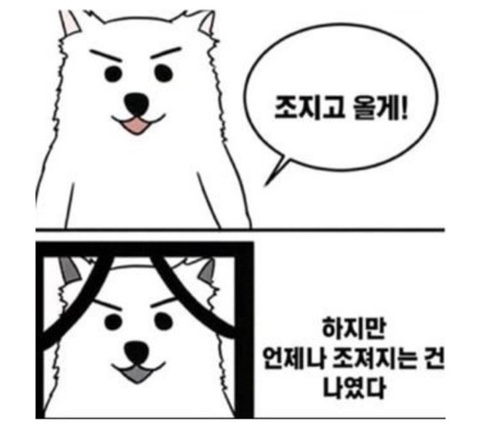
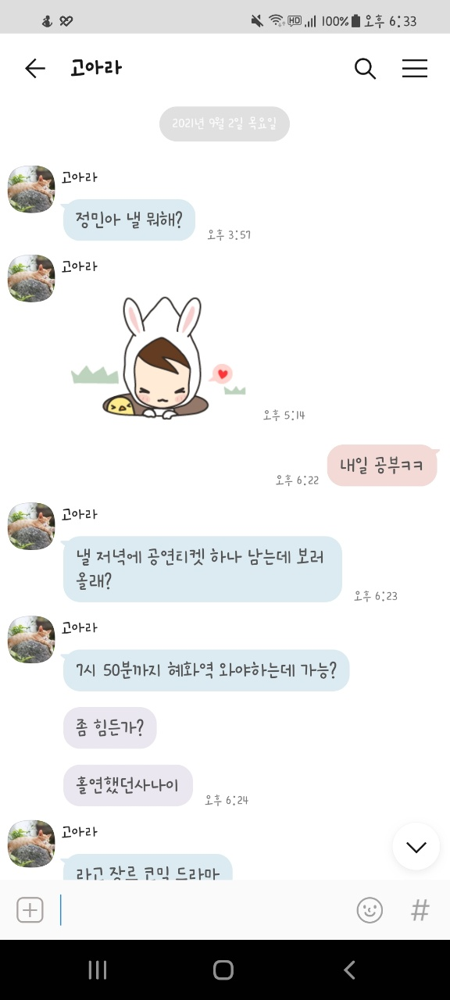
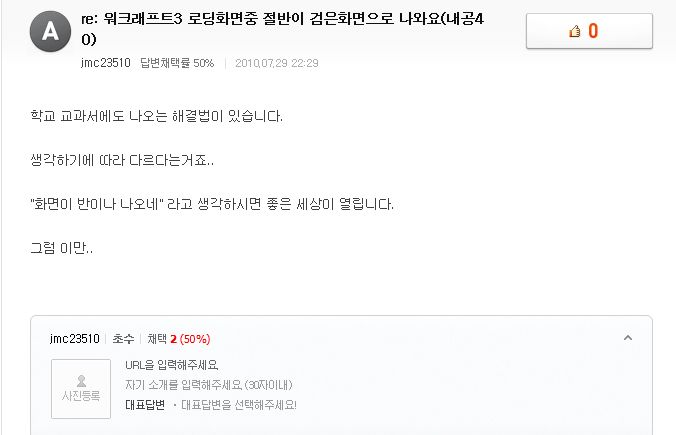
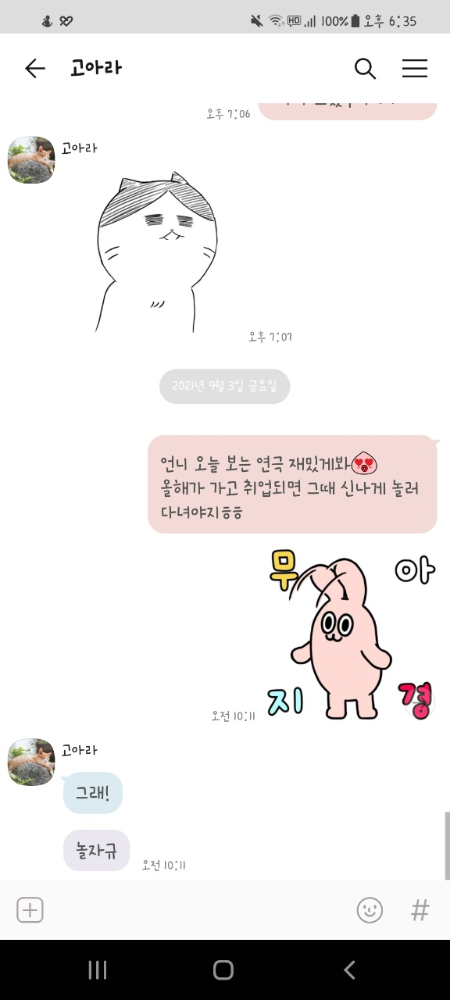

# 네카라쿠배 온라인 1주차 회고록

## 나는 어떻게 입과 테스트를 준비했나

사실, 네카라쿠배 프론트엔드 전공자 스쿨 3기 지원이 먼저 시작됐고 온라인 과정이 신설되었기 때문에 두 과정 역량 테스트를 함께 준비했다. 3기 역량 테스트는 무료로 강의 수강이 가능했는데 자료구조와 알고리즘을 공부하면서 많은 것들을 배울 수 있었던 좋은 시간이었다. 이때의 경험으로 본 수업 때 무리가 없이 과정을 따라가려면 짬 날 때 틈틈이 알고리즘 공부를 해야겠다 마음먹었다.👨🏻‍💻

## 🎉 네카라쿠배 온라인 1기 합격

8월 27일, 제로베이스로부터 수신 메일 확인할 것을 문자 받았으나, 메일이 오지 않아 초조하게 기다리다 결국 문의 메일을 보냈는데, 전부터 한메일 발신은 문제가 있었다며 합격이라고 말씀해주셨다. (기회 주셔서 감사합니다. 열심히 할게요.😭 흑흑)

~~이름도 밝히지 않고 할 말만 했던 당시 초조함이 느껴집니다.... 하하..~~

테스트 발표일은 내 생일이었다(: **행복한 저녁을 만들어주셔서 고맙습니당!** 🙋🏻‍♀️

## 나의 인강 공부 전략

- 수업 들으며 내용 정리가 필요할 땐 pause하고 필기
- 전날 들은 수업을 정리(수업내용 + 내용 보충 + 코드 작성)하고 복습
- 평일 공부한 내용을 주말에 다시 복습

## 선생님 첫 대면

(ot 내용을 따로 팔지 아니면 여기에 쓸지 고민중...)

## 간신히 혼 붙잡은 첫 정기 테스트 🧎🏻‍♀️

정기테스트 당일까지 나온 인강은 모두 훑었기에 테스트가 약간 자신이 있었다... 18시 본격 테스트가 시작되고 자꾸 드는 생각은 "어.. 왜 낯설지...?" "이거.. 제 시간 안에 풀기 어렵겠는데...?" 애써 마음을 가라앉히고 문제를 풀었지만 19분이 됐고, 마지막 문제 2개는 확인도 못 하고 제출했다. 테스트가 끝난 후 오늘 온 카톡 들을 처음 확인했는데...

~~언니 나 그럴 때가 안니야 지금... ㄴ ㅏ ... 지금 짤리게 생겼어~~......😢

그러나, 복습 시험지가 올라왔고 내 생각보다 더 틀렸... (바사삭🍗)

지나간 건 어쩔 수 없는 거고 오답 노트 작성과 주말 복습으로 앞으로 방향성을 다시 잡아봐야겠다.🏃🏻‍♂️

## 내일 주말 나는 🧐

- 진도 더 나갈 생각하지 말고 ~~(올라와 있는 인강을 다 들어야 하는 병이 있슴돠.)~~ **복습을 더 철저히!**
- OT 시간 **TIL** 열심히 작성할 것을 강조하셨는데 **TIL**을 어떻게 쓸 것인지 연구해봐야지.!
- 주어진 미션 **프로필 작성**과 **자소서**를 작성하자
- 오늘 올라온 **HTML 연습문제 5문제**와 **코딩테스트 6문제** 해결하기

## 끝으로...

정기테스트를 너무 못 봐서 불안한 마음을 감출 수가 없다. 오늘 새벽 2시에 일어났다... 또 한편으로는 내 생각을 환기하게 해 준 자극제가 되었다고 생각한다. 나는 이만 오답 노트 쓰러 총총🐤

2022년은 올라오는 연극, 뮤지컬 다 보러 다니자!!! ;^)
