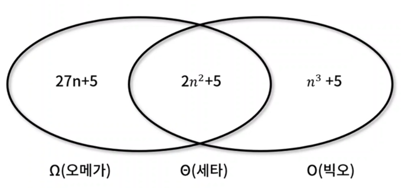
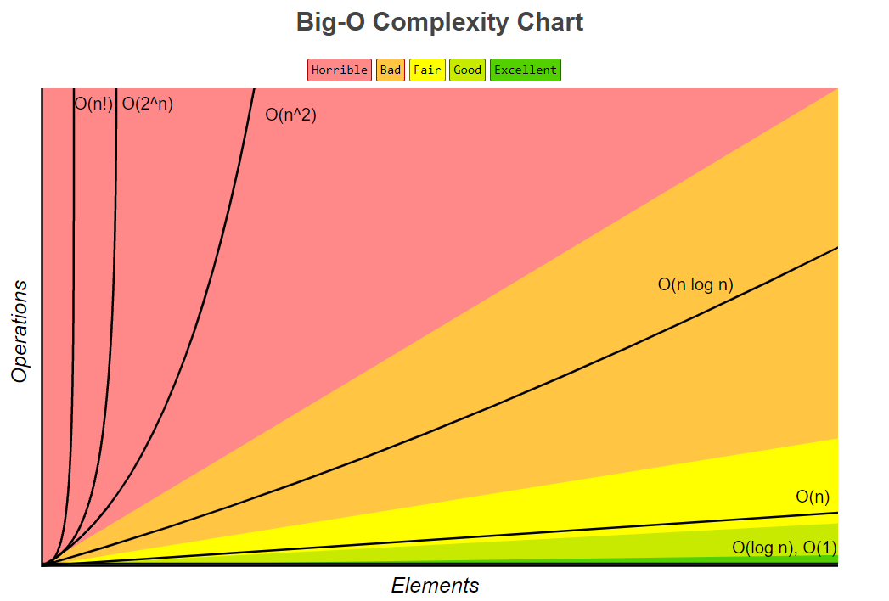
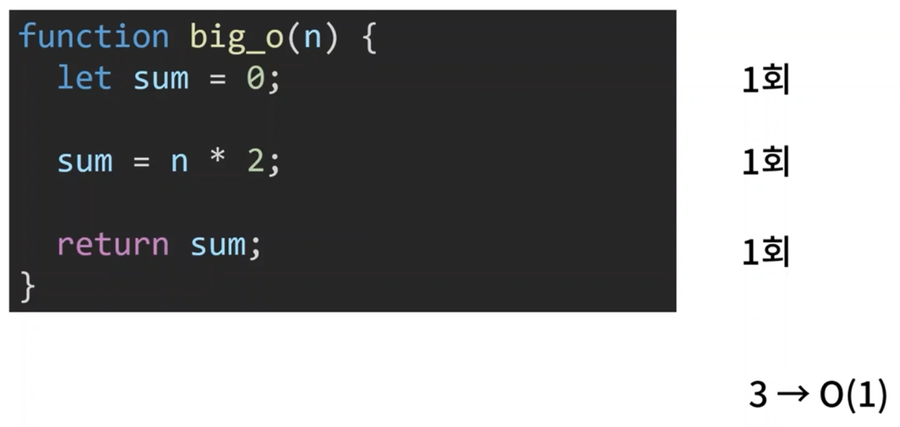
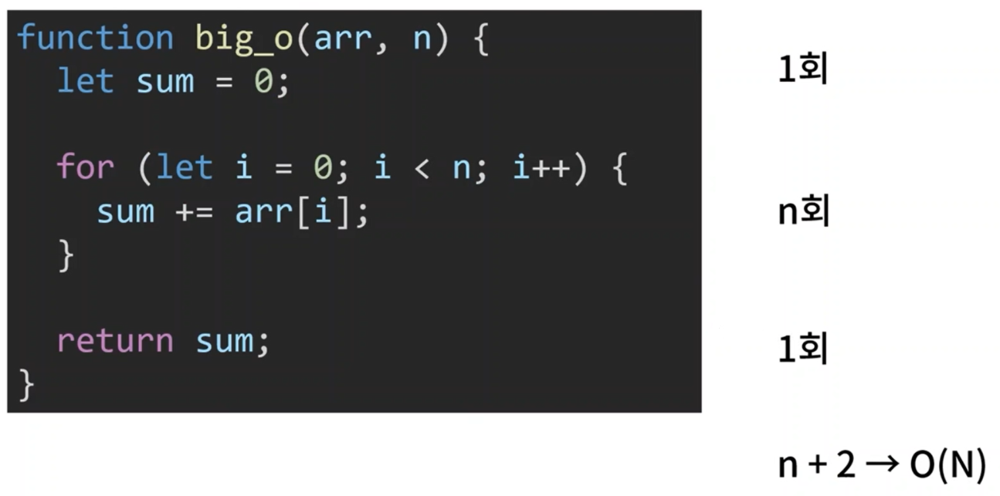
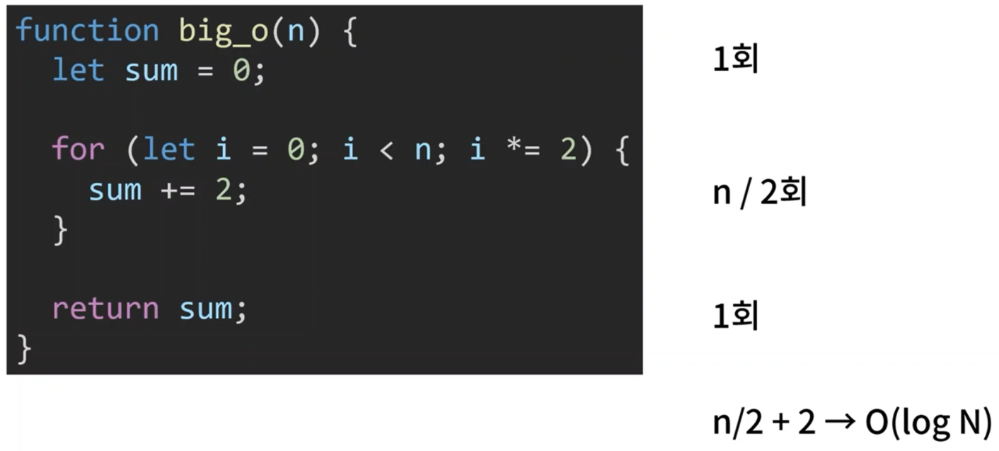
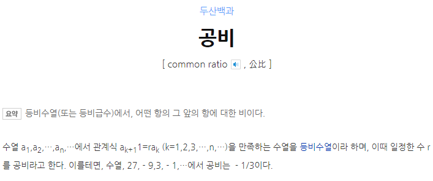
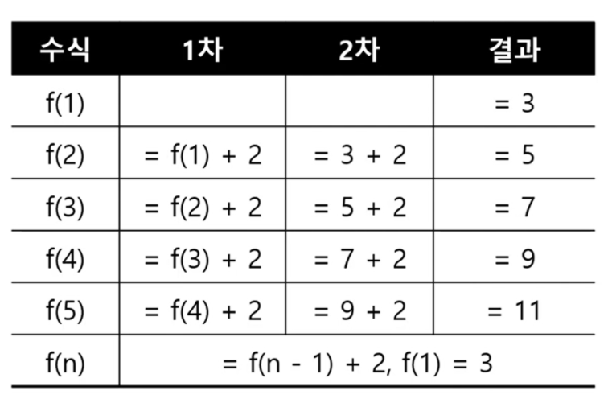
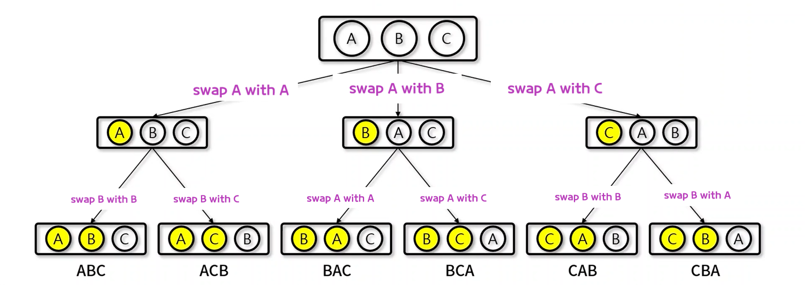
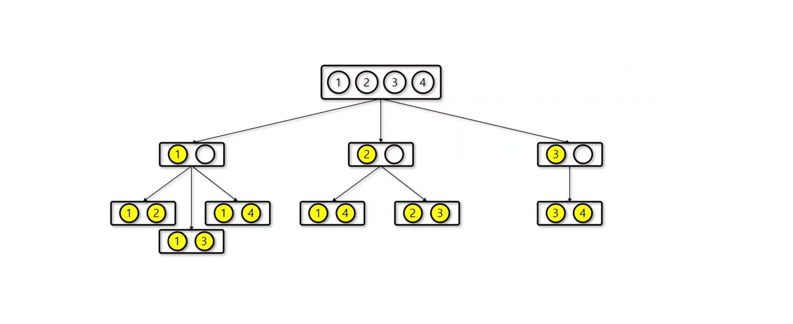

# 수학
## 1. 기본 수학 이론
- 알고리즘 복잡도
- 경우의 수(순열과 조합)
- 점화식

### 1) 알고리즘 복잡도(시간 복잡도)
입력 크기의 값에 대해 단위 연산을 몇 번 수행하는지 계산하여 알고리즘의 수행시간을 평가하는 방법
- 3가지 점근적 표현법
  - Ο(빅오): **최악의 상황**을 고려하여 성능 측정 결과 표현
  - Θ(세타): 평균적인 경우에서의 성능 측정 결과 표현
  - Ω(오메가): 최선의 상황일 때의 성능 측정 결과 표현



알고리즘 성능 평가지표 대부분은 시간 복잡도 

### 빅오 복잡도 차트 



### 빅오 표기법 예제 (1)



### 빅오 표기법 예제 (2)



### 빅오 표기법 예제 (3)


### 빅오 표기법 예제 (4)



### 2) 경우의 수 
어떤 사건 혹은 일이 일어날 수 있는 경우의 가짓수를 수로 표현
- 완전탐색으로 경우의 수를 푸는 알고리즘
  - 순열: 서로 다른 n개의 원소 중에서 r를 중복 없이 골라 순서에 상관 있게 나열하는 경우의 수 (<span><var><sub>n</sub>P<sub>r</sub></var></span>)
  - 조합: 서로 다른 n개의 원소 중에서 r를 중복 없이 골ㄹ 순서에 상관 없이 나열하는 경우의 수 (<span><var><sub>n</sub>C<sub>r</sub></var></span>)
  - 중복 순열: 서로 다른 n개의 원소 중에서 r개를 중복 있게 골라 순서에 상관 없이 나열하는 경우의 수 (nH)




### 3) 점화식
점화식(재귀식)이란 수열에서 이웃하는 두 개의 항 사이에 성립하는 관계를 나타내는 관계식입니다.
- 대표적인 점화식
  - 등차 수열: F(n) = F(n-1) + a
  - 등비 수열: F(n) = F(n-1) * a
  - 팩토리얼: F(n) = F(n-1) * n
  - 피보나치 수열: F(n) = F(n-1) + F(n-2)

> a는 고정된 상수




## 2. 경우의 수
### 1) 순열
- 서로 다른 n개의 원소 중 r를 중복 없이 골라 **순서에 상과 있게** 나열하는 경우의 수(<span><var><sub>n</sub>P<sub>r</sub></var></span>) 



- 조상노드 경우의 수 3
- 부모노드 경우의 수 2, 2, 2

### 방법 1) 중첩 반복문
인덱스 수(3) 만큼 for문이 추가돼야 한다는 단점이 있습니다.

✨ **예시**

```javascript
let input = ["a", "b", "c"];
let count = 0;

function permutation(arr) {
  for (let i = 0; i < arr.length; i++) {
    for (let j = 0; j < arr.length; j++) {
      if (i == j) continue;                  // 중복 skip
      for (let k = 0; k < arr.length; k++) {
        if (i == k) continue;
        if (j == k) continue;

        console.log(arr[i], arr[j], arr[k]);
        count++;
      }
    }
  }
}

permutation(input);
console.log(count);
```

🧪 **실행결과**

```javascript
a b c
a c b
b a c
b c a
c a b
c b a
6
```

### 방법 2) 재귀 호출
✨ **예시**

```javascript
let input = ["a", "b", "c"];
let count = 0;

// 재귀함수(배열, 시작위치, 인덱스)
function permutation(arr, start, index) {

  // 1. 재귀함수를 멈추는 조건 
  if (start == index) {      // 종료지점
    count++;
    console.log(arr.join(" "));
    return;                 // 재귀함수 break
  }

  // 2. 재귀함수를 돌면서 변경되는 부분(메인 로직)
  // 0이 아닌 start를 초기 값으로 선언하여 permutation(arr, start + 1, index) 
  // 호출 시 arr = start로 중복이 안되게 도모함.
  for (let i = start; i < arr.length; i++) {
    [arr[start], arr[i]] = [arr[i], arr[start]];  // swap
    permutation(arr, start + 1, index);
    [arr[start], arr[i]] = [arr[i], arr[start]];  // swap 복귀( 원상 복귀)

  }
}


permutation(input, 0, 2); // 세 번째 매개변수 index를 2로 지정해 0, 1, 2번까지 뽑는다.
console.log(count);

```

🧪 **실행결과**

```javascript
a b c
a c b
b a c
b c a
c a b
c b a
6
```


### 2) 조합




### 방법 1) 중첩 반복문
인덱스 수(2) 만큼 for문이 추가돼야 한다는 단점이 있습니다.

✨ **예시**

```javascript
let input = [1, 2, 3, 4];     // 4C2
let count = 0;

function combination(arr) {
  // for -> 뽑는 개수 (2)
  // [참고] i = 3일 경우 j = 4가 되면 arr.length와 동일해서 두 번째 for문은 실행되지 않습니다 .
  for (let i = 0; i < arr.length; i++) {
    for (let j = i + 1; j < arr.length; j++) {
      count++;
      console.log(arr[i], arr[j]);
    }
  }
}

combination(input);
console.log(count);
```

🧪 **실행결과**

```javascript
1 2
1 3
1 4
2 3
2 4
3 4
6
```

### 방법 2) 재귀 호출


✨ **예시**

```javascript
let input = [1, 2, 3, 4];     // 4C2
let count = 0;
let output = [];

// output에 들어갈 data 매개변수
function combination(arr, data, start, index, ratio) {
  if (start == ratio) {
    count++;
    console.log(data);
    return;
  }

  for (let i = index; arr.length - i >= ratio - start; i++) {
    data[start] = arr[i];
    combination(arr, data, start + 1, i + 1, ratio);
  }
}

combination(input, output, 0, 0, 2); // 세 번째 매개변수 index를 2로 지정해 0, 1, 2번까지 뽑는다.
console.log(count);
```

🧪 **실행결과**

```javascript
[ 1, 2 ]
[ 1, 3 ]
[ 1, 4 ]
[ 2, 3 ]
[ 2, 4 ]
[ 3, 4 ]
6
```


## 3. 점화식
### 1) 등차수열
연속하는 수의 차이가 일정한 수열

### 방법 1) 중첩 반복문

✨ **예시**

```javascript
// ********** 등차수열 **********
// a + (n - 1) * d;
// a : 첫항, 초항
// d : 공차
// n : 수열의 개수


let result;

// 첫 항, 간격(공차), 수열의 개수 
function forloop(a, d, n) {
  let acc = 0;    // 각각요소 등차값 판단 함수 5번째 요소가 저장되는 곳

  // 3 > 5 > 7 > 9
  for (let i = 1; i <= n; i++) {
    if (i == 1) {
      acc += a;

    } else {
      acc += d;   // 공차
    }

    console.log(i, acc);
  }
  return acc;

}

result = forloop(3, 2, 5);
console.log(result);
```

🧪 **실행결과**

```javascript
1 3
2 6
3 12
4 24
5 48
48
```


### 방법 2) 재귀 호출

✨ **예시**

```javascript
let result;

function recursive(a, d, n) {
  // 멈출 조건
  if (n == 1) return a;

  // 반복 코드
  return recursive(a, d, n - 1) + d;
}

// number: 5 recursive(a, d, 4) + 2
// number: 4 recursive(a, d, 3) + 2
// number: 3 recursive(a, d, 2) + 2
// number: 2 recursive(a, d, 1) + 2
// number: 1 -> 3
// result: 11

result = recursive(3, 2, 5);
console.log(result);

```

🧪 **실행결과**

```javascript
48
```


### 2) 등비수열
등비만큼 곱해지는 수열

### 방법 1) 중첩 반복문

✨ **예시**

```javascript
// ********** 등비수열 **********
// a + (n - 1) * d;
// a : 첫항, 초항
// r : 공비
// n : 수열의 개수


let result;

// 첫 항, 간격(공비), 수열의 개수 
function forloop(a, r, n) {
  let acc = 1;    // 각각 요소 등차 값 판단 함수 5번째 요소가 저장되는 곳

  // 3 > 6 > 12 > 24
  for (let i = 1; i <= n; i++) {
    if (i == 1) {
      acc *= a;

    } else {
      acc *= r;   // 공비
    }

    console.log(i, acc);
  }
  return acc;

}

result = forloop(3, 2, 5);
console.log(result);
```

🧪 **실행결과**

```javascript
1 3
2 6
3 12
4 24
5 48
48
```


### 방법 2) 재귀 호출

✨ **예시**

```javascript
let result;

function recursive(a, r, n) {
  // 멈출 조건
  if (n == 1) return a;

  // 반복 코드
  return recursive(a, r, n - 1) * r;
}

// number: 5 recursive(a, r, 4) * 2
// number: 4 recursive(a, r, 3) * 2
// number: 3 recursive(a, r, 2) * 2
// number: 2 recursive(a, r, 1) * 2
// number: 1 -> 3
// result: 48

result = recursive(3, 2, 5);
console.log(result);

```

🧪 **실행결과**

```javascript
48
```

### 3) 팩토리얼

✨ **예시**

```javascript
let result;

function recursive(n) {
  if (n == 1) {
    return n;
  }

  // 5! => 5 x 4 x 3 x 2 x 1 
  return recursive(n - 1) * n;
}

result = recursive(5);
console.log(result);
```

🧪 **실행결과**

```javascript
120
```

### 4) 피보나치 수열

✨ **예시**

```javascript
// 피보나치 수열
// 현재 값: 이전값과 이전전값을 더한 값

let result;

function recursive(n) {
  if (n == 1 || n == 0) {
    return n;
  }

  // f(n) = f(n-1) + f(n-2)
  return recursive(n - 1) + recursive(n - 2);
}

result = recursive(5);
console.log(result);

/*
f(5) = f(4) + f(3) = 5
f(4) = f(3) + f(2) = 3
f(3) = f(2) + f(1) = 2
f(2) = f(1) + f(0) = 1
f(1) -> 1
dept f(0)이 안끝남
f(0) -> 0
*/
```

🧪 **실행결과**

```bash
5
```


