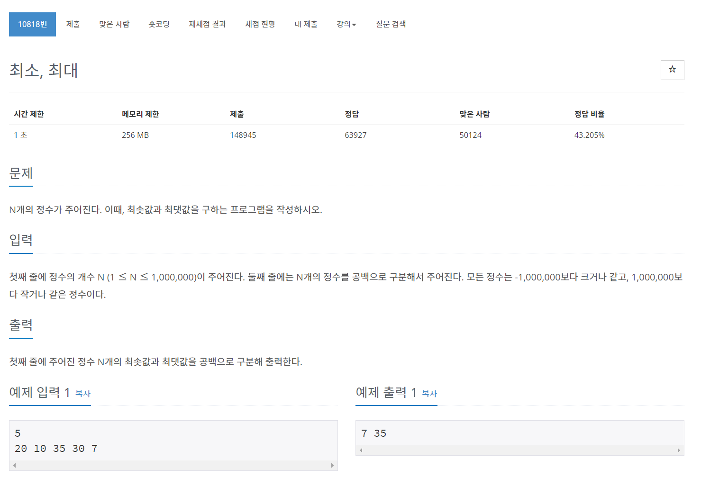

## Comment 🤞

### 1) 문자, 숫자 오름차순
  array.sort((a, b) => a - b);

### 2) 문자, 숫자 내림차순
  array.sort((a, b) => b - a);

### 3) Object 문자 오름차순 정렬
  학생 이름 오름차순
```javascript
var student = [ 
  {name : "Andrew", age : 21}, 
  {name : "Leo", age : 25}, 
  {name : "Gabriel", age : 19}, 
  {name : "Amy", age : 20}, 
  {name : "David", age : 26}, 
  {name : "Bryan", age : 19} 
] 
student.sort((a,b) => a.name < b.name ? -1 : a.name > b.name ? 1 : 0; ));
```

### 4) Object 문자 내림차순 정렬
  학생 이름 내림차순
```javascript
student.sort((a,b) => a.name < b.name ? -1 : a.name > b.name ? 1 : 0; ));
```

### 5) Object 숫자 오름차순 정렬
  학생 나이 오름차순
```javascript
student.sort((a, b) => a.age - b.age);

```


### 5) Object 숫자 내림차순 정렬
  학생 숫자 내림차순
```javascript
student.sort((a, b) => b.age - a.age);
```
