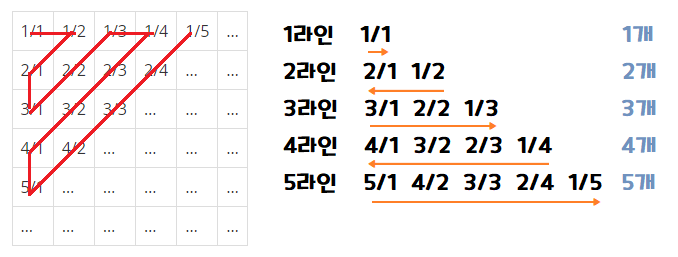

## 🤞 Comment
### 1) 입력값 X가 몇 번째 라인인지 서술하시오
X가 10이라고 한다면, 1+2+3+4 의 총합으로 4라인 임을 알 수 있습니다.

### 2) X가 속한 라인에서 X의 인덱스를 서술하시오
`X(총길이) - (X-1)라인까지 값` 의 개수입니다. X가 10인 경우 `10 - 6` 그래서 4가 됩니다.

<u>(참고) (X-1)라인까지 값은 등차수열의 합 공식 n(n+1)/2 로 도출할 수 있음. 👱‍♀️예시 (4x3)/2 = 6</u>

### 3) X가 속한 라인의 방향(정방향,역방향) 서술하시오
홀수 라인은 정방향, 짝수 라인은 역방향 입니다.