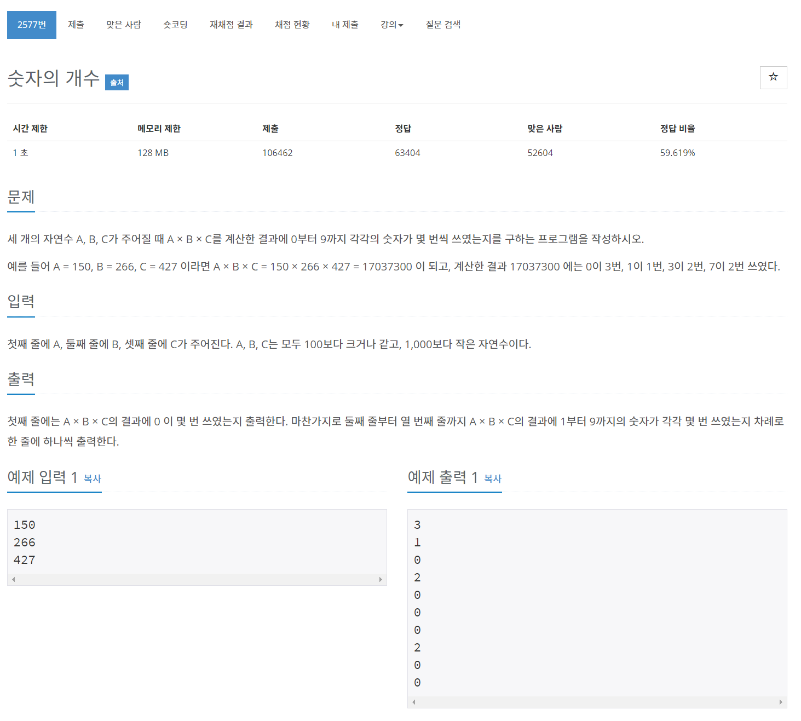

## 🤞 Comment

### 1) for in 문: 객체의 모든 열거 가능한 속성에 대해 반복
```javascript
for(key in object){};
// object[key] = value
```
- object : 반복작업을 수행할 객체로 열거형 속성을 가지고 있는 객체.


### 2) 문자열(string)은 인덱스를 for문으로 구할 수 있다.