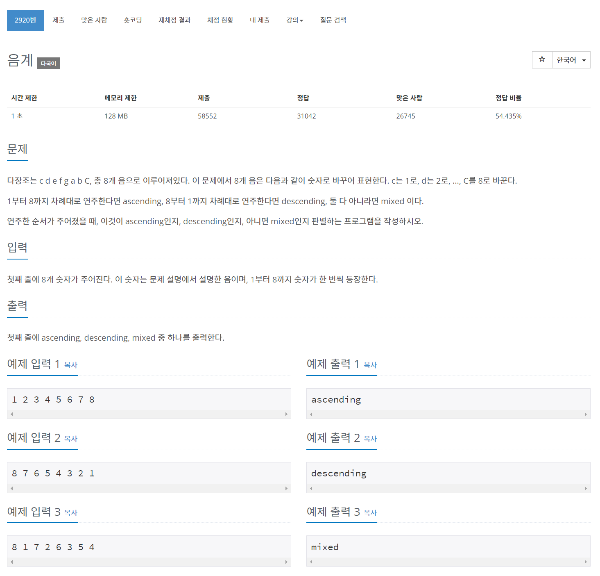

## 🤞 Comment

- `for (let i = 1; i < input.length - 1; i++)`가 중요 포인트
  - `input[i] - input[i + 1]` 코드를 실행할 때 배열의 length만큼 for문 loop 되면 input[i+1]값이 없게 되어 불리언 값이 false가 됩니다.
- `for (let i = 1; i < input.length - 1; i++)` 로 적어주기 위해서 input[0] 값에 대한 조건은 따로 적어줍니다.