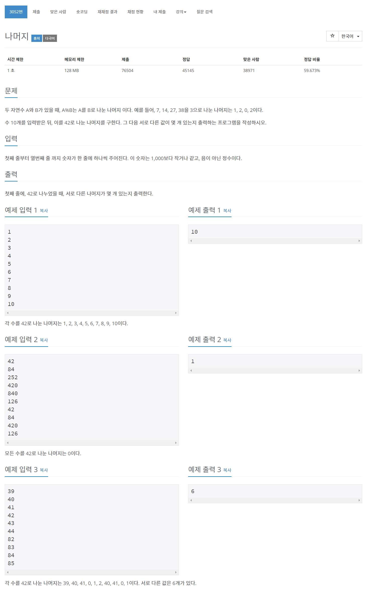
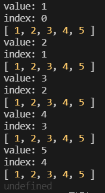

## 🤞 Comment

### 1) 콜백함수 forEach

```javascript
const myArr = [1, 2, 3, 4, 5];

const newMyArr = myArr.forEach((value, index, array) => {
  console.log(`value: ${value}`);
  console.log(`index: ${index}`);
  console.log(array);
});

console.log(newMyArr); // undefined
```




### 2) 참고 블로그
https://gurtn.tistory.com/44