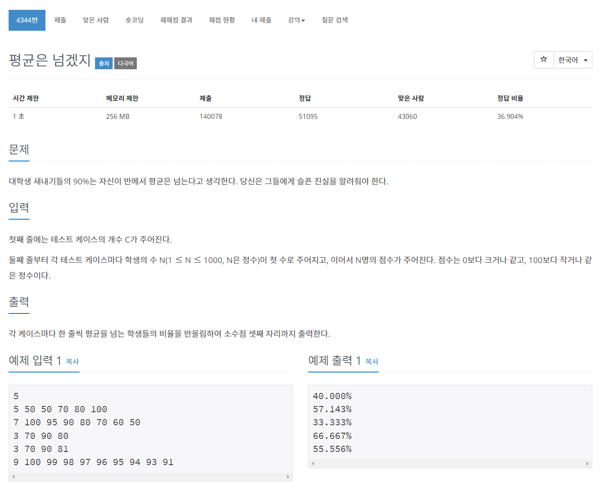

## 🤞 

### 1) 반올림
```javascript
Math.round(x)
```

### 2) 소수점 반올림
```javascript
numObj.toFixed([digits])
```

소수점 2자리로 반올림
```javascript
var num = 12314.124124124;
num = num.toFixed(2); // 12314.12
```

부동소수점(Floating Point) 숫자를 고정소수점(Fixed Point) 숫자로 리턴합니다.

### 3) reduce((previousValue, currentValue, currentIndex, array)=> 콜백함수 또는 value, 0)
callback 함수는 배열 안에 있는 모든 요소들마다 호출 됩니다. 콜백 함수에 return된 값은 함께 누적된 결과 값을 return 합니다. **더한 값을 prev에 담아주기!!!**

```javascript
sumScore = score.reduce((prev, curr) => prev += Number(curr), 0);
```

### 4) shift(): 배열 맨 앞의 값 삭제
```javascript
array.shift();
```