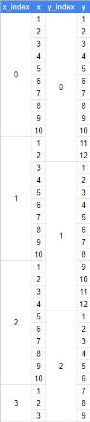
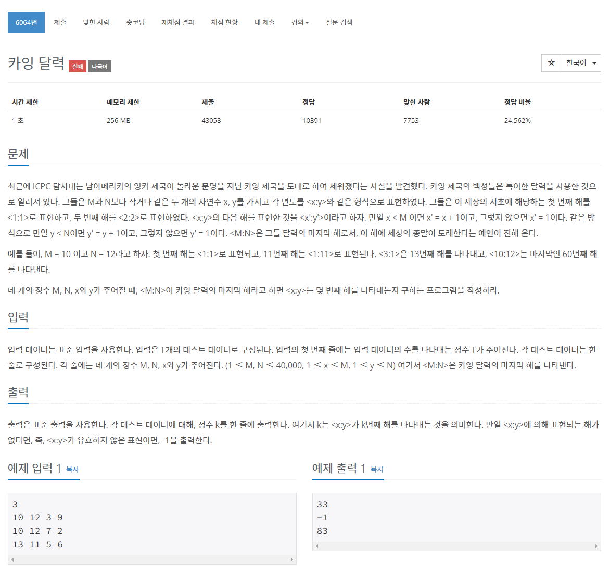

## 🤞 Comment

### 사고

입출력을 반대로 **출력값 % M = x**와 **출력값 % N = y** 라는 식을 도출하면 문제 접근이 훨씬 수월합니다. 첫 번째 식을 조건1, 두 번째 식을 조건2라고 했을 때, 조건1과 조건2의 교집합으로 출력값을 도출할 수 있습니다. 이를 **조건1 ⊂ 조건2** 로 구할 수도 있습니다.

### 로직 구현

1. 카잉 달력으로 유효하지 않은 표현이면 -1을 출력합니다. 그러므로 MAX 값을 구해줘야 해요. x에 들어올 수 있는 수는 1 ~ M 이고 y에 들어올 수 있는 수는 1 ~ N 입니다. 즉, x와 y가 표현할 수 있는 모든 수는 M \* N이고 M \* N을 초과하면 -1을 반환합니다. 결과값(k)을 -1로 초기화했습니다.
2. 조건1과 조건2를 만족시키면 `break;` 하여 k 값을 출력합니다.
3. (M \* index + x) 를 N으로 나눈 나머지가 y이면 조건이 성립합니다.
4. 순회시켜 index + 1 하여 맞는 index를 찾고 (M \* index + x) 가 MAX 값 보다 커지면 순회문을 종료합니다.
