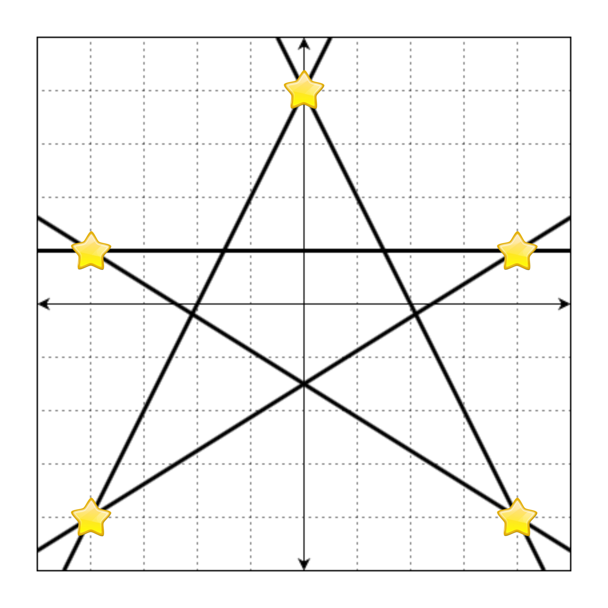
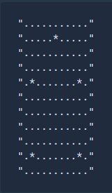
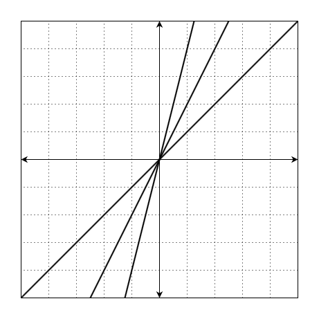
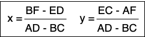
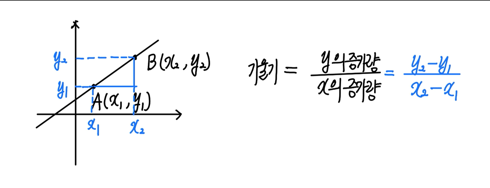
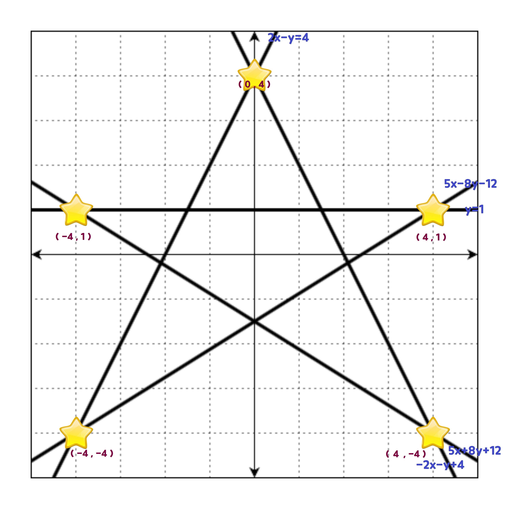
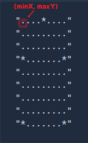

# 교점에 별 만들기

문제 설명

Ax + By + C = 0으로 표현할 수 있는 n개의 직선이 주어질 때, 이 직선의 교점 중 정수 좌표에 별을 그리려 합니다.

예를 들어, 다음과 같은 직선 5개를

- `2x - y + 4 = 0`
- `-2x - y + 4 = 0`
- `-y + 1 = 0`
- `5x - 8y - 12 = 0`
- `5x + 8y + 12 = 0`

좌표 평면 위에 그리면 아래 그림과 같습니다.


이때, 모든 교점의 좌표는 `(4, 1)`, `(4, -4)`, `(-4, -4)`, `(-4, 1)`, `(0, 4)`, `(1.5, 1.0)`, `(2.1, -0.19)`, `(0, -1.5)`, `(-2.1, -0.19)`, `(-1.5, 1.0)`입니다. 이 중 정수로만 표현되는 좌표는 `(4, 1)`, `(4, -4)`, `(-4, -4)`, `(-4, 1)`, `(0, 4)`입니다. 만약 정수로 표현되는 교점에 별을 그리면 다음과 같습니다.




위의 그림을 문자열로 나타낼 때, 별이 그려진 부분은 *, 빈 공간(격자선이 교차하는 지점)은 .으로 표현하면 다음과 같습니다.




이때 격자판은 무한히 넓으니 모든 별을 포함하는 최소한의 크기만 나타내면 됩니다.

따라서 정답은


입니다.


직선 A, B, C에 대한 정보가 담긴 배열 line이 매개변수로 주어집니다. 이때 모든 별을 포함하는 최소 사각형을 return 하도록 solution 함수를 완성해주세요.

제한사항

- line의 세로(행) 길이는 2 이상 1,000 이하인 자연수입니다.
- line의 가로(열) 길이는 3입니다.
- line의 각 원소는 [A, B, C] 형태입니다.
- A, B, C는 -100,000 이상 100,000 이하인 정수입니다.
- 무수히 많은 교점이 생기는 직선 쌍은 주어지지 않습니다.
- A = 0이면서 B = 0인 경우는 주어지지 않습니다.
- 정답은 1,000 * 1,000 크기 이내에서 표현됩니다.
- 별이 한 개 이상 그려지는 입력만 주어집니다.

입출력 예

|line	|result|
|---|---|
|[[2, -1, 4], [-2, -1, 4], [0, -1, 1], [5, -8, -12], [5, 8, 12]]	|["....*....", ".........", ".........", "*.......*", ".........", ".........", ".........", ".........", "*.......*"]|
|[[0, 1, -1], [1, 0, -1], [1, 0, 1]]|	["*.*"]|
|[[1, -1, 0], [2, -1, 0]]	|["*"]|
|[[1, -1, 0], [2, -1, 0], [4, -1, 0]]|	["*"]|

입출력 예 설명

입출력 예 #1

문제 예시와 같습니다.

입출력 예 #2

직선 `y = 1`, `x = 1`, `x = -1`는 다음과 같습니다.


`(-1, 1)`, `(1, 1)` 에서 교점이 발생합니다.

따라서 정답은

```
"*.*"  
```

입니다.

입출력 예 #3

직선 `y = x`, `y = 2x`는 다음과 같습니다.


`(0, 0)` 에서 교점이 발생합니다.

따라서 정답은

```
"*" 
```

입니다.

입출력 예 #4

직선 `y = x`, `y = 2x`, `y = 4x`는 다음과 같습니다.




`(0, 0)` 에서 교점이 발생합니다.

따라서 정답은

```
"*"
```
입니다.

참고 사항

`Ax + By + E = 0`

`Cx + Dy + F = 0`

두 직선의 교점이 유일하게 존재할 경우, 그 교점은 다음과 같습니다.




또, AD - BC = 0인 경우 두 직선은 평행 또는 일치합니다.


## 🤞 Comment

### 📐 기울기 구하는 공식




### 참고한 사고 과정
1. 정수로 표현되는 교점만을 찾아 crossPoints 배열에 할당합니다. 
2. 문제에 참고 사항 공식을 활용해 두 개의 직선 방정식이 교차하는 정수 교점을 구합니다. 그러므로 이중 for문을 사용합니다.<br>
  2-1. 분모가 0이라면 기울기가 서로 평행사거나 일치하기 때문에 이 경우는 제외합니다. <br>
  2-2. x와 y 공식에 대입하기 전 실수 교차점을 제외시킵니다. <br>
```
crossPoints = [ [ -0, 4 ], [ -4, -4 ], [ 4, -4 ], [ 4, 1 ], [ -4, 1 ] ]
```

3. y의 높이 만큼, x의 길이를 '.'으로 채워진 2차 배열 paper를 만듭니다.
4. x,y 좌표에 별을 찍어줍니다.


