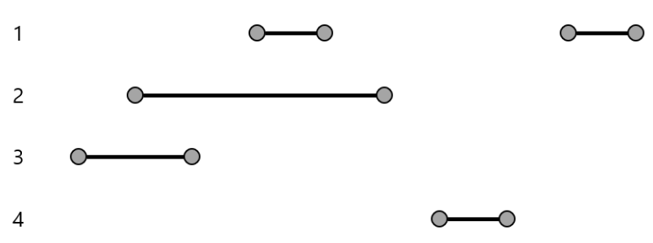

# 코로나동선

[문제 설명]

코로나로 인해 건물에 출입하는 인원의 시간을 체크하고 있습니다. 출입 기록인 history
에는 출입한 사람의 번호 배열이 저장되어 있습니다.
history에는 건물에 들어올 때에는 양수가, 나갈 때에는 음수가 기록됩니다.
이때, 확진자 번호 infected가 주어질 때, 확진자와 동선이 겹치는 사람의 번호를 오름
차순으로 출력하는 함수, solution을 완성해주세요.
예를 들어, history가 [3, 2, -3, 1, -1, -2, 4, -4, 1, -1]이고, infected가 2로 주어질 때, 확
진자와 동선이 겹치는 사람은 [1, 3]입니다.

[제한 사항]

- 사람은 건물을 여러 번 출입할 수 있습니다.
- 주어지는 history에는 건물에 남아있는 사람이 없습니다.

[입력 형식]

- 출입 기록인 history가 주어집니다.
- history는 1 이상 100 이하의 자연수로 이루어진 길이가 1000 이하의 배열입니다.
- 확진자 번호인 infected가 주어집니다.
- infected는 1 이상 100 이하의 자연수입니다.

[출력 형식]

확진자와 동선이 겹치는 사람의 번호를 오름차순 배열로 출력합니다

[입력 예시]

| history                                                                                                                                                                  | infected | return                           |
| ------------------------------------------------------------------------------------------------------------------------------------------------------------------------ | -------- | -------------------------------- |
| [3, 2, -3, 1, -1, -2, 4, -4, 1, -1]                                                                                                                                      | 2        | [1, 3]                           |
| [2, 4, 3, -3, 3, -2, 1, -3, -1, -4]                                                                                                                                      | 4        | [1, 2, 3]                        |
| [1, -1]                                                                                                                                                                  | 1        | []                               |
| [7, -7, 2, 5, 1, 4, 9, -9, -2, 3, -1, -5, 6, 10, -10, 7, -4, -6, 8, -7, 4, -3, 3, -8, -3, -4]                                                                            | 1        | [2, 3, 4, 5, 9]                  |
| [10, 2, 14, 12, 13, 6, 9, -14, 4, 1,11, 8, -10, 15, -11, -4, 3, -2, -15, -13, 7, 2, -7, 5, 7, -7, -2, -8, -3, -5,-6, -12, 5, -9, -5, -1]                                 | 3        | [1, 2, 5, 6, 7, 8, 9, 12, 13,15] |
| [18, 12, 13, 11, 6, 15, -6, 19, 7, 5,17, -5, -13, -11, 14, 2, -19, 16, -17,-16, 3, 9, 19, -7, -15, 20, 10, -14, -10, -18,-2, -19, 8, -9, -8, 4, -20, -4, -12, -3, 1, -1] | 16       | [2, 7, 12, 14, 15, 17, 18]       |

## 🤞 Comment

먼저, 확진자를 기준으로 startIdx와 endIdx를 반환합니다.

### 사고 1. 확진자보다 먼저 들어왔으나 나가지 못한 사람들😰

1. 이 그룹의 사람들은 map 형식의 prvPeople{사람 : 개수}을 반환합니다.
2. 나가지 못한 사람들을 answer 배열에 push 합니다.

### 사고 2. 확진자 동선 사람들😭

1. 절대값 indexOf(-1)일때만 answer 배열에 push 합니다.
2. return 할 때, 새 배열에 값이 있으면 오름차순으로 반환하고 아니라면 빈 배열값을 삼항연산자로 반환합니다.
