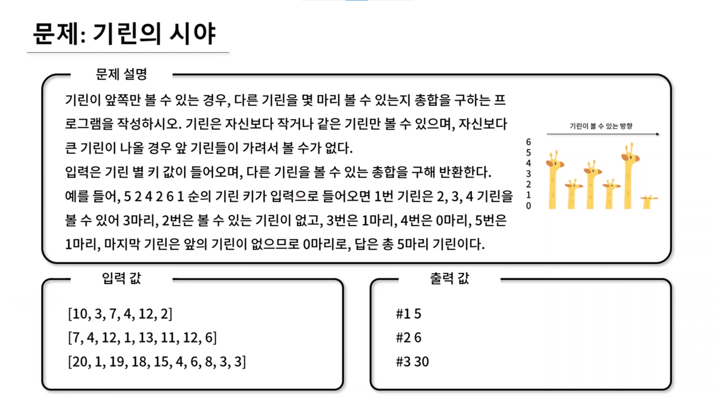

## 🤞 Comment

### 사고 1

1. 스택을 사용합니다.
2. 일단 stack에 쌓고 자신보다 긴 기린이 나오면 pop합니다.(자신보다 높은 기린이 나오면 그 이후는 볼 필요가 없어집니다.) 일단 stack에 넣어두고 앞으로 진행해보겠다는 컨셉
3. 문제 설명 예시(5 2 4 2 6 1)로 예를 들면, 스택이 있는 상태에서 첫 번째 5기린 push, 두 번째 기린이 첫 번째 기린보다 작으니까 2기린 push, 4기린보다 stack의 최상단이 작으니까 stack에 pop을 합니다. 이때 2기린(두 번째)과 4기린(세 번째) 사이 기린들이 없어서 **0마리**입니다. 그리고 stack에 4기린을 push 합니다. 현재 stack에는 5 | 4 가 있습니다.
4. 네 번째 기린 2기린은 stack 최상단 값보다 작아서 이때는 stack에 push합니다. stack에는 5 | 4 | 2 가 있습니다.
5. 6기린 차례입니다. 최상단 2기린은 6기린 보다 작습니다. 6기린과 2기린 사이는 **0마리**가 존재합니다. 그리고 2기린은 pop됩니다.  
   5-1. 계속해서 6기린은 최상단 4기린보다 작아서 비교합니다. 6기린과 4기린 사이는 **1마리**(네 번째 기린인 2기린)가 존재합니다. 그리고 4기린은 pop됩니다.  
   5-2. 계속해서 6기린은 최상단 5기린보다 작아서 비교합니다. 6기린과 5기린 사이는 **3마리**가 존재합니다. 그리고 5기린은 pop됩니다.
   5-3. 6기린을 push하고 6기린의 인덱스가 넘어갑니다.
6. 최상단에 있는 6기린이 1기린보다 큽니다. 1기린을 stack에 push합니다.
7. 기린 순회는 끝났지만 다섯 번째 기린인 6기린이 앞의 1기린을 볼 수 있기 때문에 명시적으로 맨 앞에는 MAX 기린을 둬서 평가합니다. 현재 stack에는 6 | 1 이 있습니다.
8. MAX 기린은 최상단의 1기린 사이에 **0마리**가 존재합니다. 1기린은 pop합니다. MAX 기린과 최상단 6기린 사이에는 **1마리**가 존재합니다. 6기린은 pop합니다.
9. stack에서 나온 기린 개수는 총 5마리 입니다.

위와 같은 방법은 다중 반복문을 사용하지 않더라도 빠른 시간내에 높이를 찾을 수 있게 됩니다.

### 로직 설명

1. while문을 돌면서 stack을 보고 stack에 있는 기린이 자신보다 작은지 비교 처리합니다. `!stack.isEmpty() && stack.peek() < giraffe[i]`
2. 자신의 역할이 끝나면 stack.push합니다. {키:값} 형태로 기린의 높이 h의 값은 giraffe[i]라고 하고 기린의 인덱스 i는 실제 i를 넣어줍니다. 이를 stack에 넣습니다.
3. while문 조건식 최상단 값은 높이 기준 비교니까 높이 키 값을 넣어서 비교합니다. `!stack.isEmpty() && stack.peek()["h"] < giraffe[i]`
4. 사이 기린 개수는 -1을 해줍니다. `result += i - stack.pop()["i"] - 1;`
