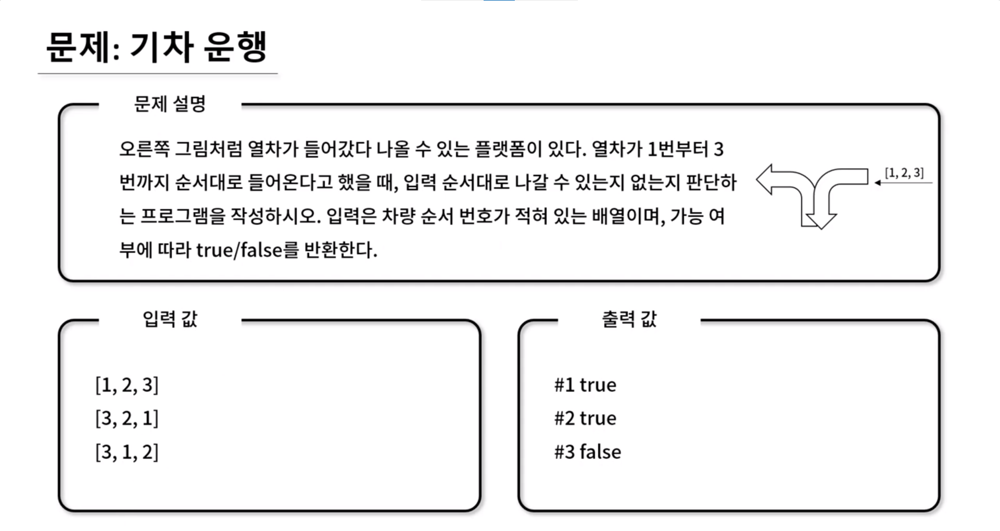

## 🤞 Comment

### 사고 1

1. 들어왔다 나가니까 **스택**을 사용합니다!
2. 기차[i]가 나갈수 있는 상태인지 조건 확인합니다. 
   2-1. 나갈 수 없는 상태라면 `return false;`  
3. stack 배열 안에 기차 즉, 값을 증가 시킬 변수 num을 생성하여 num을 증가시키면서 while 조건에 맞는 순회합니다.
4. 기차수에 최초 값은 없어서(`stack.length === 0`) 첫 값(++num === 1)은 플랫폼(stack 변수)에 push 됩니다. output이 [1, 2, 3] 이라 첫 값(stack[0])이 같은지 비교 해야하는데, 스택이기 때문에 현재 플랫폼의 가장 끝에 있는 기차가 기차[i]보다 작을 때(`stack[stack.length - 1] < train[i]`) 도 열차들을 플랫폼에 집어넣습니다. push 합니다.  
   4-1. 예시로 train이 [3, 2, 1]인 경우,   
   train[0] === 3 이고 `stack.push(++num);` 하면 stack: [1] 
   train[0] === 3 이고 `stack.push(++num);` 하면 stack: [1, 2] 
   train[0] === 3 이고 `stack.push(++num);` 하면 stack: [1, 2, 3] 
   4-2. 이제 플랫폼 끝 기차(stack[stack.length - 1])와 우리가 뽑는 기차(train[0] === 3)가 같게 되어 `stack[stack.length - 1] < train[i]` 이 조건은 false가 되어 while문이 멈춥니다.
