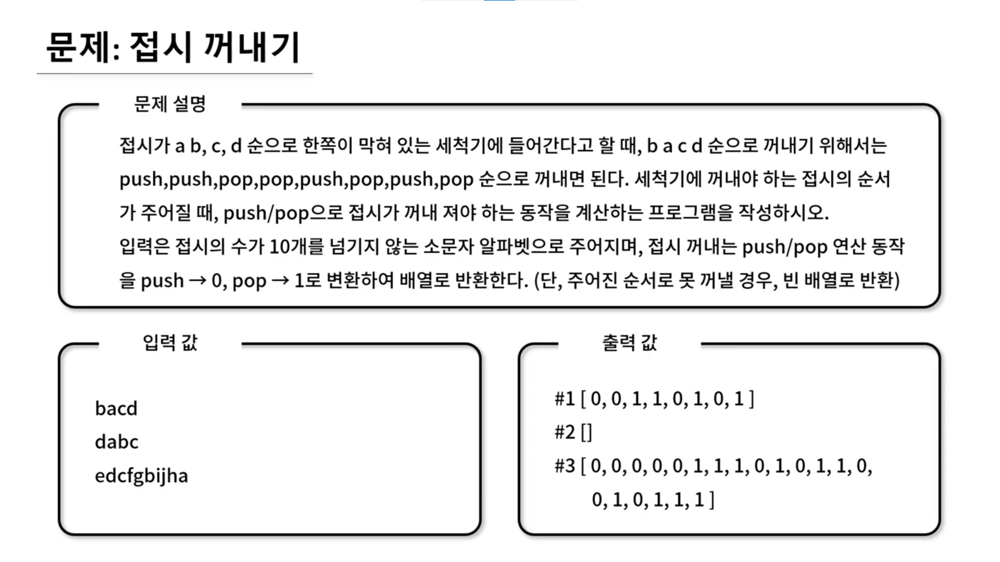

## 🤞 Comment

### 사고 1

1. stack(세척기)에 넣어보고 입력 값의 판단합니다. 가능 여부를 판단합니다.
2. 예시로 dabc를 들어보면, a|b|c|d를 push하고 d를 pop했는데, a를 꺼낼 수 없기 때문에 꺼내지 못하는 상태이므로 false입니다.

### 사고 2

1. push / pop 연산 마다 계산합니다. push는 0, pop은 1로 변환한 배열 결과를 반환합니다.

### 풀이

1. 접시의 순서 sorting  
   1-1. 들어오는 뒤죽박죽 수의 입력 값을 sort하기 위해 dish 를 배열로 만들어 정렬하고 다시 문자열로 만들어 dish 변수에 할당합니다. 
2. top에 있는 접시가 자신보다 작다면 push합니다. 꺼낼 접시가 세척기 안에 있는 알파벳보다 작을 때 push합니다. dabc 예제에서 d를 꺼내고 싶을 땐, d보다 작은 abc는 세척기에 들어가 있어야 d가 이후에 들어가게 되고 pop할 수 있게 됩니다.
3. 최상단 접시와 비교합니다.
